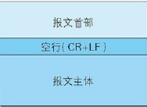
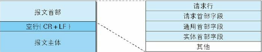
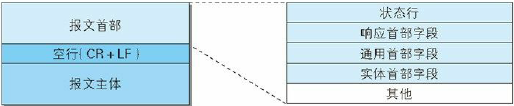

> HTTP通信过程分为两部分：客户端(浏览器)发往服务器端的请求，服务器端发往客户端的响应。本章来了解请求和响应是如何运作的。

### 3.1 HTTP报文

1. HTTP报文是什么 - 用于HTTP 协议交互的信息
2. HTTP报文类型 
   1. HTTP请求报文：从客户端向服务器端发出的报文
   2. HTTP响应报文：从服务器端向客户端发出的报文
3. HTTP报文的结构
   
   HTTP报文本身是由多行(用CR+LF作换行符)数据构成的字符串文本。HTTP报文大致可以分为**报文首部**和**报文主体**两部分，通常，不一定有报文主体。

   

   - 报文首部：服务器端或客户端需处理的请求或响应的内容或属性
   - CR+LF：回车+换行
   - 报文主体：被发送的数据

   3.1 请求报文结构
   

   - 请求行： 请求方法 请求URI HTTP版本
   - 首部字段：包含请求的各种条件和属性的各类首部字段，有请求首部字段、通用首部字段、实体首部字段
  
    来看一下真正发起请求的时候请求报文是什么样子的(chrome浏览器，请求网易支付官网，F12看下请求报文)：

   3.2 响应报文结构
   
