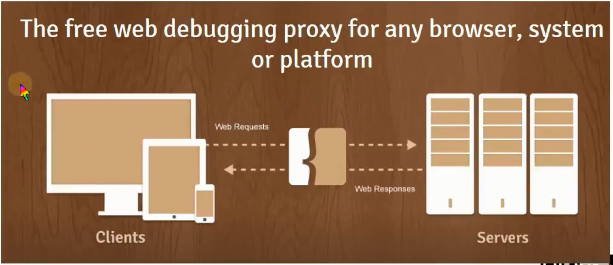

- [Fiddler简介](#fiddler简介)
- [HTTP协议](#http协议)
  - [B/S架构（浏览器/服务器架构）](#bs架构浏览器服务器架构)
  - [Fiddler工作原理](#fiddler工作原理)
  - [HTTP](#http)
- [HTTP请求报文详解](#http请求报文详解)
- [HTTP响应报文详解](#http响应报文详解)
- [Fiddler安装与详情介绍](#fiddler安装与详情介绍)
  - [Fiddler安装](#fiddler安装)
  - [Fiddler详解](#fiddler详解)

### Fiddler简介
- 是什么？ -Fiddler是位于客户端和服务器端的HTTP代理，是目前最常用的http抓包工具之一，是web调试的利器
- 功能
  - 监控浏览器所有的HTTP/HTTPS流量
  - 查看、分析请求和服务器响应
  - 伪造客户端请求和服务器响应
  - 测试网站的性能
  - 解密HTTPS的web会话
  - 全局、局部断点功能
  - 第三方插件
- 使用场景
  - 接口调试、接口测试、线上环境调试、web性能分析
  - 判断前后端bug、开发环境hosts配置、mock、弱网断网测试

### HTTP协议

#### B/S架构（浏览器/服务器架构）
- 编写程序部署的Web服务器
- web服务器运行在服务器上，绑定IP地址并监听某端口。接收和处理HTTP请求
- 客户端通过http协议获取服务器上的网页、文档等资源
  
  

#### Fiddler工作原理

简单理解，fiddler就是客户端与服务器之间的一个web服务器代理，客户端与服务器之间的通信它都能监听到，以google浏览器为例，它默认读取的代理是系统代理，fiddler一打开就会设置一个系统代理：Tools -> Options -> Connections

其中`Act as system proxy on startup`表示一打开就作为系统的代理。

再来看下chrome浏览器的默认代理设置： 

设置了一个代理的上网服务器，设置成了fiddler，也就是说fiddler的地址就是`127.0.0.1`，如果把fiddler关掉，再次去打开chrome的代理设置就不存在了。这就是fiddler的原理，这样它就可以抓到chrome或者IE的包。

#### HTTP

> 推荐阅读《图解HTTP》，该项目的11.书籍推荐文件夹下有电子版，也可以阅读我的读书笔记哦(该项目中：00.计算机网络/图解HTTP读书笔记)，理解记录的是电子书中介绍的知识点，初次之外会加一些自己的理解以及实践操作。

- HTTP: Hyper Text Transfer Protocol 超文本传输协议
- 用于从万维网服务器传输超文本(资源)到本地浏览器的传送协议
- HTTP协议是基于TCP协议的应用层协议，它不关心数据传输的细节，主要是用来规定客户端和服务器端的数据传输格式，最初是用来向客户端传输HTML页面的内容，默认80端口
- HTTP是基于请求与响应模式的、无状态的、应用层的协议

先来看下如何获取请求报文与响应报文：访问服务器`tomcat.apache.org/index.html`，该页面资源会从服务器获取到并显示在浏览器窗口：

这就是我们从服务器请求得到的资源。

这个时候回到Fiddler会发现已经抓取到这个请求，将访问index.html的session保存为.txt文件后得到HTTP整体的一个报文：

其中，响应报文中位于空行下面的内容就是从服务器端请求得到的资源，也就是页面index.html(它是经过浏览器一系列操作之后显示出来的，在浏览原理与剖析的部分会详细分析)。

### HTTP请求报文详解

- HTTP请求报文主要由请求行、请求头、空行、请求体4部分组成，请求体可能有也可能没有，比如上图中的GET请求。
- 请求行：请求方法 请求URI HTTP版本
  
请求方法 | 备注
----------|---------
GET | 请求资源
POST | 提交资源
HEAD | 获取响应头
PUT | 替换资源
DELETE | 删除资源
OPTIONS | 允许客户端查看服务器的性能
TRACE | 回显服务器收到的请求，用于测试或诊断

上述请求方法用到最多的就是GET和POST请求，github是restful风格的，它会用到上述其他请求，至于什么是restful风格，有待探究。
- URL：Uniform Resource Loactor 统一资源定位符，用于描述网上的资源
  - 格式： schema://host[:port#]/path/.../[?query-string]
    - schema:协议，比如http、https、ftp
    - host：域名或者IP地址
    - port：端口
    - path：资源路径
    - query-string：发送的参数
    - eg: `https://www.baidu.com/s?wd=Fiddler`
- 常见的请求头部信息
  
请求头 | 描述
---------|----------
 Host | 主机IP地址或域名
 User-agent | 客户端相关信息，如操作系统、浏览器等信息
 Accept | 指定客户端接收信息的类型，如：image/jpg,text/html,application/json
 Accept-Charset | 客户端接受的字符集，如gb2312、iso-8859-1
 Accept-Encoding | 可接受的内容编码，如：gzip
 Accept-Language | 可接受的语言，如：zh-cn
 Authorization | 客户端提供给服务端进行权限认证的信息
 Cookie | 携带的cookie信息
 Referer | 当前文档的URL，表示从哪个链接过来的
 Content-Type | 请求体内容类型，如：application/x-www-form-urlencoded
 Content-Length | 提交内容的数据长度
 Cache-Control | 缓存机制， 如no-cache
 Pragma | 防止页面被缓存，和Cache-Control：no-cache作用一样

### HTTP响应报文详解
- 组成：状态行、响应头、空行、响应实体
- 状态行：HTTP版本(响应的内容传输回来的时候使用的协议和版本号)、状态码、状态码原因短语
  - 状态码：用以表示网页服务器HTTP响应状态的3为数字代码
    - 1xx: 提示信息，请求被成功接收
    - 2xx: 成功，请求被成功处理，如：200
    - 3xx: 重定向相关，301：临时重定向、302：永久重定向、304：缓存是否更新
    - 4xx: 客户端错误 404：找不到页面
    - 5xx: 服务器端错误 500
- 响应头

    响应头 | 描述 
    ---------|----------
    Server | HTTP服务器的软件信息
    Date | 响应报文的时间
    Expires | 指定缓存过期时间
    Set-Cookie | 设置Cookie
    Last-Modified | 资源最后修改时间
    Content-Type | 响应的类型和字符集，如：Content-Type: text/html; charset=utf-8
    Content-Length | 内容长度
    Connection | 表示保持TCP连接不关闭，keep-alive，不会永久保持连接，服务器可设置
    Location | 指明重定向的位置，新的URL地址，如状态码为304时会有这个字段

### Fiddler安装与详情介绍

#### Fiddler安装

网盘链接：https://pan.baidu.com/s/1JwRcUUoZItV5NlSjusRIRg 
提取码：y399 

一路安装即可。

#### Fiddler详解

- 菜单栏
  - File：主要是重新打开一个视图、打开已有的一个文件、文件的导入导出及退出功能
  - Editor：复制、移除、编辑、选择、粘贴
  - Rules：一些规则
    - Hide CONNECTs: 不关注建立通道的一些连接
    - Hide 304：不关注304重定向的
    - 自动断点
    - 脚本设置
    - 弱网测试
  - Tools
    - Options：针对Fiddler的一些设置，比如设置端口，是否设置为代理
    - WinNET Options：Windows中IE的设置，这是快捷方式，直接导到IE的设置
    - Clear WinNET Cache：清楚IE缓存
    - Clear WinNET Cookies：清楚IE Cookies
    - TextWizard：一个编码解码工具
    - Reset Script：重置脚本，自定义
    - HOSTS：Windows设置的话需要找到系统文件，这个就是对应系统文件的快捷打开方式
  - View：视图相关的设置
- 工具条
  - 给一个会话添加Comments：如果是一个有错误的请求，测试人员可以在该请求上添加备注信息然后导出给开发人员进行debug，是一个标识的作用
  - Replay：重放，重新发起这个请求，是通过fiddler发到服务器去的。重放一次：快捷键R，如果是设置循环多次，Shift+R并设置循环次数。
  - 删除请求快捷键：键盘的delete键，删除选中之外的请求：shift+delete。也可以使用工具条上的remove按条件进行移除。Ctrl+x删除所有请求
  - Go：断点设置
    - 如图，点击一下就设置了请求前断点
    
    - 设置请求前断点后，发起请求，双击这个请求会发现是没有响应数据的，因为这个时候该请求相当于被fiddler拦截了，还没有到达服务器：
    
    这个时候点击Go，就会发送到服务器并拿到响应数据。
  - Stream：流模式，默认的fiddler支持的模式是缓冲模式，一般不会点。
  - Decode：解码，有时从服务器拿到的资源可能是被编码或者是被压缩过的，直接显示的话会出现乱码的现象，如果想要看到这些内容就需要解码，点击Decode会对所有得到的响应实体解码
  - Keep: All sessions，设置保存会话的数量，会占用内存
  - Any Process：选择要抓取的应用，比如点击chrome的时候就会显示chrome
  - Find：查找
  - Save
  - Add a screenshot to the capture：截图
  - A simple timer：一个简单的计时器
  - Browse：快捷打开浏览器
  - Clear Cache：清除IE缓存
  - TextWizard: 文本的编码解码工具
    - 比如GET请求的时候，请求参数的简单编码：
      
    - 还可以进行简单的MD5加密
  - Tearoff：分离面板
  - MSDN Search
  - Online：本机的一些在线信息
- 监控面板(会话列表)
  - Fiddler抓取到的每条http请求，每一条称为一个session
  - 主要包含了请求的ID编号、状态码、协议、主机名、URL、内容类型、body大小、进程信息、自定义备注等信息
  - 
    - `#`:HTTPRequest的顺序，从1开始，按照页面加载的顺序递增
    - Host：请求地址的域名
    - URL：请求的服务器文件路径和文件名，也包括请求参数
    - Content-Type：请求响应的内容
    - Result：HTTP响应状态
    - Protocol：请求使用的协议
    - Body：请求的大小，以byte为单位
    - Caching：请求的缓存过期时间或缓存控制
    - Process：发出此请求的Windows进程及进程ID
    - Comments：备注
    - Custom：用户通过脚本可以设置的自定义值
    - 在会话列表中增加ip列
      - 打开FiddlerScript：Rules -> Customize Rules  (快捷键ctrl+R)
      - 在FiddlerScript中,Ctrl+F查找“static function Main()”字符串, 添加`FiddlerObject.UI.lvSessions.AddBoundColumn("ServerIP", 120, "X-HostIP");`
      - 保存CustomRules.js或者点击“Save Script”按钮
      - 查看fiddler，此时ip会添加到所有数据的最后一列，拖到滚动条，即可看到。
        - 
- 命令行+状态栏
  - QuickExec(快速执行命令)：
  - Capturing：表示目前正在捕获，正在抓包，表示fiddler正在起一个代理的功能，这里相当于是一个是否设置代理的快捷键
  - All Processes：选择会话的进程
  - 一个空白的位置：设置断点
    - 点击一下：设置请求前的断点
    - 点击两下：设置响应后的断点，这个时候请求已经从服务器端到fiddler，但是还没有到客户端，点击Go就会到达客户端。
    - 点击三下：去掉断点
  - 会话的数量
  - 部分附加信息
- 辅助标签+工具
  - Statistics统计分析
    - 
    - HTTP请求的性能和其他数据分析，如DNS解析的时间，建立TCP/IP连接的时间消耗等信息
  - Inspector检查器(重要！)：可以以多种方式查看请求的请求报文和响应报文，包含请求报文与响应报文，前面已经用过就不再具体展示了。
  - AutoResponder(自动响应器)：用于拦截某一请求，用于如下操作：
    - 重定向到本地的资源
    - 使用Fiddler的内置响应
    - 自定义响应