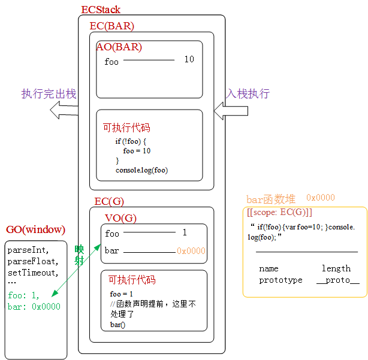

- [概念理解](#概念理解)
- [代码分析](#代码分析)
- [练习](#练习)
- [总结](#总结)

## 概念理解

1. 变量提升：在**当前上下文中(全局/私有/块级)**，JS代码自上而下执行之前，浏览器会提前处理一些事情，可以理解为词法解析的一个环节，词法解析一定发生在代码执行之前。会把当前上下文中所有带var/function关键字的进行提前声明或定义
   1. 带var的会将声明提前
   2. 带function的会将声明和定义提前
   3. 这两种情况的提升没有优先级的区别，就是一个自上而下的顺序
2. 声明declare：`var a`
3. 定义define：`a = 10`
4. 注意：基于`var`或者`function`在`全局上下文`中声明的变量(全局变量)，会`映射`到GO(全局对象window)上一份，作为window的属性，而且，接下来是一个修改，另外一个也会跟着修改。

## 代码分析

```javascript
console.log(a);  // undefined
var a = 12;
a = 13;
console.log(a);  // 13
```
- 代码执行之前：全局上下文中的变量提升
  - `var a = undefined`
  - 创建值12
  - 需要再声明a了，因为变量提升阶段已经完成了，完成的事情不会再重新处理
  - a与12关联
  - 创建值13，让全局变量a指向13

---
```javascript
fn()
function fn() {
    console.log('ok')
}
```
- 全局上下文中的变量提升(函数)
  - 提前的是声明和定义：`fn = 函数`, 函数在这个阶段赋值也完成了
  - 在真实项目中，建议用函数表达式创建函数，因为这样在变量提升阶段只会声明fn，不会赋值

```javascript
// 真实项目中
fn()  // 报错，Uncaught TypeError: fn is not a function
var fn = function () {
    console.log('OK')
}
```

```javascript
var fn = function AAA() {
    // 把原本作为值的函数表达式中的匿名函数"具名化"，虽说起了名字，但是这个名字不能在外面访问，也就是不会在当前上下文中创建AAA
    console.log('OK')

    console.log(AAA)   // 当前函数
    AAA()  // 实现函数的递归调用，而不用严格模式下都不支持的`arguments.callee`了
}
AAA()  // Uncaught ReferenceError: AAA is not defined
fn()  // 'OK'
```
- 具名化之后，使用这个名字并不能调用这个函数，那具名化的意义是什么呢？
  - 当函数执行时，在形成的私有上下文中，会把这个具名化的名字做为私有上下文中的变量(值就是这个函数)来处理
  - 可以实现函数的递归调用
  - 匿名函数具名化的应用：
  ```javascript
  setTimeout(function func() {
    console.log('ok')
    func()  // 注意递归结束条件
  }, 1000)
  ```

---
```javascript
console.log(a);  // Uncaught ReferenceError: a is not defined
a = 13;
console.log(a);  
```
- EC(G)变量提升，没有var，没有变量提升，执行报错

---
```javascript
console.log(a);  // Uncaught ReferenceError: Cannot access 'a' before initialization 不能在let声明之前使用变量， 新版浏览器报错信息
let a = 12;
a = 13;
console.log(a);
```
- EC(G)变量提升：只有var/function会变量提升，ES6中的let和const不会变量提升

---
```javascript
var a = 12
console.log(a)   // 12  全局变量a
console.log(window.a)   // 12  映射到GO上的属性a

window.a = 13
console.log(a)  // 13, 映射机制是一个修改另一个也会修改

```

---
```javascript
console.log(a, func)
if(!("a" in window)) {  // "a" in window: 检测a是否为window的一个属性
   var a = 1;
   function func() {}
}
console.log(a); 
```
- EC(G): 全局上下文中的变量提升
  - 不论条件是否成立，都要进行变量提升
  - 条件中带function的，在新版本浏览器中只会提前声明，不会再提前赋值了
  - [新版本]：
    ```javascript
    var a;  // 全局上下文中声明一个a也相当于 window.a
    func;  // 全局上下文中声明一个func也相当于 window.func
    ```
    上述代码的输出结果：`undefined undefined, undefined`
  - [老版本]：
    ```javascript
    var a;  
    func = 函数
    ```
    上述代码输出结果: `undefined function func() {}`


## 练习

```javascript
fn();  // 5
function fn(){ console.log(1); }  // 不再处理，变量提升阶段已经完成了
fn();   // 5
function fn(){ console.log(2); }
fn();   // 5
var fn = function(){ console.log(3); }  // var fn不用再处理了，但是赋值在变量提升阶段没有处理过，此处需要处理 fn = window.fn => 3
fn();   // 3
function fn(){ console.log(4); }
fn();  // 3
function fn(){ console.log(5); }
fn();  // 3
```
- EC(G)全局上下文下的变量提升
  - 函数`fn`声明+赋值： `fn => 1`
  - 不再声明，重新赋值：`   => 2`
  - `var fn`: 声明已经做过了，这一步就不做了
  - `  => 4`
  - `  => 5`
  - 变量提升完成：全局上下文中有一个全局变量fn，值是输出5的函数，此时`window.fn => 5`

--- 

```javascript
var foo=1; 
function bar(){
    if(!foo){
        var foo=10; 
    }
    console.log(foo); 
}
bar();  // 10
```


- 执行上述代码，创建执行环境栈ECStack
- 创建全局上下文EC(G),全局变量对象VO(G)，为了明确映射机制，在ECStack左侧画出了全局对象GO，他指向的是全局对象window，是一个堆内存，浏览器内置的一些API都是存放在这个堆内存中的
- 全局执行上下文入栈执行
- 全局下的变量提升
  - var foo: 变量声明提前，默认值为undefined
  - function bar() {} ： 提升函数的声明与定义，也就是声明+赋值，赋值的时候就需要开辟该函数的堆内存，假设地址为`0x0000`。
    - 它是在全局上下文中创建的，这个时候就确定了作用域为`[[scope: EC(G)]]`
    - 将函数代码字符串存入该堆内存
    - 函数也是对象，自己的一些属性也在这个堆内存中存储，比如name,length，prototype、__proto__等
    - 将堆的地址存入栈内存，bar指向`0x0000`
  - var和function声明的变量与全局对象GO有一个映射关系，也就说window下会增加foo,bar两个属性，foo属性值为undefined，bar属性值为其堆地址，以后其中一个更改，另外一个也会跟着更改
- 全局下的代码执行
  - `f00 = 1`：创建值1，变量foo与1相关联，VO(G)中的foo变为1，GO中也变为1
  - `function bar() {}`：变量提升阶段已经处理过，这里就不再处理
  - `bar()`：执行函数bar
    - 形成一个全新的私有上下文EC(BAR)
    - EC(BAR)进栈执行，全局上下文压缩到栈底，新的上下文在栈顶执行
    - 创建私有变量对象AO(BAR):
      - 初始化作用域链：`<当前所在上下文EC(BAR), bar函数的作用域EC(G)>`，以后在私有上下文中访问一个变量时，如果是私有环境下的变量则在私有环境下操作，如果没有就沿着作用域链查找，一直找到全局执行上下文，以后的操作都是操作的全局上下文中的变量。
      - 初始化this:相对于普通函数来说，this指向window
      - 初始化arguments
      - 形参赋值
      - 变量提升：`var foo`,在私有变量对象AO(BAR)中创建变量foo，默认值为undefined
      - 代码执行：
        - `if(!foo)`： 是自己私有的，置为undefined，`!undefined => true`
        - `foo = 10`：创建值10，私有foo变为10
        - `console.log(foo)`：这里的foo访问的是私有环境下的变量，结果为10
  - bar函数执行完成之后，该函数中没有被其他函数引用的变量，私有上下文EC(BAR)执行完出栈，上下文被释放掉，减少栈内存

---

```javascript
var a = 0;
if (true) {
    a = 1;
    function a() {};
    a = 21;
    console.log(a)
}
console.log(a);
```


- 现在最新版本的浏览器
  - 要向前兼容ES3/5规范
    - 判断体和函数体等不存在块级上下文，上下文只有全局上下文和函数上下文
    - 不论条件是否成立，带function的都要声明+定义
  - 要向后兼容ES6规范
    - 存在块级作用域，大括号中出现let/const/function都会被认为是块级作用域
    - **不论条件是否成立，带function的只提前声明，不会提前赋值了**
    - 举个例子：
      ```javascript
      func()
      if(false) {
        function func() {}
      }
      func()
      ```
      按照之前的规范，在代码执行之前会进行变量提升，function会提升声明+定义，也就是说在判断语句之前和之后都能调用这个func函数，这样判断就没什么意义了。原来的规范达不到代码中想要呈现的逻辑。
- 在浏览器中的执行结果：
  - IE10及以前输出`21 21`
  - Edge输出`21 function a() {}`
  - chrome85输出`21 1`


_**注意：初始阶段，一定到动手画图！画图！画图！**_


先来看老版本浏览器中的执行流程：

- 执行上述代码，创建执行环境栈ECStack
- 创建全局上下文EC(G), 全局变量对象VO(G)
- 全局执行上下文入栈执行
- 全局下的变量提升
  - `var a`：变量声明提升，默认值为undefined
  - `function a() {}`: 
    - 名字相同，不需要提前声明
    - 开辟a函数堆内存，地址为`0x0000`
    - 确定作用域EC(G)
    - 存储函数a中的代码字符串，这里么有，是一个空字符串
    - 函数也是对象，也有自己的属性，存储name，length，prototype等
    - 将a函数堆内存地址存入栈中VO(G), 将a与堆地址`0x0000`关联在一起
- 全局下的代码执行
  - `a = 0`：创建值0，将变量a与0关联，a变量只能跟一个值关联，之前的指向取消
  - `if(true), a = 1`：创建值1，a与1关联，取消之前的关联
  - `function a() {}`：变量提升阶段已经完成，不处理
  - `a = 12`：创建值21，变量a与21相关联，之前的关联取消
  - 分析到这里，变量a的最终指向是21
  - `console.log(a)`: 两个代码都输出21


再来看下在新版本浏览器中是怎么执行的：
- 执行上述代码，创建执行环境栈ECStack
- 创建全局上下文EC(G), 全局变量对象VO(G)
- 全局执行上下文入栈执行
- 全局下的变量提升
  - `var a`：变量声明提前，默认值为undefined
  - `function a`： 函数声明提前，**不赋值！！！**。
  - 所以，变量提升之后，只是创建了一个变量a，且它的值为undefined
- 全局下的代码执行：
  - `a = 0`：创建值0，关联a与0
  - if条件成立，遇到大括号，并且大括号中出现了function函数，则形成一个块级作用域
  - 创建块级私有上下文EC(BLOCK)
  - 块级执行上下文进栈执行，全局执行上下文被压缩到ECStack栈底，EC(BLOCK)在栈顶执行
  - 创建块级上下文中的私有变量对象VO(BLOCK)
  - 初始化作用域链：`<EC(BLOCK), EC(G)>`，因为大括号是全局下的，所以上一级是EC(G)
  - 初始化this：块级上下文中没有this，它的this是它所在上下文的this，跟箭头函数类似
  - 没有arguments，不需要初始化
  - 没有形参，不需要初始化
  - 变量提升：
    - `function a() {}`函数声明 + 定义
    - 函数声明：创建变量a
    - 定义函数：创建a函数的堆内存地址`0x0001`，将函数体的代码字符串存入堆内存中，函数也是对象，也有自己的属性，自己的属性也存在该堆内存地址中，注意这个堆是属于块级上下文的。
  - 代码执行：
    - 这里面遇到的a都是块级上下文中私有的
    - `a = 1`: a变为1
    - `function a() {}`：变量提升阶段已经处理过，不再处理
      - **注意：这里比较特殊，因为浏览器要兼容ES3和ES6，这个`function a`不仅在当前块级上下文中变量提升过，而且在全局上下文中也有一个函数声明的提升处理，遇到此行代码，私有下不会再处理，但是浏览器会把当前代码之前，所有对a的操作映射给全局一份，以此来兼容ES3。但是它后面的代码与全局无关！**
      - `function a() {}`之前对a的操作是`a = 1`，映射给全局，所以全局下a的值也变为1
    - `a = 21`：`function a() {}`后面的代码，这里对a的操作与全局无关，`a = 21`会将私有变量对象中的a变为21，而全局下的a还是1。
- 所以，块级作用域中a为21，全局下a为1

> 一定要会debug，一步步提高自己的实践能力，就像上面这几个题目，该怎么验证呢？打开chrome，打断点后刷新，F10一步步去执行，就可以看到全局下的变量是怎么变化的。提高自己debug的能力对以后工作开发是非常有帮助的，可以帮助我们快速问题定位，及时发现问题。

---

```javascript
fn();
function fn(){ console.log(1); }
fn();
function fn(){ console.log(2); }
fn();
var fn = function(){ console.log(3); }
fn();
function fn(){ console.log(4); }
fn();
function fn(){ console.log(5); }
fn();
```

--- 
```javascript
console.log('OK')
let x = 12
console.log(x)
let x = 13
console.log(x)
```
- 上述代码会报错，OK不会输出，说明在预编译阶段就报错了。

---
```javascript
for(var i = 0; i < 5; i++) {
  setTimeout(_ => {
    console.log(i)
  }, 1000)
}
// 1s后连续输出5个5


// => 1s后连续输出0~4
for (var i = 0; i < 5; i++) {
  // 每轮循环都执行自执行函数，形成全新的执行上下文EC
  // 并且把每一轮循环的全局i的值，当做实参赋值给私有上下文中的私有变量
  // 闭包机制：缺点是循环多少次，就形成多少个不销毁的EC
  ~ function (i) {
    // 1s后定时器触发执行，用到的i都是私有EC中保留下来的i
    setTimeout(_ => {
      console.log(i)
    }, 1000)
  }(i)
}


// 改进：使用let
for(let i = 0; i < 5; i++) {
  setTimeout(_ => {
    console.log(i)
  }, 1000)
}

// 注意：
console.log(i)  // 会报错，这个用来累计的i是父块级作用域中的，也不是全局的，全局还是不能用
```

## 总结

1. 全局变量对象VO(G)中声明的变量(用var声明的)，也会给全局对象GO中增加一个对应的属性(仅限于全局，私有的执行上下文中就是私有变量)，但是用let声明的变量不存在这个特点，注意，这个特点适用于浏览器环境下，node中不存在
2. 前面没有var声明的时候，比如`x = 100`，相当于是一个隐式全局变量，相当于给全局VO(G)变量对象中设置了一个x的全局变量，也相当于给全局对象GO设置了一个x的属性
3. JS代码执行：
   1. 编译阶段(编译器)：
      - 词法解析 => AST抽象语法树(给浏览器引擎去运行的)
   2. 引擎执行阶段：
      - ECStack -> EC(G) -> VO(G) ...  
4. var是可以重复声明的，在词法解析阶段可以审核通过，执行阶段遇到已经声明过的变量，不会再重新声明，但是let不可以，在词法解析阶段就会报错
5. `console.log(typeof a)`：直接输出没有定义的a，结果是undefined，暂时性死区
6. let创建的变量是可以更改指针指向的(也就是可以重新赋值的)，但是const声明的变量是不允许改变指针指向的。