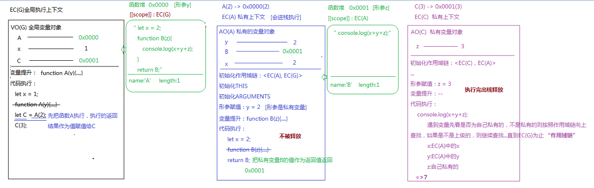

> 原理剖析阶段，概念就不再重复啦，直接上代码分析:smirk:

- [从简单题目入手分析解题思路](#从简单题目入手分析解题思路)
- [练习 + 分析](#练习--分析)
- [继续练习18题](#继续练习18题)
  - [1.](#1)
  - [2.](#2)
  - [3.](#3)
  - [4.](#4)
  - [5.](#5)
  - [6.](#6)
  - [7. 编写queryURLParams方法实现如下的效果（至少两种方案）](#7-编写queryurlparams方法实现如下的效果至少两种方案)
  - [8. 实现一个函数fn，让其具有以下功能：](#8-实现一个函数fn让其具有以下功能)
  - [9.](#9)
  - [10. 改造下面代码，使其输出0~9](#10-改造下面代码使其输出09)
  - [11.](#11)
  - [12.](#12)
  - [13.](#13)
  - [14.](#14)
  - [15. 完成如下需求：](#15-完成如下需求)
  - [16. 编写一个ADD函数满足如下需求](#16-编写一个add函数满足如下需求)
  - [17. 完成如下需求](#17-完成如下需求)
  - [18. 开放题：谈谈你对闭包的理解，以及在项目中的应用！](#18-开放题谈谈你对闭包的理解以及在项目中的应用)
  
## 从简单题目入手分析解题思路

下面这个题目一眼就能出结果，我们主要分析它到底是怎么执行的~

```javascript
let x = 1;
function A(y){
   let x = 2;
   function B(z){
       console.log(x+y+z);
   }
   return B;
}
let C = A(2);
C(3);
```

- 涉及知识点：
  - 区分GO全局对象与VO(G)全局变量对象：
    - GO是一个堆内存，存放的是浏览器内置的API
    - VO(G)是全局上下文中的空间，存放的是全局上下文中创建的变量
    - 关系：基于var/function在全局上下文中声明的全局变量也会给GO赋值一份(映射机制)，但是基于let/const等ES6方式在全局上下文中创建的全局变量和GO没有关系
  - 浏览器的垃圾回收机制：
    - 谷歌等新版本浏览器是“基于引用查找”来进行垃圾回收的
      - 开辟的堆内存，浏览器自己默认会在空闲的时候查找所有内存的引用，把那些不被引用的内存释放掉
      - 开辟的栈内存(上下文)一般在代码执行完都会出栈释放，如果遇到上下文中的东西被外部引用，则不会释放
    - IE等浏览器是“基于计数器”机制进行内存管理的
      - 创建的内存被引用一次，则计数1，再被引用一次，计数2，...，移除引用减去1，...，当减为0的时候，浏览器会把内存释放掉
      - 真实项目中，某些情况导致计数规则会出现问题，造成很多内存不能被释放掉，产生“内存泄漏”(查找引用的方式如果形成相互引用也会导致“内存泄漏”)
  - 面试思考题：总结什么情况下会导致"内存泄漏"？(JS高程3最后章节)
    - 
  - 函数的执行流程：
    - 形成私有上下文
    - 进栈执行
    - 一系列操作(代码执行前的操作和代码执行)
    - 正常情况下，代码执行完之后，私有上下文会出栈释放，以此来优化栈内存空间；但是有特殊情况，如果当前私有上下文中某个东西(一般是一个堆)被上下文以外的事物占用了，则上下文不会出栈释放。




- 执行流程：
  - 创建ECStack，创建全局上下文EC(G)，EC(G)进栈执行，后期画图的时候可以省略ECStack的绘制，只画执行上下文，默认每个执行上下文创建后都会进栈执行。
  - 全局下的变量提升:var/function存在变量提升，但是let/const不会
    - `function A(y) {...}`：提升的是函数的声明与赋值
      - 创建函数堆`0x0000`，注意，这个函数堆是在全局下创建的，一定与全局上下文有个关联。函数A有一个形参y不要忘记
      - 声明函数作用域：`[[scope]]: EC(G)`
      - 将函数A的函数体中的代码字符串存入堆0x0000
      - 存函数的name、length等自己的固有属性
      - 创建变量A，将A与0x0000相关联
  - 全局下的代码执行：
    - `let x = 1`: 创建值1，创建变量x，关联
    - `function A(y) {...}`: 变量提升已处理，不再处理
    - `let C = A(2)`: 先把函数A执行，执行的返回结果作为值赋给变量C
      - 先创建值，即先执行`A(2) => 0x0000(2)`：
        - 形成私有上下文EC(A)，进栈执行(图中没有画栈，但是这个过程一定有)，形成私有变量对象AO(A)
        - 初始化作用域链:`<EC(A), EC(G)>`
        - 初始化this、初始化arguments
        - 形参赋值：`y = 2`，形参变量是当前上下文中的私有变量 => 创建值2，y与2关联
        - EC(A)中的变量提升：
          - `function B(z) {...}`：提升的函数声明与赋值
            - 创建函数B的堆`0x0001`，带有一个形参z别忘了，这个堆是在EC(A)这个上下文中创建的，所以这个堆是与EC(A)关联的
            - 创建作用域：`[[scope]]: EC(A)`
            - 存储B函数体中的代码字符串
            - 存储name、length等函数B固有属性
            - 创建变量B，B与`0x0001`相关联
        - EC(A)中的代码执行：
          - `let x = 2`: 创建值2，创建变量x，x与2关联
          - `function B(z) {...}`: 变量提升执行过，不再执行
          - `return B`: 把私有变量B的值作为返回值返回，相当于返回`0x0001`
      - 创建全局变量C
      - C与私有上下文EC(A)的返回值B相关联，即C与`0x0001`关联
      - 关于`EC(A)`执行结束后是否出栈释放，这里的观点是这样的：
        - EC(A)中在执行过程中创建了一个堆内存`0x0001`，当前上下文中创建的堆内存被该上下文以外的全局上下文引用了，相当于C在占用这个堆，这个堆就不会被释放，这个堆不能释放，则创建这个堆的上下文也不能释放，也就说EC(A)在执行结束后由于被全局上下文中的变量引用了堆内存所以不会释放。如果返回的值是基本值，都是按值操作，不会产生占用。释放不释放的标准是看当前上下文中有没有东西被占用，返回一个函数只是其中一种形式！
    - `C(3)`: 执行`C(3) => 0X0001(3)`
      - 创建函数私有上下文EC(C), 创建私有变量对象`VO(C)`
      - 初始化作用域链：`<EC(C), EC(A)>`
      - 初始化this、初始化arguments
      - 形参赋值：`z = 3`, 形参是私有上下文中的私有变量，创建值3，关联z与3
      - 变量提升：无
      - 代码执行:
        - `console.log(x+y+z)`,遇到变量先看是否为自己私有的，如果不是私有的就按照作用域链向上查找，如果不是上级就继续向上查找，直到EC(G)为止：
          - x: EC(A)中的x
          - y: EC(A)中的y
          - z: 私有变量z
          - => 输出7
  

关于`EC(A)`执行结束后是否出栈释放的问题，因为之前看到过其他的观点，即认为EC(A)中的内容即使被外部引用，它在执行完之后也会出栈释放，而被引用的变量会被保存在一个内部对象中，也就是闭包。两个观点，到底哪个是对的？想要验证一下，

验证思路：将代码在浏览器打断点执行，整个代码执行的过程中我们能够直观地看到它的调用栈变化情况，直接看函数A执行结束之后有没有出栈就可以了。看下图：


emmm到底哪个观点是对的呢？这个疑问先放在这里，继续深入学习之后回来解答！

--- 
## 练习 + 分析

```javascript
let x = 5;
function fn(x) {
  return function(y) {
      console.log(y + (++x));
  }
}
let f = fn(6);
f(7);
fn(8)(9);
f(10);
console.log(x);
```

- 注意：函数每一次调用都会生成一个新的执行上下文

---

```javascript
let a=0,
    b=0;
function A(a){
    A=function(b){
        alert(a+b++);
    };
    alert(a++);
}
A(1);  // 注意：全局下的A被重新赋值为新的堆地址
A(2);
```


---

```javascript
var x = 3,
    obj = {x: 5};
obj.fn = (function () {
    // this => window
    this.x *= ++x;
    return function (y) {
        this.x *= (++x)+y;
        console.log(x);
    }
})();
var fn = obj.fn;
obj.fn(6);  // 13
fn(4);  // 234
console.log(obj.x, x);  // 95 234
```

注意： 
```javascript
var a = 123
var obj = {
    a: 222,
    fn: function () {
        console.log(this.a)  // 222
        console.log(a)  // 123
    }
}
obj.fn()  
```

```javascript
var a = 123
var obj = {
    a: 222,
    fn: function () {
        console.log(this.a)  // 123
        console.log(a)  // 123
    }
}
var c = obj.fn
c()
```
在不绑定this的时候，我们访问一个变量，沿着变量的所在执行上下文的作用域链来查找。在函数创建的时候它的作用域就确定了，作用域链是在执行函数创建函数执行上下文的时候初始化形成的。

---
测试一下JS学到什么程度了：
```javascript
let arr = [10.18, 0, 10, 25, 23];
arr = arr.map(parseInt);
console.log(arr);
```
---
```javascript
var a = 10,
    b = 11,
    c = 12;
function test(a) {
    a = 1;  // 形参变量是私有变量
    var b = 2;  // 在函数内部创建的变量是私有变量
    c = 3;
}
test(10);
console.log(a, b, c);
```
---
```javascript
var a = 4;
function b(x, y, a) {
    console.log(a);
    arguments[2] = 10;
    console.log(a);
}
a = b(1, 2, 3);
console.log(a);
```
- EC(G)变量提升： var a; function b(x, y, a) {}
- 执行`b(1, 2, 3)`，创建EC(B)私有上下文
  - 初始化作用域链：`<EC(B), EC(G)>`
  - 初始化this
  - 初始化arguments(函数内置的实参集合[类数组]): `{0:1, 1:2, 2:3, length:3}`
  - 形参赋值：`x = 1  y = 2  a = 3`, x、y、a都是私有变量
  - 在JS非严格模式下，函数中初始化arguments和形参赋值完成后，浏览器会**按照顺序**把形参和arguments中的每一项建立映射机制(一改都改)
    - `x -> arguments[0]`
    - `y -> arguments[1]`
    - `a -> arguments[2]`
  - 变量提升
  - 代码执行
    - 输出a为3
    - 修改a的值为10，`arguments[2]`和`a`都会变成10
    - 输出a为10
```javascript
// 非严格模式下
function func(x, y, z) {
  x = 100
  console.log(arguments[0])  // 100

  arguments[1] = 200
  console.log(y)  // 200

  z = 300
  console.log(arguments[2])  // undefined
}
func(10, 20)
```

- 开启JS严格模式: `"use strict"`
  - 上述函数中初始化arguments和形参赋值完成后，浏览器不会按照顺序把形参和arguments中的每一项建立映射机制，也就是说`x/y/a`与`arguments[0]/arguments[1]/arguments[2]`是独立的，不会存在映射机制。

```javascript
"use strict"
function func(x, y, z) {
  x = 100
  console.log(arguments[0])  // 10

  arguments[1] = 200
  console.log(y)  // 20

  z = 300
  console.log(arguments[2])  // undefined
}
func(10, 20)
```

---

```javascript
{
  function foo() {}
  foo = 1;
}
console.log(foo);
```
- `EC(G) -> VO(G)`
  - **变量提升**：`function foo`，注意，块里面只有函数提升没有赋值
  - 代码执行：如果大括号中有`function/let/const`，则会形成一个块级上下文
    - 形成EC(BLOCK) -> AO(BLOCK)
      - 作用域链：`<EC(BLOCK), EC(G)>`
      - 变量提升：声明+定义foo函数, 注意这里面没有块了，变量提升函数时会提前声明与赋值, 所以`foo ---> AAAFFF000(函数的堆内存地址，其中存放的是代码字符串)`，虽然foo是私有的，但是为了兼容ES3，在全局中这个foo声明过，浏览器会将这行diamante之前的对foo的操作映射到全局上一份，而这行代码下面的语句就是只操作私有环境下的了，与全局无关。代码中，在这行代码之前进行了变量提升，所以也会映射到全局下一份，所以全局下的foo也是指向`AAAFFF000`。
      - 代码执行：`foo=1`，所以，私有的foo是1
  - 全局下执行`console.log(foo);`输出的是函数本身

```javascript
foo() // 报错 Uncaught TypeError: foo is not a function
{
  function foo() {
    console.log('aaa')
  }
}
foo()  // 可以调用成功，因为之前存在变量提升
```
---
```javascript
{
  function foo() {}
  foo = 1;
  function foo() {}
}
console.log(foo);  // 1
```
- EC(G)->VO(G)
  - 变量提升：两次`function foo`的变量提升，后面的会覆盖前面的，注意，形成块级上下文，新版本浏览器只提升声明不提升函数定义，并且，全局下接触到的是第二个`function foo() {}`
  - EC(BLOCK) -> AO(BLOCK)
    - 初始化作用域链：`<EC(BLOCK), EC(G)>`
    - 初始化this
    - 初始化arguments
    - 变量提升：提升函数的声明+定义
    - 代码执行：
      - `foo = 1`，这里foo是私有的
      - 第二个`function foo() {}`之前的语句会在全局下形成映射，所以，此时全局下的foo也是1
---
```javascript
{
  function foo() {}
  foo = 1;
  function foo() {}
  foo = 2;
}
console.log(foo);  // 1
```

```javascript
console.log(foo);  // undefined 
{
  function foo() {}
  foo = 1;
  function foo() {}
  foo = 2;
}
console.log(foo);  // 1
```

---
```javascript
var a = 9;
function fn() {
    a = 0;
    return function (b) {
        return b + a++;
    }
}
var f = fn();
console.log(f(5));  // 5
console.log(fn()(5));  // 5
console.log(f(5));  // 6
console.log(a); // 2
```


---
```javascript
var test = (function (i) {
    return function () {
        alert(i *= 2);
    }
})(2);
test(5);
```


---
```javascript
var x = 5,
    y = 6;
function func() {
    x += y;
    func = function (y) {
        console.log(y + (--x));
    };
    console.log(x, y);
}
func(4);
func(3);
console.log(x, y);
```

---
```javascript
function fun(n, o) {
    console.log(o);
    return {
        fun: function (m) {
            return fun(m, n);
        }
    };
}
var c = fun(0).fun(1);
c.fun(2);
c.fun(3);
```


---
## 继续练习18题
### 1. 
```javascript
console.log(a, b, c);
var a = 12,
    b = 13,
    c = 14;
function fn(a) {
    console.log(a, b, c);
    a = 100;
    c = 200;
    console.log(a, b, c);
}
b = fn(10);
console.log(a, b, c);
```

---
### 2. 
```javascript
var i = 0;
function A() {
    var i = 10;
    function x() {
        console.log(i);
    }
    return x;
}
var y = A();
y();
function B() {
    var i = 20;
    y();
}
B();
```

---
### 3. 
```javascript
var a=1;
var obj ={
   "name":"tom"
}
function fn(){
   var a2 = a;
   obj2 = obj;
   a2 =a;
   obj2.name =”jack”;
}
fn();
console.log(a);
console.log(obj);
```
---
### 4. 
```javascript
var a = 1;
function fn(a){
    console.log(a)
    var a = 2;
    function a(){}
}
fn(a);
```
---
### 5. 
```javascript
console.log(a); 
var a=12; 
function fn(){
    console.log(a); 
    var a=13;   
}
fn();   
console.log(a);
```

```javascript
console.log(a); 
var a=12;
function fn(){
    console.log(a);
    a=13;
}
fn();
console.log(a);
```
 
```javascript
console.log(a);
a=12;
function fn(){
    console.log(a);
    a=13;   
}
fn();
console.log(a);
```
---
### 6. 
```javascript
var foo='hello'; 
(function(foo){
   console.log(foo);
   var foo=foo||'world';
   console.log(foo);
})(foo);
console.log(foo);
```
---
### 7. 编写queryURLParams方法实现如下的效果（至少两种方案）
```javascript
let url="http://www.zhufengpeixun.cn/?lx=1&from=wx#video";
console.log(url.queryURLParams("from")); //=>"wx"
console.log(url.queryURLParams("_HASH")); //=>"video"
```
---
### 8. 实现一个函数fn，让其具有以下功能：
```javascript
let res = fn(1,2)(3);
console.log(res); //=>6  1+2+3
```
---
### 9. 
```javascript
var b = 10;
(function b() {
    b = 20;
    console.log(b);
})();
console.log(b);
```
---
### 10. 改造下面代码，使其输出0~9
```javascript
for (var i = 0; i < 10; i++) {
    setTimeout(() => {
        console.log(i);
    }, 1000);
}
```
---
### 11. 
```javascript
var i = 20;
function fn() {
    i -= 2;
    var i = 10;
    return function (n) {
        console.log((++i) - n);
    }
}
var f = fn();
f(1);
f(2);
fn()(3);
fn()(4);
f(5);
console.log(i);
```
---
### 12. 
```javascript
var x=0,
    y=1;
function fn(){
    x+=2;
    fn=function(y){
        console.log(y + (--x));
    };
    console.log(x, y);
}
fn(3);
fn(4);
console.log(x, y);
```
---
### 13. 
```javascript
!(!"Number(undefined)");

isNaN(parseInt(new Date())) + Number([1]) + typeof undefined;

Boolean(Number("")) + !isNaN(Number(null)) + Boolean("parseInt([])") + typeof !(null);

parseFloat("1.6px") + parseInt("1.2px") + typeof parseInt(null);

isNaN(Number(!!Number(parseInt("0.8"))));

!typeof parseFloat("0");

typeof "parseInt(null)" + 12 + !!Number(NaN);

!typeof (isNaN("")) + parseInt(NaN);

typeof !parseInt(null) + !isNaN(null);
```

---
### 14. 
```javascript
var x = 1
function func(x, y=function anonymous() {x = 2}) {
  x = 3
  y()
  console.log(x)
} 
func(5)
console.log(x)
```

```javascript
var x = 1
function func(x, y=function anonymous() {x = 2}) {
  var x = 3
  y()
  console.log(x)
} 
func(5)
console.log(x)
```

```javascript
var x = 1
function func(x, y=function anonymous() {x = 2}) {
  var x = 3
  var y = function anonymous1() {x = 4}
  console.log(x)
} 
func(5)
console.log(x)
```

---
### 15. 完成如下需求：

```javascript
~function(){
    //=>bind方法在IE6~8中不兼容，接下来我们自己基于原生JS实现这个方法
    function bind(){

    };
    Function.prototype.bind=bind;
}();
var obj = {name:'zhufeng'};
function func(){
    console.log(this,arguments);
    //=>当点击BODY的时候，执行func方法，输出：obj [100,200,MouseEvent事件对象]
}
document.body.onclick = func.bind(obj,100,200);
```
### 16. 编写一个ADD函数满足如下需求
```javascript
add(1);       //1
add(1)(2);    //3
add(1)(2)(3); //6
add(1)(2,3);  //6
add(1,2)(3);  //6
add(1,2,3);   //6
```
---
### 17. 完成如下需求
```javascript
/* 
    在函数式编程当中有一个很重要的概念就是函数组合， 实际上就是把处理数据的函数像管道一样连接起来， 然后让数据穿过管道得到最终的结果。 例如：
    const add1 = (x) => x + 1;
    const mul3 = (x) => x * 3;
    const div2 = (x) => x / 2;
    div2(mul3(add1(add1(0)))); //=>3
​
    而这样的写法可读性明显太差了，我们可以构建一个compose函数，它接受任意多个函数作为参数（这些函数都只接受一个参数），然后compose返回的也是一个函数，达到以下的效果：
    const operate = compose(div2, mul3, add1, add1)
    operate(0) //=>相当于div2(mul3(add1(add1(0)))) 
    operate(2) //=>相当于div2(mul3(add1(add1(2))))
​
    简而言之：compose可以把类似于f(g(h(x)))这种写法简化成compose(f, g, h)(x)，请你完成 compose函数的编写 
*/
```

---
### 18. 开放题：谈谈你对闭包的理解，以及在项目中的应用！

