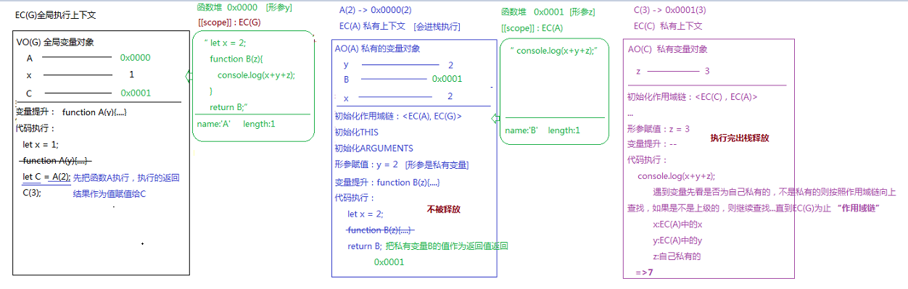
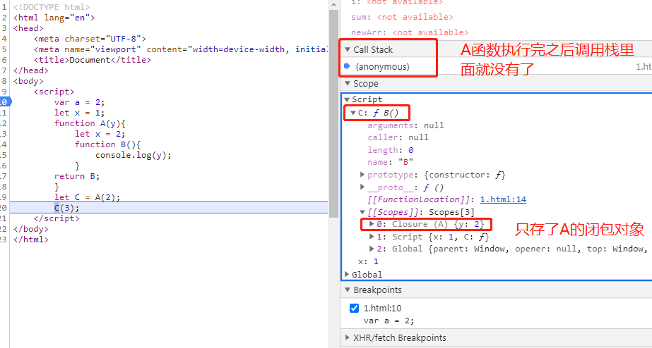

> 原理剖析阶段，概念就不再重复啦，直接上代码分析:smirk:

1. 从简单题目入手

下面这个题目一眼就能出结果，我们主要分析它到底是怎么执行的~

```javascript
let x = 1;
function A(y){
   let x = 2;
   function B(z){
       console.log(x+y+z);
   }
   return B;
}
let C = A(2);
C(3);
```

- 涉及知识点：
  - 区分GO全局对象与VO(G)全局变量对象：
    - GO是一个堆内存，存放的是浏览器内置的API
    - VO(G)是全局上下文中的空间，存放的是全局上下文中创建的变量
    - 关系：基于var/function在全局上下文中声明的全局变量也会给GO赋值一份(映射机制)，但是基于let/const等ES6方式在全局上下文中创建的全局变量和GO没有关系
  - 浏览器的垃圾回收机制：
    - 谷歌等新版本浏览器是“基于引用查找”来进行垃圾回收的
      - 开辟的堆内存，浏览器自己默认会在空闲的时候查找所有内存的引用，把那些不被引用的内存释放掉
      - 开辟的栈内存(上下文)一般在代码执行完都会出栈释放，如果遇到上下文中的东西被外部引用，则不会释放
    - IE等浏览器是“基于计数器”机制进行内存管理的
      - 创建的内存被引用一次，则计数1，再被引用一次，计数2，...，移除引用减去1，...，当减为0的时候，浏览器会把内存释放掉
      - 真实项目中，某些情况导致计数规则会出现问题，造成很多内存不能被释放掉，产生“内存泄漏”(查找引用的方式如果形成相互引用也会导致“内存泄漏”)
  - 面试思考题：总结什么情况下会导致"内存泄漏"？(JS高程3最后章节)
    - 
  - 函数的执行流程：
    - 形成私有上下文
    - 进栈执行
    - 一系列操作(代码执行前的操作和代码执行)
    - 正常情况下，代码执行完之后，私有上下文会出栈释放，以此来优化栈内存空间；但是有特殊情况，如果当前私有上下文中某个东西(一般是一个堆)被上下文以外的事物占用了，则上下文不会出栈释放。




- 执行流程：
  - 创建ECStack，创建全局上下文EC(G)，EC(G)进栈执行，后期画图的时候可以省略ECStack的绘制，只画执行上下文，默认每个执行上下文创建后都会进栈执行。
  - 全局下的变量提升:var/function存在变量提升，但是let/const不会
    - `function A(y) {...}`：提升的是函数的声明与赋值
      - 创建函数堆`0x0000`，注意，这个函数堆是在全局下创建的，一定与全局上下文有个关联。函数A有一个形参y不要忘记
      - 声明函数作用域：`[[scope]]: EC(G)`
      - 将函数A的函数体中的代码字符串存入堆0x0000
      - 存函数的name、length等自己的固有属性
      - 创建变量A，将A与0x0000相关联
  - 全局下的代码执行：
    - `let x = 1`: 创建值1，创建变量x，关联
    - `function A(y) {...}`: 变量提升已处理，不再处理
    - `let C = A(2)`: 先把函数A执行，执行的返回结果作为值赋给变量C
      - 先创建值，即先执行`A(2) => 0x0000(2)`：
        - 形成私有上下文EC(A)，进栈执行(图中没有画栈，但是这个过程一定有)，形成私有变量对象AO(A)
        - 初始化作用域链:`<EC(A), EC(G)>`
        - 初始化this、初始化arguments
        - 形参赋值：`y = 2`，形参变量是当前上下文中的私有变量 => 创建值2，y与2关联
        - EC(A)中的变量提升：
          - `function B(z) {...}`：提升的函数声明与赋值
            - 创建函数B的堆`0x0001`，带有一个形参z别忘了，这个堆是在EC(A)这个上下文中创建的，所以这个堆是与EC(A)关联的
            - 创建作用域：`[[scope]]: EC(A)`
            - 存储B函数体中的代码字符串
            - 存储name、length等函数B固有属性
            - 创建变量B，B与`0x0001`相关联
        - EC(A)中的代码执行：
          - `let x = 2`: 创建值2，创建变量x，x与2关联
          - `function B(z) {...}`: 变量提升执行过，不再执行
          - `return B`: 把私有变量B的值作为返回值返回，相当于返回`0x0001`
      - 创建全局变量C
      - C与私有上下文EC(A)的返回值B相关联，即C与`0x0001`关联
      - 关于`EC(A)`执行结束后是否出栈释放，这里的观点是这样的：
        - EC(A)中在执行过程中创建了一个堆内存`0x0001`，当前上下文中创建的堆内存被该上下文以外的全局上下文引用了，相当于C在占用这个堆，这个堆就不会被释放，这个堆不能释放，则创建这个堆的上下文也不能释放，也就说EC(A)在执行结束后由于被全局上下文中的变量引用了堆内存所以不会释放。如果返回的值是基本值，都是按值操作，不会产生占用。释放不释放的标准是看当前上下文中有没有东西被占用，返回一个函数只是其中一种形式！
    - `C(3)`: 执行`C(3) => 0X0001(3)`
      - 创建函数私有上下文EC(C), 创建私有变量对象`VO(C)`
      - 初始化作用域链：`<EC(C), EC(A)>`
      - 初始化this、初始化arguments
      - 形参赋值：`z = 3`, 形参是私有上下文中的私有变量，创建值3，关联z与3
      - 变量提升：无
      - 代码执行:
        - `console.log(x+y+z)`,遇到变量先看是否为自己私有的，如果不是私有的就按照作用域链向上查找，如果不是上级就继续向上查找，直到EC(G)为止：
          - x: EC(A)中的x
          - y: EC(A)中的y
          - z: 私有变量z
          - => 输出7
  

关于`EC(A)`执行结束后是否出栈释放的问题，因为之前看到过其他的观点，即认为EC(A)中的内容即使被外部引用，它在执行完之后也会出栈释放，而被引用的变量会被保存在一个内部对象中，也就是闭包。两个观点，到底哪个是对的？想要验证一下，

验证思路：将代码在浏览器打断点执行，整个代码执行的过程中我们能够直观地看到它的调用栈变化情况，直接看函数A执行结束之后有没有出栈就可以了。看下图：



emmm到底哪个观点是对的呢？这个疑问先放在这里，继续深入学习之后回来解答！

