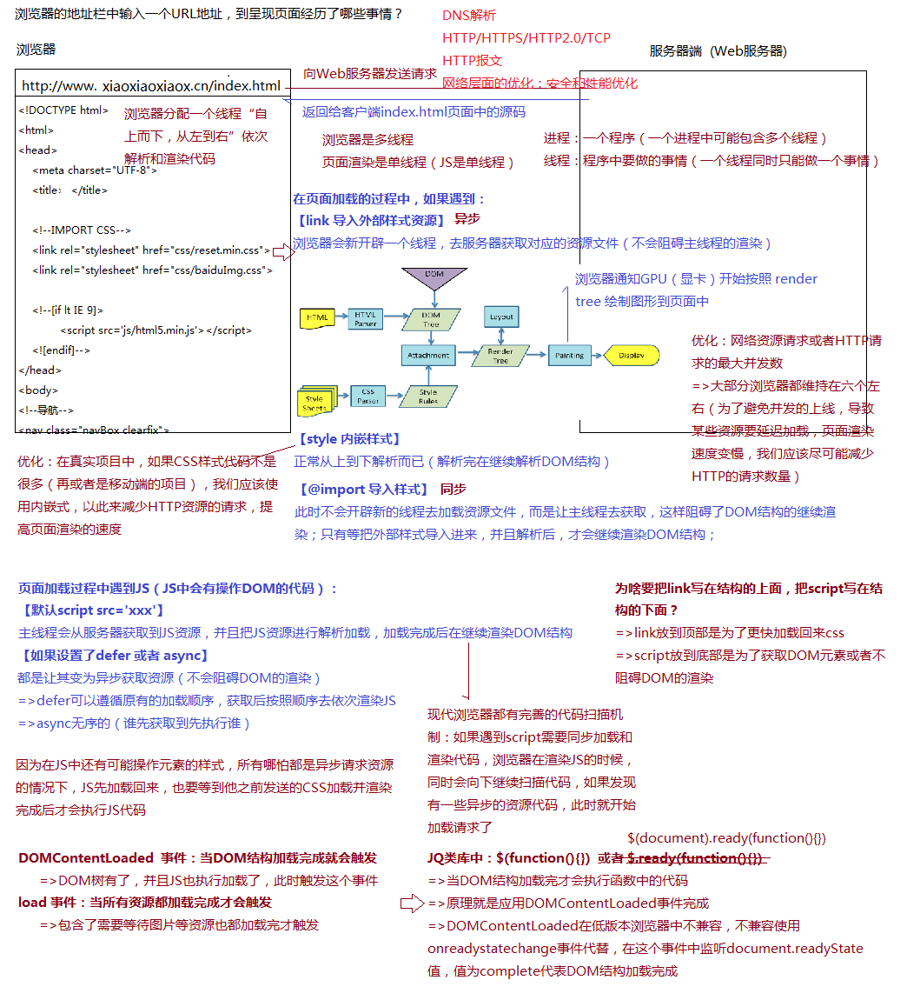

## 浏览器渲染原理



  - 浏览器是多线程的，页面渲染是单线程的(JS单线程)
    - 进程：一个程序，一个进程中可能包含多个线程
    - 线程：程序中要做的事情，一个线程同时只能做一件事情
  - 浏览器渲染的主要流程：
    - 当地址栏中输入上图中的url时，服务器返回的是这个index文件的源代码，浏览器拿到这个源代码后会分配一个主线程"自上而下，从左到右"依次解析和渲染代码
    - 页面加载过程中遇到CSS：
      - link(link导入外部样式资源，异步),浏览器会新开辟一个线程，去服务器获取对应的资源文件，不会阻塞主线程的渲染，注意，获取到css之后代码的运行还是在主线中完成的
      - 如果遇到style内嵌样式，正常自上往下解析(也就是说，如果有内嵌样式的话，可能还没有构建DOM树，就已经解析完部分CSS样式了)，这是同步的方式
      - 如果遇到`@import`导入样式，它使用的是同步的方式，此时浏览器不会开辟新的线程去加载资源文件，而是让主线程去获取，这样阻碍了DOM结构的继续渲染，只有等把外部的样式导入完成，并且解析后，才会继续渲染DOM结构
      - 思考：上述3中引入CSS的方式应该选择哪一种？
        - 真实项目中尽可能使用link，`@import`尽量不使用，如果规定了必须先获取到某个样式才能进行DOM解析才会去使用`@import`，注意，less和scss中的`@import`跟这里是不太一样的，less和scss中的`@import`在编译成CSS的时候就已经合在一起了，后面不会再出现`@import`。
        - 如果样式表东西太多，使用link，原因是，这种情况下如果使用style的方式，相当于将样式全部都写在html页面中了，第一次去拉html页面的时候就会很长，就会出现白屏；如果样式表内容比较少就可以使用内嵌的方式。
    - 页面加载过程中遇到加载图片，处理方式与CSS基本一致
    - 页面加载过程中遇到JS(JS中会有操作DOM的代码)：
      - 默认的`<script src='xxx'></script>`, 主线程会从服务器获取到JS资源，并把JS资源进行解析执行，加载完成后再继续渲染DOM结构，同步的
        - 思考：为什么要把link写在结构的上面，把script写在结构的下面？
          - link放在上面是为了更快加载CSS
          - script放在下面是为了获取DOM元素(JS中有对DOM的操作)或者不阻碍DOM的渲染(因为就算没有操作DOM，但是获取js代码之后就要执行，会阻塞DOM渲染)
      - script标签含有`defer`或者`sync`属性变成异步请求。
        - defer：会遵循原有的加载顺序，获取后按照顺序去依次渲染JS，执行时间是DOM渲染完成之后，不会阻碍DOM渲染，真实项目中使用defer多
        - async：无序的，谁先加载回来谁先执行，有可能会阻碍DOM渲染，如果知道不会操作DOM，就可以使用async
      - 注1：现代浏览器都有完善的代码扫描机制：如果遇到script需要同步加载和渲染代码，浏览器在渲染JS的时候，同时会向下继续扫描代码，如果发现有一些异步的资源代码，此时就开始加载请求了。
      - 注2：JS中的自我等待机制：在JS中还有可能操作元素的样式，所以哪怕都是异步请求资源的情况下，JS加载回来，也要等到它之前发送的CSS加载并渲染完之后才会执行JS代码
      - `DOMContentLoaded`和`load`事件：
        - `DOMContentLoaded`事件：DOM结构加载完成就会触发，这个事件的触发优先于load事件。DOM树有了，并且JS也执行加载了，此时会触发`DOMContentLoaded`事件。
        - `load`：当所有资源加载完成才会触发，DOM树有了，并且JS也执行加载了，还需要等待图片等资源也都加载完才触发
      - jQuery类库中：`$(function () {})`或者`$(document).ready(function () {})`
        - 当DOM结构加载完才会执行函数中的代码，原理是应用`DOMContentLoaded`事件完成的，但是`DOMContentLoaded`属于DOM2级事件，在低版本浏览器中不兼容，不兼容的情况下使用`onreadystatechange`事件代替，在这个事件中监听`documnet.readyState`值，值为`complete`代表DOM结构加载完成。
    - DOM回流和重绘
      - 浏览器渲染页面的机制和原理：
        - 解析HTML，生成DOM树，解析CSS，生成CSSOM树
        - 将DOM树和CSSOM树结合，生成渲染树(Render Tree)
        - Layout(回流): 根据生成的渲染树，计算它们在设备视口(viewport)内的确切位置和大小，这个计算的阶段就是回流
        - Painting(重绘): 根据渲染树以及回流得到的几何信息，得到节点的绝对像素
        - Display:将像素发送给GPU，展示在页面上
      - 重绘：元素样式的改变（但宽高、大小、位置等不变），如 outline, visibility, color、background-color等。
      - 回流：元素的大小或者位置发生了变化（当页面布局和几何信息发生变化的时候），触发了重新布局，导致渲染树重新计算布局和渲染
        - 添加或删除可见的DOM元素 
        - 元素的位置发生变化
        - 元素的尺寸发生变化
        - 内容发生变化（比如文本变化或图片被另一个不同尺寸的图片所替代）
        - 页面一开始渲染的时候（这个无法避免）
        - 浏览器的窗口尺寸变化(回流是根据视口的大小来计算元素的位置和大小的，所以浏览器的窗口尺寸变化也会引发回流)
      - 注意：回流一定会触发重绘，而重绘不一定会回流


- 网络资源请求或者HTTP请求的最大并发数

Browser | HTTP1.0 | HTTP1.1
---------|----------|---------
 IE 6,7 | 2 | 4
 IE8 | 6 | 6
 Firefox | 6 | 6
 Safari | 4 | 4
 Chrome | 6 | 6
 Opera | 4 | 4


- 根据浏览器渲染原理考虑前端优化：
  - 在真实项目中，如果CSS样式代码不是很多或者是移动端的项目，应该使用内嵌式，以此来减少HTTP资源的请求，提高页面渲染速度
  - 网络资源请求或者HTTP请求的最大并发数,大部浏览器都维持在6个左右，从上而下比如会遇到十几个link，就会发送十几个请求，但是最大并发数是6个，也就是只能处理6个请求，其他的就需要先等待这6个处理完之后再处理。所以，为了避免并发上线导致某些资源要延迟加载，页面渲染速度变慢，应该尽可能减少HTTP请求数量
  - 避免DOM回流：
    - 放弃传统操作dom的时代，基于vue/react开始数据影响视图模式：mvvm / mvc / virtual dom / dom diff
    - 分离读写操作 （现代的浏览器都有渲染队列的机制）
    - 样式集中改变(分离读写)
        ```javascript
        div.style.cssText = 'width:20px;height:20px;'
        div.className = 'box';
        ```
    - 缓存布局信息(分离读写)
        ```javascript
        div.style.left = div.offsetLeft + 1 + 'px';
        div.style.top = div.offsetTop + 1 + 'px';
        // => 改为
        var curLeft = div.offsetLeft;
        var curTop = div.offsetTop;
        div.style.left = curLeft + 1 + 'px';
        div.style.top = curTop + 1 + 'px';
        ```
    - 元素批量修改: 文档碎片：`createDocumentFragment`; 模板字符串拼接
        ```javascript
        // 循环创建，会引发10次回流
        for(let i = 0; i < 10; i++) {
            let span = document.createElement('span')
            navBox.appendChild(span)
        }

        // 文档碎片: 一次回流
        let frag = document.createDocumentFragment()  // 创建一个文档碎片
        for(let i = 0; i < 10; i++) {
            let span = document.createElement('span')
            frag.appendChild(span)
        }
        navBox.appendChild(frag)


        // 模板字符串拼接
        let str = ``
        for(let i = 0; i < 10; i++) {
            str += `<span></span>`
        }
        navBox.innerHTML = str
        ```
    - 动画效果应用到position属性为absolute或fixed的元素上（脱离文档流）
    - CSS3硬件加速（GPU加速）
      - 比起考虑如何减少回流重绘，我们更期望的是，根本不要回流重绘；`transform \  opacity \ filters ...` 这些属性会触发硬件加速，不会引发回流和重绘
      - 可能会引发的坑：过多使用会占用大量内存，性能消耗严重、有时候会导致字体模糊等
    - 牺牲平滑度换取速度
      - 每次1像素移动一个动画，但是如果此动画使用了100%的CPU，动画就会看上去是跳动的，因为浏览器正在与更新回流做斗争。每次移动3像素可能看起来平滑度低了，但它不会导致CPU在较慢的机器中抖动
    - 避免table布局和使用css的javascript表达式


分离读写操作的理解：
```javascript

let navBox = document.getElementById('navBox')

// 老版本浏览器引发两次回流
navBox.style.width = '100px'
navBox.style.height = '100px'

// 新版本浏览器存在渲染队列机制，即，不会立即执行，会先收集起来一起执行，所以会引发依次回流
navBox.style.width = '100px'
navBox.style.height = '100px'

// 读写不分离的情况，就算存在渲染队列机制，也会引发两次回流
navBox.style.width = '100px'  // 写
console.log(navBox.clientWidth)  // 读， 这里要读取，上面写的代码就要先执行
navBox.style.height = '100px'

// 读写分离，引发一次回流
navBox.style.width = '100px'  
navBox.style.height = '100px'

console.log(navBox.clientWidth)  // 读取
```