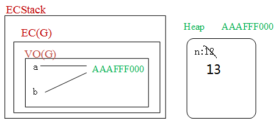
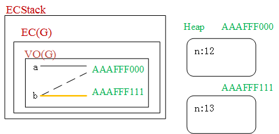
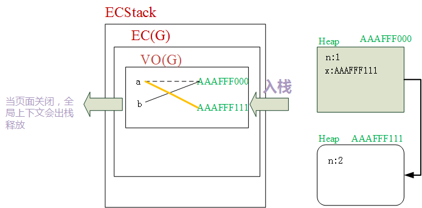
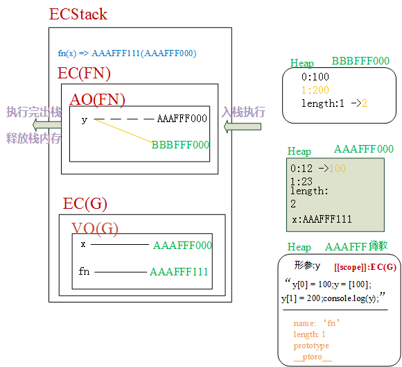

- 要想理解底层机制，先来认识以下几个概念：
  - ECStack(Execution Context Stack)：执行上下文栈、执行环境栈、栈内存 
    - 每打开一个网页都会形成可供JS代码执行的环境，一个全新的ECStack
  - EC(Execution Context)：执行上下文，代码自己执行所在的环境
    - 全局执行上下文EC(G)
    - 函数私有执行上下文EC(FN)
    - 块级执行上下文
    - 两个作用：
      - 供代码执行
      - 存储基本数据类型值(变量/堆的引用地址)
  - VO(Variable Object)： 变量对象，在当前上下文中，用来存放创建的变量和值，每一个执行上下文中都会有一个自己的变量对象，函数私有上下文中叫做AO(Activation Object)活动对象，AO可以理解为VO的一个分支
- GO(Global Object)全局对象：浏览器把内置的一些属性和方法(比如isNaN，parseInt)放到一个单独的内存中，叫堆内存(Heap)，任何一个内存都有一个对应的十六进制内存地址，方便后期寻址，浏览器会让window执行GO，所以浏览器端window指向全局对象
- 栈内存：提供代码执行的环境
- 堆内存：存放属性和方法
- 注意：不要搞混全局对象(GO)与全局变量对象(VO(G)):
  - GO全局对象:它是一个堆内存，存储的是浏览器内置的API属性方法，在浏览器端，让window指向它
  - VO(G)：每一个执行上下文中一定存在一个空间，用来存储创建的变量，叫作变量对象,全局变量对象是全局上下文中用来存储全局变量的空间，它不是GO，只不过在某些情况下VO(G)中的东西会和GO中的东西有所关联("映射机制")
- 注意：栈中也会有一个空间来存储需要执行的代码，为了简便，在文章有的图中没有画出来。

> 一下罗列出来这么多个专有名词缩写，一脸懵？？？不着急，往下看，结合代码，图文并茂就会容易理解了
---

- 基本数据类型都是直接存储在栈内存中的，引用数据类型值先开辟一个堆内存，把代码存进去，最后把地址放到栈中供变量关联使用，注意：所有的等号赋值都是指针的关联指向，一个变量的指针只能与一个内容相关联
  - `var a = 1;`
    - 创建一个值
    - 创建一个变量
    - 让变量和值关联在一起
  - `var a = {n: 12};`，需要创建堆内存，创建的这个堆内存一定是与当前的这个执行上下文相互关联的，对于对象来说也需要三步：
    - 创建一个堆内存
    - 把键值对存储到堆内存中
    - 堆内存地址放到栈中，供变量调用
---

- 从最简单的代码开始：
```javascript
var a = 12;
var b = a;
b = 13;
console.log(a);  // 12
```


- 打开浏览器要执行这段代码时，开辟一个执行上下文栈(调用栈)ECStack
- 创建全局执行上下文EC(G)，在全局执行上下文中会有一块空间叫全局变量对象VO(G)用来存放全局环境下的变量与值，还有一块空间存放要执行的代码，图里面没有画出来。
- 全局执行上下文进栈执行
  - `var a = 12` 需要经过三步操作：
    - 1. 创建值12
    - 2. 创建变量a
    - 3. 变量a和12关联在一起
  - `var b = a`:
    - 变量a已经存在，不需要创建值这一步了
    - 创建变量b
    - 变量b与a关联，相当于与12关联
  - 变量b被重新赋值为13，此时，变量b和值13关联在一起，之前的关联就被清除掉了，一个变量只能关联一个。
  - 访问变量a的值，a仍然与12关联，所以结果为12
- 全局的，在代码不关闭的时候不会出栈，一般私有上下文(函数上下文执行完毕之后可能会直接出栈，来释放空间，优化栈内存)
---

```javascript
var a = {n: 12};
var b = a;
b['n'] = 13;
console.log(a.n);  // 13
```


- 上述代码要执行时开辟一个全新的ECStack
- 创建全局执行上下文EC(G)，EC(G)中会有一个专门的空间(全局变量对象VO(G))来存储该执行上下文中需要的变量与值(引用地址)
- 全局执行上下文EC(G)入栈执行
  - `var a = {n: 12}`需要三步:
    - 创建一个堆内存, 假设地址为`AAAFFF000`
    - 把键值对存储到堆内存中
    - 堆内存地址`AAAFFF000`放到栈中，供变量调用
  - `var b = a`:
    - 创建变量b
    - b与a相关联，也就是指向`AAAFFF000`
  - `b['n'] = 13`: 与b关联的堆内存中的n被重新赋值为13，因为a与b的关联是一样的，所以结果是13

---
```javascript
var a = {n: 12};
var b = a;
b = {n: 13};
console.log(a.n); // 12
```



- 前两行代码执行过程与上述代码是一样的
- `b = {n: 13}`:
  - 开辟一个新的堆内存空间,假设地址为`AAAFFF111`
  - 将键值对放在这个堆内存中
  - 将该堆内存地址`AAAFFF111`与b相关联，现在变量b指向新的内存地址，也就是说无论这个堆内存中的键值对是什么都与变量a无关了，所以a.n依然是12。

---

```javascript
var obj = {
    name: '李易峰',
    fn: (function (x) {
      return x + 10;
    })(obj.name)  // 把自执行函数执行的返回结果赋值给fn属性
  };
  console.log(obj.fn);  // Uncaught TypeError: Cannot read property 'name' of undefined
```
- 考点：`var 变量 = 值`的执行机制
  - 时刻记得三步操作：创建值，创建变量，相互关联
  - 创建值：
    - 开辟一个堆，假设地址是AAABBB000
    - 将键值对存储到这个堆里面：`name: '李易峰', fn: 自执行函数执行，这个函数要执行需要把obj.name作为参数传递进来，这个时候还没有创建变量，也就相当于是undefined.name`, 在这一步就会报错了。

---

- 练习：
  ```javascript
  var a={}, b='0', c=0;  
  a[b]='李易峰';
  a[c]='精神小伙';  
  console.log(a[b]);  // '精神小伙'
  ```
  - 考察点：在JS中对象的属性名是什么格式的？
    - 一种观点认为：普通对象的属性名只能是字符串
    - 另一种认为：普通对象的属性名可以是基本数据类型值
    - Map这种数据结构支持对象作为属性名
    - 普通对象的属性名不能是对象，如果是对象，需要将对象转换为字符串
    - `a["0"]`和`a[0]`，JS认为是一个属性，后面的将前面的覆盖掉了

  ---
  ```javascript
  var a={}, b=Symbol('1'), c=Symbol('1');  
  a[b]='李易峰';
  a[c]='精神小伙';  
  console.log(a[b]);  // '李易峰'
  ```
  - 考点：`Symbol('1') == Symbol('1')  => false`
  
  ---
  ```javascript
  var a={}, b={n:'1'}, c={m:'2'};  
  a[b]='李易峰';  // a["[object Object]"] = '李易峰'
  a[c]='精神小伙';   // a["[object Object]"] = '精神小伙'
  console.log(a[b]);  // '精神小伙'
  ```
  - 考点：普通对象的属性不能是对象，如果是对象需要转换成字符串类型
    - 普通对象`toString`是调取`Object.prototype.toString`，这个是用来检测数据类型的。`({n:'1'}).toString() => "[object Object]"`，注意要加小括号，不加的话会报错。
  
  ---
  - JS执行机制：
  ```javascript
  var a = {n: 1};
  var b = a;
  a.x = a = {n: 2};
  console.log(a.x);  // undefined
  console.log(b);   // {n: 1, x: {n: 2}}
  ```
  
  - 开辟执行上下文栈ECStack
  - 创建全局执行上下文EC(G), EC(G)有一个存储存储变量和值(引用地址)的变量对象VO(G)
  - EC(G)入栈执行：
    - `var a = {n: 1}`:
      - 开辟一个堆内存，假设地址为`AAAFFF000`
      - 将键值对放入该堆内存中
      - 创建变量a
      - 关联变量a与地址`AAAFFF000`
    - `var b = a`:
      - 创建变量b
      - 将变量b与a相关联,也就是指向`AAAFFF000`
    - `a.x = {n: 2}`:
      - 开辟一个新的堆内存，假设地址是`AAAFFF111`
      - 将键值对放入这个堆内存中
      - 在a中关联的堆`AAAFFF000`中创建一个属性x
      - x与堆内存`AAAFFF111`关联
    - `a = {n: 2}`：
      - `{n: 2}`的堆内存已经创建了，这一步要做的就是改变变量a的指针指向
      - 将a与堆内存地址`AAAFFF111`关联
    - `console.log(a.x)`: 访问的是`AAAFFF111`中的x，这个堆中没有x，所以结果为undefined
    - `console.log(b)`: 访问的是`AAAFFF000`，所以结果为`{n: 1, x: {n: 2}}`
  
  ---
  ```javascript
  var x = [12, 23];
  function fn(y) {
      y[0] = 100;
      y = [100];
      y[1] = 200;
      console.log(y);  // [100, 200]
  }
  fn(x);
  console.log(x);  // [100, 23]
  ```
  
  - 开辟执行上下文栈ECStack供代码执行
  - 创建全局执行上下文EC(G), 创建存储变量和值(引用地址的)全局变量对象VO(G)
  - 入栈执行：
    - `var x = [12, 23]`:
      - 等号右边是一个数组，创建一个堆内存，假设地址为`AAAFFF000`
      - 将键值对放到这个堆内存中，即`0: 12, 1: 23, length: 2`
      - 创建变量x，地址`AAAFFF000`存入栈，将变量x与`AAAFFF000`相关联
    - `function fn(y) { ... }`: (注意：这里是创建函数，函数体中的代码是不执行的)
      - 开辟一个堆内存(函数堆)，假设地址为`AAAFFF111`：
      - 创建函数的时候， 就定义了函数的作用域，是当前创建函数所在的上下文，即`[[scope]] = EC(G)`
      - 形参：y
      - 把函数体中的代码当作字符串存储到堆中("代码字符串"， 创建函数不执行)
      - 函数也是对象，也有自己的键值对，这部分键值对也存在这个堆内存中
    - `fn(x) => AAAFFF111(AAAFFF000)`函数执行：
      - 创建函数私有执行上下文EC(FN)，创建存储函数私有变量的函数活动对象AO(G)准备执行函数体中的代码
      - 全局上下文EC(G)压入栈底，函数执行上下文EC(FN)入栈执行
      - 将实参x的值与形参关联，即引用地址与函数形参y相关联
      - `y[0] = 100`：将`AAAFFF000`堆内存中第0个元素的值重新赋值为100
      - `y = [100]`: 开辟一个新的堆内存，假设地址为`BBBFFF000`，将键值对存储到这个堆内存中`0: 100, length: 1`，将y与地址`BBBFFF000`相关联，之前的指向就消除掉了。
      - `y[1] = 200`: 在堆内存`BBBFFF000`中添加一个键值对`1: 200`，这个时候长度也发生变化了，`length: 2`
      - `console.log(y)`:在函数中访问y，实际上访问的就是堆内存`BBBFFF000`中的内容，所以结果是`[100, 200]`
      - `fn(x)`执行结束，并且该函数中没有被其他函数依赖的变量，执行完出栈，释放栈内存
      - 继续执行全局代码: `console.log(x)`这个时候访问x，实际上访问的就是堆内存`AAAFFF000`中的内容，即`[100, 23]`

> 注意： 函数执行的时候，真正执行函数体中的代码之前还需要完成这么几个步骤：
> - 初始化作用域链scopeChain: 自己所在上下文 -> 函数的作用域(函数在哪创建的)。比如在执行函数`fn`的时候，就会初始化作用域链：<EC(FN), EC(G)>。日后在私有上下文代码执行的时候，遇到一个变量，首先看是否为自己的私有变量，在自己的变量对象中有没有，是私有的就操作私有的，不是私有的，按照作用域链向上级上下文找，一直找到全局上下文
> - 初始化this指向：window
> - 初始化实参集合：arguments
> - 形参赋值 y = AAAFFF000
> - 变量提升
> - 代码执行