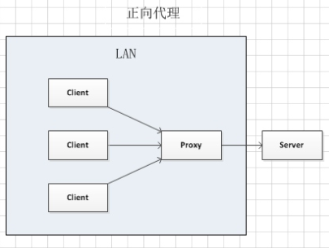
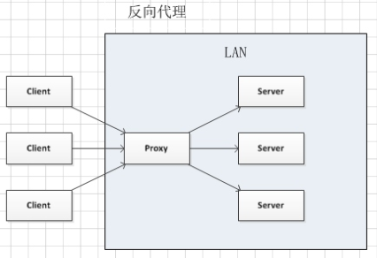

- [正向代理与反向代理的原理](#正向代理与反向代理的原理)
- [TCP三次握手与四次挥手](#tcp三次握手与四次挥手)
- [从页面输入url到页面显示都经历了什么](#从页面输入url到页面显示都经历了什么)
- [HTTP缓存机制及原理](#http缓存机制及原理)
- [实现多个网站之间共享登录状态](#实现多个网站之间共享登录状态)

## 正向代理与反向代理的原理

- 正向代理中，proxy和client同属于一个LAN，对server透明
  - 客户端必须配置正向代理服务器，前提是知道正向代理服务器的IP地址和代理程序的端口
  - 正向代理的作用：
    - 可以访问原来无法访问的资源，比如google
    - 做缓存，加速访问资源
    - 对客户端访问授权，上网进行认证
    - 代理可以记录用户访问记录(上网行为管理)，对外隐藏用户信息
- 反向代理中，proxy和server同属于一个LAN，对client透明
  - 实际运行方式：以代理服务器来接受internet上的连接请求，然后将请求转发给内部网络上的服务器，并将从服务器上得到的结果返回给internet上请求连接的客户端，此时代理服务器对外就表现为一个服务器。
  - 反向代理的作用：
    - 保证内网的安全，可以使用反向代理提供WAF功能，阻止web攻击
    - 负载均衡，通过反向代理服务器来优化网站的负载

> 参考：https://www.cnblogs.com/Anker/p/6056540.html

## TCP三次握手与四次挥手

- TCP三次握手全过程
  - 第一次握手：客户端首先传输控制块 TCB，然后向服务器发出连接请求报文，其中 SYN=1，seq=x（x 为计算机生成的一个随机数）。此时客户端进入 SYN-SENT 状态。TCP规定，SYN报文段（SYN=1的报文段）不能携带数据，但需要消耗掉一个序号。
  - 第二次握手：在服务端收到连接请求报文后，如果服务器同意连接，就会向客户端发送确认报文。确认报文中 SYN=1，ACK=1，（确认号）ack=x+1，（序号）seq=y，其中 y 为服务端的初始化序列号。在发送该报文之后服务端进入 SYN-RCVD 状态。这个报文也不能携带数据，但是同样要消耗一个序号。
  - 第三次握手：在客户端收到服务器发送来的确认报文之后，还需要向服务器发出确认。确认报文的 ACK=1，ack=y+1，seq=x+1。此时，TCP 连接建立，客户端进入 ESTABLISHED 状态。TCP 规定，ACK 报文段可以携带数据，但是如果不携带数据则不消耗序号。在服务端收到客户端的确认之后也会进入 ESTABLISHED 状态，此时客户端和服务端之间就可以相互传输数据了。三次握手完成

思考：
- 为什么需要3次握手，2次可以吗？
> 假设客户端和服务端的连接只需要两次握手，现考虑如下特殊情况：客户端请求建立连接，向服务器发送请求连接报文。服务器在收到请求报文之后，就会向客户端发送一个确认报文，此时服务端认为连接已经建立。但在传输的过程中，该数据丢失，那么客户端此时就会认为自己尚未与服务端建立连接，所以就会进行重传。而如果服务端发送的数据一直丢失而客户端一直在进行重传，那么服务器就会产生多个无效连接，占用资源，这个时候服务器可能会挂掉。而在加入了第三次握手之后，服务端在第二次接收到客户端发送的报文之后才会认为连接已经建立，再出现上述情况的时候，由于三次握手的缘故，此时服务器就不会认为连接已经建立，就会放弃此次连接，和客户端重新进行连接确认。

- 如果已经建立了连接，但是客户端突然出现故障了怎么办？
> 如果客户端出现故障，显然服务器需要在适当的时候关闭连接，以免资源浪费。TCP设置有一个保活计时器，通常时间为2小时，每次服务端接收到客户端的报文时都会重置这个计时器。如果超过了保活时间之后服务端还未收到客户端的报文，那么服务端就会每隔75s发送一个探测报文，若一连发送了10个探测报文之后仍然没反应，服务端就会认为客户端发生了故障，就会关闭连接。

- TCP四次挥手
  - 第一次挥手：客户端发出释放连接报文，并且停止发送数据。释放连接报文首部 FIN=1，seq=u（等于前面已经传送过来的数据的最后一个字节的序号加1）。此时客户端由 ESTABLISHED 状态进入到 FIN-WAIT-1 状态。TCP 规定，FIN 报文段即使不携带数据，也要消耗一个序号。
  - 第二次挥手：服务器收到客户端发送的释放连接报文后，服务器向客户端发送一个确认报文，ACK=1，ack=u+1，seq=v（自己的序列号）后，就进入了 CLOSE-WAIT 状态。此时 TCP 服务器通知高层的应用进程，客户端向服务器的方向就释放了，这时候处于半关闭状态，即客户端已经没有数据要发送了，但是服务器若发送数据，客户端依然要接收。而在客户端收到该确认报文之后，客户端就进入了 FIN-WAIT-2 状态，等待服务器向其发送释放连接报文。此时服务器在发送释放连接报文之前可能还会向客户端继续发送数据。
  - 第三次挥手：在服务端没有数据需要发送给客户端之后，服务器会向客户端发送释放连接报文，FIN=1，ACK=1，ack=u+1，seq=w（此时服务器自己的序列号）。然后服务器便进入了 LAST-ACK 状态。
  - 第四次挥手：

参考：[TCP三次握手四次挥手详解](https://www.cnblogs.com/zmlctt/p/3690998.html)

## 从页面输入url到页面显示都经历了什么

（1）首先会对 URL 进行解析，分析所需要使用的传输协议和请求的资源的路径。如果输入的 URL 中的协议或者主机名不合法，
将会把地址栏中输入的内容传递给搜索引擎。如果没有问题，浏览器会检查 URL 中是否出现了非法字符，如果存在非法字
符，则对非法字符进行转义后再进行下一过程。

（2）浏览器会判断所请求的资源是否在缓存里，如果请求的资源在缓存里并且没有失效，那么就直接使用，否则向服务器发起新
的请求。

（3）下一步我们首先需要获取的是输入的 URL 中的域名的 IP 地址，首先会判断本地是否有该域名的 IP 地址的缓存，如果
有则使用，如果没有则向本地 DNS 服务器发起请求。本地 DNS 服务器也会先检查是否存在缓存，如果没有就会先向根域
名服务器发起请求，获得负责的顶级域名服务器的地址后，再向顶级域名服务器请求，然后获得负责的权威域名服务器的地
址后，再向权威域名服务器发起请求，最终获得域名的 IP 地址后，本地 DNS 服务器再将这个 IP 地址返回给请求的用
户。用户向本地 DNS 服务器发起请求属于递归请求，本地 DNS 服务器向各级域名服务器发起请求属于迭代请求。

（4）当浏览器得到 IP 地址后，数据传输还需要知道目的主机 MAC 地址，因为应用层下发数据给传输层，TCP 协议会指定源
端口号和目的端口号，然后下发给网络层。网络层会将本机地址作为源地址，获取的 IP 地址作为目的地址。然后将下发给
数据链路层，数据链路层的发送需要加入通信双方的 MAC 地址，我们本机的 MAC 地址作为源 MAC 地址，目的 MAC 地
址需要分情况处理，通过将 IP 地址与我们本机的子网掩码相与，我们可以判断我们是否与请求主机在同一个子网里，如果
在同一个子网里，我们可以使用 APR 协议获取到目的主机的 MAC 地址，如果我们不在一个子网里，那么我们的请求应该
转发给我们的网关，由它代为转发，此时同样可以通过 ARP 协议来获取网关的 MAC 地址，此时目的主机的 MAC 地址应
该为网关的地址。

（5）下面是 TCP 建立连接的三次握手的过程，首先客户端向服务器发送一个 SYN 连接请求报文段和一个随机序号，服务端接
收到请求后向服务器端发送一个 SYN ACK报文段，确认连接请求，并且也向客户端发送一个随机序号。客户端接收服务器的
确认应答后，进入连接建立的状态，同时向服务器也发送一个 ACK 确认报文段，服务器端接收到确认后，也进入连接建立
状态，此时双方的连接就建立起来了。

（6）如果使用的是 HTTPS 协议，在通信前还存在 TLS 的一个四次握手的过程。首先由客户端向服务器端发送使用的协议的版
本号、一个随机数和可以使用的加密方法。服务器端收到后，确认加密的方法，也向客户端发送一个随机数和自己的数字证
书。客户端收到后，首先检查数字证书是否有效，如果有效，则再生成一个随机数，并使用证书中的公钥对随机数加密，然后
发送给服务器端，并且还会提供一个前面所有内容的 hash 值供服务器端检验。服务器端接收后，使用自己的私钥对数据解
密，同时向客户端发送一个前面所有内容的 hash 值供客户端检验。这个时候双方都有了三个随机数，按照之前所约定的加
密方法，使用这三个随机数生成一把秘钥，以后双方通信前，就使用这个秘钥对数据进行加密后再传输。

（7）当页面请求发送到服务器端后，服务器端会返回一个 html 文件作为响应，浏览器接收到响应后，开始对 html 文件进行
解析，开始页面的渲染过程。

（8）浏览器首先会根据 html 文件构建 DOM 树，根据解析到的 css 文件构建 CSSOM 树，如果遇到 script 标签，则判端
是否含有 defer 或者 async 属性，要不然 script 的加载和执行会造成页面的渲染的阻塞。当 DOM 树和 CSSOM 树建
立好后，根据它们来构建渲染树。渲染树构建好后，会根据渲染树来进行布局。布局完成后，最后使用浏览器的 UI 接口对页
面进行绘制。这个时候整个页面就显示出来了。

（9）最后一步是 TCP 断开连接的四次挥手过程。

## HTTP缓存机制及原理

参考：[彻底弄懂HTTP缓存机制及原理](https://www.cnblogs.com/chenqf/p/6386163.html)

## 实现多个网站之间共享登录状态

在多个网站之间共享登录状态指的就是单点登录。多个应用系统中，用户只需要登录一次就可以访问所有相互信任的应用系统。

单点登录：首先将用户信息的验证中心独立出来，作为一个单独的认证中心，该认证中心的作用是判断客户端发送的账号密码的正确性，然后向客户端返回对应的用户信息，并且返回一个由服务器端秘钥加密的登录信息的 token 给客户端，该token 具有一定的有效时限。当一个应用系统跳转到另一个应用系统时，通过 url 参数的方式来传递 token，然后转移到的应用站点发送给认证中心，认证中心对 token 进行解密后验证，如果用户信息没有失效，则向客户端返回对应的用户信息，如果失效了则将页面重定向会单点登录页面。

