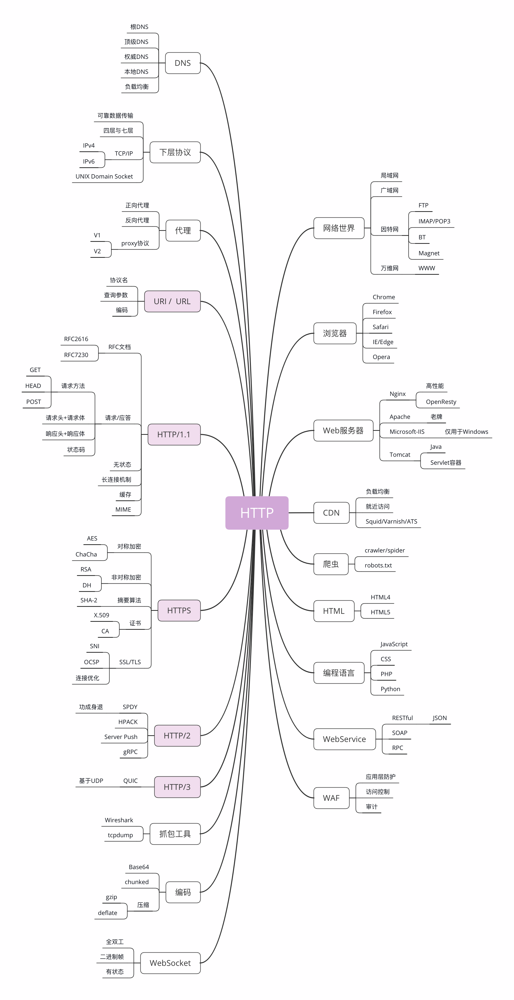

- [HTTP的前世今生](#http的前世今生)
- [HTTP是什么？](#http是什么)
- [与HTTP相关的各种概念](#与http相关的各种概念)
  - [HTTP相关概念](#http相关概念)
  - [HTTP相关协议](#http相关协议)


## HTTP的前世今生

1. 史前时期

20 世纪 60 年代，美国国防部高等研究计划署（ARPA）建立了 ARPA 网，它有四个分布在各地的节点，被认为是如今互联网的“始祖”。然后在 70 年代，基于对 ARPA 网的实践和思考，研究人员发明出了著名的 TCP/IP 协议。由于具有良好的分层结构和稳定的性能，TCP/IP 协议迅速战胜其他竞争对手流行起来，并在 80 年代中期进入了 UNIX 系统内核，促使更多的计算机接入了互联网。

2. 创世纪

1989 年，任职于欧洲核子研究中心（CERN）的蒂姆·伯纳斯 - 李（Tim Berners-Lee）发表了一篇论文，提出了在互联网上构建超链接文档系统的构想。这篇论文中他确立了三项关键技术。

URI：即统一资源标识符，作为互联网上资源的唯一身份；

HTML：即超文本标记语言，描述超文本文档；

HTTP：即超文本传输协议，用来传输超文本。  

这三项技术在如今的我们看来已经是稀松平常，但在当时却是了不得的大发明。基于它们，就可以把超文本系统完美地运行在互联网上，让各地的人们能够自由地共享信息，蒂姆把这个系统称为“万维网”（World Wide Web），也就是我们现在所熟知的 Web。所以在这一年，我们的英雄“HTTP”诞生了，从此开始了它伟大的征途。

3. HTTP/0.9

20 世纪 90 年代初期的互联网世界非常简陋，计算机处理能力低，存储容量小，网速很慢，还是一片“信息荒漠”。网络上绝大多数的资源都是纯文本，很多通信协议也都使用纯文本，所以 HTTP 的设计也不可避免地受到了时代的限制。

这一时期的 HTTP 被定义为 0.9 版，结构比较简单，为了便于服务器和客户端处理，它也采用了纯文本格式。蒂姆·伯纳斯 - 李最初设想的系统里的文档都是只读的，所以只允许用“GET”动作从服务器上获取 HTML 文档，并且在响应请求之后立即关闭连接，功能非常有限。

HTTP/0.9 虽然很简单，但它作为一个“原型”，充分验证了 Web 服务的可行性，而“简单”也正是它的优点，蕴含了进化和扩展的可能性，因为“把简单的系统变复杂”，要比“把复杂的系统变简单”容易得多。


4. HTTP/1.0

1993 年，NCSA（美国国家超级计算应用中心）开发出了 Mosaic，是第一个可以图文混排的浏览器，随后又在 1995 年开发出了服务器软件 Apache，简化了 HTTP 服务器的搭建工作。同一时期，计算机多媒体技术也有了新的发展：1992 年发明了 JPEG 图像格式，1995 年发明了 MP3 音乐格式。这些新软件新技术一经推出立刻就吸引了广大网民的热情，更的多的人开始使用互联网，研究 HTTP 并提出改进意见，甚至实验性地往协议里添加各种特性，从用户需求的角度促进了 HTTP 的发展。

于是在这些已有实践的基础上，经过一系列的草案，HTTP/1.0 版本在 1996 年正式发布。它在多方面增强了 0.9 版，形式上已经和我们现在的 HTTP 差别不大了，例如：

- 增加了 HEAD、POST 等新方法；

- 增加了响应状态码，标记可能的错误原因；

- 引入了协议版本号概念；引入了 HTTP Header（头部）的概念，让 HTTP 处理请求和响应更加灵活；

- 传输的数据不再仅限于文本。

但 HTTP/1.0 并不是一个“标准”，只是记录已有实践和模式的一份参考文档，不具有实际的约束力，相当于一个“备忘录”。所以 HTTP/1.0 的发布对于当时正在蓬勃发展的互联网来说并没有太大的实际意义，各方势力仍然按照自己的意图继续在市场上奋力拼杀。

5. HTTP/1.1

1995 年，网景的 Netscape Navigator 和微软的 Internet Explorer 开始了著名的“浏览器大战”，都希望在互联网上占据主导地位。这场战争的结果你一定早就知道了，最终微软的 IE 取得了决定性的胜利，而网景则“败走麦城”(但后来却凭借 Mozilla Firefox 又扳回一局)。“浏览器大战”的是非成败我们放在一边暂且不管，不可否认的是，它再一次极大地推动了 Web 的发展，HTTP/1.0 也在这个过程中经受了实践检验。于是在“浏览器大战”结束之后的 1999 年，HTTP/1.1 发布了 RFC 文档，编号为 2616，正式确立了延续十余年的传奇。

从版本号我们就可以看到，HTTP/1.1 是对 HTTP/1.0 的小幅度修正。但一个重要的区别是：它是一个“正式的标准”，而不是一份可有可无的“参考文档”。这意味着今后互联网上所有的浏览器、服务器、网关、代理等等，只要用到 HTTP 协议，就必须严格遵守这个标准，相当于是互联网世界的一个“立法”。

不过，说 HTTP/1.1 是“小幅度修正”也不太确切，它还是有很多实质性进步的。毕竟经过了多年的实战检验，比起 0.9/1.0 少了“学术气”，更加“接地气”，同时表述也更加严谨。HTTP/1.1 主要的变更点有：

- 增加了 PUT、DELETE 等新的方法；
- 增加了缓存管理和控制；
- 明确了连接管理，允许持久连接；
- 允许响应数据分块（chunked），利于传输大文件；
- 强制要求 Host 头，让互联网主机托管成为可能。

HTTP/1.1 的推出可谓是“众望所归”，互联网在它的“保驾护航”下迈开了大步，由此走上了“康庄大道”，开启了后续的“Web 1.0”“Web 2.0”时代。现在许多的知名网站都是在这个时间点左右创立的，例如 Google、新浪、搜狐、网易、腾讯等。不过由于 HTTP/1.1 太过庞大和复杂，所以在 2014 年又做了一次修订，原来的一个大文档被拆分成了六份较小的文档，编号为 7230-7235，优化了一些细节，但此外没有任何实质性的改动。

6. HTTP/2

HTTP/1.1 发布之后，整个互联网世界呈现出了爆发式的增长，度过了十多年的“快乐时光”，更涌现出了 Facebook、Twitter、淘宝、京东等互联网新贵。这期间也出现了一些对 HTTP 不满的意见，主要就是连接慢，无法跟上迅猛发展的互联网，但 HTTP/1.1 标准一直“岿然不动”，无奈之下人们只好发明各式各样的“小花招”来缓解这些问题，比如以前常见的切图、JS 合并等网页优化手段。终于有一天，搜索巨头 Google 忍不住了，决定“揭竿而起”，就像马云说的“如果银行不改变，我们就改变银行”。那么，它是怎么“造反”的呢？Google 首先开发了自己的浏览器 Chrome，然后推出了新的 SPDY 协议，并在 Chrome 里应用于自家的服务器，如同十多年前的网景与微软一样，从实际的用户方来“倒逼”HTTP 协议的变革，这也开启了第二次的“浏览器大战”。历史再次重演，不过这次的胜利者是 Google，Chrome 目前的全球的占有率超过了 60%。“挟用户以号令天下”，Google 借此顺势把 SPDY 推上了标准的宝座，互联网标准化组织以 SPDY 为基础开始制定新版本的 HTTP 协议，最终在 2015 年发布了 HTTP/2，RFC 编号 7540。

HTTP/2 的制定充分考虑了现今互联网的现状：宽带、移动、不安全，在高度兼容 HTTP/1.1 的同时在性能改善方面做了很大努力，主要的特点有：
- 二进制协议，不再是纯文本；
- 可发起多个请求，废弃了 1.1 里的管道；
- 使用专用算法压缩头部，减少数据传输量；
- 允许服务器主动向客户端推送数据；
- 增强了安全性，“事实上”要求加密通信。

虽然 HTTP/2 到今天衍生出了 gRPC 等新协议，但由于 HTTP/1.1 实在是太过经典和强势，目前它的普及率还比较低，大多数网站使用的仍然还是 20 年前的 HTTP/1.1。

7. HTTP/3

看到这里，你可能会问了：“HTTP/2 这么好，是不是就已经完美了呢？”答案是否定的，这一次还是 Google，而且它要“革自己的命”。在 HTTP/2 还处于草案之时，Google 又发明了一个新的协议，叫做 QUIC，而且还是相同的“套路”，继续在 Chrome 和自家服务器里试验着“玩”，依托它的庞大用户量和数据量，持续地推动 QUIC 协议成为互联网上的“既成事实”。“功夫不负有心人”，当然也是因为 QUIC 确实自身素质过硬。2018 年，互联网标准化组织 IETF 提议将“HTTP over QUIC”更名为“HTTP/3”并获得批准，HTTP/3 正式进入了标准化制订阶段，也许两三年后就会正式发布，到时候我们很可能会跳过 HTTP/2 直接进入 HTTP/3。

8. 小结

- HTTP 协议始于三十年前蒂姆·伯纳斯 - 李的一篇论文；
- HTTP/0.9 是个简单的文本协议，只能获取文本资源；
- HTTP/1.0 确立了大部分现在使用的技术，但它不是正式标准；
- HTTP/1.1 是目前互联网上使用最广泛的协议，功能也非常完善；
- HTTP/2 基于 Google 的 SPDY 协议，注重性能改善，但还未普及；
- HTTP/3 基于 Google 的 QUIC 协议，是将来的发展方向。

## HTTP是什么？

HTTP 是什么？你可能会不假思索、脱口而出：“HTTP 就是超文本传输协议，也就是 HyperText Transfer Protocol。”

能给出这个答案，就表明你具有至少 50%HTTP 相关的知识储备，应该算得上是“半个专家”了。不过让我们换个对话场景，假设不是我，而是由一位面试官问出刚才的问题呢？显然，这个答案有点过于简单了，不能让他满意，他肯定会再追问你一些问题：

- 你是怎么理解 HTTP 字面上的“超文本”和“传输协议”的？
- 能否谈一下你对 HTTP 的认识？越多越好。
- HTTP 有什么特点？有什么优点和缺点？
- HTTP 下层都有哪些协议？是如何工作的？
- ……

几乎所有面试时问到的 HTTP 相关问题，都可以从这个最简单的“HTTP 是什么？”引出来。所以，话题就从这里开始，深度地解答一下“HTTP 是什么？”，以及延伸出来的第二个问题“HTTP 不是什么？”

1. HTTP 是什么

先看一下 HTTP 的名字：“超文本传输协议”，它可以拆成三个部分，分别是：“超文本”“传输”和“协议”。我们从后往前来逐个解析，理解了这三个词，我们也就明白了什么是 HTTP。


首先，HTTP 是一个协议。不过，协议又是什么呢？其实“协议”并不仅限于计算机世界，现实生活中也随处可见。例如，你在刚毕业时会签一个“三方协议”，找房子时会签一个“租房协议”，公司入职时还可能会签一个“保密协议”，工作中使用的各种软件也都带着各自的“许可协议”。刚才说的这几个都是“协议”，本质上与 HTTP 是相同的，那么“协议”有什么特点呢？

- 第一点，协议必须要有两个或多个参与者，也就是“协”。如果只有你一个人，那你自然可以想干什么就干什么，想怎么玩就怎么玩，不会干涉其他人，其他人也不会干涉你，也就不需要所谓的“协议”。但是，一旦有了两个以上的参与者出现，为了保证最基本的顺畅交流，协议就自然而然地出现了。例如，为了保证你顺利就业，“三方协议”里的参与者有三个：你、公司和学校；为了保证你顺利入住，“租房协议”里的参与者有两个：你和房东。
- 第二点，协议是对参与者的一种行为约定和规范，也就是“议”。协议意味着有多个参与者为了达成某个共同的目的而站在了一起，除了要无疑义地沟通交流之外，还必须明确地规定各方的“责、权、利”，约定该做什么不该做什么，先做什么后做什么，做错了怎么办，有没有补救措施等等。例如，“租房协议”里就约定了，租期多少个月，每月租金多少，押金是多少，水电费谁来付，违约应如何处理等等。

HTTP 的第一层含义:HTTP 是一个用在计算机世界里的协议。它使用计算机能够理解的语言确立了一种计算机之间交流通信的规范，以及相关的各种控制和错误处理方式。

接下来,我们看 HTTP 字面里的第二部分：“传输”。

计算机和网络世界里有数不清的各种角色：CPU、内存、总线、磁盘、操作系统、浏览器、网关、服务器……这些角色之间相互通信也必然会有各式各样、五花八门的协议，用处也各不相同，例如广播协议、寻址协议、路由协议、隧道协议、选举协议等等。

HTTP 是一个“传输协议”，所谓的“传输”（Transfer）其实很好理解，就是把一堆东西从 A 点搬到 B 点，或者从 B 点搬到 A 点，即“A<===>B”。别小看了这个简单的动作，它也至少包含了两项重要的信息。

- 第一点，HTTP 协议是一个“双向协议”。也就是说，有两个最基本的参与者 A 和 B，从 A 开始到 B 结束，数据在 A 和 B 之间双向而不是单向流动。通常我们把先发起传输动作的 A 叫做请求方，把后接到传输的 B 叫做应答方或者响应方。拿我们最常见的上网冲浪来举例子，浏览器就是请求方 A，网易、新浪这些网站就是应答方 B。双方约定用 HTTP 协议来通信，于是浏览器把一些数据发送给网站，网站再把一些数据发回给浏览器，最后展现在屏幕上，你就可以看到各种有意思的新闻、视频了。
- 第二点，数据虽然是在 A 和 B 之间传输，但并没有限制只有 A 和 B 这两个角色，允许中间有“中转”或者“接力”。这样，传输方式就从“A<===>B”，变成了“A<=>X<=>Y<=>Z<=>B”，A 到 B 的传输过程中可以存在任意多个“中间人”，而这些中间人也都遵从 HTTP 协议，只要不打扰基本的数据传输，就可以添加任意的额外功能，例如安全认证、数据压缩、编码转换等等，优化整个传输过程。

HTTP 的第二层含义：HTTP 是一个在计算机世界里专门用来在两点之间传输数据的约定和规范。

HTTP 字面里的第三部分：“超文本”。

既然 HTTP 是一个“传输协议”，那么它传输的“超文本”到底是什么呢？还是用两点来进一步解释。

- 所谓“文本”（Text），就表示 HTTP 传输的不是 TCP/UDP 这些底层协议里被切分的杂乱无章的二进制包（datagram），而是完整的、有意义的数据，可以被浏览器、服务器这样的上层应用程序处理。在互联网早期，“文本”只是简单的字符文字，但发展到现在，“文本”的涵义已经被大大地扩展了，图片、音频、视频、甚至是压缩包，在 HTTP 眼里都可以算做是“文本”。
- 所谓“超文本”，就是“超越了普通文本的文本”，它是文字、图片、音频和视频等的混合体，最关键的是含有“超链接”，能够从一个“超文本”跳跃到另一个“超文本”，形成复杂的非线性、网状的结构关系。对于“超文本”，我们最熟悉的就应该是 HTML 了，它本身只是纯文字文件，但内部用很多标签定义了对图片、音频、视频等的链接，再经过浏览器的解释，呈现在我们面前的就是一个含有多种视听信息的页面。

经过了对 HTTP 里这三个名词的详细解释，下次当你再面对面试官时，就可以给出比“超文本传输协议”这七个字更准确更有技术含量的答案：“HTTP 是一个在计算机世界里专门在两点之间传输文字、图片、音频、视频等超文本数据的约定和规范”。

1. HTTP 不是什么？

因为 HTTP 是一个协议，是一种计算机间通信的规范，所以它不存在“单独的实体”。它不是浏览器、手机 APP 那样的应用程序，也不是 Windows、Linux 那样的操作系统，更不是 Apache、Nginx、Tomcat 那样的 Web 服务器。但 HTTP 又与应用程序、操作系统、Web 服务器密切相关，在它们之间的通信过程中存在，而且是一种“动态的存在”，是发生在网络连接、传输超文本数据时的一个“动态过程”。

- HTTP 不是互联网

  互联网（Internet）是遍布于全球的许多网络互相连接而形成的一个巨大的国际网络，在它上面存放着各式各样的资源，也对应着各式各样的协议，例如超文本资源使用 HTTP，普通文件使用 FTP，电子邮件使用 SMTP 和 POP3 等。但毫无疑问，HTTP 是构建互联网的一块重要拼图，而且是占比最大的那一块。

- HTTP 不是编程语言
  
  编程语言是人与计算机沟通交流所使用的语言，而 HTTP 是计算机与计算机沟通交流的语言，我们无法使用 HTTP 来编程，但可以反过来，用编程语言去实现 HTTP，告诉计算机如何用 HTTP 来与外界通信。

  很多流行的编程语言都支持编写 HTTP 相关的服务或应用，例如使用 Java 在 Tomcat 里编写 Web 服务，使用 PHP 在后端实现页面模板渲染，使用 JavaScript 在前端实现动态页面更新。

  HTTP 不是 HTML，这个可能要特别强调一下，千万不要把 HTTP 与 HTML 混为一谈，虽然这两者经常是同时出现。HTML 是超文本的载体，是一种标记语言，使用各种标签描述文字、图片、超链接等资源，并且可以嵌入 CSS、JavaScript 等技术实现复杂的动态效果。单论次数，在互联网上 HTTP 传输最多的可能就是 HTML，但要是论数据量，HTML 可能要往后排了，图片、音频、视频这些类型的资源显然更大。

- HTTP 不是一个孤立的协议
  
  在互联网世界里，HTTP 通常跑在 TCP/IP 协议栈之上，依靠 IP 协议实现寻址和路由、TCP 协议实现可靠数据传输、DNS 协议实现域名查找、SSL/TLS 协议实现安全通信。此外，还有一些协议依赖于 HTTP，例如 WebSocket、HTTPDNS 等。这些协议相互交织，构成了一个协议网，而 HTTP 则处于中心地位。

3. 小结

- HTTP 是一个用在计算机世界里的协议，它确立了一种计算机之间交流通信的规范，以及相关的各种控制和错误处理方式。
- HTTP 专门用来在两点之间传输数据，不能用于广播、寻址或路由。
- HTTP 传输的是文字、图片、音频、视频等超文本数据。
- HTTP 是构建互联网的重要基础技术，它没有实体，依赖许多其他的技术来实现，但同时许多技术也都依赖于它。

把这些综合起来，使用递归缩写方式（模仿 PHP），可以把 HTTP 定义为“与 HTTP 协议相关的所有应用层技术的总和”。



这个图里面是与 HTTP 关联的各种技术和知识点，也可以说是这个专栏的总索引。图左边的部分是与 HTTP 有关系的各种协议，比较偏向于理论；而右边的部分是与 HTTP 有关系的各种应用技术，偏向于实际应用。

## 与HTTP相关的各种概念

### HTTP相关概念


这是HTTP总览图的右边部分，也就是与 HTTP 相关的各种应用，着重介绍互联网、浏览器、Web 服务器等常见且重要的概念。

你一定已经习惯了现在的网络生活，甚至可能会下意识地认为网络世界就应该是这个样子的：“一张平坦而且一望无际的巨大网络，每一台电脑就是网络上的一个节点，均匀地点缀在这张网上”。这样的理解既对，又不对。从抽象的、虚拟的层面来看，网络世界确实是这样的，我们可以从一个节点毫无障碍地访问到另一个节点。但现实世界的网络却远比这个抽象的模型要复杂得多。实际的互联网是由许许多多个规模略小的网络连接而成的，这些“小网络”可能是只有几百台电脑的局域网，可能是有几万、几十万台电脑的广域网，可能是用电缆、光纤构成的固定网络，也可能是用基站、热点构成的移动网络……互联网世界更像是由数不清的大小岛屿组成的“千岛之国”。

互联网的正式名称是 Internet，里面存储着无穷无尽的信息资源，我们通常所说的“上网”实际上访问的只是互联网的一个子集“万维网”（World Wide Web），它基于 HTTP 协议，传输 HTML 等超文本资源，能力也就被限制在 HTTP 协议之内。互联网上还有许多万维网之外的资源，例如常用的电子邮件、BT 和 Magnet 点对点下载、FTP 文件下载、SSH 安全登录、各种即时通信服务等等，它们需要用各自的专有协议来访问。

不过由于 HTTP 协议非常灵活、易于扩展，而且“超文本”的表述能力很强，所以很多其他原本不属于 HTTP 的资源也可以“包装”成 HTTP 来访问，这就是我们为什么能够总看到各种“网页应用”——例如“微信网页版”“邮箱网页版”——的原因。综合起来看，现在的互联网 90% 以上的部分都被万维网，也就是 HTTP 所覆盖，所以把互联网约等于万维网或 HTTP 应该也不算大错。

1. 浏览器

上网就要用到浏览器，常见的浏览器有 Google 的 Chrome、Mozilla 的 Firefox、Apple 的 Safari、Microsoft 的 IE 和 Edge，还有小众的 Opera 以及国内的各种“换壳”的“极速”“安全”浏览器。那么你想过没有，所谓的“浏览器”到底是个什么东西呢？

浏览器的正式名字叫“Web Browser”，顾名思义，就是检索、查看互联网上网页资源的应用程序，名字里的 Web，实际上指的就是“World Wide Web”，也就是万维网。浏览器本质上是一个 HTTP 协议中的请求方，使用 HTTP 协议获取网络上的各种资源。当然，为了让我们更好地检索查看网页，它还集成了很多额外的功能。例如，HTML 排版引擎用来展示页面，JavaScript 引擎用来实现动态化效果，甚至还有开发者工具用来调试网页，以及五花八门的各种插件和扩展。在 HTTP 协议里，浏览器的角色被称为“User Agent”即“用户代理”，意思是作为访问者的“代理”来发起 HTTP 请求。不过在不引起混淆的情况下，我们通常都简单地称之为“客户端”。

2. Web 服务器

刚才说的浏览器是 HTTP 里的请求方，那么在协议另一端的应答方（响应方）又是什么呢？这个你一定也很熟悉，答案就是服务器，Web Server。Web 服务器是一个很大也很重要的概念，它是 HTTP 协议里响应请求的主体，通常也把控着绝大多数的网络资源，在网络世界里处于强势地位。当我们谈到“Web 服务器”时有两个层面的含义：硬件和软件。

- 硬件含义就是物理形式或“云”形式的机器，在大多数情况下它可能不是一台服务器，而是利用反向代理、负载均衡等技术组成的庞大集群。但从外界看来，它仍然表现为一台机器，但这个形象是“虚拟的”。
- 软件含义的 Web 服务器可能我们更为关心，它就是提供 Web 服务的应用程序，通常会运行在硬件含义的服务器上。它利用强大的硬件能力响应海量的客户端 HTTP 请求，处理磁盘上的网页、图片等静态文件，或者把请求转发给后面的 Tomcat、Node.js 等业务应用，返回动态的信息。
 
比起层出不穷的各种 Web 浏览器，Web 服务器就要少很多了，一只手的手指头就可以数得过来。Apache 是老牌的服务器，功能相当完善，相关的资料很多，学习门槛低，是许多创业者建站的入门产品。

Nginx 是 Web 服务器里的后起之秀，特点是高性能、高稳定，且易于扩展。自 2004 年推出后就不断蚕食 Apache 的市场份额，在高流量的网站里更是不二之选。

此外，还有 Windows 上的 IIS、Java 的 Jetty/Tomcat 等，因为性能不是很高，所以在互联网上应用得较少。

3. CDN

浏览器和服务器是 HTTP 协议的两个端点，那么，在这两者之间还有别的什么东西吗？当然有了。浏览器通常不会直接连到服务器，中间会经过“重重关卡”，其中的一个重要角色就叫做 CDN。CDN，全称是“Content Delivery Network”，翻译过来就是“内容分发网络”。它应用了 HTTP 协议里的缓存和代理技术，代替源站响应客户端的请求。

CDN 有什么好处呢？

简单来说，它可以缓存源站的数据，让浏览器的请求不用“千里迢迢”地到达源站服务器，直接在“半路”就可以获取响应。如果 CDN 的调度算法很优秀，更可以找到离用户最近的节点，大幅度缩短响应时间。打个比方，就好像唐僧西天取经，刚出长安城，就看到阿难与迦叶把佛祖的真经递过来了，是不是很省事？CDN 也是现在互联网中的一项重要基础设施，除了基本的网络加速外，还提供负载均衡、安全防护、边缘计算、跨运营商网络等功能，能够成倍地“放大”源站服务器的服务能力，很多云服务商都把 CDN 作为产品的一部分，也会在后面用一讲的篇幅来专门讲解 CDN。

4. 爬虫

前面说到过浏览器，它是一种用户代理，代替我们访问互联网。但 HTTP 协议并没有规定用户代理后面必须是“真正的人类”，它也完全可以是“机器人”，这些“机器人”的正式名称就叫做“爬虫”（Crawler），实际上是一种可以自动访问 Web 资源的应用程序。“爬虫”这个名字非常形象，它们就像是一只只不知疲倦的、辛勤的蚂蚁，在无边无际的网络上爬来爬去，不停地在网站间奔走，搜集抓取各种信息。据估计，互联网上至少有 50% 的流量都是由爬虫产生的，某些特定领域的比例还会更高，也就是说，如果你的网站今天的访问量是十万，那么里面至少有五六万是爬虫机器人，而不是真实的用户。

爬虫是怎么来的呢？

绝大多数是由各大搜索引擎“放”出来的，抓取网页存入庞大的数据库，再建立关键字索引，这样我们才能够在搜索引擎中快速地搜索到互联网角落里的页面。爬虫也有不好的一面，它会过度消耗网络资源，占用服务器和带宽，影响网站对真实数据的分析，甚至导致敏感信息泄漏。所以，又出现了“反爬虫”技术，通过各种手段来限制爬虫。其中一项就是“君子协定”robots.txt，约定哪些该爬，哪些不该爬。无论是“爬虫”还是“反爬虫”，用到的基本技术都是两个，一个是 HTTP，另一个就是 HTML。

5. HTML/WebService/WAF

到现在已经说完了图中右边的五大部分，而左边的 HTML、WebService、WAF 等由于与 HTTP 技术上实质关联不太大，所以就简略地介绍一下，不再过多展开。

HTML 是 HTTP 协议传输的主要内容之一，它描述了超文本页面，用各种“标签”定义文字、图片等资源和排版布局，最终由浏览器“渲染”出可视化页面。HTML 目前有两个主要的标准，HTML4 和 HTML5。广义上的 HTML 通常是指 HTML、JavaScript、CSS 等前端技术的组合，能够实现比传统静态页面更丰富的动态页面。

接下来是 Web  Service，它的名字与 Web Server 很像，但却是一个完全不同的东西。Web  Service 是一种由 W3C 定义的应用服务开发规范，使用 client-server 主从架构，通常使用 WSDL 定义服务接口，使用 HTTP 协议传输 XML 或 SOAP 消息，也就是说，它是一个基于 Web（HTTP）的服务架构技术，既可以运行在内网，也可以在适当保护后运行在外网。

因为采用了 HTTP 协议传输数据，所以在 Web  Service 架构里服务器和客户端可以采用不同的操作系统或编程语言开发。例如服务器端用 Linux+Java，客户端用 Windows+C#，具有跨平台跨语言的优点。

WAF 是近几年比较“火”的一个词，意思是“网络应用防火墙”。与硬件“防火墙”类似，它是应用层面的“防火墙”，专门检测 HTTP 流量，是防护 Web 应用的安全技术。WAF 通常位于 Web 服务器之前，可以阻止如 SQL 注入、跨站脚本等攻击，目前应用较多的一个开源项目是 ModSecurity，它能够完全集成进 Apache 或 Nginx。

6. 小结

- 互联网上绝大部分资源都使用 HTTP 协议传输；
- 浏览器是 HTTP 协议里的请求方，即 User Agent；
- 服务器是 HTTP 协议里的应答方，常用的有 Apache 和 Nginx；
- CDN 位于浏览器和服务器之间，主要起到缓存加速的作用；
- 爬虫是另一类 User Agent，是自动访问网络资源的程序。

### HTTP相关协议


1. TCP/IP

TCP/IP 协议是目前网络世界“事实上”的标准通信协议，即使你没有用过也一定听说过，因为它太著名了。TCP/IP 协议实际上是一系列网络通信协议的统称，其中最核心的两个协议是 TCP 和 IP，其他的还有 UDP、ICMP、ARP 等等，共同构成了一个复杂但有层次的协议栈。这个协议栈有四层，最上层是“应用层”，最下层是“链接层”，TCP 和 IP 则在中间：TCP 属于“传输层”，IP 属于“网际层”。协议的层级关系模型非常重要!!!

IP 协议是“Internet Protocol”的缩写，主要目的是解决寻址和路由问题，以及如何在两点间传送数据包。IP 协议使用“IP 地址”的概念来定位互联网上的每一台计算机。可以对比一下现实中的电话系统，你拿着的手机相当于互联网上的计算机，而要打电话就必须接入电话网，由通信公司给你分配一个号码，这个号码就相当于 IP 地址。现在我们使用的 IP 协议大多数是 v4 版，地址是四个用“.”分隔的数字，例如“192.168.0.1”，总共有 2^32，大约 42 亿个可以分配的地址。看上去好像很多，但互联网的快速发展让地址的分配管理很快就“捉襟见肘”。所以，就又出现了 v6 版，使用 8 组“:”分隔的数字作为地址，容量扩大了很多，有 2^128 个，在未来的几十年里应该是足够用了。

TCP 协议是“Transmission Control Protocol”的缩写，意思是“传输控制协议”，它位于 IP 协议之上，基于 IP 协议提供可靠的、字节流形式的通信，是 HTTP 协议得以实现的基础。“可靠”是指保证数据不丢失，“字节流”是指保证数据完整，所以在 TCP 协议的两端可以如同操作文件一样访问传输的数据，就像是读写在一个密闭的管道里“流动”的字节。HTTP 是一个"传输协议"，但它不关心寻址、路由、数据完整性等传输细节，而要求这些工作都由下层来处理。因为互联网上最流行的是 TCP/IP 协议，而它刚好满足 HTTP 的要求，所以互联网上的 HTTP 协议就运行在了 TCP/IP 上，HTTP 也就可以更准确地称为“HTTP over TCP/IP”。

2. DNS

在 TCP/IP 协议中使用 IP 地址来标识计算机，数字形式的地址对于计算机来说是方便了，但对于人类来说却既难以记忆又难以输入。于是“域名系统”（Domain Name System）出现了，用有意义的名字来作为 IP 地址的等价替代。设想一下，你是愿意记“95.211.80.227”这样枯燥的数字，还是“nginx.org”这样的词组呢？

在 DNS 中，“域名”（Domain Name）又称为“主机名”（Host），为了更好地标记不同国家或组织的主机，让名字更好记，所以被设计成了一个有层次的结构。

域名用“.”分隔成多个单词，级别从左到右逐级升高，最右边的被称为“顶级域名”。对于顶级域名，可能你随口就能说出几个，例如表示商业公司的“com”、表示教育机构的“edu”，表示国家的“cn”“uk”等，买火车票时的域名还记得吗？是“www.12306.cn”。但想要使用 TCP/IP 协议来通信仍然要使用 IP 地址，所以需要把域名做一个转换，“映射”到它的真实 IP，这就是所谓的“域名解析”。

继续用刚才的打电话做个比喻，你想要打电话给小明，但不知道电话号码，就得在手机里的号码簿里一项一项地找，直到找到小明那一条记录，然后才能查到号码。这里的“小明”就相当于域名，而“电话号码”就相当于 IP 地址，这个查找的过程就是域名解析。域名解析的实际操作要比刚才的例子复杂很多，因为互联网上的电脑实在是太多了。目前全世界有 13 组根 DNS 服务器，下面再有许多的顶级 DNS、权威 DNS 和更小的本地 DNS，逐层递归地实现域名查询。HTTP 协议中并没有明确要求必须使用 DNS，但实际上为了方便访问互联网上的 Web 服务器，通常都会使用 DNS 来定位或标记主机名，间接地把 DNS 与 HTTP 绑在了一起。

3. URI/URL

有了 TCP/IP 和 DNS，是不是我们就可以任意访问网络上的资源了呢？还不行，DNS 和 IP 地址只是标记了互联网上的主机，但主机上有那么多文本、图片、页面，到底要找哪一个呢？就像小明管理了一大堆文档，你怎么告诉他是哪个呢？所以就出现了 URI（Uniform Resource Identifier），中文名称是 统一资源标识符，使用它就能够唯一地标记互联网上资源。

URI 另一个更常用的表现形式是 URL（Uniform Resource Locator）， 统一资源定位符，也就是我们俗称的“网址”，它实际上是 URI 的一个子集，不过因为这两者几乎是相同的，差异不大，所以通常不会做严格的区分。

拿 Nginx 网站来举例，看一下 URI 是什么样子的:

```
http://nginx.org/en/download.html
```

你可以看到，URI 主要有三个基本的部分构成：
- 协议名：即访问该资源应当使用的协议，在这里是“http”；
- 主机名：即互联网上主机的标记，可以是域名或 IP 地址，在这里是“nginx.org”；
- 路径：即资源在主机上的位置，使用“/”分隔多级目录，在这里是“/en/download.html”。

还是用打电话来做比喻，你通过电话簿找到了小明，让他把昨天做好的宣传文案快递过来。那么这个过程中你就完成了一次 URI 资源访问，“小明”就是“主机名”，“昨天做好的宣传文案”就是“路径”，而“快递”，就是你要访问这个资源的“协议名”。

4. HTTPS

在 TCP/IP、DNS 和 URI 的“加持”之下，HTTP 协议终于可以自由地穿梭在互联网世界里，顺利地访问任意的网页了，真的是“好生快活”。但且慢，互联网上不仅有“美女”，还有很多的“野兽”。

假设你打电话找小明要一份广告创意，很不幸，电话被商业间谍给窃听了，他立刻动用种种手段偷窃了你的快递，就在你还在等包裹的时候，他抢先发布了这份广告，给你的公司造成了无形或有形的损失。有没有什么办法能够防止这种情况的发生呢？确实有。你可以使用“加密”的方法，比如这样打电话：

```
你：“喂，小明啊，接下来我们改用火星文通话吧。
”小明：“好啊好啊，就用火星文吧。
”你：“巴拉巴拉巴拉巴拉……”
小明：“巴拉巴拉巴拉巴拉……”
```

如果你和小明说的火星文只有你们两个才懂，那么即使窃听到了这段谈话，他也不会知道你们到底在说什么，也就无从破坏你们的通话过程。HTTPS 就相当于这个比喻中的“火星文”，它的全称是“HTTP over SSL/TLS”，也就是运行在 SSL/TLS 协议上的 HTTP。注意它的名字，这里是 SSL/TLS，而不是 TCP/IP，它是一个负责加密通信的安全协议，建立在 TCP/IP 之上，所以也是个可靠的传输协议，可以被用作 HTTP 的下层。

因为 HTTPS 相当于“HTTP+SSL/TLS+TCP/IP”，其中的“HTTP”和“TCP/IP”我们都已经明白了，只要再了解一下 SSL/TLS，HTTPS 也就能够轻松掌握。SSL 的全称是“Secure Socket Layer”，由网景公司发明，当发展到 3.0 时被标准化，改名为 TLS，即“Transport Layer Security”，但由于历史的原因还是有很多人称之为 SSL/TLS，或者直接简称为 SSL。SSL 使用了许多密码学最先进的研究成果，综合了对称加密、非对称加密、摘要算法、数字签名、数字证书等技术，能够在不安全的环境中为通信的双方创建出一个秘密的、安全的传输通道，为 HTTP 套上一副坚固的盔甲。

你可以在今后上网时留心看一下浏览器地址栏，如果有一个小锁头标志，那就表明网站启用了安全的 HTTPS 协议，而 URI 里的协议名，也从“http”变成了“https”。

5. 代理

代理（Proxy）是 HTTP 协议中请求方和应答方中间的一个环节，作为“中转站”，既可以转发客户端的请求，也可以转发服务器的应答。代理有很多的种类，常见的有：
- 匿名代理：完全“隐匿”了被代理的机器，外界看到的只是代理服务器；
- 透明代理：顾名思义，它在传输过程中是“透明开放”的，外界既知道代理，也知道客户端；
- 正向代理：靠近客户端，代表客户端向服务器发送请求；
- 反向代理：靠近服务器端，代表服务器响应客户端的请求；

CDN，实际上就是一种代理，它代替源站服务器响应客户端的请求，通常扮演着透明代理和反向代理的角色。

由于代理在传输过程中插入了一个“中间层”，所以可以在这个环节做很多有意思的事情，比如：

- 负载均衡：把访问请求均匀分散到多台机器，实现访问集群化；
- 内容缓存：暂存上下行的数据，减轻后端的压力；
- 安全防护：隐匿 IP, 使用 WAF 等工具抵御网络攻击，保护被代理的机器；
- 数据处理：提供压缩、加密等额外的功能。

6. 小结

- TCP/IP 是网络世界最常用的协议，HTTP 通常运行在 TCP/IP 提供的可靠传输基础上；
- DNS 域名是 IP 地址的等价替代，需要用域名解析实现到 IP 地址的映射；
- URI 是用来标记互联网上资源的一个名字，由“协议名 + 主机名 + 路径”构成，俗称 URL；
- HTTPS 相当于“HTTP+SSL/TLS+TCP/IP”，为 HTTP 套了一个安全的外壳；
- 代理是 HTTP 传输过程中的“中转站”，可以实现缓存加速、负载均衡等功能。
