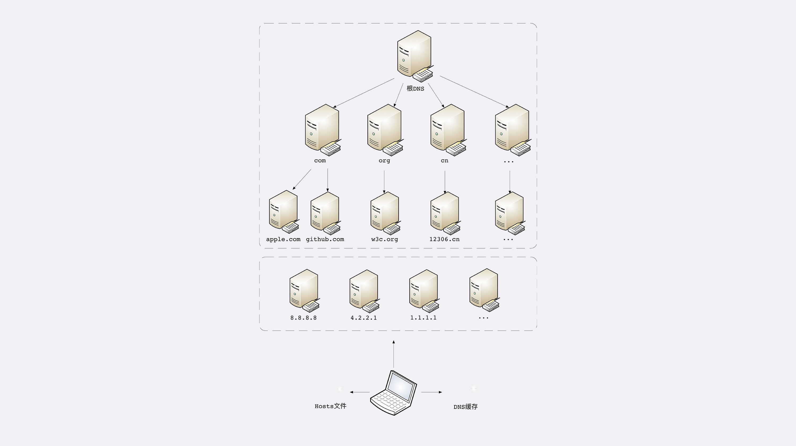

- [TCP/IP 网络分层模型](#tcpip-网络分层模型)
- [OSI 网络分层模型](#osi-网络分层模型)
- [两个分层模型的映射关系](#两个分层模型的映射关系)
- [TCP/IP 协议栈的工作方式](#tcpip-协议栈的工作方式)
- [域名](#域名)
  - [域名的形式](#域名的形式)
  - [域名的解析](#域名的解析)


> TCP/IP 协议是 HTTP 协议的下层协议，负责具体的数据传输工作，是一个“有层次的协议栈”。在工作中你一定经常听别人谈起什么“四层负载均衡”“七层负载均衡”，什么“二层转发”“三层路由”，那么你真正理解这些层次的含义吗？

## TCP/IP 网络分层模型

先从 TCP/IP 协议开始讲起，一是因为它非常经典，二是因为它是目前事实上的网络通信标准，研究它的实用价值最大。TCP/IP 当初的设计者真的是非常聪明，创造性地提出了“分层”的概念，把复杂的网络通信划分出多个层次，再给每一个层次分配不同的职责，层次内只专心做自己的事情就好，用“分而治之”的思想把一个“大麻烦”拆分成了数个“小麻烦”，从而解决了网络通信的难题。

 TCP/IP 的协议栈
 

 TCP/IP 协议总共有四层，就像搭积木一样，每一层需要下层的支撑，同时又支撑着上层，任何一层被抽掉都可能会导致整个协议栈坍塌。我们来仔细地看一下这个精巧的积木架构，注意它的层次顺序是“从下往上”数的，所以第一层就是最下面的一层。

 - 第一层叫“链接层”（link layer），负责在以太网、WiFi 这样的底层网络上发送原始数据包，工作在网卡这个层次，使用 MAC 地址来标记网络上的设备，所以有时候也叫 MAC 层。
 - 第二层叫“网际层”或者“网络互连层”（internet layer），IP 协议就处在这一层。因为 IP 协议定义了“IP 地址”的概念，所以就可以在“链接层”的基础上，用 IP 地址取代 MAC 地址，把许许多多的局域网、广域网连接成一个虚拟的巨大网络，在这个网络里找设备时只要把 IP 地址再“翻译”成 MAC 地址就可以了。
 - 第三层叫“传输层”（transport layer），这个层次协议的职责是保证数据在 IP 地址标记的两点之间“可靠”地传输，是 TCP 协议工作的层次，另外还有它的一个“小伙伴”UDP。
  
    TCP 是一个有状态的协议，需要先与对方建立连接然后才能发送数据，而且保证数据不丢失不重复。而 UDP 则比较简单，它无状态，不用事先建立连接就可以任意发送数据，但不保证数据一定会发到对方。两个协议的另一个重要区别在于数据的形式。TCP 的数据是连续的“字节流”，有先后顺序，而 UDP 则是分散的小数据包，是顺序发，乱序收。
  - 协议栈的第四层叫“应用层”（application layer），由于下面的三层把基础打得非常好，所以在这一层就“百花齐放”了，有各种面向具体应用的协议。例如 Telnet、SSH、FTP、SMTP 等等，当然还有我们的 HTTP。

MAC 层的传输单位是帧（frame），IP 层的传输单位是包（packet），TCP 层的传输单位是段（segment），HTTP 的传输单位则是消息或报文（message）。但这些名词并没有什么本质的区分，可以统称为数据包。

## OSI 网络分层模型

看完 TCP/IP 协议栈，你可能要问了，“它只有四层，那常说的七层怎么没见到呢？”别着急，这就是今天要说的第二个网络分层模型：OSI，全称是“开放式系统互联通信参考模型”（Open System Interconnection Reference Model）。

TCP/IP 发明于 1970 年代，当时除了它还有很多其他的网络协议，整个网络世界比较混乱。这个时候国际标准组织（ISO）注意到了这种现象，感觉“野路子”太多，就想要来个“大一统”。于是设计出了一个新的网络分层模型，想用这个新框架来统一既存的各种网络协议。OSI 模型分成了七层，部分层次与 TCP/IP 很像，从下到上分别是：


- 第一层：物理层，网络的物理形式，例如电缆、光纤、网卡、集线器等等；
- 第二层：数据链路层，它基本相当于 TCP/IP 的链接层；
- 第三层：网络层，相当于 TCP/IP 里的网际层；
- 第四层：传输层，相当于 TCP/IP 里的传输层；
- 第五层：会话层，维护网络中的连接状态，即保持会话和同步；
- 第六层：表示层，把数据转换为合适、可理解的语法和语义；
- 第七层：应用层，面向具体的应用传输数据。

至此，我们常说的“四层”“七层”就出现了。不过国际标准组织心里也很清楚，TCP/IP 等协议已经在许多网络上实际运行，再推翻重来是不可能的。所以，OSI 分层模型在发布的时候就明确地表明是一个“参考”，不是强制标准，意思就是说，“你们以后该干什么还干什么，我不管，但面子上还是要按照我说的来”。

但 OSI 模型也是有优点的。对比一下就可以看出，TCP/IP 是一个纯软件的栈，没有网络应有的最根基的电缆、网卡等物理设备的位置。而 OSI 则补足了这个缺失，在理论层面上描述网络更加完整。还有一个重要的形式上的优点：OSI 为每一层标记了明确了编号，最底层是一层，最上层是七层，而 TCP/IP 的层次从来只有名字而没有编号。显然，在交流的时候说“七层”要比“应用层”更简单快捷，特别是英文，对比一下“Layer seven”与“application layer”。

## 两个分层模型的映射关系

现在我们有了两个网络分层模型：TCP/IP 和 OSI，新的问题又出现了，一个是四层模型，一个是七层模型，这两者应该如何互相映射或者说互相解释呢？

好在 OSI 在设计之初就参考了 TCP/IP 等多个协议，可以比较容易但不是很精确地实现对应关系。


- 第一层：物理层，TCP/IP 里无对应；
- 第二层：数据链路层，对应 TCP/IP 的链接层；
- 第三层：网络层，对应 TCP/IP 的网际层；
- 第四层：传输层，对应 TCP/IP 的传输层；
- 第五、六、七层：统一对应到 TCP/IP 的应用层。

所以你看，这就是“理想与现实”之间的矛盾。理想很美好，有七层，但现实很残酷，只有四层，“多余”的五层、六层就这样“消失”了。

但这也有一定的实际原因。OSI 的分层模型在四层以上分的太细，而 TCP/IP 实际应用时的会话管理、编码转换、压缩等和具体应用经常联系的很紧密，很难分开。例如，HTTP 协议就同时包含了连接管理和数据格式定义。

所谓的“四层负载均衡”就是指工作在传输层上，基于 TCP/IP 协议的特性，例如 IP 地址、端口号等实现对后端服务器的负载均衡。所谓的“七层负载均衡”就是指工作在应用层上，看到的是 HTTP 协议，解析 HTTP 报文里的 URI、主机名、资源类型等数据，再用适当的策略转发给后端服务器。

## TCP/IP 协议栈的工作方式

TCP/IP 协议栈是如何工作的呢？你可以把 HTTP 利用 TCP/IP 协议栈传输数据想象成一个发快递的过程。

假设你想把一件毛绒玩具送给朋友，但你要先拿个塑料袋套一下，这件玩具就相当于 HTTP 协议里要传输的内容，比如 HTML，然后 HTTP 协议为它加一个 HTTP 专用附加数据。你把玩具交给快递小哥，为了保护货物，他又加了层包装再贴了个标签，相当于在 TCP 层给数据再次打包，加上了 TCP 头。接着快递小哥下楼，把包裹放进了三轮车里，运到集散点，然后再装进更大的卡车里，相当于在 IP 层、MAC 层对 TCP 数据包加上了 IP 头、MAC 头。之后经过漫长的运输，包裹到达目的地，要卸货再放进另一位快递员的三轮车，就是在 IP 层、MAC 层传输后拆包。快递员到了你朋友的家门口，撕掉标签，去除了 TCP 层的头，你朋友再拆掉塑料袋包装，也就是 HTTP 头，最后就拿到了玩具，也就是真正的 HTML 页面。这个比喻里省略了很多 TCP/IP 协议里的细节，比如建连、路由、数据切分与重组、错误检查等，但核心的数据传输过程是差不多的。HTTP 协议的传输过程就是这样通过协议栈逐层向下，每一层都添加本层的专有数据，层层打包，然后通过下层发送出去。接收数据则是相反的操作，从下往上穿过协议栈，逐层拆包，每层去掉本层的专有头，上层就会拿到自己的数据。但下层的传输过程对于上层是完全“透明”的，上层也不需要关心下层的具体实现细节，所以就 HTTP 层次来看，它不管下层是不是 TCP/IP 协议，看到的只是一个可靠的传输链路，只要把数据加上自己的头，对方就能原样收到。


小结：

- TCP/IP 分为四层，核心是二层的 IP 和三层的 TCP，HTTP 在第四层；
- OSI 分为七层，基本对应 TCP/IP，TCP 在第四层，HTTP 在第七层；
- OSI 可以映射到 TCP/IP，但这期间一、五、六层消失了；日常交流的时候我们通常使用 OSI 模型，用四层、七层等术语；
- HTTP 利用 TCP/IP 协议栈逐层打包再拆包，实现了数据传输，但下面的细节并不可见。
  
有一个辨别四层和七层比较好的（但不是绝对的）小窍门，“两个凡是”：凡是由操作系统负责处理的就是四层或四层以下，否则，凡是需要由应用程序（也就是你自己写代码）负责处理的就是七层。


## 域名

IP 协议的职责是“网际互连”，它在 MAC 层之上，使用 IP 地址把 MAC 编号转换成了四位数字，这就对物理网卡的 MAC 地址做了一层抽象，发展出了许多的“新玩法”。例如，分为 A、B、C、D、E 五种类型，公有地址和私有地址，掩码分割子网等。只要每个小网络在 IP 地址这个概念上达成一致，不管它在 MAC 层有多大的差异，都可以接入 TCP/IP 协议栈，最终汇合进整个互联网。但接入互联网的计算机越来越多，IP 地址的缺点也就暴露出来了，最主要的是它“对人不友好”，虽然比 MAC 的 16 进制数要好一点，但还是难于记忆和输入。怎么解决这个问题呢？

那就“以其人之道还治其人之身”，在 IP 地址之上再来一次抽象，把数字形式的 IP 地址转换成更有意义更好记的名字，在字符串的层面上再增加“新玩法”。于是，DNS 域名系统就这么出现了。

### 域名的形式

域名是一个有层次的结构，是一串用“.”分隔的多个单词，最右边的被称为“顶级域名”，然后是“二级域名”，层级关系向左依次降低。最左边的是主机名，通常用来表明主机的用途，比如“www”表示提供万维网服务、“mail”表示提供邮件服务，不过这也不是绝对的，名字的关键是要让我们容易记忆。

看一下极客时间的域名“time.geekbang.org”，这里的“org”就是顶级域名，“geekbang”是二级域名，“time”则是主机名。使用这个域名，DNS 就会把它转换成相应的 IP 地址，你就可以访问极客时间的网站了。

域名不仅能够代替 IP 地址，还有许多其他的用途。在 Apache、Nginx 这样的 Web 服务器里，域名可以用来标识虚拟主机，决定由哪个虚拟主机来对外提供服务，比如在 Nginx 里就会使用“server_name”指令：

```

server {
    listen 80;                       #监听80端口
    server_name  time.geekbang.org;  #主机名是time.geekbang.org
    ...
}
```

域名本质上还是个名字空间系统，使用多级域名就可以划分出不同的国家、地区、组织、公司、部门，每个域名都是独一无二的，可以作为一种身份的标识。举个例子吧，假设 A 公司里有个小明，B 公司里有个小强，于是他们就可以分别说是“小明.A 公司”，“小强.B 公司”，即使 B 公司里也有个小明也不怕，可以标记为“小明.B 公司”，很好地解决了重名问题。因为这个特性，域名也被扩展到了其他应用领域，比如 Java 的包机制就采用域名作为命名空间，只是它使用了反序。如果极客时间要开发 Java 应用，那么它的包名可能就是“org.geekbang.time”。而 XML 里使用 URI 作为名字空间，也是间接使用了域名。

### 域名的解析

就像 IP 地址必须转换成 MAC 地址才能访问主机一样，域名也必须要转换成 IP 地址，这个过程就是“域名解析”。目前全世界有几亿个站点，有几十亿网民，而每天网络上发生的 HTTP 流量更是天文数字。这些请求绝大多数都是基于域名来访问网站的，所以 DNS 就成了互联网的重要基础设施，必须要保证域名解析稳定可靠、快速高效。DNS 的核心系统是一个三层的树状、分布式服务，基本对应域名的结构：

- 根域名服务器（Root DNS Server）：管理顶级域名服务器，返回“com”“net”“cn”等顶级域名服务器的 IP 地址；
- 顶级域名服务器（Top-level DNS Server）：管理各自域名下的权威域名服务器，比如 com 顶级域名服务器可以返回 apple.com 域名服务器的 IP 地址；
- 权威域名服务器（Authoritative DNS Server）：管理自己域名下主机的 IP 地址，比如 apple.com 权威域名服务器可以返回 www.apple.com 的 IP 地址。

在这里根域名服务器是关键，它必须是众所周知的，否则下面的各级服务器就无从谈起了。目前全世界共有 13 组根域名服务器，又有数百台的镜像，保证一定能够被访问到。

有了这个系统以后，任何一个域名都可以在这个树形结构里从顶至下进行查询，就好像是把域名从右到左顺序走了一遍，最终就获得了域名对应的 IP 地址。例如，你要访问“www.apple.com”，就要进行下面的三次查询：
- 访问根域名服务器，它会告诉你“com”顶级域名服务器的地址；
- 访问“com”顶级域名服务器，它再告诉你“apple.com”域名服务器的地址；
- 最后访问“apple.com”域名服务器，就得到了“www.apple.com”的地址。

虽然核心的 DNS 系统遍布全球，服务能力很强也很稳定，但如果全世界的网民都往这个系统里挤，即使不挤瘫痪了，访问速度也会很慢。所以在核心 DNS 系统之外，还有两种手段用来减轻域名解析的压力，并且能够更快地获取结果，基本思路就是“缓存”。首先，许多大公司、网络运行商都会建立自己的 DNS 服务器，作为用户 DNS 查询的代理，代替用户访问核心 DNS 系统。这些“野生”服务器被称为“非权威域名服务器”，可以缓存之前的查询结果，如果已经有了记录，就无需再向根服务器发起查询，直接返回对应的 IP 地址。这些 DNS 服务器的数量要比核心系统的服务器多很多，而且大多部署在离用户很近的地方。比较知名的 DNS 有 Google 的“8.8.8.8”，Microsoft 的“4.2.2.1”，还有 CloudFlare 的“1.1.1.1”等等。其次，操作系统里也会对 DNS 解析结果做缓存，如果你之前访问过“www.apple.com”，那么下一次在浏览器里再输入这个网址的时候就不会再跑到 DNS 那里去问了，直接在操作系统里就可以拿到 IP 地址。

另外，操作系统里还有一个特殊的“主机映射”文件，通常是一个可编辑的文本，在 Linux 里是“/etc/hosts”，在 Windows 里是“C:\WINDOWS\system32\drivers\etc\hosts”，如果操作系统在缓存里找不到 DNS 记录，就会找这个文件。

有了上面的“野生”DNS 服务器、操作系统缓存和 hosts 文件后，很多域名解析的工作就都不用“跋山涉水”了，直接在本地或本机就能解决，不仅方便了用户，也减轻了各级 DNS 服务器的压力，效率就大大提升了。



在 Nginx 里有这么一条配置指令“resolver”，它就是用来配置 DNS 服务器的，如果没有它，那么 Nginx 就无法查询域名对应的 IP，也就无法反向代理到外部的网站。

```
resolver 8.8.8.8 valid=30s;  #指定Google的DNS，缓存30秒
```

有了域名，又有了可以稳定工作的解析系统，于是我们就可以实现比 IP 地址更多的“新玩法”了。

- 第一种，也是最简单的，“重定向”。因为域名代替了 IP 地址，所以可以让对外服务的域名不变，而主机的 IP 地址任意变动。当主机有情况需要下线、迁移时，可以更改 DNS 记录，让域名指向其他的机器。比如，你有一台“buy.tv”的服务器要临时停机维护，那你就可以通知 DNS 服务器：“我这个 buy.tv 域名的地址变了啊，原先是 1.2.3.4，现在是 5.6.7.8，麻烦你改一下。”DNS 于是就修改内部的 IP 地址映射关系，之后再有访问 buy.tv 的请求就不走 1.2.3.4 这台主机，改由 5.6.7.8 来处理，这样就可以保证业务服务不中断。
- 第二种，因为域名是一个名字空间，所以可以使用 bind9 等开源软件搭建一个在内部使用的 DNS，作为名字服务器。这样我们开发的各种内部服务就都用域名来标记，比如数据库服务都用域名“mysql.inner.app”，商品服务都用“goods.inner.app”，发起网络通信时也就不必再使用写死的 IP 地址了，可以直接用域名，而且这种方式也兼具了第一种“玩法”的优势。
- 第三种“玩法”包含了前两种，也就是基于域名实现的负载均衡。这种“玩法”也有两种方式，两种方式可以混用。第一种方式，因为域名解析可以返回多个 IP 地址，所以一个域名可以对应多台主机，客户端收到多个 IP 地址后，就可以自己使用轮询算法依次向服务器发起请求，实现负载均衡。第二种方式，域名解析可以配置内部的策略，返回离客户端最近的主机，或者返回当前服务质量最好的主机，这样在 DNS 端把请求分发到不同的服务器，实现负载均衡。

前面我们说的都是可信的 DNS，如果有一些不怀好意的 DNS，那么它也可以在域名这方面“做手脚”，弄一些比较“恶意”的“玩法”，举两个例子：
- “域名屏蔽”，对域名直接不解析，返回错误，让你无法拿到 IP 地址，也就无法访问网站
- 域名劫持”，也叫“域名污染”，你要访问 A 网站，但 DNS 给了你 B 网站

好在互联网上还是好人多，而且 DNS 又是互联网的基础设施，这些“恶意 DNS”并不多见，你上网的时候不需要太过担心。


- 小结:
  - 域名使用字符串来代替 IP 地址，方便用户记忆，本质上一个名字空间系统；
  - DNS 就像是我们现实世界里的电话本、查号台，统管着互联网世界里的所有网站，是一个“超级大管家”；
  - DNS 是一个树状的分布式查询系统，但为了提高查询效率，外围有多级的缓存；使用 DNS 可以实现基于域名的负载均衡，既可以在内网，也可以在外网。


