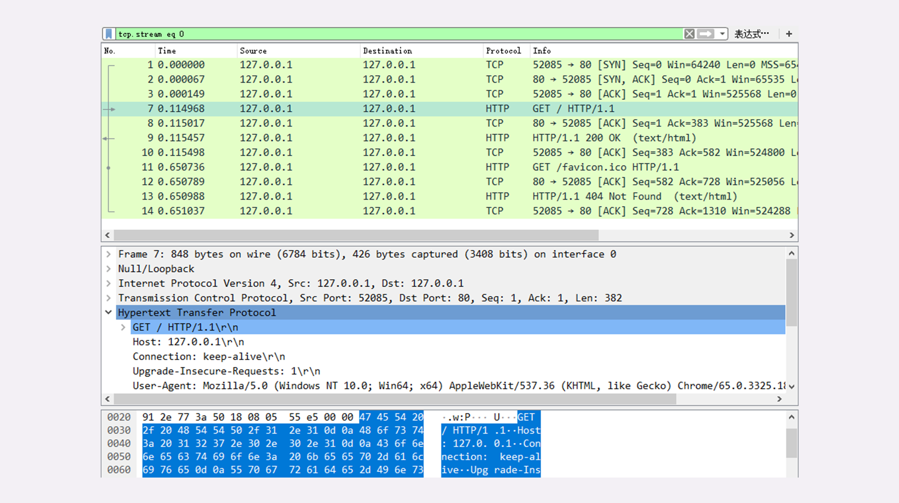
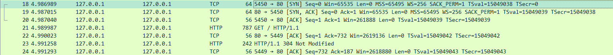
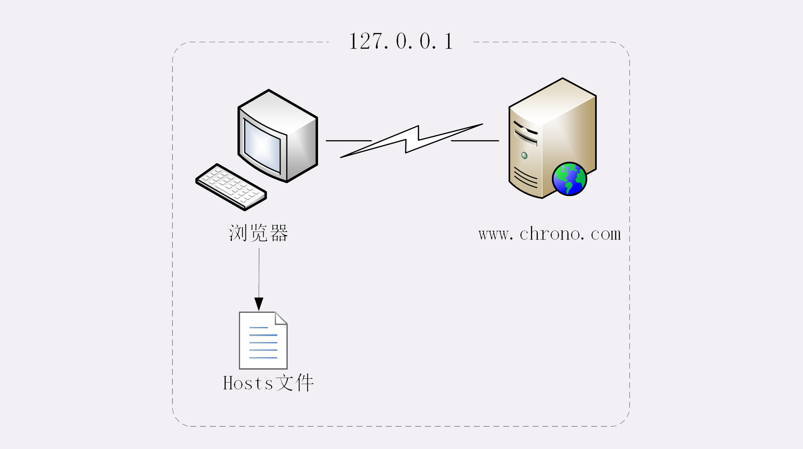
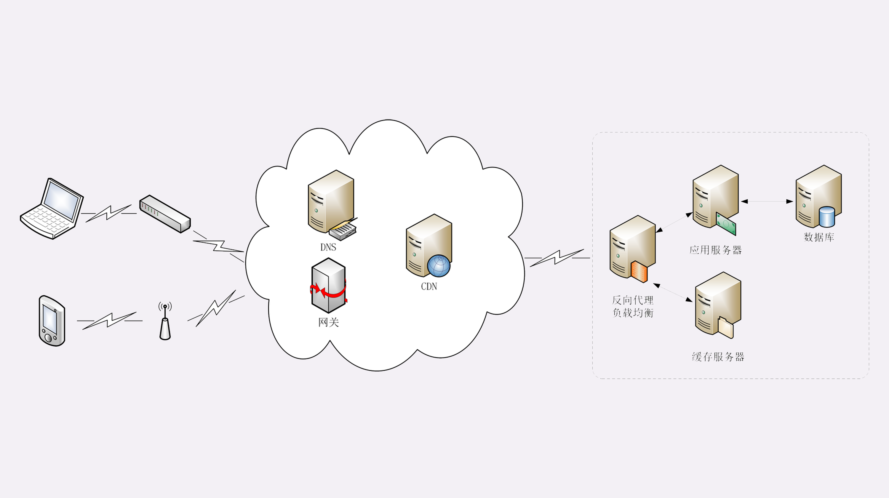
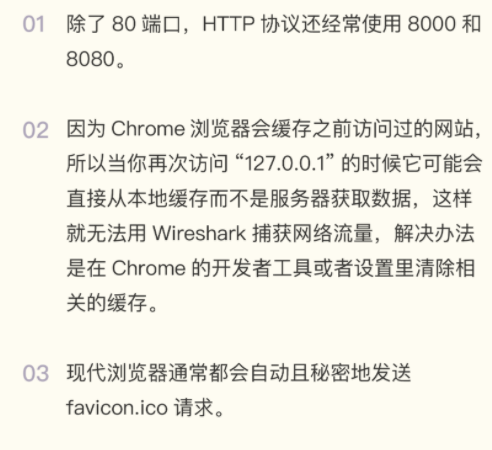
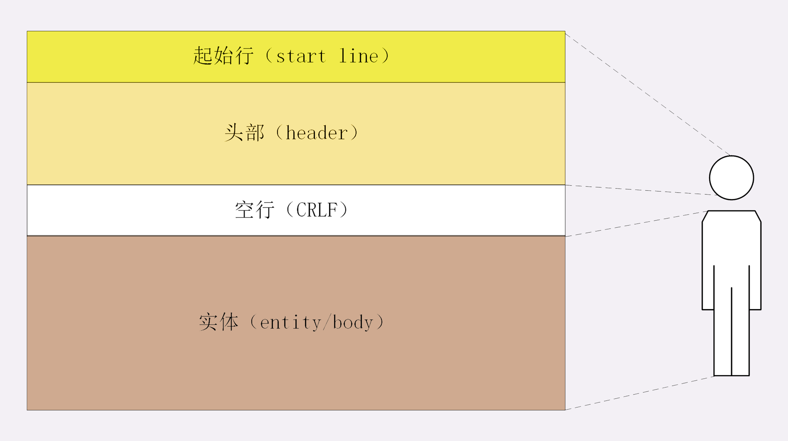
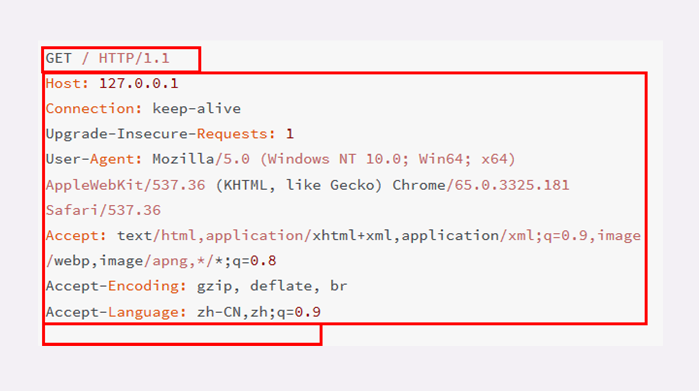
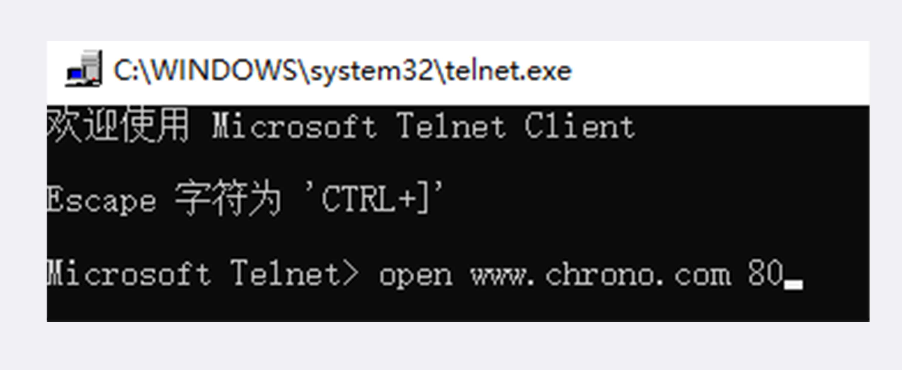
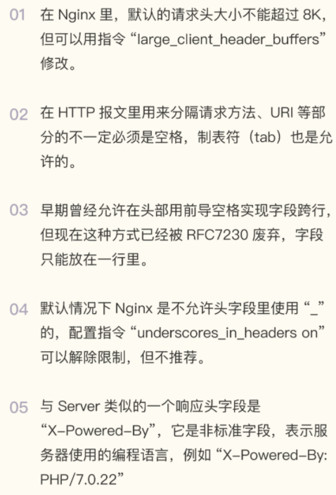

- [使用 IP 地址访问 Web 服务器](#使用-ip-地址访问-web-服务器)
- [使用域名访问 Web 服务器](#使用域名访问-web-服务器)
- [报文结构](#报文结构)
  - [请求行](#请求行)
  - [状态行](#状态行)
  - [头部字段](#头部字段)
  - [常用头字段](#常用头字段)
## 使用 IP 地址访问 Web 服务器

第一步：首先我们运行 www 目录下的“start”批处理程序，启动本机的 OpenResty 服务器，启动后可以用“list”批处理确认服务是否正常运行。

第二步：打开 Wireshark，选择“HTTP TCP port(80)”过滤器，再鼠标双击“Npcap loopback Adapter”，开始抓取本机 127.0.0.1 地址上的网络数据。

第三步，在 Chrome 浏览器的地址栏里输入“http://127.0.0.1/”，再按下回车键，等欢迎页面显示出来后 Wireshark 里就会有捕获的数据包，如下图所示:



另：我在输入网址抓取数据包的时候，得到的数据包与上述不一致，主要原因是304缓存：


下面我们就来一起分析一下"首次键入网址按下回车"后数据传输的全过程。你应该知道 HTTP 协议是运行在 TCP/IP 基础上的，依靠 TCP/IP 协议来实现数据的可靠传输。所以浏览器要用 HTTP 协议收发数据，首先要做的就是建立 TCP 连接。

- 因为在地址栏里直接输入了 IP 地址“127.0.0.1”，而 Web 服务器的默认端口是 80，所以浏览器就要依照 TCP 协议的规范，使用“三次握手”建立与 Web 服务器的连接。对应到 Wireshark 里，就是最开始的三个抓包，浏览器使用的端口是 52085，服务器使用的端口是 80，经过 SYN、SYN/ACK、ACK 的三个包之后，浏览器与服务器的 TCP 连接就建立起来了。
- 有了可靠的 TCP 连接通道后，HTTP 协议就可以开始工作了。于是，浏览器按照 HTTP 协议规定的格式，通过 TCP 发送了一个“GET / HTTP/1.1”请求报文，也就是 Wireshark 里的第四个包。
- 随后，Web 服务器回复了第五个包，在 TCP 协议层面确认：“刚才的报文我已经收到了”，不过这个 TCP 包 HTTP 协议是看不见的。
- Web 服务器收到报文后在内部就要处理这个请求。同样也是依据 HTTP 协议的规定，解析报文，看看浏览器发送这个请求想要干什么。它一看，原来是要求获取根目录下的默认文件，好吧，那我就从磁盘上把那个文件全读出来，再拼成符合 HTTP 格式的报文，发回去吧。这就是 Wireshark 里的第六个包“HTTP/1.1 200 OK”，底层走的还是 TCP 协议。
- 同样的，浏览器也要给服务器回复一个 TCP 的 ACK 确认，“你的响应报文收到了，多谢”，即第七个包。
- 这时浏览器就收到了响应数据，但里面是什么呢？所以也要解析报文。一看，服务器给我的是个 HTML 文件，好，那我就调用排版引擎、JavaScript 引擎等等处理一下，然后在浏览器窗口里展现出了欢迎页面。
- 这之后还有两个来回，共四个包，重复了相同的步骤。这是浏览器自动请求了作为网站图标的“favicon.ico”文件，与我们输入的网址无关。但因为我们的实验环境没有这个文件，所以服务器在硬盘上找不到，返回了一个“404 Not Found”。至此，“键入网址再按下回车”的全过程就结束了。
- 注意：图里 TCP 关闭连接的“四次挥手”在抓包里没有出现，这是因为 HTTP/1.1 长连接特性，默认不会立即关闭连接。

整个流程图如下图所示：


简要叙述一下这次最简单的浏览器 HTTP 请求过程：
- 浏览器从地址栏的输入中获得服务器的 IP 地址和端口号；
- 浏览器用 TCP 的三次握手与服务器建立连接；
- 浏览器向服务器发送拼好的报文；
- 服务器收到报文后处理请求，同样拼好报文再发给浏览器；
- 浏览器解析报文，渲染输出页面


## 使用域名访问 Web 服务器

刚才是在浏览器地址栏里直接输入 IP 地址，但绝大多数情况下，我们是不知道服务器 IP 地址的，使用的是域名，那么改用域名后这个过程会有什么不同吗？

把地址栏的输入改成“http://www.chrono.com”，重复 Wireshark 抓包过程，你会发现，好像没有什么不同，浏览器上同样显示出了欢迎界面，抓到的包也同样是 11 个：先是三次握手，然后是两次 HTTP 传输。

这里就出现了一个问题：浏览器是如何从网址里知道“www.chrono.com”的 IP 地址就是“127.0.0.1”的呢？

还记得我们之前讲过的 DNS 知识吗？浏览器看到了网址里的“www.chrono.com”，发现它不是数字形式的 IP 地址，那就肯定是域名了，于是就会发起域名解析动作，通过访问一系列的域名解析服务器，试图把这个域名翻译成 TCP/IP 协议里的 IP 地址。不过因为域名解析的全过程实在是太复杂了，如果每一个域名都要大费周折地去网上查一下，那我们上网肯定会慢得受不了。

所以，在域名解析的过程中会有多级的缓存，浏览器首先看一下自己的缓存里有没有，如果没有就向操作系统的缓存要，还没有就检查本机域名解析文件 hosts，也就是我们修改的“C:\WINDOWS\system32\drivers\etc\hosts”。刚好，里面有一行映射关系“127.0.0.1 www.chrono.com”，于是浏览器就知道了域名对应的 IP 地址，就可以愉快地建立 TCP 连接发送 HTTP 请求了。

上述过程如图，省略了 TCP/IP 协议的交互部分，里面的浏览器多出了一个访问 hosts 文件的动作，也就是本机的 DNS 解析：



通过上面两个在“最小化”环境里的实验，你是否已经对 HTTP 协议的工作流程有了基本的认识呢？

第一个实验是最简单的场景，只有两个角色：浏览器和服务器，浏览器可以直接用 IP 地址找到服务器，两者直接建立 TCP 连接后发送 HTTP 报文通信。

第二个实验在浏览器和服务器之外增加了一个 DNS 的角色，浏览器不知道服务器的 IP 地址，所以必须要借助 DNS 的域名解析功能得到服务器的 IP 地址，然后才能与服务器通信。

真实的互联网世界要比这两个场景要复杂的多，利用下面的这张图来做一个详细的说明：



如果你用的是电脑台式机，那么你可能会使用带水晶头的双绞线连上网口，由交换机接入固定网络。如果你用的是手机、平板电脑，那么你可能会通过蜂窝网络、WiFi，由电信基站、无线热点接入移动网络。接入网络的同时，网络运行商会给你的设备分配一个 IP 地址，这个地址可能是静态分配的，也可能是动态分配的。静态 IP 就始终不变，而动态 IP 可能你下次上网就变了。

假设你要访问的是 Apple 网站，显然你是不知道它的真实 IP 地址的，在浏览器里只能使用域名“www.apple.com”访问，那么接下来要做的必然是域名解析。这就要用 DNS 协议开始从操作系统、本地 DNS、根 DNS、顶级 DNS、权威 DNS 的层层解析，当然这中间有缓存，可能不会费太多时间就能拿到结果。

别忘了互联网上还有另外一个重要的角色 CDN，它也会在 DNS 的解析过程中“插上一脚”。DNS 解析可能会给出 CDN 服务器的 IP 地址，这样你拿到的就会是 CDN 服务器而不是目标网站的实际地址。因为 CDN 会缓存网站的大部分资源，比如图片、CSS 样式表，所以有的 HTTP 请求就不需要再发到 Apple，CDN 就可以直接响应你的请求，把数据发给你。由 PHP、Java 等后台服务动态生成的页面属于“动态资源”，CDN 无法缓存，只能从目标网站获取。于是你发出的 HTTP 请求就要开始在互联网上的“漫长跋涉”，经过无数的路由器、网关、代理，最后到达目的地。

目标网站的服务器对外表现的是一个 IP 地址，但为了能够扛住高并发，在内部也是一套复杂的架构。通常在入口是负载均衡设备，例如四层的 LVS 或者七层的 Nginx，在后面是许多的服务器，构成一个更强更稳定的集群。负载均衡设备会先访问系统里的缓存服务器，通常有 memory 级缓存 Redis 和 disk 级缓存 Varnish，它们的作用与 CDN 类似，不过是工作在内部网络里，把最频繁访问的数据缓存几秒钟或几分钟，减轻后端应用服务器的压力。如果缓存服务器里也没有，那么负载均衡设备就要把请求转发给应用服务器了。这里就是各种开发框架大显神通的地方了，例如 Java 的 Tomcat/Netty/Jetty，Python 的 Django，还有 PHP、Node.js、Golang 等等。它们又会再访问后面的 MySQL、PostgreSQL、MongoDB 等数据库服务，实现用户登录、商品查询、购物下单、扣款支付等业务操作，然后把执行的结果返回给负载均衡设备，同时也可能给缓存服务器里也放一份。

应用服务器的输出到了负载均衡设备这里，请求的处理就算是完成了，就要按照原路再走回去，还是要经过许多的路由器、网关、代理。如果这个资源允许缓存，那么经过 CDN 的时候它也会做缓存，这样下次同样的请求就不会到达源站了。

最后网站的响应数据回到了你的设备，它可能是 HTML、JSON、图片或者其他格式的数据，需要由浏览器解析处理才能显示出来，如果数据里面还有超链接，指向别的资源，那么就又要重走一遍整个流程，直到所有的资源都下载完。

- 小结：
  - HTTP 协议基于底层的 TCP/IP 协议，所以必须要用 IP 地址建立连接；
  - 如果不知道 IP 地址，就要用 DNS 协议去解析得到 IP 地址，否则就会连接失败；
  - 建立 TCP 连接后会顺序收发数据，请求方和应答方都必须依据 HTTP 规范构建和解析报文； 
  - 为了减少响应时间，整个过程中的每一个环节都会有缓存，能够实现“短路”操作；
  - 虽然现实中的 HTTP 传输过程非常复杂，但理论上仍然可以简化成实验里的“两点”模型。




## 报文结构

我们在本机的最小化环境了做了两个 HTTP 协议的实验，使用 Wireshark 抓包，弄清楚了 HTTP 协议基本工作流程，也就是“请求 - 应答”“一发一收”的模式。可以看到，HTTP 的工作模式是非常简单的，由于 TCP/IP 协议负责底层的具体传输工作，HTTP 协议基本上不用在这方面操心太多。单从这一点上来看，所谓的“超文本传输协议”其实并不怎么管“传输”的事情，有点“名不副实”。那么 HTTP 协议的核心部分是什么呢？答案就是它传输的报文内容。

HTTP 协议在规范文档里详细定义了报文的格式，规定了组成部分，解析规则，还有处理策略，所以可以在 TCP/IP 层之上实现更灵活丰富的功能，例如连接控制，缓存管理、数据编码、内容协商等等。

你也许对 TCP/UDP 的报文格式有所了解，拿 TCP 报文来举例，它在实际要传输的数据之前附加了一个 20 字节的头部数据，存储 TCP 协议必须的额外信息，例如发送方的端口号、接收方的端口号、包序号、标志位等等。有了这个附加的 TCP 头，数据包才能够正确传输，到了目的地后把头部去掉，就可以拿到真正的数据。


HTTP 协议也是与 TCP/UDP 类似，同样也需要在实际传输的数据前附加一些头数据，不过与 TCP/UDP 不同的是，它是一个“纯文本”的协议，所以头数据都是 ASCII 码的文本，可以很容易地用肉眼阅读，不用借助程序解析也能够看懂。

HTTP 协议的请求报文和响应报文的结构基本相同，由三大部分组成：
- 起始行（start line）：描述请求或响应的基本信息；
- 头部字段集合（header）：使用 key-value 形式更详细地说明报文；
- 消息正文（entity）：实际传输的数据，它不一定是纯文本，可以是图片、视频等二进制数据

这其中前两部分起始行和头部字段经常又合称为“请求头”或“响应头”，消息正文又称为“实体”，但与“header”对应，很多时候就直接称为“body”。

HTTP 协议规定报文必须有 header，但可以没有 body，而且在 header 之后必须要有一个“空行”，也就是“CRLF”，十六进制的“0D0A”。



看一下之前用 Wireshark 抓的包：



在这个浏览器发出的请求报文里，第一行“GET / HTTP/1.1”就是请求行，而后面的“Host”“Connection”等等都属于 header，报文的最后是一个空白行结束，没有 body。

在很多时候，特别是浏览器发送 GET 请求的时候都是这样，HTTP 报文经常是只有 header 而没 body，相当于只发了一个超级“大头”过来，你可以想象的出来：每时每刻网络上都会有数不清的“大头儿子”在跑来跑去。不过这个“大头”也不能太大，虽然 HTTP 协议对 header 的大小没有做限制，但各个 Web 服务器都不允许过大的请求头，因为头部太大可能会占用大量的服务器资源，影响运行效率。

### 请求行

了解了 HTTP 报文的基本结构后，我们来看看请求报文里的起始行也就是请求行（request line），它简要地描述了客户端想要如何操作服务器端的资源。请求行由三部分构成：

- 请求方法：是一个动词，如 GET/POST，表示对资源的操作；
- 请求目标：通常是一个 URI，标记了请求方法要操作的资源；
- 版本号：表示报文使用的 HTTP 协议版本

这三个部分通常使用空格（space）来分隔，最后要用 CRLF 换行表示结束:


用 Wireshark 抓包的数据:
```
GET / HTTP/1.1
```
在这个请求行里，“GET”是请求方法，“/”是请求目标，“HTTP/1.1”是版本号，把这三部分连起来，意思就是“服务器你好，我想获取网站根目录下的默认文件，我用的协议版本号是 1.1，请不要用 1.0 或者 2.0 回复我。”

### 状态行

看完了请求行，再看响应报文里的起始行，在这里它不叫“响应行”，而是叫“状态行”（status line），意思是服务器响应的状态。比起请求行来说，状态行要简单一些，同样也是由三部分构成：
- 版本号：表示报文使用的 HTTP 协议版本；
- 状态码：一个三位数，用代码的形式表示处理的结果，比如 200 是成功，500 是服务器错误；
- 原因：作为数字状态码补充，是更详细的解释文字，帮助人理解原因。


Wireshark 抓包里的响应报文状态行是：
```
HTTP/1.1 200 OK
```
意思就是：“浏览器你好，我已经处理完了你的请求，这个报文使用的协议版本号是 1.1，状态码是 200，一切 OK。”

而另一个“GET /favicon.ico HTTP/1.1”的响应报文状态行是：
```
HTTP/1.1 404 Not Found
```
翻译成人话就是：“抱歉啊浏览器，刚才你的请求收到了，但我没找到你要的资源，错误代码是 404，接下来的事情你就看着办吧。”

### 头部字段

请求行或状态行再加上头部字段集合就构成了 HTTP 报文里完整的请求头或响应头。

请求头：


响应头：


请求头和响应头的结构是基本一样的，唯一的区别是起始行，所以我把请求头和响应头里的字段放在一起介绍。头部字段是 key-value 的形式，key 和 value 之间用“:”分隔，最后用 CRLF 换行表示字段结束。比如在“Host: 127.0.0.1”这一行里 key 就是“Host”，value 就是“127.0.0.1”。

HTTP 头字段非常灵活，不仅可以使用标准里的 Host、Connection 等已有头，也可以任意添加自定义头，这就给 HTTP 协议带来了无限的扩展可能。不过使用头字段需要注意下面几点：
- 字段名不区分大小写，例如“Host”也可以写成“host”，但首字母大写的可读性更好；
- 字段名里不允许出现空格，可以使用连字符“-”，但不能使用下划线“_”。例如，“test-name”是合法的字段名，而“test name”“test_name”是不正确的字段名；
- 字段名后面必须紧接着“:”，不能有空格，而“:”后的字段值前可以有多个空格；
- 字段的顺序是没有意义的，可以任意排列不影响语义；
- 字段原则上不能重复，除非这个字段本身的语义允许，例如 Set-Cookie。

在实验环境里用 Lua 编写了一个小服务程序，URI 是“/09-1”，效果是输出所有的请求头。你可以在实验环境里用 Telnet 连接 OpenResty 服务器试一下，手动发送 HTTP 请求头，试验各种正确和错误的情况。

先启动 OpenResty 服务器，然后用组合键“Win+R”运行 telnet，输入命令“open www.chrono.com 80”，就连上了 Web 服务器。



连接上之后按组合键“CTRL+]”，然后按回车键，就进入了编辑模式。在这个界面里，你可以直接用鼠标右键粘贴文本，敲两下回车后就会发送数据，也就是模拟了一次 HTTP 请求。

下面是两个最简单的 HTTP 请求，第一个在“:”后有多个空格，第二个在“:”前有空格
```
GET /09-1 HTTP/1.1
Host:   www.chrono.com


GET /09-1 HTTP/1.1
Host : www.chrono.com
```

一个可以正确获取服务器的响应报文，而第二个得到的会是一个“400 Bad Request”，表示请求报文格式有误，服务器无法正确处理：
```
HTTP/1.1 400 Bad Request
Server: openresty/1.15.8.1
Connection: close
```

### 常用头字段

HTTP 协议规定了非常多的头部字段，实现各种各样的功能，但基本上可以分为四大类：
- 通用字段：在请求头和响应头里都可以出现；
- 请求字段：仅能出现在请求头里，进一步说明请求信息或者额外的附加条件；
- 响应字段：仅能出现在响应头里，补充说明响应报文的信息；
- 实体字段：它实际上属于通用字段，但专门描述 body 的额外信息。


对 HTTP 报文的解析和处理实际上主要就是对头字段的处理，理解了头字段也就理解了 HTTP 报文。后续的课程中我将会以应用领域为切入点介绍连接管理、缓存控制等头字段，今天先讲几个最基本的头，看完了它们你就应该能够读懂大多数 HTTP 报文了。

首先要说的是 Host 字段，它属于请求字段，只能出现在请求头里，它同时也是唯一一个 HTTP/1.1 规范里要求必须出现的字段，也就是说，如果请求头里没有 Host，那这就是一个错误的报文。Host 字段告诉服务器这个请求应该由哪个主机来处理，当一台计算机上托管了多个虚拟主机的时候，服务器端就需要用 Host 字段来选择，有点像是一个简单的“路由重定向”。例如我们的试验环境，在 127.0.0.1 上有三个虚拟主机：“www.chrono.com”“www.metroid.net”和“origin.io”。那么当使用域名的方式访问时，就必须要用 Host 字段来区分这三个 IP 相同但域名不同的网站，否则服务器就会找不到合适的虚拟主机，无法处理。

User-Agent 是请求字段，只出现在请求头里。它使用一个字符串来描述发起 HTTP 请求的客户端，服务器可以依据它来返回最合适此浏览器显示的页面。但由于历史的原因，User-Agent 非常混乱，每个浏览器都自称是“Mozilla”“Chrome”“Safari”，企图使用这个字段来互相“伪装”，导致 User-Agent 变得越来越长，最终变得毫无意义。不过有的比较“诚实”的爬虫会在 User-Agent 里用“spider”标明自己是爬虫，所以可以利用这个字段实现简单的反爬虫策略。

Date 字段是一个通用字段，但通常出现在响应头里，表示 HTTP 报文创建的时间，客户端可以使用这个时间再搭配其他字段决定缓存策略。

Server 字段是响应字段，只能出现在响应头里。它告诉客户端当前正在提供 Web 服务的软件名称和版本号，例如在我们的实验环境里它就是“Server: openresty/1.15.8.1”，即使用的是 OpenResty 1.15.8.1。

Server 字段也不是必须要出现的，因为这会把服务器的一部分信息暴露给外界，如果这个版本恰好存在 bug，那么黑客就有可能利用 bug 攻陷服务器。所以，有的网站响应头里要么没有这个字段，要么就给出一个完全无关的描述信息。比如 GitHub，它的 Server 字段里就看不出是使用了 Apache 还是 Nginx，只是显示为“GitHub.com”。

实体字段里要说的一个是 Content-Length，它表示报文里 body 的长度，也就是请求头或响应头空行后面数据的长度。服务器看到这个字段，就知道了后续有多少数据，可以直接接收。如果没有这个字段，那么 body 就是不定长的，需要使用 chunked 方式分段传输。

小结：
- HTTP 报文结构就像是“大头儿子”，由“起始行 + 头部 + 空行 + 实体”组成，简单地说就是“header+body”；
- HTTP 报文可以没有 body，但必须要有 header，而且 header 后也必须要有空行，形象地说就是“大头”必须要带着“脖子”；
- 请求头由“请求行 + 头部字段”构成，响应头由“状态行 + 头部字段”构成；
- 请求行有三部分：请求方法，请求目标和版本号；
- 状态行也有三部分：版本号，状态码和原因字符串；
- 头部字段是 key-value 的形式，用“:”分隔，不区分大小写，顺序任意，除了规定的标准头，也可以任意添加自定义字段，实现功能扩展；
- HTTP/1.1 里唯一要求必须提供的头字段是 Host，它必须出现在请求头里，标记虚拟主机名。


