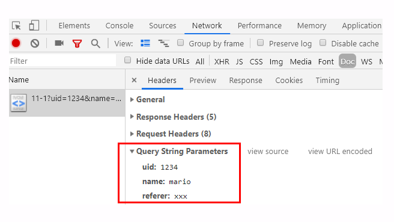

- [标准请求方法](#标准请求方法)
- [GET/HEAD](#gethead)
- [POST/PUT](#postput)
- [其他方法](#其他方法)
- [扩展方法](#扩展方法)
- [安全与幂等](#安全与幂等)
- [URI格式](#uri格式)
- [URI 的基本组成](#uri-的基本组成)
- [URI 的查询参数](#uri-的查询参数)
- [URI 的完整格式](#uri-的完整格式)
- [URI 的编码](#uri-的编码)

## 标准请求方法

HTTP 协议里为什么要有“请求方法”这个东西呢？这就要从 HTTP 协议设计时的定位说起了。还记得吗？蒂姆·伯纳斯 - 李最初设想的是要用 HTTP 协议构建一个超链接文档系统，使用 URI 来定位这些文档，也就是资源。那么，该怎么在协议里操作这些资源呢？

很显然，需要有某种“动作的指示”，告诉操作这些资源的方式。所以，就这么出现了“请求方法”。它的实际含义就是客户端发出了一个“动作指令”，要求服务器端对 URI 定位的资源执行这个动作。

目前 HTTP/1.1 规定了八种方法，单词都必须是大写的形式:
- GET：获取资源，可以理解为读取或者下载数据；
- HEAD：获取资源的元信息；
- POST：向资源提交数据，相当于写入或上传数据；
- PUT：类似 POST；
- DELETE：删除资源；
- CONNECT：建立特殊的连接隧道；
- OPTIONS：列出可对资源实行的方法；
- TRACE：追踪请求 - 响应的传输路径


看看这些方法，是不是有点像对文件或数据库的“增删改查”操作，只不过这些动作操作的目标不是本地资源，而是远程服务器上的资源，所以只能由客户端“请求”或者“指示”服务器来完成。既然请求方法是一个“指示”，那么客户端自然就没有决定权，服务器掌控着所有资源，也就有绝对的决策权力。它收到 HTTP 请求报文后，看到里面的请求方法，可以执行也可以拒绝，或者改变动作的含义，毕竟 HTTP 是一个“协议”，两边都要“商量着来”。比如，你发起了一个 GET 请求，想获取“/orders”这个文件，但这个文件保密级别比较高，不是谁都能看的，服务器就可以有如下的几种响应方式：
- 假装这个文件不存在，直接返回一个 404 Not found 报文；
- 稍微友好一点，明确告诉你有这个文件，但不允许访问，返回一个 403 Forbidden；
- 再宽松一些，返回 405 Method Not Allowed，然后用 Allow 头告诉你可以用 HEAD 方法获取文件的元信息

## GET/HEAD

虽然 HTTP/1.1 里规定了八种请求方法，但只有前四个是比较常用的，所以我们先来看一下这四个方法。

GET 方法应该是 HTTP 协议里最知名的请求方法了，也应该是用的最多的，自 0.9 版出现并一直被保留至今，是名副其实的“元老”。它的含义是请求从服务器获取资源，这个资源既可以是静态的文本、页面、图片、视频，也可以是由 PHP、Java 动态生成的页面或者其他格式的数据。

GET 方法虽然基本动作比较简单，但搭配 URI 和其他头字段就能实现对资源更精细的操作。例如，在 URI 后使用“#”，就可以在获取页面后直接定位到某个标签所在的位置；使用 If-Modified-Since 字段就变成了“有条件的请求”，仅当资源被修改时才会执行获取动作；使用 Range 字段就是“范围请求”，只获取资源的一部分数据。

HEAD 方法与 GET 方法类似，也是请求从服务器获取资源，服务器的处理机制也是一样的，但服务器不会返回请求的实体数据，只会传回响应头，也就是资源的“元信息”。HEAD 方法可以看做是 GET 方法的一个“简化版”或者“轻量版”。因为它的响应头与 GET 完全相同，所以可以用在很多并不真正需要资源的场合，避免传输 body 数据的浪费。比如，想要检查一个文件是否存在，只要发个 HEAD 请求就可以了，没有必要用 GET 把整个文件都取下来。再比如，要检查文件是否有最新版本，同样也应该用 HEAD，服务器会在响应头里把文件的修改时间传回来。

可以在实验环境里试一下这两个方法，运行 Telnet，分别向 URI“/10-1”发送 GET 和 HEAD 请求，观察一下响应头是否一致：
```
GET /10-1 HTTP/1.1
Host: www.chrono.com

HEAD /10-1 HTTP/1.1
Host: www.chrono.com
```

## POST/PUT

接下来要说的是 POST 和 PUT 方法，这两个方法也很像。GET 和 HEAD 方法是从服务器获取数据，而 POST 和 PUT 方法则是相反操作，向 URI 指定的资源提交数据，数据就放在报文的 body 里。

POST 也是一个经常用到的请求方法，使用频率应该是仅次于 GET，应用的场景也非常多，只要向服务器发送数据，用的大多数都是 POST。比如，你上论坛灌水，敲了一堆字后点击“发帖”按钮，浏览器就执行了一次 POST 请求，把你的文字放进报文的 body 里，然后拼好 POST 请求头，通过 TCP 协议发给服务器。又比如，你上购物网站，看到了一件心仪的商品，点击“加入购物车”，这时也会有 POST 请求，浏览器会把商品 ID 发给服务器，服务器再把 ID 写入你的购物车相关的数据库记录。

PUT 的作用与 POST 类似，也可以向服务器提交数据，但与 POST 存在微妙的不同，通常 POST 表示的是“新建”“create”的含义，而 PUT 则是“修改”“update”的含义。在实际应用中，PUT 用到的比较少。而且，因为它与 POST 的语义、功能太过近似，有的服务器甚至就直接禁止使用 PUT 方法，只用 POST 方法上传数据。

实验环境的“/10-2”模拟了 POST 和 PUT 方法的处理过程，你仍然可以用 Telnet 发送测试请求，看看运行的效果。注意，在发送请求时，头字段“Content-Length”一定要写对，是空行后 body 的长度：
```
POST /10-2 HTTP/1.1
Host: www.chrono.com
Content-Length: 17

POST DATA IS HERE

PUT /10-2 HTTP/1.1
Host: www.chrono.com
Content-Length: 16

PUT DATA IS HERE
```

## 其他方法

讲完了 GET/HEAD/POST/PUT，还剩下四个标准请求方法，它们属于比较“冷僻”的方法，应用的不是很多。

- DELETE 方法指示服务器删除资源，因为这个动作危险性太大，所以通常服务器不会执行真正的删除操作，而是对资源做一个删除标记。当然，更多的时候服务器就直接不处理 DELETE 请求。

- CONNECT 是一个比较特殊的方法，要求服务器为客户端和另一台远程服务器建立一条特殊的连接隧道，这时 Web 服务器在中间充当了代理的角色。

- OPTIONS 方法要求服务器列出可对资源实行的操作方法，在响应头的 Allow 字段里返回。它的功能很有限，用处也不大，有的服务器（例如 Nginx）干脆就没有实现对它的支持。

- TRACE 方法多用于对 HTTP 链路的测试或诊断，可以显示出请求 - 响应的传输路径。它的本意是好的，但存在漏洞，会泄漏网站的信息，所以 Web 服务器通常也是禁止使用。

## 扩展方法

虽然 HTTP/1.1 里规定了八种请求方法，但它并没有限制我们只能用这八种方法，这也体现了 HTTP 协议良好的扩展性，我们可以任意添加请求动作，只要请求方和响应方都能理解就行。例如著名的愚人节玩笑 RFC2324，它定义了协议 HTCPCP，即“超文本咖啡壶控制协议”，为 HTTP 协议增加了用来煮咖啡的 BREW 方法，要求添牛奶的 WHEN 方法。

此外，还有一些得到了实际应用的请求方法（WebDAV），例如 MKCOL、COPY、MOVE、LOCK、UNLOCK、PATCH 等。如果有合适的场景，你也可以把它们应用到自己的系统里，比如用 LOCK 方法锁定资源暂时不允许修改，或者使用 PATCH 方法给资源打个小补丁，部分更新数据。但因为这些方法是非标准的，所以需要为客户端和服务器编写额外的代码才能添加支持。当然了，你也完全可以根据实际需求，自己发明新的方法，比如“PULL”拉取某些资源到本地，“PURGE”清理某个目录下的所有缓存数据。

## 安全与幂等

关于请求方法还有两个面试时有可能会问到、比较重要的概念：安全与幂等。

在 HTTP 协议里，所谓的“安全”是指请求方法不会“破坏”服务器上的资源，即不会对服务器上的资源造成实质的修改。按照这个定义，只有 GET 和 HEAD 方法是“安全”的，因为它们是“只读”操作，只要服务器不故意曲解请求方法的处理方式，无论 GET 和 HEAD 操作多少次，服务器上的数据都是“安全的”。而 POST/PUT/DELETE 操作会修改服务器上的资源，增加或删除数据，所以是“不安全”的。

所谓的“幂等”实际上是一个数学用语，被借用到了 HTTP 协议里，意思是多次执行相同的操作，结果也都是相同的，即多次“幂”后结果“相等”。很显然，GET 和 HEAD 既是安全的也是幂等的，DELETE 可以多次删除同一个资源，效果都是“资源不存在”，所以也是幂等的。

POST 和 PUT 的幂等性质就略费解一点。按照 RFC 里的语义，POST 是“新增或提交数据”，多次提交数据会创建多个资源，所以不是幂等的；而 PUT 是“替换或更新数据”，多次更新一个资源，资源还是会第一次更新的状态，所以是幂等的。

可以对比一下 SQL 来加深理解：把 POST 理解成 INSERT，把 PUT 理解成 UPDATE，这样就很清楚了。多次 INSERT 会添加多条记录，而多次 UPDATE 只操作一条记录，而且效果相同。

- 小结：
  - 请求方法是客户端发出的、要求服务器执行的、对资源的一种操作；
  - 请求方法是对服务器的“指示”，真正应如何处理由服务器来决定；
  - 最常用的请求方法是 GET 和 POST，分别是获取数据和发送数据；
  - HEAD 方法是轻量级的 GET，用来获取资源的元信息；
  - PUT 基本上是 POST 的同义词，多用于更新数据；
  - “安全”与“幂等”是描述请求方法的两个重要属性，具有理论指导意义，可以帮助我们设计系统。


## URI格式

HTTP 协议里的请求方法，其中最常用的一个是 GET，它用来从服务器上某个资源获取数据，另一个是 POST，向某个资源提交数据。那么，应该用什么来标记服务器上的资源呢？怎么区分“这个”资源和“那个”资源呢？

经过前面的学习，你一定已经知道了，用的是 URI，也就是统一资源标识符（Uniform Resource Identifier）。因为它经常出现在浏览器的地址栏里，所以俗称为“网络地址”，简称“网址”。严格地说，URI 不完全等同于网址，它包含有 URL 和 URN 两个部分，在 HTTP 世界里用的网址实际上是 URL——统一资源定位符（Uniform Resource Locator）。但因为 URL 实在是太普及了，所以常常把这两者简单地视为相等。不仅我们生活中的上网要用到 URI，平常的开发、测试、运维的工作中也少不了它。如果你在客户端做 iOS、 Android 或者某某小程序开发，免不了要连接远程服务，就会调用底层 API 用 URI 访问服务。如果你使用 Java、PHP 做后台 Web 开发，也会调用 getPath()、parse_url() 等函数来处理 URI，解析里面的各个要素。在测试、运维配置 Apache、Nginx 等 Web 服务器的时候也必须正确理解 URI，分离静态资源与动态资源，或者设置规则实现网页的重定向跳转。总之一句话，URI 非常重要，要搞懂 HTTP 甚至网络应用，就必须搞懂 URI。

不知道你平常上网的时候有没有关注过地址栏里的那一长串字符，有的比较简短，有的则一行都显示不下，有的意思大概能看明白，而有的则带着各种怪字符，有如“天书”。其实只要你弄清楚了 URI 的格式，就能够轻易地“破解”这些难懂的“天书”了。URI 本质上是一个字符串，这个字符串的作用是唯一地标记资源的位置或者名字。注意，它不仅能够标记万维网的资源，也可以标记其他的，如邮件系统、本地文件系统等任意资源。而“资源”既可以是存在磁盘上的静态文本、页面数据，也可以是由 Java、PHP 提供的动态服务。

下面的这张图显示了 URI 最常用的形式，由 scheme、host:port、path 和 query 四个部分组成，但有的部分可以视情况省略：


## URI 的基本组成

URI 第一个组成部分叫 scheme，翻译成中文叫“方案名”或者“协议名”，表示资源应该使用哪种协议来访问。最常见的当然就是“http”了，表示使用 HTTP 协议。另外还有“https”，表示使用经过加密、安全的 HTTPS 协议。此外还有其他不是很常见的 scheme，例如 ftp、ldap、file、news 等。浏览器或者你的应用程序看到 URI 里的 scheme，就知道下一步该怎么走了，会调用相应的 HTTP 或者 HTTPS 下层 API。显然，如果一个 URI 没有提供 scheme，即使后面的地址再完善，也是无法处理的。

在 scheme 之后，必须是三个特定的字符“://”，它把 scheme 和后面的部分分离开。实话实说，这个设计非常的怪异，我最早上网的时候看见地址栏里的“://”就觉得很别扭，直到现在也还是没有太适应。URI 的创造者蒂姆·伯纳斯 - 李也曾经私下承认“://”并非必要，当初有些“过于草率”了。不过这个设计已经有了三十年的历史，不管我们愿意不愿意，只能接受。

在“://”之后，是被称为“authority”的部分，表示资源所在的主机名，通常的形式是“host:port”，即主机名加端口号。主机名可以是 IP 地址或者域名的形式，必须要有，否则浏览器就会找不到服务器。但端口号有时可以省略，浏览器等客户端会依据 scheme 使用默认的端口号，例如 HTTP 的默认端口号是 80，HTTPS 的默认端口号是 443。

有了协议名和主机地址、端口号，再加上后面标记资源所在位置的 path，浏览器就可以连接服务器访问资源了。URI 里 path 采用了类似文件系统“目录”“路径”的表示方式，因为早期互联网上的计算机多是 UNIX 系统，所以采用了 UNIX 的“/”风格。其实也比较好理解，它与 scheme 后面的“://”是一致的。注意，URI 的 path 部分必须以“/”开始，也就是必须包含“/”，不要把“/”误认为属于前面 authority。说了这么多“理论”，来看几个实例：
```
http://nginx.org
http://www.chrono.com:8080/11-1
https://tools.ietf.org/html/rfc7230
file:///D:/http_study/www/
```

- 第一个 URI 算是最简单的了，协议名是“http”，主机名是“nginx.org”，端口号省略，所以是默认的 80，而路径部分也被省略了，默认就是一个“/”，表示根目录。
- 第二个 URI 是在实验环境里这次课程的专用 URI，主机名是“www.chrono.com”，端口号是 8080，后面的路径是“/11-1”。
- 第三个是 HTTP 协议标准文档 RFC7230 的 URI，主机名是“tools.ietf.org”，路径是“/html/rfc7230”。
- 最后一个 URI 要注意了，它的协议名不是“http”，而是“file”，表示这是本地文件，而后面居然有三个斜杠，这是怎么回事？

如果你刚才仔细学习了 scheme 的介绍就能明白，这三个斜杠里的前两个属于 URI 特殊分隔符“://”，然后后面的“/D:/http_study/www/”是路径，而中间的主机名被“省略”了。这实际上是 file 类型 URI 的“特例”，它允许省略主机名，默认是本机 localhost。但对于 HTTP 或 HTTPS 这样的网络通信协议，主机名是绝对不能省略的。原因之前也说了，会导致浏览器无法找到服务器。

我们可以在实验环境里用 Chrome 浏览器再仔细观察一下 HTTP 报文里的 URI。运行 Chrome，用 F12 打开开发者工具，然后在地址栏里输入“http://www.chrono.com/11-1”，得到的结果如下图:


在开发者工具里依次选“Network”“Doc”，就可以找到请求的 URI。然后在 Headers 页里看 Request Headers，用“view source”就可以看到浏览器发的原始请求头了。

发现了什么特别的没有？在 HTTP 报文里的 URI“/11-1”与浏览器里输入的“http://www.chrono.com/11-1”有很大的不同，协议名和主机名都不见了，只剩下了后面的部分。这是因为协议名和主机名已经分别出现在了请求行的版本号和请求头的 Host 字段里，没有必要再重复。当然，在请求行里使用完整的 URI 也是可以的，你可以在课后自己试一下。

通过这个小实验，我们还得到了一个结论：客户端和服务器看到的 URI 是不一样的。客户端看到的必须是完整的 URI，使用特定的协议去连接特定的主机，而服务器看到的只是报文请求行里被删除了协议名和主机名的 URI。如果你配置过 Nginx，你就应该明白了，Nginx 作为一个 Web 服务器，它的 location、rewrite 等指令操作的 URI 其实指的是真正 URI 里的 path 和后续的部分。

## URI 的查询参数

使用“协议名 + 主机名 + 路径”的方式，已经可以精确定位网络上的任何资源了。但这还不够，很多时候我们还想在操作资源的时候附加一些额外的修饰参数。

举几个例子：获取商品图片，但想要一个 32×32 的缩略图版本；获取商品列表，但要按某种规则做分页和排序；跳转页面，但想要标记跳转前的原始页面。仅用“协议名 + 主机名 + 路径”的方式是无法适应这些场景的，所以 URI 后面还有一个“query”部分，它在 path 之后，用一个“?”开始，但不包含“?”，表示对资源附加的额外要求。这是个很形象的符号，比“://”要好的多，很明显地表示了“查询”的含义。查询参数 query 有一套自己的格式，是多个“key=value”的字符串，这些 KV 值用字符“&”连接，浏览器和服务器都可以按照这个格式把长串的查询参数解析成可理解的字典或关联数组形式。你可以在实验环境里用 Chrome 试试下面这个加了 query 参数的 URI：
```
http://www.chrono.com:8080/11-1?uid=1234&name=mario&referer=xxx
```

Chrome 的开发者工具也能解码出 query 里的 KV 对，省得我们“人肉”分解:



还可以再拿一个实际的 URI 来看一下，这个 URI 是某电商网站的一个商品查询 URI，比较复杂，但相信现在的你能够毫不费力地区分出里面的协议名、主机名、路径和查询参数。
```

https://search.jd.com/Search?keyword=openresty&enc=utf-8&qrst=1&rt=1&stop=1&vt=2&wq=openresty&psort=3&click=0
```

你也可以把这个 URI 输入到 Chrome 的地址栏里，再用开发者工具仔细检查它的组成部分。

## URI 的完整格式

讲完了 query 参数，URI 就算完整了，HTTP 协议里用到的 URI 绝大多数都是这种形式。不过必须要说的是，URI 还有一个“真正”的完整形态，如下图所示:


这个“真正”形态比基本形态多了两部分。
- 第一个多出的部分是协议名之后、主机名之前的身份信息“user:passwd@”，表示登录主机时的用户名和密码，但现在已经不推荐使用这种形式了（RFC7230），因为它把敏感信息以明文形式暴露出来，存在严重的安全隐患。
- 第二个多出的部分是查询参数后的片段标识符“#fragment”，它是 URI 所定位的资源内部的一个“锚点”或者说是“标签”，浏览器可以在获取资源后直接跳转到它指示的位置。但片段标识符仅能由浏览器这样的客户端使用，服务器是看不到的。也就是说，浏览器永远不会把带“#fragment”的 URI 发送给服务器，服务器也永远不会用这种方式去处理资源的片段。

## URI 的编码

刚才我们看到了，在 URI 里只能使用 ASCII 码，但如果要在 URI 里使用英语以外的汉语、日语等其他语言该怎么办呢？还有，某些特殊的 URI，会在 path、query 里出现“@&?"等起界定符作用的字符，会导致 URI 解析错误，这时又该怎么办呢？

所以，URI 引入了编码机制，对于 ASCII 码以外的字符集和特殊字符做一个特殊的操作，把它们转换成与 URI 语义不冲突的形式。这在 RFC 规范里称为“escape”和“unescape”，俗称“转义”。

URI 转义的规则有点“简单粗暴”，直接把非 ASCII 码或特殊字符转换成十六进制字节值，然后前面再加上一个“%”。例如，空格被转义成“%20”，“?”被转义成“%3F”。而中文、日文等则通常使用 UTF-8 编码后再转义，例如“银河”会被转义成“%E9%93%B6%E6%B2%B3”。

有了这个编码规则后，URI 就更加完美了，可以支持任意的字符集用任何语言来标记资源。不过我们在浏览器的地址栏里通常是不会看到这些转义后的“乱码”的，这实际上是浏览器一种“友好”表现，隐藏了 URI 编码后的“丑陋一面”，不信你可以试试下面的这个 URI。
```
http://www.chrono.com:8080/11-1?夸父逐日
```

先在 Chrome 的地址栏里输入这个 query 里含有中文的 URI，然后点击地址栏，把它再拷贝到其他的编辑器里，它就会“现出原形”：
```
http://www.chrono.com:8080/11-1?%E5%A4%B8%E7%88%B6%E9%80%90%E6%97%A5
```

-小结：
  - URI 是用来唯一标记服务器上资源的一个字符串，通常也称为 URL；URI 通常由 scheme、host:port、path 和 query 四个部分组成，有的可以省略；scheme 叫“方案名”或者“协议名”，表示资源应该使用哪种协议来访问；“host:port”表示资源所在的主机名和端口号；path 标记资源所在的位置；query 表示对资源附加的额外要求；在 URI 里对“@&/”等特殊字符和汉字必须要做编码，否则服务器收到 HTTP 报文后会无法正确处理。


