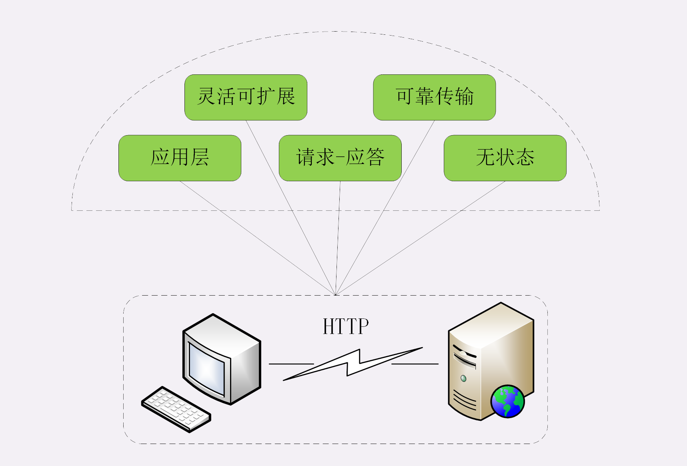
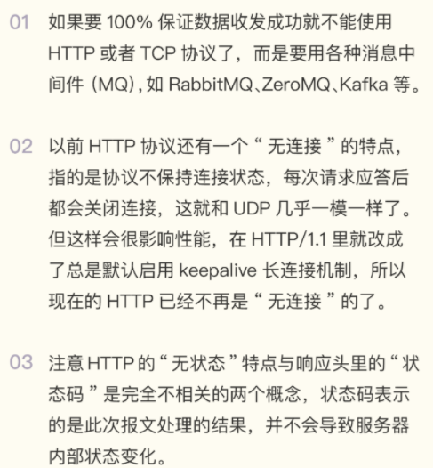
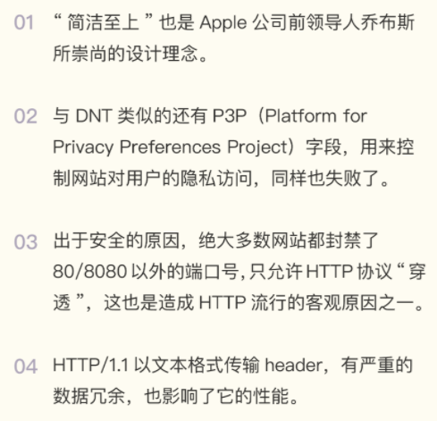

- [HTTP的特点](#http的特点)
  - [灵活可扩展](#灵活可扩展)
  - [可靠传输](#可靠传输)
  - [应用层协议](#应用层协议)
  - [请求 - 应答](#请求---应答)
  - [无状态](#无状态)
  - [其他特点](#其他特点)
  - [小结](#小结)
- [HTTP优缺点](#http优缺点)
  - [简单、灵活、易于扩展](#简单灵活易于扩展)
  - [应用广泛、环境成熟](#应用广泛环境成熟)
  - [无状态](#无状态-1)
  - [明文](#明文)
  - [不安全](#不安全)
  - [性能](#性能)
  - [小结](#小结-1)

你会不会有种疑惑：“HTTP 协议好像也挺简单的啊，凭什么它就能统治互联网这么多年呢？”所以接下来的这两讲，我会跟你聊聊 HTTP 协议的特点、优点和缺点。既要看到它好的一面，也要正视它不好的一面，只有全方位、多角度了解 HTTP，才能实现“扬长避短”，更好地利用 HTTP。

## HTTP的特点
### 灵活可扩展

首先， HTTP 协议是一个“灵活可扩展”的传输协议。

HTTP 协议最初诞生的时候就比较简单，本着开放的精神只规定了报文的基本格式，比如用空格分隔单词，用换行分隔字段，“header+body”等，报文里的各个组成部分都没有做严格的语法语义限制，可以由开发者任意定制。所以，HTTP 协议就随着互联网的发展一同成长起来了。在这个过程中，HTTP 协议逐渐增加了请求方法、版本号、状态码、头字段等特性。而 body 也不再限于文本形式的 TXT 或 HTML，而是能够传输图片、音频视频等任意数据，这些都是源于它的“灵活可扩展”的特点。

而那些 RFC 文档，实际上也可以理解为是对已有扩展的“承认和标准化”，实现了“从实践中来，到实践中去”的良性循环。也正是因为这个特点，HTTP 才能在三十年的历史长河中“屹立不倒”，从最初的低速实验网络发展到现在的遍布全球的高速互联网，始终保持着旺盛的生命力。

### 可靠传输

第二个特点， HTTP 协议是一个“可靠”的传输协议。

这个特点显而易见，因为 HTTP 协议是基于 TCP/IP 的，而 TCP 本身是一个“可靠”的传输协议，所以 HTTP 自然也就继承了这个特性，能够在请求方和应答方之间“可靠”地传输数据。它的具体做法与 TCP/UDP 差不多，都是对实际传输的数据（entity）做了一层包装，加上一个头，然后调用 Socket API，通过 TCP/IP 协议栈发送或者接收。

不过我们必须正确地理解“可靠”的含义，HTTP 并不能 100% 保证数据一定能够发送到另一端，在网络繁忙、连接质量差等恶劣的环境下，也有可能收发失败。“可靠”只是向使用者提供了一个“承诺”，会在下层用多种手段“尽量”保证数据的完整送达。当然，如果遇到光纤被意外挖断这样的极端情况，即使是神仙也不能发送成功。所以，“可靠”传输是指在网络基本正常的情况下数据收发必定成功，借用运维里的术语，大概就是“3 个 9”或者“4 个 9”的程度吧。

### 应用层协议

第三个特点，HTTP 协议是一个应用层的协议。

这个特点也是不言自明的，但却很重要。在 TCP/IP 诞生后的几十年里，虽然出现了许多的应用层协议，但它们都仅关注很小的应用领域，局限在很少的应用场景。例如 FTP 只能传输文件、SMTP 只能发送邮件、SSH 只能远程登录等，在通用的数据传输方面“完全不能打”。

所以 HTTP 凭借着可携带任意头字段和实体数据的报文结构，以及连接控制、缓存代理等方便易用的特性，一出现就“技压群雄”，迅速成为了应用层里的“明星”协议。只要不太苛求性能，HTTP 几乎可以传递一切东西，满足各种需求，称得上是一个“万能”的协议。

套用一个网上流行的段子，HTTP 完全可以用开玩笑的口吻说：“不要误会，我不是针对 FTP，我是说在座的应用层各位，都是垃圾。”

### 请求 - 应答

第四个特点，HTTP 协议使用的是请求 - 应答通信模式。

这个请求 - 应答模式是 HTTP 协议最根本的通信模型，通俗来讲就是“一发一收”“有来有去”，就像是写代码时的函数调用，只要填好请求头里的字段，“调用”后就会收到答复。

请求 - 应答模式也明确了 HTTP 协议里通信双方的定位，永远是请求方先发起连接和请求，是主动的，而应答方只有在收到请求后才能答复，是被动的，如果没有请求时不会有任何动作。

当然，请求方和应答方的角色也不是绝对的，在浏览器 - 服务器的场景里，通常服务器都是应答方，但如果将它用作代理连接后端服务器，那么它就可能同时扮演请求方和应答方的角色。

HTTP 的请求 - 应答模式也恰好契合了传统的 C/S（Client/Server）系统架构，请求方作为客户端、应答方作为服务器。所以，随着互联网的发展就出现了 B/S（Browser/Server）架构，用轻量级的浏览器代替笨重的客户端应用，实现零维护的“瘦”客户端，而服务器则摈弃私有通信协议转而使用 HTTP 协议。此外，请求 - 应答模式也完全符合 RPC（Remote Procedure Call）的工作模式，可以把 HTTP 请求处理封装成远程函数调用，导致了 WebService、RESTful 和 gRPC 等的出现。

### 无状态

第五个特点，HTTP 协议是无状态的。这个所谓的“状态”应该怎么理解呢？

“状态”其实就是客户端或者服务器里保存的一些数据或者标志，记录了通信过程中的一些变化信息。你一定知道，TCP 协议是有状态的，一开始处于 CLOSED 状态，连接成功后是 ESTABLISHED 状态，断开连接后是 FIN-WAIT 状态，最后又是 CLOSED 状态。这些“状态”就需要 TCP 在内部用一些数据结构去维护，可以简单地想象成是个标志量，标记当前所处的状态，例如 0 是 CLOSED，2 是 ESTABLISHED 等等。

再来看 HTTP，那么对比一下 TCP 就看出来了，在整个协议里没有规定任何的“状态”，客户端和服务器永远是处在一种“无知”的状态。建立连接前两者互不知情，每次收发的报文也都是互相独立的，没有任何的联系。收发报文也不会对客户端或服务器产生任何影响，连接后也不会要求保存任何信息。

“无状态”形象地来说就是“没有记忆能力”。比如，浏览器发了一个请求，说“我是小明，请给我 A 文件。”，服务器收到报文后就会检查一下权限，看小明确实可以访问 A 文件，于是把文件发回给浏览器。接着浏览器还想要 B 文件，但服务器不会记录刚才的请求状态，不知道第二个请求和第一个请求是同一个浏览器发来的，所以浏览器必须还得重复一次自己的身份才行：“我是刚才的小明，请再给我 B 文件。”

可以再对比一下 UDP 协议，不过它是无连接也无状态的，顺序发包乱序收包，数据包发出去后就不管了，收到后也不会顺序整理。而 HTTP 是有连接无状态，顺序发包顺序收包，按照收发的顺序管理报文。但不要忘了 HTTP 是“灵活可扩展”的，虽然标准里没有规定“状态”，但完全能够在协议的框架里给它“打个补丁”，增加这个特性。

### 其他特点

除了以上的五大特点，其实 HTTP 协议还可以列出非常多的特点，例如传输的实体数据可缓存可压缩、可分段获取数据、支持身份认证、支持国际化语言等。但这些并不能算是 HTTP 的基本特点，因为这都是由第一个“灵活可扩展”的特点所衍生出来的。

### 小结

- HTTP 是灵活可扩展的，可以任意添加头字段实现任意功能；
- HTTP 是可靠传输协议，基于 TCP/IP 协议“尽量”保证数据的送达；
- HTTP 是应用层协议，比 FTP、SSH 等更通用功能更多，能够传输任意数据；
- HTTP 使用了请求 - 应答模式，客户端主动发起请求，服务器被动回复请求；
- HTTP 本质上是无状态的，每个请求都是互相独立、毫无关联的，协议不要求客户端或服务器记录请求相关的信息。

## HTTP优缺点

> 本节讨论范围仅限于 HTTP/1.1，所说的优点和缺点也仅针对 HTTP/1.1。实际上，后续的 HTTPS 和 HTTP/2 都是对 HTTP/1.1 优点的发挥和缺点的完善。

### 简单、灵活、易于扩展

首先，HTTP 最重要也是最突出的优点是“简单、灵活、易于扩展”。

初次接触 HTTP 的人都会认为，HTTP 协议是很“简单”的，基本的报文格式就是“header+body”，头部信息也是简单的文本格式，用的也都是常见的英文单词，即使不去看 RFC 文档，只靠猜也能猜出个“八九不离十”。

可不要小看了“简单”这个优点，它不仅降低了学习和使用的门槛，能够让更多的人研究和开发 HTTP 应用，“简单”蕴含了进化和扩展的可能性，所谓“少即是多”，“把简单的系统变复杂”，要比“把复杂的系统变简单”容易得多。所以，在“简单”这个最基本的设计理念之下，HTTP 协议又多出了“灵活和易于扩展”的优点。

“灵活和易于扩展”实际上是一体的，它们互为表里、相互促进，因为“灵活”所以才会“易于扩展”，而“易于扩展”又反过来让 HTTP 更加灵活，拥有更强的表现能力。

HTTP 协议里的请求方法、URI、状态码、原因短语、头字段等每一个核心组成要素都没有被“写死”，允许开发者任意定制、扩充或解释，给予了浏览器和服务器最大程度的信任和自由，也正好符合了互联网“自由与平等”的精神——缺什么功能自己加个字段或者错误码什么的补上就是了。

“请勿跟踪”所使用的头字段 DNT（Do Not Track）就是一个很好的例子。它最早由 Mozilla 提出，用来保护用户隐私，防止网站监测追踪用户的偏好。不过可惜的是 DNT 从推出至今有差不多七八年的历史，但很多网站仍然选择“无视”DNT。虽然 DNT 基本失败了，但这也正说明 HTTP 协议是“灵活自由的”，不会受单方面势力的压制。

“灵活、易于扩展”的特性还表现在 HTTP 对“可靠传输”的定义上，它不限制具体的下层协议，不仅可以使用 TCP、UNIX Domain Socket，还可以使用 SSL/TLS，甚至是基于 UDP 的 QUIC，下层可以随意变化，而上层的语义则始终保持稳定。

### 应用广泛、环境成熟

HTTP 协议的另一大优点是“应用广泛”，软硬件环境都非常成熟。

随着互联网特别是移动互联网的普及，HTTP 的触角已经延伸到了世界的每一个角落：从简单的 Web 页面到复杂的 JSON、XML 数据，从台式机上的浏览器到手机上的各种 APP，从看新闻、泡论坛到购物、理财、“吃鸡”，你很难找到一个没有使用 HTTP 的地方。

不仅在应用领域，在开发领域 HTTP 协议也得到了广泛的支持。它并不限定某种编程语言或者操作系统，所以天然具有“跨语言、跨平台”的优越性。而且，因为本身的简单特性很容易实现，所以几乎所有的编程语言都有 HTTP 调用库和外围的开发测试工具，这一点我觉得就不用再举例了吧，你可能比我更熟悉。

HTTP 广泛应用的背后还有许多硬件基础设施支持，各个互联网公司和传统行业公司都不遗余力地“触网”，购买服务器开办网站，建设数据中心、CDN 和高速光纤，持续地优化上网体验，让 HTTP 运行的越来越顺畅。“应用广泛”的这个优点也就决定了：无论是创业者还是求职者，无论是做网站服务器还是写应用客户端，HTTP 协议都是必须要掌握的基本技能。

### 无状态

看过了两个优点，我们再来看看一把“双刃剑”，也就是上一讲中说到的“无状态”，它对于 HTTP 来说既是优点也是缺点。

“无状态”有什么好处呢？因为服务器没有“记忆能力”，所以就不需要额外的资源来记录状态信息，不仅实现上会简单一些，而且还能减轻服务器的负担，能够把更多的 CPU 和内存用来对外提供服务。而且，“无状态”也表示服务器都是相同的，没有“状态”的差异，所以可以很容易地组成集群，让负载均衡把请求转发到任意一台服务器，不会因为状态不一致导致处理出错，使用“堆机器”的“笨办法”轻松实现高并发高可用。

那么，“无状态”又有什么坏处呢？既然服务器没有“记忆能力”，它就无法支持需要连续多个步骤的“事务”操作。例如电商购物，首先要登录，然后添加购物车，再下单、结算、支付，这一系列操作都需要知道用户的身份才行，但“无状态”服务器是不知道这些请求是相互关联的，每次都得问一遍身份信息，不仅麻烦，而且还增加了不必要的数据传输量。

所以，HTTP 协议最好是既“无状态”又“有状态”，不过还真有“鱼和熊掌”两者兼得这样的好事，这就是“小甜饼”Cookie 技术。

### 明文

HTTP 协议里还有一把优缺点一体的“双刃剑”，就是明文传输。

“明文”意思就是协议里的报文（准确地说是 header 部分）不使用二进制数据，而是用简单可阅读的文本形式。

对比 TCP、UDP 这样的二进制协议，它的优点显而易见，不需要借助任何外部工具，用浏览器、Wireshark 或者 tcpdump 抓包后，直接用肉眼就可以很容易地查看或者修改，为我们的开发调试工作带来极大的便利。

当然，明文的缺点也是一样显而易见，HTTP 报文的所有信息都会暴露在“光天化日之下”，在漫长的传输链路的每一个环节上都毫无隐私可言，不怀好意的人只要侵入了这个链路里的某个设备，简单地“旁路”一下流量，就可以实现对通信的窥视。

你有没有听说过“免费 WiFi 陷阱”之类的新闻呢？黑客就是利用了 HTTP 明文传输的缺点，在公共场所架设一个 WiFi 热点开始“钓鱼”，诱骗网民上网。一旦你连上了这个 WiFi 热点，所有的流量都会被截获保存，里面如果有银行卡号、网站密码等敏感信息的话那就危险了，黑客拿到了这些数据就可以冒充你为所欲为。

### 不安全

与“明文”缺点相关但不完全等同的另一个缺点是“不安全”。

安全有很多的方面，明文只是“机密”方面的一个缺点，在“身份认证”和“完整性校验”这两方面 HTTP 也是欠缺的。

“身份认证”简单来说就是“怎么证明你就是你”。在现实生活中比较好办，你可以拿出身份证、驾照或者护照，上面有照片和权威机构的盖章，能够证明你的身份。但在虚拟的网络世界里这却是个麻烦事。HTTP 没有提供有效的手段来确认通信双方的真实身份。虽然协议里有一个基本的认证机制，但因为刚才所说的明文传输缺点，这个机制几乎可以说是“纸糊的”，非常容易被攻破。如果仅使用 HTTP 协议，很可能你会连到一个页面一模一样但却是个假冒的网站，然后再被“钓”走各种私人信息。

HTTP 协议也不支持“完整性校验”，数据在传输过程中容易被窜改而无法验证真伪。比如，你收到了一条银行用 HTTP 发来的消息：“小明向你转账一百元”，你无法知道小明是否真的就只转了一百元，也许他转了一千元或者五十元，但被黑客窜改成了一百元，真实情况到底是什么样子 HTTP 协议没有办法给你答案。虽然银行可以用 MD5、SHA1 等算法给报文加上数字摘要，但还是因为“明文”这个致命缺点，黑客可以连同摘要一同修改，最终还是判断不出报文是否被窜改。为了解决 HTTP 不安全的缺点，所以就出现了 HTTPS，这个以后再说。

### 性能

最后来谈谈 HTTP 的性能，可以用六个字来概括：“不算差，不够好”。

HTTP 协议基于 TCP/IP，并且使用了“请求 - 应答”的通信模式，所以性能的关键就在这两点上。必须要说的是，TCP 的性能是不差的，否则也不会纵横互联网江湖四十余载了，而且它已经被研究的很透，集成在操作系统内核里经过了细致的优化，足以应付大多数的场景。

只可惜如今的江湖已经不是从前的江湖，现在互联网的特点是移动和高并发，不能保证稳定的连接质量，所以在 TCP 层面上 HTTP 协议有时候就会表现的不够好。

而“请求 - 应答”模式则加剧了 HTTP 的性能问题，这就是著名的“队头阻塞”（Head-of-line blocking），当顺序发送的请求序列中的一个请求因为某种原因被阻塞时，在后面排队的所有请求也一并被阻塞，会导致客户端迟迟收不到数据。为了解决这个问题，就诞生出了一个专门的研究课题“Web 性能优化”，HTTP 官方标准里就有“缓存”一章（RFC7234），非官方的“花招”就更多了，例如切图、数据内嵌与合并，域名分片、JavaScript“黑科技”等等。不过现在已经有了终极解决方案：HTTP/2 和 HTTP/3，后面也会展开来讲。

### 小结

- HTTP 最大的优点是简单、灵活和易于扩展；
- HTTP 拥有成熟的软硬件环境，应用的非常广泛，是互联网的基础设施；
- HTTP 是无状态的，可以轻松实现集群化，扩展性能，但有时也需要用 Cookie 技术来实现“有状态”；
- HTTP 是明文传输，数据完全肉眼可见，能够方便地研究分析，但也容易被窃听；
- HTTP 是不安全的，无法验证通信双方的身份，也不能判断报文是否被窜改；
- HTTP 的性能不算差，但不完全适应现在的互联网，还有很大的提升空间

