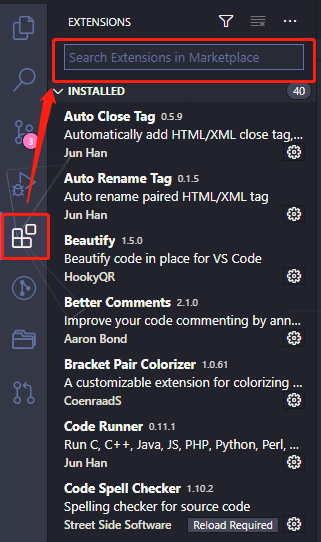
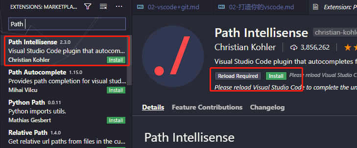
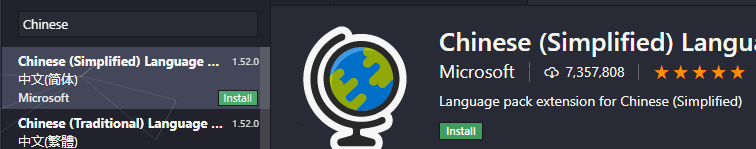
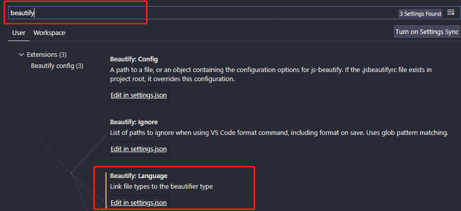
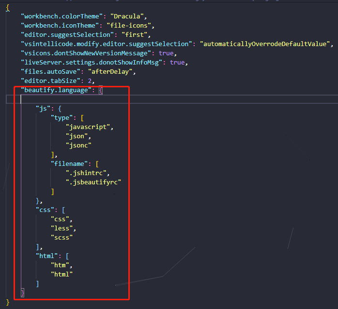
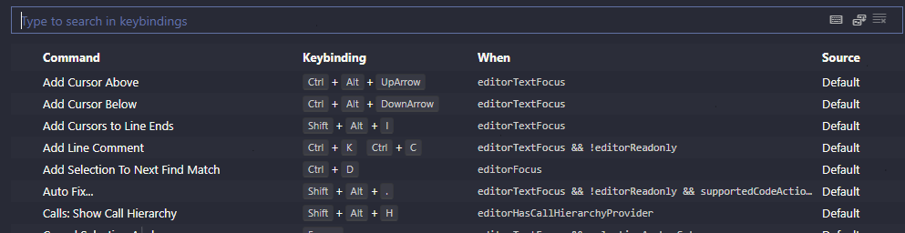
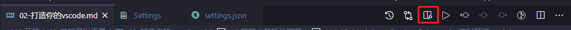

- [为什么选择使用VS Code](#为什么选择使用vs-code)
- [安装](#安装)
- [前端必备插件推荐](#前端必备插件推荐)
  - [1. VSCode汉化](#1-vscode汉化)
  - [2. Auto Close Tag：自动闭合HTML/XML标签](#2-auto-close-tag自动闭合htmlxml标签)
  - [3. Auto Rename Tag：完成另一个标签的同步修改](#3-auto-rename-tag完成另一个标签的同步修改)
  - [4. Beautify：格式化JavaScript，JSON，CSS，Sass，HTML](#4-beautify格式化javascriptjsoncsssasshtml)
  - [5. Prettier - Code formatter：格式化JS，TS，CSS](#5-prettier---code-formatter格式化jstscss)
  - [6. Bracket Pair Colorizer：不同的括号显示不同的颜色，可以更好的区分区块。](#6-bracket-pair-colorizer不同的括号显示不同的颜色可以更好的区分区块)
  - [7. Debugger for Chrome：映射vscode上的断点到chrome上，方便调试](#7-debugger-for-chrome映射vscode上的断点到chrome上方便调试)
  - [8. ESLint：js语法纠错](#8-eslintjs语法纠错)
  - [9. GitLens：Git多人协作必备，方便查看git日志](#9-gitlensgit多人协作必备方便查看git日志)
  - [10. Git History: 可以查看所有的历史提交记录](#10-git-history-可以查看所有的历史提交记录)
  - [11. HTML CSS Support：智能提示CSS类名以及id](#11-html-css-support智能提示css类名以及id)
  - [12. HTML Snippets：智能提示HTML标签，以及标签含义](#12-html-snippets智能提示html标签以及标签含义)
  - [13. JavaScript(ES6) code snippets：ES6语法智能提示，以及快速输入](#13-javascriptes6-code-snippetses6语法智能提示以及快速输入)
  - [14. jQuery Code Snippets：jQuery代码智能提示](#14-jquery-code-snippetsjquery代码智能提示)
  - [15. Markdown Preview Enhanced：实时预览markdown](#15-markdown-preview-enhanced实时预览markdown)
  - [16. Path Intellisense：自动提示文件路径](#16-path-intellisense自动提示文件路径)
  - [17. Vetur：Vue多功能集成插件](#17-veturvue多功能集成插件)
  - [18. Npm Intellisense：require 时的包提示](#18-npm-intellisenserequire-时的包提示)
  - [19. 主题插件](#19-主题插件)
  - [20. 书写Markdown](#20-书写markdown)
  - [常用Settings配置项：](#常用settings配置项)
- [VSCode基本使用](#vscode基本使用)


## 为什么选择使用VS Code

> Visual Studio Code，简称VS code，

- 特点：
  - 开源，免费
  - 自定义配置
  - 集成Git
  - 强大的智能提示
  - 支持各种格式的文件(html/js/css/less/sass/vue/react)
  - 快捷键
  - 强大的插件扩展

## 安装

- [官网](https://code.visualstudio.com/)
- [GitHub](https://github.com/Microsoft/vscode)

去官网找到对应自己电脑系统的VSCode安装，默认是英文版的，建议使用英文版，熟悉英文开发环境(如果一开始觉得不习惯，安装完成后安装简体中文插件即可，后面会介绍插件的安装)。

选定安装的路径，将path添加到环境变量一路安装即可。
- 安装插件

最简单的方法：点击左侧从上到下第5个图标(Extensions)，在打开的搜索框中输入想要安装的插件名称，点击对应插件install即可。

但是，会出现点击对应插件无法安装的情况，比如搜索"Chinese (Simplified) Language Pack for Visual Studio Code"汉化插件，VSCode右下角会出现一个提示框，内容为：`Unable to open 'Extension: Chinese (Simplified) Language Pack for Visual Studio Code': XHR failed.`大多是网络问题，更换一下自己的手机热点就可以正常install了。

下面以安装`Path Intellisense`(该插件能够自动提示文件路径，支持快速引入)为例：




## 前端必备插件推荐

### 1. VSCode汉化



按照上述插件安装方法安装`Chinese(Simplified) Language Pack for Visual Studio Code`，然后重启VSCode即可。

### 2. Auto Close Tag：自动闭合HTML/XML标签
### 3. Auto Rename Tag：完成另一个标签的同步修改
### 4. Beautify：格式化JavaScript，JSON，CSS，Sass，HTML

- 配置：VSCode左下角点击齿轮图标找到Settings打开，或者使用快捷键`Ctrl+,`直接打开配置文件，然后在`Search settings`中输入`beautify.language`,即：


点击上述`Edit in settings.json`打开配置文件会看到beautify.language的相关配置：


VS Code在内部使用js-beautify，但缺乏修改自己希望使用的样式的能力。 此扩展允许在VS Code中运行js-beautify，并可以打开文件路径树中的任何`.jsbeautifyrc`文件以加载代码样式。

- 具体使用

在工作目录中创建`.jsbeautifyrc`文件：(可不配置)

```javascript
 {
   "brace_style": "none,preserve-inline",
   "indent_size": 2,
   "indent_char": " ",
   "jslint_happy": true,
   "unformatted": [""],
   "css": {
     "indent_size": 2
   }
 }
```
其他相关配置[参考官网文档](https://github.com/HookyQR/VSCodeBeautify/blob/master/Settings.md)。这里简单说明一下以上配置项的含义：

> `brace_style`: 格式风格,为避免和eslint默认检查冲突，建议此属性设置为 none,preserve-inline
> 
> `indent_size`: 缩进长度,为避免和eslint默认检查冲突，建议此属性设置为 2
> 
> `indent_char`: 缩进填充的内容
> 
> `jslint_happy`: 若要搭配jslint使用，请开启此选项,设置为true
> 
> `unformatted`: 这里放不需要格式化的标签类型。注意template也是默认不格式化的，`.vue`的`template`标签如果需要格式化请在`.jsbeautifyrc`重新定义不带template的声明属性。

- 设置保存时自动格式化：在配置文件里添加`editor.formatOnSave:true`
- 可以自定义代码格式化快捷键

首先，打开快捷键配置文件，vscode左下角齿轮->Keyboard Shortcuts,或者`Ctrl+k Ctrl+s`。



从上面即可看到当前VSCode默认的相关命令以及对应的快捷键。可以点击每个条目的最左边铅笔形状去自定义自己设置的快捷键以及对应的功能。
### 5. Prettier - Code formatter：格式化JS，TS，CSS

- 是什么? prettier和各种lint工具不一样，prettier只关注格式化，并不具有lint检查语法等能力，所以开始可能会碰到lint搭配prettier会出现冲突的问题。而且prettier独断自行一套格式化风格，虽然提供配置，也只是配置少量的关键属性，能在一定程度上保证代码的风格统一。
- 支持的语言：
  - JavaScript
  - Flow
  - TypeScript
  - CSS/SCSS/Less
  - JSX
  - Vue 
  - GraphQL
  - JSON
  - Markdown
- 安装：就按照普通插件的安装方式进行安装，安装弯沉之后，编辑器默认的格式化处理就会被prettier代替， 默认快捷键是`Alt + Shift + f`
- 配置：可以像Beautify插件一样使用VSCode配置，也可以在项目根目录下创建`.editorconfig`文件进行格式化配置。其中，使用VSCode配置文件进行格式化配置一般作为备用的配置，通常用于非项目文件，建议在项目中包含一个更prettier的配置文件`.editorconfig`，用来指定当前项目的所有设置，这样的话就可以保证不管是使用CLI还是使用其他的IDE运行项目都会保持一致的格式化设置。

### 6. Bracket Pair Colorizer：不同的括号显示不同的颜色，可以更好的区分区块。
### 7. Debugger for Chrome：映射vscode上的断点到chrome上，方便调试

- 该插件主要利用 Chrome 所开放出来的接口，来实现对其渲染的页面进行调试
- 配置：打开VSCode配置文件找到launch，进行相关项配置：

```javascript
"launch": {
    "configurations": [
        {
            "type": "chrome",
            "request": "attach",   // attach模式：附加于（或者“监听”）一个已经启动的程序（必须已经开启 Debug 模式）
            "name": "Attach to Chrome",
            "port": 9222,
            "webRoot": "${workspaceFolder}"
        },
        {
            "type": "chrome",
            "request": "launch",  // launch模式：由 vscode 来启动一个独立的具有 debug 模式的程序
            "name": "启动Chrome并打开localhost",
            "url": "${workspaceFolder}",  // 本地文件的方式打开
            // "url": "http://localhost:8080",
            "cwd": "${workspaceRoot}",    // 运行时程序的工作目录，表示当前的工作区
            "webRoot": "${workspaceFolder}"
        }
    ],
},
```
具体配置使用参看[Visual Studio Code 前端调试不完全指南](https://jerryzou.com/posts/vscode-debug-guide/)。

或者，可以直接使用chrome进行代码调试，自认为这种方式是很方便的。

### 8. ESLint：js语法纠错

- 可以自定义配置，但是配置较为复杂，建议使用网上一些广泛使用的eslint配置

### 9. GitLens：Git多人协作必备，方便查看git日志

- 安装之后，在每一行代码后面都会有日志，谁写的，什么时间，commit信息等都非常清楚的，认真敲代码吧哈哈哈哈
- 可以查看全部的日志信息：点击VSCode左侧菜单栏GitLens图标，可以看到``COMMITS, FILE HISTORY`等等相关信息

### 10. Git History: 可以查看所有的历史提交记录

- 详细内容会在当前项目下的`08.Git代码管理/02-vscode+git.md`中详细展开
### 11. HTML CSS Support：智能提示CSS类名以及id 

### 12. HTML Snippets：智能提示HTML标签，以及标签含义

### 13. JavaScript(ES6) code snippets：ES6语法智能提示，以及快速输入

- 不仅仅支持.js，还支持.ts，.jsx，.tsx，.html，.vue，省去了配置其支持各种包含js代码文件
### 14. jQuery Code Snippets：jQuery代码智能提示

### 15. Markdown Preview Enhanced：实时预览markdown



### 16. Path Intellisense：自动提示文件路径
### 17. Vetur：Vue多功能集成插件

- 包括：语法高亮，智能提示，emmet，错误提示，格式化，自动补全，debugger

### 18. Npm Intellisense：require 时的包提示
### 19. 主题插件

- VSCode文件图标：
  - Material Icon Theme
  - vscode-icons
- VSCode主题：
  - Dracula Official
  - One Dark pro
  - Material Theme

### 20. 书写Markdown
- Markdown Shortcuts：该插件可以提供链接与表格的快速插入(当然还有其他功能，常用的是这两项功能),下载完插件后，在编辑页面点击右键即可看到关于链接(默认ctrl + l)的快捷键，以及表格(add table)的插入, 插入表格可以自行设置快捷键。

- Markdown All in One：里面有数学公式插入, css预览美化与目录生成等功能
  - 目录生成：`Ctrl+Shift+P`，输入`Markdown all in one: Create Table of Contents`，Enter
  - css的样式：可以在用户目录添加这样的一段Json字符串设置
    ```javascript
    {
    "markdown.styles": [
        // 这里的地址可以填写你本地或者网络的css文件地址
        "https://files.cnblogs.com/files/invoker-/dark.css"
    ]
    }
    ```
### 常用Settings配置项：

```javascript
{ // VScode主题配置
  "editor.tabSize": 2,
  "editor.lineHeight": 24,
  "editor.renderLineHighlight": "none",
  "editor.renderWhitespace": "none",
  "editor.fontFamily": "Consolas",
  "editor.fontSize": 15,
  "editor.cursorBlinking": "smooth",
  "editor.multiCursorModifier": "ctrlCmd",
  "editor.formatOnSave": false,
  "editor.snippetSuggestions": "top",
  "editor.wordWrapColumn": 200,
  "editor.wordWrap": "off",
  "editor.quickSuggestions": {
      "other": true,
      "comments": true,
      "strings": false
  },
  // 保存时自动格式化
  "editor.formatOnPaste": false,
  "files.trimTrailingWhitespace": true,
  "terminal.integrated.shell.windows": "C:\\windows\\System32\\WindowsPowerShell\\v1.0\\powershell.exe",
  "typescript.suggest.autoImports": true,
  "javascript.updateImportsOnFileMove.enabled": "always",
  "javascript.suggest.autoImports": true,
  "workbench.iconTheme": "eq-material-theme-icons",
  "workbench.startupEditor": "newUntitledFile",
  "workbench.colorTheme": "Material Theme High Contrast",
  "workbench.colorCustomizations": {
      // 设置guide线高亮颜色
      "editorIndentGuide.activeBackground": "#ff0000"
  },
  // 启用/禁用导航路径
  "breadcrumbs.enabled": true,
  // git是否启用自动拉取
  "git.autofetch": true,
  "minapp-vscode.disableAutoConfig": true,
  "view-in-browser.customBrowser": "chrome",
  // VScode 文件搜索区域配置
  "search.exclude": {
      "**/dist": true,
      "**/build": true,
      "**/elehukouben": true,
      "**/.git": true,
      "**/.gitignore": true,
      "**/.svn": true,
      "**/.DS_Store": true,
      "**/.idea": true,
      "**/.vscode": false,
      "**/yarn.lock": true,
      "**/tmp": true
  },
  // 配置文件关联
  "files.associations": {
      "*.vue": "html",
      "*.wxss": "css",
      "*.cjson": "jsonc",
      "*.wxs": "javascript"
  },
  // 配置emmet是否启用tab展开缩写
  "emmet.triggerExpansionOnTab": true,
  // 配置emmet对文件类型的支持
  "emmet.syntaxProfiles": {
      "vue-html": "html",
      "vue": "html",
      "javascript": "javascriptreact",
      "xml": {
          "attr_quotes": "single"
      }
  },
  // 在react的jsx中添加对emmet的支持
  "emmet.includeLanguages": {
      "jsx-sublime-babel-tags": "javascriptreact",
      "wxml": "html"
  },
  "vetur.format.defaultFormatter.html": "js-beautify-html",
  "vetur.format.defaultFormatterOptions": {
      "wrap_attributes": "force-aligned"
  },
  // 是否开启eslint检测
  "eslint.enable": false,
  // 文件保存时，是否自动根据eslint进行格式化
  "eslint.autoFixOnSave": false,
  // eslint配置文件
  "eslint.options": {
      "configFile": "E:/aaaworkspace/ex/experience/.eslintrc.js",
      "plugins": [
          "html",
          "vue"
      ]
  },
  "eslint.validate": [
      "javascript",
      "javascriptreact",
      {
          "language": "vue",
          "autoFix": true
      },
      "html",
      "typescript",
      "typescriptreact"
  ],
  // 格式化快捷键 shirt+alt+F
  // prettier进行格式化时是否安装eslint配置去执行，建议false
  "prettier.eslintIntegration": false,
  // 如果为true，将使用单引号而不是双引号
  "prettier.singleQuote": true,
  // 代码换行,每一行最大占有字符数
  "prettier.printWidth": 200,
  // 配置gitlen中git提交历史记录的信息显示情况
  "gitlens.advanced.messages": {
      "suppressCommitHasNoPreviousCommitWarning": false,
      "suppressCommitNotFoundWarning": false,
      "suppressFileNotUnderSourceControlWarning": false,
      "suppressGitVersionWarning": false,
      "suppressLineUncommittedWarning": false,
      "suppressNoRepositoryWarning": false,
      "suppressResultsExplorerNotice": false,
      "suppressShowKeyBindingsNotice": true,
      "suppressUpdateNotice": true,
      "suppressWelcomeNotice": false
  },
  // 调试，本地服务器配置
  "launch": {
      "configurations": [{
              "type": "node",
              "request": "launch",
              "name": "Node.js",
              "program": "${file}"
          },
          {
              "type": "chrome",
              "request": "launch",
              "name": "vuejs: chrome",
              "url": "http://localhost:8080",
              "webRoot": "${workspaceFolder}/src",
              "breakOnLoad": true,
              "sourceMapPathOverrides": {
                  "webpack:///src/*": "${webRoot}/*"
              }
          }
      ],
      "compounds": []
  },
  // 是否格式化python文件
  "python.linting.enabled": false,
  // 设置端口。开启apicloud在vscode中的wifi真机同步
  "apicloud.port": "23450",
  // 设置apicloud在vscode中的wifi真机同步根目录，默认可不设置
  "apicloud.subdirectories": "/apicloudproject",

  // git 部分配置
  "gitlens.advanced.messages": {
      "suppressShowKeyBindingsNotice": true
  },
  "git.path": "C:/Program Files/Git/cmd/git.exe",
  "git.autofetch": true,
  "git.confirmSync": false,


  "open-in-browser.default": "Google Chrome",
  "files.autoSave": "afterDelay",

  "emmet.includeLanguages": {
      "javascript": "javascriptreact"
  },

  "workbench.startupEditor": "welcomePage",
}
```
## VSCode基本使用

- 常用快捷键汇总：

功能 | 快捷键
---------|----------
 删除当前行 | Ctrl + Shift + K
 控制台终端显示与隐藏 | Ctrl + ~
 快速回到顶部 | Ctrl + Home
 快速回到底部 | Ctrl + End
 展开代码 | Ctrl + K + J (完全展开代码)
 代码折叠 | Ctrl + K + 0~9(0表示全部折叠)
 代码格式化 | Shift + Alt + F
 移动行 | Alt + Up/Down
 复制当前行 | Shift + Alt + Up/Down
 显示或者隐藏左侧目录栏 | Ctrl + B
 拆分编辑器 | Ctrl + 1/2/3
 关闭编辑器窗口 | Ctrl + W
 关闭编辑器所有窗口 | Ctrl + K + W
 全局文件查找 | Ctrl + P
 创建新的文件 | Ctrl + N
 创建新的VSCode窗口 | Ctrl + Shift + N
 使用默认浏览器打开html文件 | Alt + B

- 自定义快捷键：

vscode左下角齿轮->Keyboard Shortcuts,或者`Ctrl+k Ctrl+s`。


从上面即可看到当前VSCode默认的相关命令以及对应的快捷键。可以点击每个条目的最左边铅笔形状去自定义自己设置的快捷键以及对应的功能。

快捷键修改：


功能 | 快捷键 
---------|----------
 代码格式化 | Shift + F
 复制当前行到下一行  | Ctrl + D 

