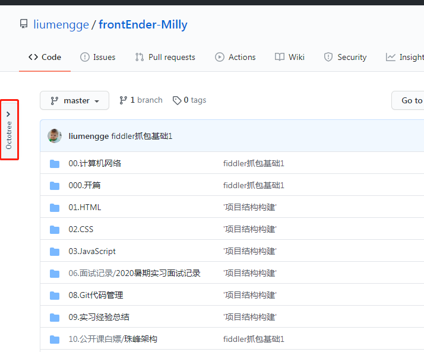
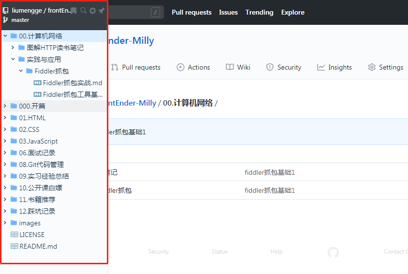
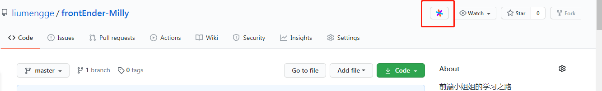
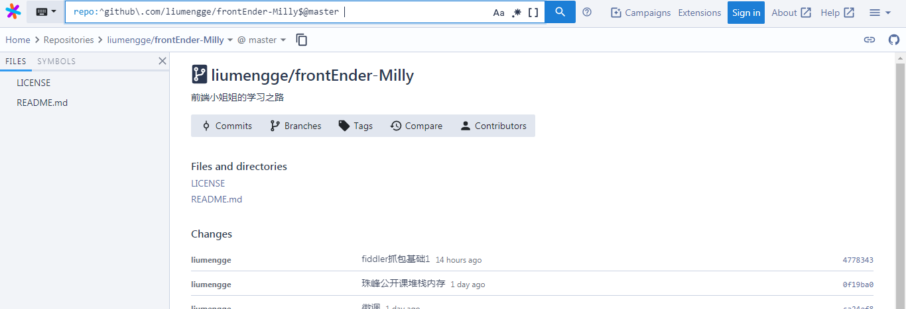
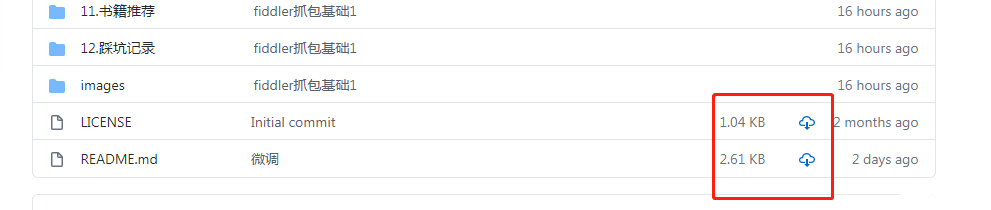
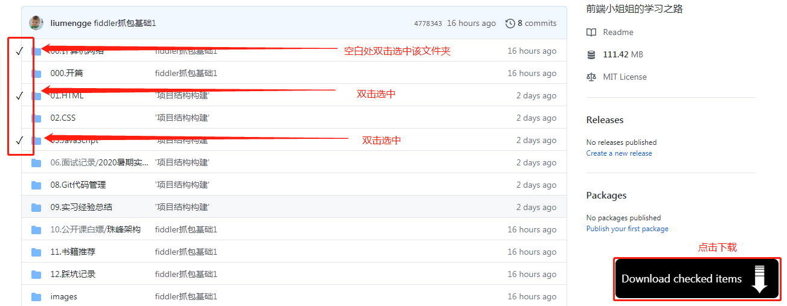
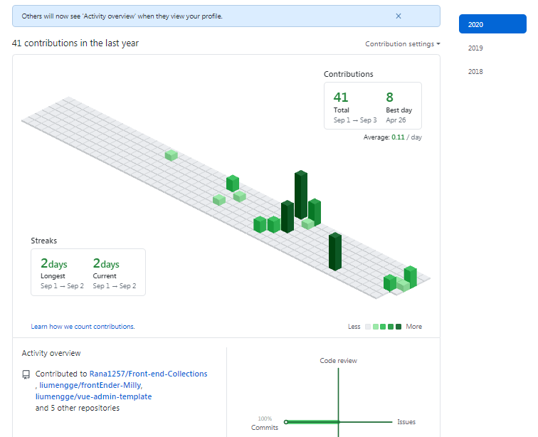
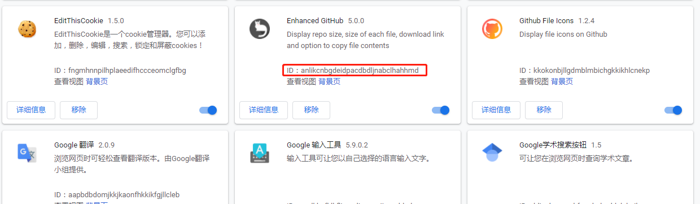
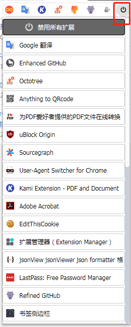

> 以chrome，我们来武装一下自己的浏览器~

- [科学上网](#科学上网)
- [提高前端开发效率](#提高前端开发效率)
- [浏览Github必备插件](#浏览github必备插件)
- [万一你用得到的插件](#万一你用得到的插件)
- [安装了太多的扩展程序chrome性能会受影响怎么办？](#安装了太多的扩展程序chrome性能会受影响怎么办)
  - [为什么安装扩展程序之后会影响页面加载速度？](#为什么安装扩展程序之后会影响页面加载速度)
    - [谷歌插件存储在哪里？](#谷歌插件存储在哪里)
    - [为什么会影响页面加载？](#为什么会影响页面加载)
  - [chrome扩展程序安装多了怎么管理？](#chrome扩展程序安装多了怎么管理)


先推荐一个网址吧，极简插件，你想要的都分类汇总好啦：https://chrome.zzzmh.cn/index

<div style="text-align: center; width: 300px;">
    
</div>

## 科学上网

> 使用之前要先注册一个谷歌账号呀，注册谷歌账号的过程确实有点磨人，还是一个墙内一个墙外的问题，那就只能找找途径翻一哈啦~

现在你就是拥有谷歌账号的人儿啦，打开极简插件，首先推荐安装的就是能够让你在平时不用使用专门的fq软件就可以访问谷歌、谷歌商店以及谷歌学术的插件，谷歌访问助手或者谷歌上网助手，谷歌访问助手应该是需要付费的，只是提供一段时间的免费试用，具体付费可以自己查一下。科学上网推荐`iGG谷歌访问助手`插件，下面来说下这个插件怎么安装吧。

极简插件提供了几个下载的方式并且配备了安装教程，这里就简单说一下，你可以打开你的fq软件访问谷歌商店直接搜索你想要安装的插件进行安装，这是最简单的方法。另外，你可以下载插件压缩包，然后打开chrome扩展程序中的开发者模式，将该插件压缩包拖拽至扩展程序处安装即可。

## 提高前端开发效率

> "工欲善其事必先利其器"，我们花费专门的时间来武装自己的浏览器目的就是在以后的工作中提高自己的开发效率，保质保量完成任务，留点时间休息或者有点时间搞点自己的小玩意儿~所以呢，作为前端开发人员，我们就来看下有哪些能够提高我们开发效率的插件叭~我一直认为插件真的很多很优秀，不用装了也是浪费，用对了才是最好的！

1. ``

## 浏览Github必备插件

> 作为程序猿(媛)，Github将会是我们最常浏览的地方，它包含了大量的优秀代码库，但是你会发现，Github用户体验并不太好，当你点击一个文件夹找到你想看的那个.js文件美滋滋看完之后，还想去看该目录下或者上级目录下的相关文件时就只能一级一级往回退，而且看不到一个比较清晰的目录结构。为了更方便的浏览github，推荐以下比较好用的几款插件供君选择。

1. `Octotree`
- 插件功能：
  - 类似IDE的项目目录结构
  - 使用PJAX快速浏览代码
  - 支持公有库和私有库
- 安装：谷歌商店直接搜索Octotree
- 解决的问题：解决从一个目录跳转到另一个目录时候繁琐的一系列返回操作
- 安装之后，再去浏览github时会发现左侧已经出现了一个小按钮，第一次使用需要创建账号然后设置一下你的token，比较简单就不详述了。
- 
- 
  
2. `Sourcegraph`
- 功能：
  - 允许你像使用IDE那样浏览代码，可以跳转到函数声明定义的位置，添加了标签查看文档和类型定义
  - 通过添加即时文档并在GitHub上键入工具提示来编码GitHub，从而增强了GitHub上的文件页面，并使每个标识符成为一个跳转到链接
  - 添加了一个搜索按钮和键盘快捷键（shift+T），允许您在存储库中搜索函数，类型和其他代码定义
  - 
  - 


3. `Enhanced GitHub`
- 功能：
  - 可以显示Github当前仓库的整体大小,
  - 显示每个活动分支中的每个文件大小（不适用于文件夹/符号链接）
  - 显示每个文件的下载链接（不适用于文件夹/符号链接）
  - 将文件内容直接复制到剪贴板（对于markdown文件不起作用）
  - 在查看文件内容时下载文件
- 安装：谷歌商店直接搜索Enhanced GitHub
- 

4. `Octolinker`

- 功能：将特定语言的模块加载语句（如 include、require 与 import）转换为链接，根据语言将您重定向到引用的文件或外部网站（如手册页或其他服务）
  - 相关文件：只需单击一下，就可以比以前更快地浏览GitHub存储库。OctoLinker利用GitHub API获取存储库的树结构以链接相关文件
  - 依赖发现：切勿离开GitHub手动搜索依赖项。OctoLinker将在package.json，composer.json，Gemfile或requirements.txt之类的文件中定义的依赖项与相关的GitHub项目页面链接在一起
  - API文档：忘了核心库方法的签名？不用担心，OctoLinker链接到API文档，例如nodejs.org/en/docs docs.python.org docs.oracle.com或rubygems.org
  - 拉请求：代码审查变得简单。OctoLinker链接Pull Request上的依赖项和文件，因此您可以专注于重要的工作 - 代码审查
  - 问题与评论：如果OctoLinker能够从Markdown文件，Issue或Pull Request注释中的代码片段推断出文件类型，它也会插入链接
  - 私人仓库：为了支持私有存储库上的所有提到的功能，OctoLinker需要GitHub访问令牌。如果发生这种情况，OctoLinker将提示通知。您的GitHub令牌永远不会发送到服务器！您的令牌留在浏览器中

5. `GitZip for github`
- 功能: 当你只需要下载Github项目中的其中一个文件夹的时候, 不需要再去下载整个项目, 只需要用GitZip for github, 自动将单独文件夹压缩成压缩包并提供下载
- 注意：如果遇到无法下载的问题, 可以尝试将自己的github账号授权GitZip for github。
- 

6. `Isometric Contributions`
- 功能：可以将你每天的contributions数目（可以理解为提交GitHub的数目）转化为颜色不一的立体柱状图，并给出自己的统计数据。这个插件允许在普通的 Github 贡献表与等距像素艺术版之间切换，每天提交记录使用图表展示。除了“图形化”你的数据之外，Isometric Contribution还将你的情况统计，将你一年内的提交状况，以及“最忙“的一天提交数目统计出来。
- 
如果想切换的话，右上角的Contribution settings 即可切换，emmm...就是目前的这个工作量啊，再接再厉呀小姐姐~


参考链接：http://www.cnplugins.com/zhuanti/266406.html
## 万一你用得到的插件

> 除了工作，我们还需要偶尔娱乐一下下，搞个电影看看？需要VIP怎么办？网盘不太好用，下载太慢，直接浏览器下载是否可行？...下面这些插件，或许你能用得到~

## 安装了太多的扩展程序chrome性能会受影响怎么办？

chrome浏览器一直因其高性能而深受广大用户喜爱，也因其丰富的插件让它的应用变得更加便捷，给我们带来了很大的便利，但是chrome扩展程序安装的越多，打开chrome时就会越慢，该怎么办？

### 为什么安装扩展程序之后会影响页面加载速度？

chrome扩展是允许向页面里植入CSS和JS的，并且CSS和JS的植入可能还会引起一些图片等资源的下载。为什么？往下看就知道啦~

#### 谷歌插件存储在哪里？

一般是存储在：`C:\Users\用户名\AppData\Local\Google\Chrome\User Data\Default\Extensions`

你想要查看哪一个插件相关代码就可以在chrome中打开扩展程序找到对应插件复制插件ID去上述文件夹下搜索即可：


#### 为什么会影响页面加载？

chrome插件开发中核心必备的一个文件就是插件的配置文件manifest.json，在该配文件中有一个`Content Scripts`属性，以`Adobe Acrobat`插件为例：

```javascript
"content_scripts": [{
    "js": [ "data/js/libs/jquery-3.1.1.min.js", "data/js/ch-content-script.js" ],
    "matches": [ "http://*/*", "https://*/*" ],
    "run_at": "document_end"
}],
```
上述代码表示向`http://*/*`或`https://*/*`页面植入`jquery-3.1.1.min.js`、`ch-content-script.js`两个js文件，并且植入时间是`document_end`。

run_at有3个属性值，分别对应：
- `document_start` 在页面CSS加载完成之后，DOM结构构造完成和script执行之前加载
- `document_end` 在DOM结构完成之后，图片或者iframe等资源之前
- `document_idle` 在`document_end`和`window.onload`找个空闲时候触发 
  
从3个run_at值来看，如果植入的脚本在`document_start`，那对页面的影响是非常大的。虽然这些资源在本地，没什么网络传输时间，但还是有解析和执行时间。并且一个扩展可以植入多个资源或者脚本，如果扩展安装比较多的话，对页面性能的影响就非常大了。

还有其他插件会引入css，比如：
```javascript
"content_scripts": [ {
    "all_frames": false,
    "css": [ "css/content.css" ],
    "js": [ "lib.js", "lib/jquery.min.js", "lib/jquery.qrcode.min.js", "lib/toutf8.js", "lib/clipboard.min.js", "js/cs.js" ],
    "matches": [ "http://*/*", "https://*/*" ]
}, {
    "all_frames": true,
    "js": [ "js/m.js" ],
    "matches": [ "http://*/*", "https://*/*" ]
} ],
```
所以，安装过多的插件是会影响chrome的性能的

### chrome扩展程序安装多了怎么管理？

借助chrome插件扩展管理器和一件管理插件。

Extensions Manager – chrome浏览器扩展管理扩展，提供比原生扩展管理更为方便快捷的管理方式，清晰的分类可以很快区分扩展与应用。它能弹出浮窗，一键开关任意已安装的插件。

chrome扩展管理器的功能：
- 一键快速开启/关闭扩展
- 闪电管理：双击空白区域关闭所有开启扩展（被锁定或主题类扩展除外）
- 智能排序：根据启用频繁度智能排序
- 右键菜单：提供锁定、卸载、选项配置、主页等快捷功能
- 角标实时显示开启扩展数量，用完提醒及时关闭（被锁定或主题类扩展除外）

扩展程序管理：


一键管理：


上面两个都挺方便的，我觉得一个就ok啦，看个人喜好~
