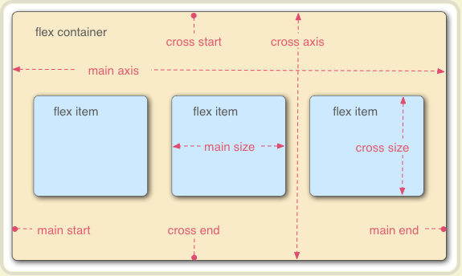

- [flex布局基础语法](#flex布局基础语法)
  - [flex布局](#flex布局)
  - [flex布局的基本概念](#flex布局的基本概念)
  - [容器的属性](#容器的属性)
  - [项目的属性](#项目的属性)
- [flex布局实践案例](#flex布局实践案例)
  - [骰子布局：直接参考阮老师博客就好](#骰子布局直接参考阮老师博客就好)
  - [网格布局](#网格布局)
  - [圣杯布局](#圣杯布局)
  - [流式布局](#流式布局)
## flex布局基础语法

> 文章来源：[阮一峰老师的网络日志](www.ruanyifeng.com/blog/2015/07/flex-grammar.html)

布局，基于盒模型，依赖于display属性+position属性+float属性。但是对于特殊的布局不容易实现，比如：垂直居中。Flex布局实现这种特殊的布局就比较方便，目前浏览器已经全部支持，可放心使用。

### flex布局
- Flex Box的缩写，弹性布局，为盒模型提供更大灵活性
- 任何一个容器都可以被指定为flex容器

```javascript
.box{
  display: flex;
}

// 
.box{
  display: inline-flex;
}

// Webkit 内核的浏览器，必须加上-webkit前缀
.box{
  display: -webkit-flex; /* Safari */
  display: flex;
}
```

注意：设置为flex布局以后，`float、clear、vertical-align`属性将失效。

### flex布局的基本概念



- 容器：采用 Flex 布局的元素，称为 Flex 容器（flex container），简称"容器"
- 项目：容器的所有子元素自动成为容器成员，称为 Flex 项目（flex item），简称"项目"
- 容器默认存在两根轴：
  - 水平的主轴(main axis)：默认
    - main start: 主轴的开始位置（与边框的交叉点）
    - main end: 主轴的结束位置
    - main size： 单个项目占据的主轴空间
  - 垂直的交叉轴(cross axis)
    - cross start： 交叉轴的开始位置
    - cross end: 交叉轴的结束位置
    - cross size: 单个项目占据的交叉轴空间

### 容器的属性

> 使用在flex容器上的属性总共有以下6个：

- `flex-direction`：决定主轴的方向（即项目的排列方向）
  - `flex-direction: row | row-reverse | column | column-reverse;`
    - `row`（默认值）：主轴为水平方向，起点在左端
    - `row-reverse`：主轴为水平方向，起点在右端
    - `column`：主轴为垂直方向，起点在上沿
    - `column-reverse`：主轴为垂直方向，起点在下沿
- `flex-wrap`: 默认情况下，项目都排在一条线（又称"轴线"）上。`flex-wrap`属性定义，如果一条轴线排不下，如何换行。
  - ` flex-wrap: nowrap | wrap | wrap-reverse;`
    - `nowrap`（默认）：不换行
    - `wrap`：换行，第一行在上方
    - `wrap-reverse`：换行，第一行在下方
- `flex-flow`: `flex-direction`属性和`flex-wrap`属性的简写形式，默认值为`row nowrap`
  - ` flex-flow: <flex-direction> || <flex-wrap>;`
- `justify-content`: 定义了项目在主轴上的对齐方式
  - `justify-content: flex-start | flex-end | center | space-between | space-around;`
  - `flex-start`（默认值）：左对齐
  - `flex-end`：右对齐
  - `center`： 居中
  - `space-between`：两端对齐，项目之间的间隔都相等。
  - `space-around`：每个项目两侧的间隔相等。所以，项目之间的间隔比项目与边框的间隔大一倍。
  
- `align-items`: 定义项目在交叉轴上如何对齐
  - `align-items: flex-start | flex-end | center | baseline | stretch;`
  - stretch（默认值）：如果项目未设置高度或设为auto，将占满整个容器的高度。
  - flex-start：交叉轴的起点对齐。
  - flex-end：交叉轴的终点对齐。
  - center：交叉轴的中点对齐。
  - baseline: 项目的第一行文字的基线对齐。
  

- `align-content`: 定义了多根轴线的对齐方式。如果项目只有一根轴线，该属性不起作用。
  - `align-content: flex-start | flex-end | center | space-between | space-around | stretch;`
    - stretch（默认值）：轴线占满整个交叉轴。
    - flex-start：与交叉轴的起点对齐。
    - flex-end：与交叉轴的终点对齐。
    - center：与交叉轴的中点对齐。
    - space-between：与交叉轴两端对齐，轴线之间的间隔平均分布。
    - space-around：每根轴线两侧的间隔都相等。所以，轴线之间的间隔比轴线与边框的间隔大一倍。
  

### 项目的属性

> 使用在项目上的属性也有6个：

-  `order`：定义项目的排列顺序。数值越小，排列越靠前，默认为0
-  `flex-grow`: 定义项目的放大比例，默认为0，即如果存在剩余空间，也不放大
-  `flex-shrink`: 定义了项目的缩小比例，默认为1，即如果空间不足，该项目将缩小
-  `flex-basis`: 定义了在分配多余空间之前，项目占据的主轴空间（main size）。浏览器根据这个属性，计算主轴是否有多余空间。它的默认值为auto，即项目的本来大小。
-  `flex`: `flex-grow`, `flex-shrink` 和 `flex-basis`的简写，默认值为`0 1 auto`，后两个属性可选。
   -  该属性有两个快捷值：auto (1 1 auto) 和 none (0 0 auto)
   -  建议优先使用这个属性，而不是单独写三个分离的属性，因为浏览器会推算相关值。
-  'align-self': 允许单个项目有与其他项目不一样的对齐方式，可覆盖`align-items`属性。默认值为`auto`，表示继承父元素的`align-items`属性，如果没有父元素，则等同于`stretch`。
   -  `align-self: auto | flex-start | flex-end | center | baseline | stretch;`

## flex布局实践案例

> 测试代码在flex/骰子布局.html中可参考，自己调了下应该没问题。

### 骰子布局：直接参考阮老师博客就好

### 网格布局
1. 基本网格布局 --- 平均布局
   实现在容器中平均分配空间，且需要设置项目的自动缩放。
   ```html
   <!DOCTYPE html>
    <html lang="en">
    <head>
        <meta charset="UTF-8">
        <meta name="viewport" content="width=device-width, initial-scale=1.0">
        <title>网格布局</title>
        <style>
            .box {
                display: flex;
                border: 2px solid yellowgreen;
            }
            .box:nth-of-type(2) {
                margin-top: 50px;
            }
            .item {
                flex: 1;
                background-color: blueviolet;
            }
            .item:nth-of-type(2), .item:nth-of-type(5) {
                background-color: #fff;
            }
        </style>
    </head>
    <body>
        <div class="box">
            <div class="item">111111</div>
            <div class="item">222222</div>
            <div class="item">333333</div>
        </div>
        <div class="box">
            <div class="item">111111</div>
            <div class="item">222222</div>
            <div class="item">333333</div>
        </div>
        <script>

        </script>
    </body>
    </html>
   ```
2. 百分比布局
实现某个网格的宽度为固定的百分比，其余网格平均分配剩余空间。


```javascript
<!DOCTYPE html>
<html lang="en">
<head>
    <meta charset="UTF-8">
    <meta name="viewport" content="width=device-width, initial-scale=1.0">
    <title>百分比布局</title>
    <style>
        .Grid {
            display: flex;
            background-color: grey;
            text-align: center;
        }
        .Grid-cell {
            flex: 1;
        }
        .Grid-cell.u-1of3 {
            flex: 0 0 10%;
            background-color: rgb(58, 199, 241);
            
        }
        .Grid-cell.u-1of4 {
            flex: 0 0 25%;
            background-color: yellowgreen;
        }
    </style>
</head>
<body>
    <div class="Grid">
        <div class="Grid-cell u-1of4">111111</div>
        <div class="Grid-cell">222222</div>
        <div class="Grid-cell u-1of3">333333</div>
    </div>

</body>
</html>
```

### 圣杯布局
> 什么是圣杯布局：一种常见的网站布局。页面从上到下，分成三个部分：头部（header），躯干（body），尾部（footer）。其中躯干又水平分成三栏，从左到右为：导航、主栏、副栏。

圣杯布局的实现在flex案例文件夹下。其中有几个点需要搞清楚：
- 单位：`px、em、vh`之间的区别是什么？
- `@media`是干什么的？

### 流式布局
