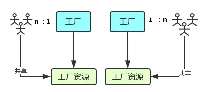

## JS

### 进程与线程

- 进程是 CPU资源分配的最小单位；线程是 CPU调度的最小单位
- 进程好比图中的工厂，有单独的专属自己的工厂资源
- 线程好比图中的工人，多个工人在一个工厂中协作工作，工厂与工人是 1:n的关系。也就是说一个进程由一个或多个线程组成，线程是一个进程中代码的不同执行路线
- 工厂的空间是工人们共享的，这象征一个进程的内存空间是共享的，每个线程都可用这些共享内存
- 多个进程之间独立存在

### 多进程与多线程
- 多进程：在同一个时间里，同一个计算机系统中允许两个或两个以上的进程处于运行状态。比如你可以听歌的同时，打开编辑器敲代码，编辑器和听歌软件的进程之间丝毫不会相互干扰。
- 多线程：程序中包含多个执行流，即在一个程序中可以同时运行多个不同的线程来执行不同的任务，也就是说允许单个程序创建多个并行执行的线程来完成各自的任务。
- chrome浏览器：当你打开一个 Tab 页时，其实就是创建了一个进程，一个进程中可以有多个线程，比如渲染线程、JS 引擎线程、HTTP 请求线程等等。当你发起一个请求时，其实就是创建了一个线程，当请求结束后，该线程可能就会被销毁。

参考：[进程与线程](https://juejin.im/post/6844903761949753352)

### 说一下浏览器内核

> 浏览器内核是通过取得页面内容、整理信息（应用CSS）、计算和组合最终输出可视化的图像结果，通常也被称为渲染引擎。

> 浏览器内核是多线程，在内核控制下各线程相互配合以保持同步，一个浏览器通常由以下常驻线程组成：
- GUI 渲染线程
  - 主要负责页面的渲染，解析HTML、CSS，构建DOM树，布局和绘制等。
  - 当界面需要重绘或者由于某种操作引发回流时，将执行该线程。
  - 该线程与JS引擎线程互斥，当执行JS引擎线程时，GUI渲染会被挂起
  - 当任务队列空闲时，主线程才会去执行GUI渲染。
- JavaScript引擎线程
  - 该线程当然是主要负责处理 JavaScript脚本，执行代码。
  - 也是主要负责执行准备好待执行的事件，即定时器计数结束，或者异
  - 请求成功并正确返回时，将依次进入任务队列，等待 JS引擎线程的执行。
  - 该线程与 GUI渲染线程互斥，当 JS引擎线程执行 JavaScript脚本时间过长，将导致页面渲染的阻塞。

- 定时触发器线程
  - 负责执行异步定时器一类的函数的线程，如： setTimeout，setInterval。
  - 主线程依次执行代码时，遇到定时器，会将定时器交给该线程处理，当计数完毕后，事件触发线程会将计数完毕后的事件加入到任务队列的尾部，等待JS引擎线程执行。
- 事件触发线程
  - 主要负责将准备好的事件交给 JS引擎线程执行
  - 比如 setTimeout定时器计数结束， ajax等异步请求成功并触发回调函数，或者用户触发点击事件时，该线程会将整装待发的事件依次加入到任务队列的队尾，等待 JS引擎线程的执行
- 异步http请求线程
  - 负责执行异步请求一类的函数的线程，如： Promise，axios，ajax等
  - 主线程依次执行代码时，遇到异步请求，会将函数交给该线程处理，当监听到状态码变更，如果有回调函数，事件触发线程会将回调函数加入到任务队列的尾部，等待JS引擎线程执行

### DOM事件机制