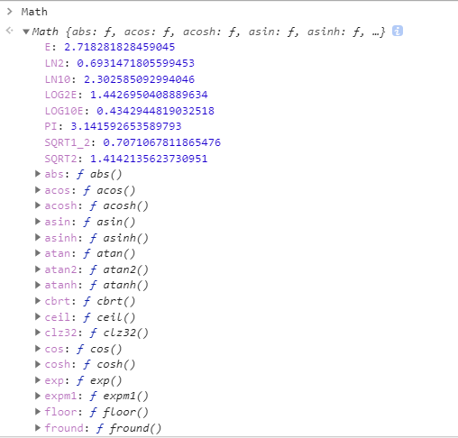
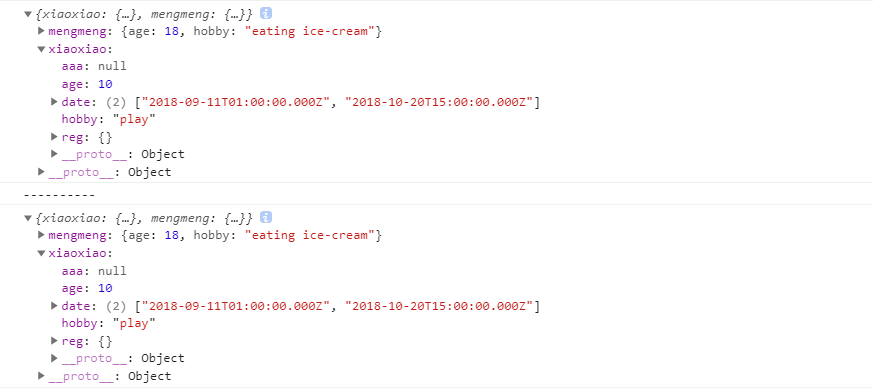

- [数据类型检测的方法](#数据类型检测的方法)
- [使用var声明变量与不使用var变量直接赋值的区别](#使用var声明变量与不使用var变量直接赋值的区别)
- [说一下JS中的delete](#说一下js中的delete)
- [Promise实现指定时间后完成某事](#promise实现指定时间后完成某事)
- [Promise实现异步加载图片](#promise实现异步加载图片)
- [Promise实现AJAX封装](#promise实现ajax封装)
- [resolve函数的参数有哪几种类型，分别怎么处理](#resolve函数的参数有哪几种类型分别怎么处理)
- [有没有用过promise的then方法，怎么使用的](#有没有用过promise的then方法怎么使用的)
- [`Promise.prototype.catch()`](#promiseprototypecatch)
- [有没有使用过Promise.all()，用它解决过什么问题](#有没有使用过promiseall用它解决过什么问题)
- [有没有使用过Promise.race()，用它解决过什么问题](#有没有使用过promiserace用它解决过什么问题)
- [Promise.resolve()](#promiseresolve)
- [Promise.try()](#promisetry)
- [深拷贝的实现方式](#深拷贝的实现方式)
- [使用setTimeout有没有遇到过什么坑？](#使用settimeout有没有遇到过什么坑)
  - [浏览器是怎么实现setTimeout的？](#浏览器是怎么实现settimeout的)
  - [使用setTimeout的注意事项](#使用settimeout的注意事项)
- [什么是`Web Worker`](#什么是web-worker)

## 数据类型检测的方法

> typeof 检测数据类型的逻辑运算符
> 
> instanceof 检测是否为某个类的实例
> 
> constructor 检测构造函数
> 
> Object.prototype.toString.call() 检测数据类型

> 这一部分主要分析`typeof`如何检测数据类型

1. `typeof [value]` 返回结果是对应数据类型的字符串
   
   ```javscript
    console.log(typeof 12)  // "number"
    console.log(typeof NaN)  // "number"
    console.log(typeof Infinity)  // "number"
    console.log(typeof true)  // "boolean"
    console.log(typeof "xiaoming")  // "string" 
    console.log(typeof null)  // "object"
    console.log(typeof undefined)  // "undefined"
    console.log(typeof Symbol('1'))  // "symbol"
    console.log(typeof BigInt('1'))  // "bigint"
    console.log(typeof [])  // "object"
    console.log(typeof {})  // "object"
    console.log(typeof function () {})  // "function"
   ```
注意：null本身是基本数据类型的，但是typeof检测得到的结果是`"object"`，这是因为所有值在内存中都是按照二进制位存储的，typeof在检测的时候认为前几位都是0的就是`"object"`，null存储的结果正好前几位都是0。

 - 特点总结：
   - 返回的结果都是字符串
   - 局限性
     - `console.log(typeof null)  // "object"`
     - typeof不能细分对象类型(检测普通对象和数组对象都是object)

2. JS中的数字类型：
- 数字类型分类：
  - 0、1、 2、 -1、 1.3、 1.02，正整数、负整数、零、小数都是数字类型
  - NaN：它表示不是一个有效数字，但是它属于number类型
  - Infinity：无穷大的值
  - -Infinity：负无穷大的值
- NaN：不等于任何值，包括它自己
  - `NaN == NaN` 结果为false
  - 判断一个值是不是有效数字：使用全局方法`isNaN(值)` --- 检测这个值是否不是有效数字，如果不是有效数字，返回true，如果是有效数字，返回false

3. 把其它数据类型转换为数字
   1. 强转换（基于底层机制转换的） `Number([value])`
      1. 一般很少自己写Number去进行类型转换，存在一些隐式类型转换都是基于Number完成的
         1. `isNaN('12px')`： 先把其它类型值转换为数字再检测
         2. 数学运算: '12px'-13
         3. `字符串 == 数字`：两个等于号比较，很多时候也是要把其它值转换为数字再进行转换
   2.  弱转换（基于一些额外的方法转换） `parseInt([value])/parseFloat([value])`

4. 例题分析

```javascript
let a = typeof typeof typeof [1,2,3]
console.log(a)  // "string"
```
- 分析：`typeof [1, 2, 3] =>"object"` -> `typeof "object" =>"string"` -> `typeof "string" =>"string"`

---
```javascript
let res = parseFloat('left:200px');
if(res===200){
   alert(200);
}else if(res===NaN){
   alert(NaN);
}else if(typeof res==='number'){
   alert('number');
}else{
   alert('Invalid Number');
}

// 结果："number"
```
- 分析：
  - `parseFloat()`:实现数字类型转换，将字符串转换成数字类型，从左往右开始查找，找到数字依次转换为数字，如果检测到不是数字就转换为NaN,只要检测到一个不是数字就停止查找了,如果处理的值不是字符串，需要先转换为字符串然后再开始查找接口。 所以`res=NaN`
  - 第一个分支肯定不成立，第二个分支也不成立，因为`NaN !== NaN`
  - 到第三个分支: `typeof res`结果为字符串"number"，所以该分支成立，弹出"number"

---
```javascript
parseInt("")  // NaN
Number("")  // 0
isNaN("")  // isNaN(0) -> false

parseInt(null)  // NaN
Number(null)  // 0
isNaN(null)  // isNaN(0) -> false

parseInt("12px")  // 12
Number("12px")  // NaN
isNaN("12px")  // isNaN(NaN) -> true

parseFloat("1.6px")+parseInt("1.2px")+typeof parseInt(null)  // 1.6 + 1 + "number"  -> 2.6 + "number" -> "2.6number" 

isNaN(Number(!!Number(parseInt("0.8"))))  // isNaN(0) -> false

typeof !parseInt(null) + !isNaN(null)  // "booleantrue"

[] == true  // false  
```
- 分析：
    - parseInt 处理的值是字符串，从字符串的左侧开始查找有效数字字符（遇到非有效数字字符则停止查找），如果处理的值不是字符串，需要先转换为字符串然后再开始查找接口。
    - Number 直接调用浏览器最底层的数据类型检测机制来完成，有以下几个规定：
      - `Number(true) -> 1`, `Number(false) -> 0`
      - `Number(null) -> 0`, `Number(undefined) -> NaN`
      - `Number("") -> 0`
      - `Number([]) -> Number("") -> 0`
      - 字符串中必须保证都是有效数字才会转换为数字，否则都是NaN, 比如`Number("12px")  // NaN`
    - `isNaN()`使用的是隐式转换：比如`isNaN("")`, 先把""转换为数字（隐式 Number），相当于先执行`Number("")` 再执行 `isNaN(0)`，所以结果为false
    - `+`在JS中除了数学运算还有字符串拼接的作用, `+`遇到字符串(或者对象，因为对象是先转换为字符串然后再处理)
    - 其他类型转换为布尔为false：
      - `0 -> false`
      - `NaN -> false`
      - `null -> false`
      - `undefined -> false`
      - `"" -> false`
    - 两个等号比较的时候，等号两边一个是对象一个是布尔，在比较的时候先进行隐式转换(Number)，都转换成数字类型，`Number([]) -> Number("") -> 0`，`Number(true) -> 1`，所以`[] == true  // false`。两个等号比较的时候有几个规律：
      - `对象 == 字符串`： 对象转换为字符串
      - `null == undefined`: null和undefined相等，但是和其他值都不相等
      - 剩下的情况，如果两边是不同的类型，都是先转换成数字类型再进行比较

---
```javascript
let result = 10+false+undefined+[]+'Tencent'+null+true+{};
console.log(result);  // NaNTencentnulltrue[object Object]
```
- 分析：
    - `10+0 -> 10`
    - `10+NaN -> NaN`
    - `NaN+[] -> "NaN"`: 这里的运算遇到对象[]，对象先转换为字符串，`[] -> ""`，所以，得到的结果是字符串"NaN"。这个运算为什么转为字符串呢？原因是：现在要进行数学运算，要先转换成数字，要把对象转换成数字的过程是`对象 -> 字符串 -> 数字`，在对象转换成字符串的时候遇到加号就变成字符串拼接了。
    - `"NaN"+'Tencent' -> 'NaNTencent'`：现在是字符串了，后面就变成是字符串拼接了
    - -> `'NaNTencentnulltrue'`
    - 最后是一个对象，现将空对象转换成字符串,检测数据类型中有一个toString()，`({}).toString() -> "[object Object]"`
    - 一般，对象转为字符串的时候是先调用valueOf获得原始值再去调用toString，学习完面向对象之后再来理解这里！

5. 练习

```javascript
let str = 100 + true + 21.2 + null + undefined + 'Tencent' + [] + null + 9 + false

[] == false
![] == false
```

- 规律：在两边出现字符串或者对象的情况下，加号一定是字符串拼接。对象本身是要转换为数字进行运算的，只不过转换数字的过程中，需要先转换为字符串，而一旦转换成字符串，加号就变成字符串拼接了
- 对象转换成字符串：先调用valueOf获取其原始值(一般是基本类型值)，如果不是基本类型值，就继续调用toString()
- `==`在进行比较的时候，如果左右两边数据类型不一致，则需要先默认转换成一直的数据类型，然后再进行比较。`===`绝对相等，两边类型一致，值也一致才相等，类型不一样直接不对等，不会进行数据类型转换
- `==`比较规则：
  - `对象 == 字符串`,对象转换为字符串, `[10] == '10'  => true`
  - `null == undefined`, 但是和其他任何值都不相等，`0 == null => false`，虽然null在转换成数字类型的时候是0，但是这里是不相等的，可以这样理解，`0`一定会在内存中开辟一个值来存储的，，但是null直接不会分配内存。
  - NaN和谁都不相等，包括它自己
  - 剩下的情况都是转换成数字再比较
- `![] == false`考察点：
  - 优先级问题：先计算`![]`再计算`==`
  - `![]`:转换为布尔值取反。
    - 把其他类型转换为布尔类型：只有`0/NaN/null/undefined/''`这5种情况转换为布尔值是false，其他情况都是true
  - `false == fasle => true`
- 注意：浏览器底层运行的时候有一套自己的转换规则，`把其他值转换为数字`、`把其他值转换为布尔`、`==的比较`，这几个规则是互不干涉的。

---
```javascript
[] + 0 ? alert('ok') : alert('no')  // ok
0 + [] ? alert('ok') : alert('no')  // ok

{} + 0 ? alert('ok') : alert('no')  // no
0 + {} ? alert('ok') : alert('no')  // ok
```
- `[] + 0`:首先`[]`转换成数字，在转换成数字之前转换成字符串，转换成字符串之后就变成字符串拼接了，所以得到的结果是字符串`"0"`，`"0"`不是转换为布尔值的五种情况之一，所以转换为布尔值为true。第二行代码情况是一样的。
- `{} + 0`:
  - `{}`在JS中可以是对象，可以是代码块(块作用域)。在该题目的运算中，将`{}`当作一个代码块，后面是`+0`,所以浏览器运行的时候认为它是两个代码：代码块和`+0`运算。代码块不参与运算，只计算了`+0`，得到的结果是0。
  - `+值`这个操作是数学运算，不论这个值是什么类型的。`+[] => 0`、`+'10' => 10`、`++值`、`值++`也是数学运算
  - `{}`出现在运算符的前面，浏览器就认为它是一个单独的块，`{name: 'xiaoxiao'}+0 => 0`
  - 在浏览器`console.log({}+0) => "[object Object]0"`、`({}+0) => "[object Object]0"`，像这样的运算，浏览器就把这两部分看作是一个整体了。`({})+0 => "[object Object]0"`这样的话，浏览器认为`({})`不是代码块而是一个值。
- `0+{}`: `{}`出现在运算符后面，直接当作数学运算。
- `{} + 0 + {} => "[object Object]0[object Object]"`，特殊情况单独记。像是`{} + 0 + '10' => "010"`就是只计算后面的。


## 使用var声明变量与不使用var变量直接赋值的区别

1. 全局作用域内声明变量有var和没var的区别

```javascript
var aaa = 1
window.bbb = 2
ccc = 3
this.ddd = 4

// 使用getOwnPropertyDescriptor来查看window上这几个属性的特性描述
// getOwnPropertyDescriptor：获取指定对象的自身属性描述符。自身属性描述符是指直接在对象上定义（而非从对象的原型继承）的描述符。

Object.getOwnPropertyDescriptor(window, 'aaa')
// {value: 1, writable: true, enumerable: true, configurable: false}

Object.getOwnPropertyDescriptor(window, 'bbb')
// {value: 2, writable: true, enumerable: true, configurable: true}

Object.getOwnPropertyDescriptor(window, 'ccc')
// {value: 3, writable: true, enumerable: true, configurable: true}

Object.getOwnPropertyDescriptor(window, 'ddd')
// {value: 4, writable: true, enumerable: true, configurable: true}
```
通过上面的属性描述结果可以发现，在全局作用域下var的变量是window对象的一个属性，但是这个属性是**不可配置**的，关于是否可配置是与`Object.defineProperty`对象的数据属性相关的概念，比如：
```javascript
var person = {}
Object.defineProperty(person,'name',{
    configurable: false,//能否使用delete、能否修改属性特性、或能否修改访问器属性、，false为不可重新定义，默认值为true
    enumerable: false,//对象属性是否可通过for-in循环，flase为不可循环，默认值为true
    writable: false,//对象属性是否可修改,flase为不可修改，默认值为true
    value: 'xiaoxiao' //对象属性的默认值，默认值为undefined
});
```
也就是说，**全局作用域下var声明的变量是不可删除**的，来测试下：
```javascript
// 以下的验证都是使用chrome浏览器的默认js执行环境-非严格模式下的返回结果

delete aaa  // false
console.log(aaa)  // 1, 依然存在

delete bbb  // true
console.log(bbb) // VM805:1 Uncaught ReferenceError: bbb is not defined  报错，说明已经删除掉了

delete ccc // true
console.log(ccc) // 报错，说明可删除

delete ddd  // true
console.log(ddd) // 报错，说明可删除
```

2. 函数作用域内声明变量有var和没var的区别

看一个非常简单的梨子：
```javascript
var x = 8
function fn() {
    var a = 1
    b = 2  // 隐式全局变量
    return a + b + x
}
fn()  // 3

console.log(a)  // Uncaught ReferenceError: a is not defined
console.log(b)  // 2
```
分析一下上面的代码：
- 在全局作用域下声明了一个变量x并且赋值为8，声明了一个函数fn，然后调用这个函数
- 在全局环境中访问函数作用域下var声明的变量a时会报错，因为在函数作用域下，var声明之后会被变量提升到当前作用域下的顶部，也就是说这个变量是函数作用域下的，在全局作用域中是无法访问的，报错信息的`ReferenceError: a is not defined`，全局作用域下是没有这个变量的。
- 函数fn中还有一个变量b，没有使用var声明，而是直接赋值，这时我们在全局作用域下访问b的时候是能够访问到的：`window.b => 2`，也就是说b变成了全局对象window的一个属性。能不能删除呢？`delete b => true`，再次访问就会报错了，所以这种方式的变量是可以删除的。
- 还有一点会发现，在函数内部是可以调用全局下的变量x的，这就涉及到作用域与作用域链的概念，简单说就是在函数作用域下没有找到这个变量就会沿着作用域链往上查找，直到查找到全局作用域。所以，**在函数内部可以沿着作用域链访问定义在函数外部的变量**。
- 注意：在ES5的严格模式下，如果变量声明没有var，去delete时就会报` SyntaxError`。

关于隐式全局变量变量有几点需要注意：

```javascript
function  fn() {
   var  a  =  b  =  c  =  1;   // b和c是隐式全局变量（等号）
   var  a = 1;  b = 2;  c = 3;     // b和c是隐式全局变量（分号）

   var  a = 1 ,  b = 2 ,  c = 3;    // b和c不是隐式全局变量（逗号）
}
```

> 关于JS的执行机制，什么是变量提升，为什么要变量提升，作用域以及作用域链是什么，执行环境是什么这几个问题是我们深入理解JS的基础，都是很重要的内容，将会使用单独的章节进行详细分析。

## 说一下JS中的delete

> 看到很多博文上建议说delete少用，使用了delete并不是真正的删除，delete的那个变量还是存储在内存中的，这里确实有点蒙圈，有人面试遇到过，整理下

1. delete的作用：删除对象的某个属性
2. 语法：`delete object.property`或者`delete object['property']`
   ```javascript
   var doggy = {
      name: 'Bob',
      age: 3
   }

   delete doggy.name
   console.log(doggy)  // {age: 3}
   ```
3. 返回值：delete操作符的返回值是布尔值，如果是可删除的内容，执行delete操作，删除成功返回值为true，如果是不可删除的内容，执行delete操作，删除成功，返回值为false。
   
   比如，就像上面提到的`Object.getOwnPropertyDescriptor(window, 'aaa')
 => {value: 1, writable: true, enumerable: true, configurable: false}`，`configurable`的值为false，就表示是不可删除的属性，执行`delete aaa`得到的返回值就是false。

4. 实践应用：
   1. 删除一个对象中不存在的属性
   使用delete删除一个不存在的属性，delete操作无效，但是返回值仍然是true。
   ```javascript
   var doggy = {
      name: 'Bob',
      age: 3
   }
   delete doggy.sister  // true
   ```
   2. 能否删除原型链上的同名属性
   ```javascript
   // 构造函数
   function Person() {
      this.name = '李易峰',
      this.job = '明星演员'
   }

   Person.prototype.name = '李贺'  // 原型上有一个同名属性

   // 创建实例对象
   var p = new Person()
   // 删除p的name属性
   delete p.name
   console.log(p)  // Person {job: "明星演员"} , 对象中name这个属性已经被删除掉了
   console.log(p.name)  // '李贺'
   ```
   也就是说，使用delete删除成功之后的属性是不存在了，但是如果它的原型链上还存在一个同名属性的话是没有办法通过delete删除的，再次访问对象p的name属性时，访问的是从原型上继承过来的属性。
   
   需要注意的是，delete操作与内存管理没有关系，也就是有博客中所指出的**delete并不能将一个属性从内存中删除掉**观点，但是删除之后到底是什么，在内存里面是什么样子的还需要进一步探究！！！
   
   关于内存管理的内容可以参考[MDN](https://developer.mozilla.org/zh-CN/docs/Web/JavaScript/Memory_Management)。垃圾回收机制会有专门的章节介绍。

   3. 删除var声明的变量与函数
   在`使用var声明变量与不使用var变量直接赋值的区别`中已经详细给出了几个简单的梨子已经相关验证，除此之外，这里来看下函数声明与函数表达式使用delete会怎么样呢？

   ```javascript
   var f1 = function () {
      console.log(1)
   }

   delete f1  // 严格模式下，会报错
   f1()  // 非严格模式下，控制台会输出1
   ```
   也就是说delete一个通过函数表达式定义的函数得到的结果与删除var声明的变量是一样的。
   
   另外，如果一个函数是一个对象的方法，是可以delete的。看下面：
   ```javascript
   var person = {
      name: '李易峰',
      show: function () {
         console.log('给大家表演个节目叭！')
      }
   }
   delete person.show  // true 表示删除成功
   console.log(person)  // {name: "李易峰"}
   ```

   4. 能否删除let和const声明的变量
   答案是不能删除。删除let和const声明的变量与删除var声明的变量得到的效果是一样的。
   5. 不可设置的属性不可删除
   - Math、Array、Object等内置对象的属性不可删除、方法可删除
   
      以Math为例，先来看下都有什么属性和方法：
      

      ```javascript
      // 属性
      console.log(Math.E)  // 2.718281828459045
      delete Math.E   // false
      console.log(Math.E)  // 2.718281828459045

      // 方法
      console.log(Math.abs)  // ƒ abs() { [native code] }
      delete Math.abs  //  true
      console.log(Math.abs) // undefined
      ```
   - `Object.defineProperty()`设置为不可设置的属性不可删除
      ```javascript
      var person = {}
      Object.defineProperty(person, 'name', {
         value: '李易峰',
         configurable: false
      })

      delete person.name  // 非严格模式下，false， 严格模式下报语法错误
      console.log(person)  // {name: "李易峰"}
      ```
   6. 数组的删除
   删除数组中的某个元素：
   ```javascript
   var arr = ['李易峰','顾耀东','陈深','百里屠苏']
   console.log(arr.length)  // 4

   delete arr[0]  // true
   console.log(arr) // [empty, "顾耀东", "陈深", "百里屠苏"]
   console.log(arr.length)  // 4
   console.log(arr[0])  // undefined
   console.log(0 in arr)  // 0 in arr中0表示数组属性或索引，返回结果为false
   ```
   也就是说，
   - delete可以删除数组中的一个元素
   - 使用delete删除数组中元素以后，这个数组的长度是不会发生变化的
   - 删除之后数组中当前位置为empty，并且`console.log(0 in arr)`返回结果为false，表示0这个索引在数组中不存在了，现在数组中的索引是从1开始的。

   ```javascript
   var arr = ['李易峰','顾耀东','陈深','百里屠苏']
   arr[1] = undefined
   console.log(arr)  // ["李易峰", undefined, "陈深", "百里屠苏"]
   console.log(1 in arr)  // true, 表示1这个索引还是存在的
   ```  
   参考链接：[Javascript中的delete操作符](https://segmentfault.com/a/1190000010574280)


## Promise实现指定时间后完成某事

```javascript
function timeout(ms) {
   return new Promise((resolve, reject) => {
      setTimeout(resolve, ms, 'done')
   })
}

// timoeout方法返回一个promise实例，表示一段时间之后发挥发生的结果，过了指定的时间ms后，promise实例的状态变为resolved，就会触发then方法绑定的回调函数。
timeout(1000).then((value) => {
   console.log(value)
})
```

## Promise实现异步加载图片

```javascript
function loadImageAsync(url) {
   return new Promise((resolve, reject) => {
      var image = new Image()

      image.onload = function () {
         resolve(image)
      }

      image.onerror = function () {
         reject(new Error('Can not load image at ' + url))
      }

      image.src = url
   })
}
```

## Promise实现AJAX封装
> 封装一个getJSON函数，用于发出一个针对JSON数据的HTTP请求。

```javascript
var getJSON = function (url) {
   var promise = new Promise((resolve, reject) => {
      var xhr = new XMLHttpRequest()
      xhr.open('GET', url)
      xhr.onreadystatechange = handler
      xhr.responseType = "json"
      xhr.setRequestHeader("Accept", "application/json")
      xhr.send()

      function handler() {
         if(this.readyState !== 4) {
            return 
         }
         if(this.status === 200) {
            resolve(this.response)  // 带有参数，这些参数会传递给回调函数
         }else {
            reject(new Error(this.statusText))
         }
      } 
   })
   return promise
}

// 使用
getJSON('posts.json').then(function (json) {
   console.log('Contents ' + json)
}, function (error) {
   console.log('出错了', error)
})
```

## resolve函数的参数有哪几种类型，分别怎么处理

1. `resolve(非promise对象)`：resolve函数的参数可以是一个非promise对象，这个值我们可以在promise实例的.then的第一个回调函数中拿到，比如上一个问题中，如果请求成功了就调用`resolve(this.response)`,在使用的时候promise实例对象的成功回调中的json就是我们请求到的json数据。
2. `resolve(promise实例对象)`：
   ```javascript
   const p1 = new Promise(function (resolve, reject) {
      setTimeout(() => reject(new Error('fail')), 3000)
   })

   const p2 = new Promise(function (resolve, reject) {
      setTimeout(() => resolve(p1), 1000)
      // 如果不传递参数的话可以这样写, resolve本身就是一个函数
      // setTimeout(resolve, 1000) 
   })

   p2.then(result => console.log(result))
     .catch(error => console.log(error))
   ```
   上述代码实际执行的是catch方法，最终输出fail。p1是一个 Promise，3 秒之后变为rejected。p2的状态在 1 秒之后改变，resolve方法返回的是p1。由于p2返回的是另一个 Promise，导致p2自己的状态无效了，由p1的状态决定p2的状态。所以，后面的then语句都变成针对后者（p1）。又过了 2 秒，p1变为rejected，导致触发catch方法指定的回调函数。

## 有没有用过promise的then方法，怎么使用的

首先，then方法是定义在Promise.prototype上的，它的作用是为 Promise 实例添加状态改变时的回调函数。then方法的第一个参数是resolved状态的回调函数，第二个参数（可选）是rejected状态的回调函数。

then方法的返回值是一个新的Promise实例，可以链式调用。第一个回调函数完成以后，会将返回结果作为参数，传入第二个回调函数。采用链式的then，可以指定一组按照次序调用的回调函数。这时，前一个回调函数，有可能返回的还是一个Promise对象（即有异步操作），这时后一个回调函数，就会等待该Promise对象的状态发生变化，才会被调用。

```javascript
getJSON("/post/1.json").then(
      post => getJSON(post.commentURL)
   ).then(
      comments => console.log("resolved: ", comments),
      err => console.log("rejected: ", err)
   );
```
第一个then方法指定的回调函数，返回的是另一个Promise对象。这时，第二个then方法指定的回调函数，就会等待这个新的Promise对象状态发生变化。如果变为resolved，就调用第一个回调函数，如果状态变为rejected，就调用第二个回调函数。(使用箭头函数的形式来书写还是很简洁的)

## `Promise.prototype.catch()`

> Promise 对象的错误具有“冒泡”性质，会一直向后传递，直到被捕获为止。也就是说，错误总是会被下一个catch语句捕获。

```javascript
getJSON('/post/1.json').then(function(post) {
  return getJSON(post.commentURL);
}).then(function(comments) {
  // some code
}).catch(function(error) {
  // 处理前面三个Promise产生的错误
});
```
一共有三个 Promise 对象：一个由getJSON()产生，两个由then()产生。它们之中任何一个抛出的错误，都会被最后一个catch()捕获。

一般使用catch方法去替代then方法的第二个参数，因为catch可以捕获前面then方法执行中的错误，也更接近同步的写法（try/catch）。因此，建议总是使用catch()方法，而不使用then()方法的第二个参数。

一般总是建议，Promise 对象后面要跟catch()方法，这样可以处理 Promise 内部发生的错误。catch()方法返回的还是一个 Promise 对象，因此后面还可以接着调用then()方法。代码运行完catch()方法指定的回调函数，会接着运行后面那个then()方法指定的回调函数。如果没有报错，则会跳过catch()方法。

## 有没有使用过Promise.all()，用它解决过什么问题

1. `Promise.all()`能干什么：`Promise.all()`方法用于将多个 Promise 实例，包装成一个新的 Promise 实例。
   
   `const p = Promise.all([p1, p2, p3]);`

   `Promise.all()`方法接受一个数组作为参数，p1、p2、p3都是 Promise 实例，如果不是，就会先调`Promise.resolve`方法，将参数转为 Promise 实例，再进一步处理。另外，`Promise.all()`方法的参数可以不是数组，但必须具有 Iterator 接口，且返回的每个成员都是 Promise 实例。

   p的状态由p1、p2、p3决定，分成两种情况:

   - 只有p1、p2、p3的状态都变成fulfilled，p的状态才会变成fulfilled，此时p1、p2、p3的返回值组成一个数组，传递给p的回调函数
   - 只要p1、p2、p3之中有一个被rejected，p的状态就变成rejected，此时第一个被reject的实例的返回值，会传递给p的回调函数

2. `Promise.all()`实现图片预加载
   ```javascript
   // 预加载图片
   function loadImage(url) {
      return new Promise((resolve, reject) => {
         let image = new Image()
         image.onload = () => resolve(image)
         image.onerror = reject
         image.src = url
      })
   }

   // 预处理图片
   // source是一个存放要加载的图片url的数组
   function preLoadImage(source) {
      let pr = []  // 收集promise实例对象
      source.forEach(url => {
         // 预加载
         let p = loadImage(url)
                     .then(image => this.images.push(image))
                     .catch(err => console.log(err))
         pr.push(p)
      })

      // 图片全部加载完成
      Promise.all(pr).then(() => {
            // do sth
         })
         .catch((err) => {
            console.log(err)
         })
   }
   ```

- 在前端开发请求数据的过程中，偶尔会遇到发送多个请求并根据请求顺序获取和使用数据的场景，使用Promise.all毫无疑问可以解决这个问题。
- Promise.all获得的成功结果的数组里面的数据顺序和发送请求的顺序是一致的，而不会根据响应结果的顺序排序。

## 有没有使用过Promise.race()，用它解决过什么问题

1. `Promise.race()`能干什么：将多个 Promise 实例，包装成一个新的 Promise 实例。

   ```javascript
   const p = Promise.race([p1, p2, p3]);
   ```
   只要p1、p2、p3之中有一个实例率先改变状态，p的状态就跟着改变。那个率先改变的 Promise 实例的返回值，就传递给p的回调函数。

   `Promise.race()`方法的参数与`Promise.all()`方法一样，如果不是 Promise 实例，就会先调用`Promise.resolve()`方法，将参数转为 Promise 实例，再进一步处理。

2. 应用：如果指定时间内没有获得结果，就将 Promise 的状态变为reject，否则变为resolve：
   ```javascript
   const p = Promise.race([
      fetch('/resource-that-may-take-a-while'),
      new Promise((resolve, reject) => {
         setTimeout(() => reject(new Error('request timeout')), 5000)
      })])
   
   p
   .then(console.log)
   .catch(console.error);
   ```
   如果 5 秒之内fetch方法无法返回结果，变量p的状态就会变为rejected，从而触发catch方法指定的回调函数。

## Promise.resolve()

传送：https://es6.ruanyifeng.com/#docs/promise#基本用法

总结：
   - Promise.resolve()将现有对象转为 Promise 对象
   - `Promise.resolve(promise实例)`: 不处理
   - `Promise.resolve(thenable)`方法会将这个对象转为 Promise 对象，然后就立即执行thenable对象的then()方法
   - `Promise.resolve(原始值)`方法返回一个新的 Promise 对象，状态为resolved
   - `Promise.resolve()`不带参数，直接返回一个resolved状态的 Promise 对象。
   - **注意**：立即resolve()的 Promise 对象，是在本轮“事件循环”（event loop）的结束时执行，而不是在下一轮“事件循环”的开始时

## Promise.try()

> 实际开发中，经常遇到一种情况：不知道或者不想区分，函数f是同步函数还是异步操作，但是想用 Promise 来处理它。因为这样就可以不管f是否包含异步操作，都用then方法指定下一步流程，用catch方法处理f抛出的错误。一般就会采用下面的写法。

> 有没有一种方法，让同步函数同步执行，异步函数异步执行，并且让它们具有统一的 API 呢？

```javascript
const f = () => console.log('now');  // 同步代码
(async () => f())();   // 一个立即执行的匿名函数，同步代码立即执行
console.log('next');
// now
// next
```
如果f是异步的，就可以用then指定下一步：
```javascript
(async () => f())()
.then(...)
.catch(...)
```
等价于：
```javascript
const f = () => console.log('now');
Promise.try(f);
console.log('next');
// now
// next
```
规范化写法：
```javascript
Promise.try(() => database.users.get({id: userId}))
       .then(...)
       .catch(...)  // 同时捕获同步错误和异步错误
```

## 深拷贝的实现方式

1. JSON方式实现深拷贝(注意有坑)

```javascript
let deepClone = function (obj) { 
   let temp = JSON.stringify(obj)  // 将对象转换成json字符串
   let res = JSON.parse(temp)  // 将字符串转换成原生js
   // temp和result是相互独立的，没有任何联系，有各自的存储空间
   return res
}

// 测试
let obj = {
   xiaoxiao: {
      age: 12,
      hobby: 'play',
      date: [new Date(1536627600000), new Date(1540047600000)],
      reg: new RegExp('\\w+'),
      sayHi: function () {
          console.log('Hi!')
      },
      aaa: NaN
   },
   mengmeng: {
      age: 18,
      hobby: 'eating ice-cream'
   } 
}

let test = deepClone(obj)
console.log(test.xiaoxiao.age)  // ?
console.log(test)
console.log('----------')
test.xiaoxiao.age = 10
console.log(test)
```

- 这种拷贝方式存在一些问题：
  - 1. obj里面有时间对象，拷贝之后，时间是字符串的形式而不是时间对象
  - 2. obj里面RegExp,拷贝后会变成一个空对象
  - 3. obj里面有function方法或者有undefined，会丢失，直接不会被拷贝过来
  - 4. obj里面有NaN,(-)Infinity序列化之后会变成null
  - 5. `JSON.stringify()`只能序列化对象的可枚举的自有属性, 如果obj中的对象是由构造函数生成的， 则深拷贝后会丢弃对象的constructor.
  - 6. 如果对象中存在循环引用的情况也无法正确实现深拷贝
  - 疑问：为什么在修改test的属性之前打印test，age的值已经发生了变化？？？

2. 利用Array.prototype.forEach实现深拷贝

```javascript
let deepClone = function (obj) {
    let copy = Object.create(Object.getPrototypeOf(obj))
    let propNames = Object.getOwnPropertyNames(obj)

    propNames.forEach((items) => {
        let item = Object.getOwnPropertyDescriptor(obj, items)
        Object.defineProperty(copy, items, item)

    })
    return copy
}

// 测试
let obj = {
   name: "xiaoxiao",
   age: 22,
   family: {brother: "shuoshuo", mother: "mm", father: "dd"},
   date: [new Date(1536627600000), new Date(1540047600000)],
   reg: new RegExp('\\w+'),
   sayHi: function () {
         console.log('Hi!')
   },
   aaa: NaN
}

let test = deepClone(obj)
console.log(test)  // ?
test.age = 10
console.log(test)
console.log(obj)
```
- `Object.create()`：用于创建对象，注意与new和字面量的方式创建对象的区别
- `Object.getPrototypeOf(obj)`


4. 递归实现深拷贝

## 使用setTimeout有没有遇到过什么坑？

> `setTimeout`：定时器，用来指定某个函数在多少毫秒之后执行，它会返回一个整数，表示定时器的编号，同时还可以通过该编号来取消这个定时器。它的使用时比较简单的，这里不再详细展开，下面首先说一下浏览器怎么实现setTimeout的，然后列举一些使用setTimeout可能遇到的坑

### 浏览器是怎么实现setTimeout的？

我们知道，浏览器页面是由消息队列和事件循环系统来驱动的，渲染进程中所有运行在主线程上的任务都需要先添加到消息队列，然后事件循环系统再按照顺序执行消息队列中的任务。

比如，接收到HTML文档数据，渲染引擎就会将"解析DOM"事件添加到消息队列中，当用户改变了Web页面的窗口大小，渲染引擎就会将"重新布局"的事件添加到消息队列中，如果要执行一段异步代码，也是需要将执行任务添加到消息队列中，然后，事件循环系统就会按照顺序依次处理消息队列中的任务。

但是，通过定时器设置的回调函数有点不同，他们需要在指定的时间间隔内被调用，消息队列中的任务是按照顺序执行的，为了保证回调函数能在指定时间内执行，不能将定时器设置的回调函数直接添加到消息队列中。Chrome中除了正常使用消息队列之外，还有另外一个消息队列，这个队列维护了需要延迟执行的任务列表，包括了定时器和Chromium内部需要延迟执行的任务。所以，当通过JS创建一个定时器时，渲染进程会将该定时器的回调任务添加到延迟队列中而不是直接添加到消息队列中。

Chromium中相关源码的思路是这样的：
- 通过JS调用setTimeout设置回调函数的时候，渲染进程将会创建一个回调任务，这个回调任务包含回调函数、当前发起时间、延迟执行时间
- 创建好回调任务之后，再将该任务添加到延迟执行队列中
- 消息循环系统如何触发延迟队列中的任务的？
  - 假设执行消息队列中任务的函数叫`processTask(task)`，执行延迟队列中任务的函数叫`processDelayTask(task)`
  - 在一次循环中，执行完消息队列中的一个任务之后就开始执行`processDelayTask(task)`函数，这个函数会根据发起时间和延迟时间计算出到期的任务，然后依次执行这些到期的任务，等到期的任务执行完之后，再继续下一个循环过程。
- 通过这个方式，一个完整的定时器就实现了

### 使用setTimeout的注意事项

1. 如果当前任务执行时间过久，会影响延迟到期定时器任务的执行
```javascript
function getName() {
   console.log('xiaoxiao')
}

function foo() {
   setTimeout(getName, 0)
   for(let i = 0; i < 5000; i++) {
      let i = 5 + 5
      console.log(i)
   }
}
foo()
```
上述代码中，执行foo函数的时候使用setTimeout设置了一个0延时的回调任务，设置回调任务之后，该任务被放到延迟执行队列中等待下一次执行，要执行下一个任务就需要等当前任务执行结束之后执行，foo函数会继续执行5000次for循环，所以，当前的这个任务的执行时间会比较久，这就会影响到下个任务的执行。

2. 如果setTimeout存在嵌套调用，那么系统会设置最短时间间隔为4毫秒

- 再定时器函数当中嵌套调用定时器，也会延长定时器的执行时间
```javascript
function foo() {
   setTimeout(foo, 0)
}
setTimeout(foo, 0)
```

在前5次调用的时间间隔比较小，嵌套调用超过5次以上，后面每次的调用最小时间间隔是4毫秒。这是因为，chrome中，定时器被嵌套调用5次以上，系统会判断该函数方法被阻塞，如果定时器的调用时间间隔小于4毫秒，那么浏览器会将每次调用的时间间隔设置为4毫秒。

3. 延迟执行时间有最大值

在chrome中是以32bit来存储定时器的这个延时值的，32bit最大只能存放`2147483647`毫秒(大约24.8天)，如果超出这个值就会溢出，这导致定时器会被立即执行。

```javascript
function getName() {
   console.log('xiaoxiao')
}

var timeId = setTimeout(getName, 2147483648)  // 会被理解为立即执行
```

2. 使用setTimeout设置的回调函数中this指向问题

- 如果被setTimeout推迟执行的回调函数是某个对象的方法，那么该方法中的this关键字将指向window(严格模式下是undefined)，而不是定义时所在的那个对象

```javascript
var name = 'yy'

var obj = {
   name: 'xx',
   getName: function () {  
         console.log(this.name)
   }
}

setTimeout(obj.getName, 1000)  // yy
```

- 如何解决这个问题？
  - 使用匿名函数或者箭头函数
  ```javascript
   setTimeout(() => {
      obj.getName()   // 注意这里是函数调用
   }, 1000)
  ```
  ```javascript
   setTimeout(function () {
      obj.getName()   // 注意这里是函数调用
   }, 1000)
  ```
  - 使用bind方法
  ```javascript
  setTimeout(obj.getName.bind(obj), 1000)
  ```

## 什么是`Web Worker`

> JavaScript 语言采用的是单线程模型,随着电脑计算能力的增强，尤其是多核 CPU 的出现，单线程带来很大的不便，无法充分发挥计算机的计算能力。Web Worker 的作用，就是为 JavaScript 创造多线程环境，允许主线程创建 Worker 线程，将一些任务分配给后者运行。在主线程运行的同时，Worker 线程在后台运行，两者互不干扰。等到 Worker 线程完成计算任务，再把结果返回给主线程。Worker 线程一旦新建成功，就会始终运行，不会被主线程上的活动（比如用户点击按钮、提交表单）打断。

- 几个注意点：
  -  同源限制：分配给 Worker 线程运行的脚本文件，必须与主线程的脚本文件同源
  -  DOM 限制：Worker 线程所在的全局对象，与主线程不一样，无法读取主线程所在网页的 DOM 对象，也无法使用document、window、parent这些对象。但是，Worker 线程可以navigator对象和location对象。
  -  通信联系：Worker 线程和主线程不在同一个上下文环境，它们不能直接通信，必须通过消息完成
  -  脚本限制：Worker 线程不能执行alert()方法和confirm()方法，但可以使用 XMLHttpRequest 对象发出 AJAX 请求。
  -  文件限制：Worker 线程无法读取本地文件，即不能打开本机的文件系统（file://），它所加载的脚本，必须来自网络。
