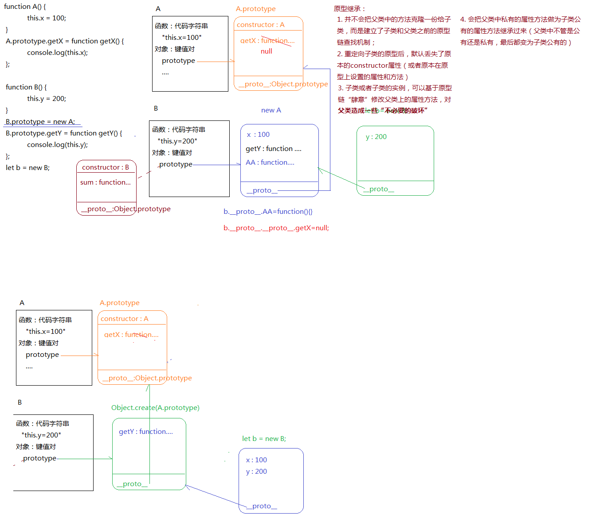

- [JS中的继承](#js中的继承)
  - [回顾OOP编程：](#回顾oop编程)
  - [继承](#继承)
    - [原型继承](#原型继承)
    - [call继承(构造函数继承)](#call继承构造函数继承)
    - [寄生组合继承](#寄生组合继承)
    - [class继承](#class继承)
  - [真实项目中继承的应用场景](#真实项目中继承的应用场景)


## JS中的继承

> 这里详细分析，项目中经常用的4种继承方式
> - 原型继承
> - call继承(构造函数继承)
> - 寄生组合继承
> - class实现继承
> - 应用场景：封装插件或者类库(或者REACT中)


### 回顾OOP编程：
- 对象
- 类
  - 特征：
    - 封装：
    - 继承：
    - 多态：重载和重写
      - JAVA中重载：函数名相同，但是传参类型、数量不同或者返回值不一样，这相当与把一个函数重载了。JS中没有类似于后台语言中的重载机制：JS中的重载指的是同一个方法，根据传参不同，实现不同的业务逻辑。
      - 重写：子类重写父类上的方法
- 实例

JAVA中的重载：
```javascript
public String fn(int n, int m) {
    // ...
}

public String fn(int n) {
    // ...
}

public String fn(int n, double m) {
    // ...
}

fn(10, 20)   // 调用第一个函数
fn(10)  // 调用第二个函数
fn(10, 20.01)  // 调用第三个函数
// 函数名相同但是不会覆盖
```

JS中没有重载:
```javascript
function fn(n, m) {
    // ...
}

function fn(n) {
    // ...
}

fn(10, 20)   // 调用的是第二个函数
fn(10)      // 调用的是第二个函数
```

JS模拟重载：
```javascript
function fn(n,m) {
    if(!m) {
        // ...
    }
}
fn(10,20)
fn(10)
```

### 继承

> 子类继承父类中的属性和方法
> - JAVA中的继承：子类继承父类会把父类中的东西拷贝一份到子类上，子类可以修改继承过来的这些东西，一个子类的修改不会影响另外的子类
> 
> - JS中的继承机制和其它后台语言是不一样的，有自己的独特处理方式


#### 原型继承

> 子类原型指向父类的一个实例

```javascript
// 父类
function A() {
    this.x = 100;
}

A.prototype.getX = function getX() {
    console.log(this.x);
};

// 子类
function B() {
    this.y = 200;
}

B.prototype = new A;   // 子类原型指向父类的一个实例
B.prototype.getY = function getY() {
    console.log(this.y);
};

let b = new B;

b.getX()    // 100  可以调用父类原型上的方法
console.log(b.constructor)  // A() {this.x = 100;}, B类的constructor丢失

b.__proto__.AA = function () {
    console.log('AAA')
}  // 会在父类的实例上增加一个方法

let bb = new B
bb.AA()  //AAA,  子类的其他实例上也可以调用这个增加的方法

b.__proto__.__proto__.getX = null  // 将父类原型上的方法置为null

let a = new A
a.getX()  // Uncaught TypeError: aaa.getX is not a function  父类上的其他实例无法正常调用getX方法了
```

- 原型继承的特点：
  - 并不会把父类中的方法克隆一份给子类，而是建立了子类和父类之间的原型链查找机制
  - 重定向子类的原型后，默认丢失了原本的constructor属性(或者原本在原型上设置的属性和方法)
  - 子类或者子类的实例，可以基于原型链"肆意"修改父类上的属性和方法，会对父类造成一些破坏
  - 会把父类中私有的属性和方法(this.xxx)作为子类公有的属性方法继承过来(父类中不管是公有还是私有，最后都变为子类公有的)

注：左下角的图是寄生组合式继承。

#### call继承(构造函数继承)

> 把父类当作普通函数执行，让其执行的时候，方法中的this变为子类的实例
> - 特点：
>   - 只能继承父类中的私有属性(继承的私有属性赋值给子类实例的私有属性)，而且是类似拷贝过来一份，而不是链式查找
>   - 因为只是把父类当做普通的方法执行，所以父类原型上的公有属性方法无法被继承过来

```javascript
function A() {
    this.x = 100;
}

A.prototype.getX = function getX() {
    console.log(this.x);
};


function B() {
    //CALL继承
    A.call(this);  //=>this.x = 100;  b.x=100;
    this.y = 200;
}
B.prototype.getY = function getY() {
    console.log(this.y);
};

let b = new B;
console.log(b);
```

#### 寄生组合继承

> CALL继承+变异版的原型继承共同完成的
> - CALL继承实现：私有到私有
> - 原型继承实现：公有到公有

```javascript
function A() {
    this.x = 100;
}
A.prototype.getX = function getX() {
    console.log(this.x);
};

function B() {
    A.call(this);
    this.y = 200;
}

//=>Object.create(OBJ) 创建一个空对象，让其__proto__指向OBJ（把OBJ作为空对象的原型）
B.prototype = Object.create(A.prototype);    // new 与 Object.create的区别
B.prototype.constructor = B;
B.prototype.getY = function getY() {
    console.log(this.y);
};
let b = new B;
console.log(b);
```

#### class继承

```javascript
class A {
    constructor() {
        this.x = 100;
    }

    //=>这样和构造函数中的this.xxx=xxx没啥区别，设置的是私有属性（ES7）
    // num = 100;

    //=>设置到A.prototype上的方法
    getX() {
        console.log(this.x);
    }

    //=>把A当做普通对象设置的属性和方法
    // static n = 200;
    // static getN() {}
}

//=>extends继承和寄生组合继承基本类似
class B extends A {
    constructor() {
        super(100); //=>使用extends实现继承，只要自己写了constructor，就必须写super  <=> A.call(this,100)
        this.y = 200;
    }
    getY() {
        console.log(this.y);
    }
}

let b = new B;
```

### 真实项目中继承的应用场景

- React创建类组件

```javascript
class Vote extents React.Component{
    // ... 
}
```

- 自己写插件或者类库的时候

```javascript
class Utils{
    // 项目中公共的属性和方法
}

class Dialog extends Utils{
    // ...
}
```


