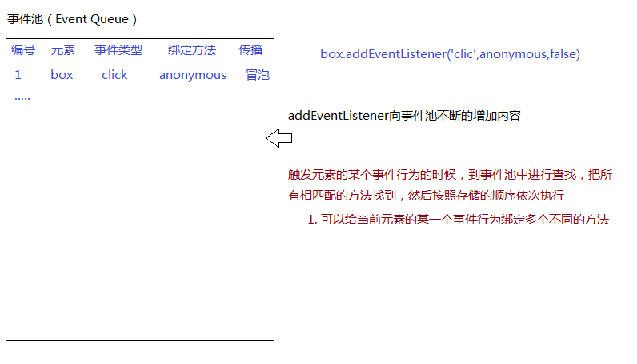
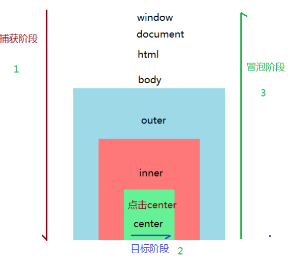
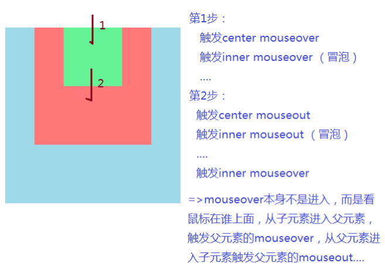
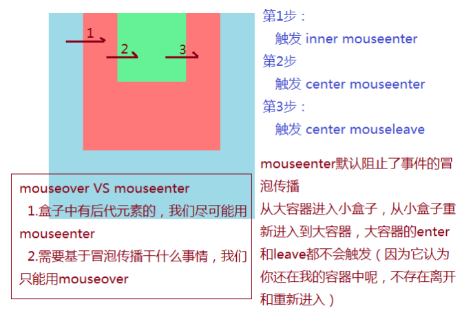

- [事件机制](#事件机制)
  - [DOM事件的基础知识](#dom事件的基础知识)
  - [事件对象](#事件对象)
  - [阻止事件的默认行为](#阻止事件的默认行为)
  - [事件的传播机制](#事件的传播机制)
  - [`mouseenter` VS `mouseover`](#mouseenter-vs-mouseover)

## 事件机制

### DOM事件的基础知识

- 事件：浏览器赋予元素天生默认的一些行为，不论是否绑定相关的方法，只要行为操作进行了，那么一定会触发相关的事件行为
- 事件绑定：给元素的某一个事件行为绑定方法，目的是行为触发后可以做点自己想做的事情
- DOM0事件绑定/DOM2事件绑定
  - DOM0事件绑定
    - 格式：
      - `元素.onxxx=function(){}`
      - `元素.onxxx=null;`
    - 原理：给DOM元素对象的某一个私有事件属性赋值函数值，当用户触发这个事件行为，JS引擎会帮助我们把之前绑定的方法执行
      - 不是所有的事件类型都支持这种方式，元素有哪些`onxxx`事件属性，才能给其绑定方法(例如：DOMContentLoaded事件就不支持这种绑定方案)
      - 只能给当前元素的某一个事件行为绑定一个方法(绑定多个也只能识别最后一个)
  - DOM2事件绑定
    - 格式：
      - `元素.addEventListener([事件类型],[方法],[传播模式])`
      - `元素.removeEventListener([事件类型],[方法],[传播模式])`
    ```javascript
    function anonymous () {
        console.log('ok')
    }

    box.addEventListener('click',anonymous,false)
    box.removeEventListener('click',anonymous,false)
    ```
    - 原理：基于原型链查找机制，找到EventTarget.prototype上的addEventListener方法执行，它是基于浏览器事件池机制完成事件绑定的
  

- 事件对象：当前元素的某个事件行为被触发，不仅会把绑定的方法执行，还会给绑定的方法传递一个实参，这个实参就是事件对象；事件对象就是用来存储当前行为操作相关信息的对象;(MosueEvent/KeyboardEvent/Event/TouchEvent...), 注意：事件对象和在哪个方法中拿到的没关系，它记录的是当前操作的信息
- 浏览器自带的事件
  - 鼠标事件
  - 键盘事件
  - 表单元素常用事件
  - 移动端手指事件
  - 音视频常用事件
  - https://developer.mozilla.org/zh-CN/docs/Web/Events


### 事件对象

- 事件对象：给元素的事件行为绑定方法，当事件行为触发方法会被执行，不仅被执行，而且还会把当前操作的相关信息传递给这个函数， 这个存储相关信息的参数就是事件对象
  
  ```javascript
  box.onclick = function (ev) {
      console.log(ev)
  }
  ```
  - 如果是鼠标操作，获取的是MouseEvent类的实例 => `鼠标事件对象->MouseEvent.prototype -> UIEvent.prototype -> Event.prototype -> Object.prototype`;

    - 鼠标对象中的属性：
      - `clientX / clientY` ：当前鼠标触发点距离当前窗口左上角的X/Y轴坐标
      - `pageX / pageY`: 触发点距离当前页面左上角的X/Y轴坐标(有滚动条的时候就会有区别了，可以打印看一下)

    

    `ev.pageY = ev.clientY + document.documentElement.scrollTop`

    注：水平方向上如果有滚动条的话也是一样的，只是把Y换成X。
      - `type`: 触发事件的类型
      - `target`: 事件源(操作的是哪个元素，哪个元素就是事件源)，在不兼容的跨浏览器中可以使用`srcElement`获取。
      - `preventDefault()`：用来阻止默认行为的方法，不兼容的浏览器中用`ev.returnValue = false`
      - `stopPropagation()`：阻止冒泡传播，不兼容的浏览器中用`ev.cancelBubble = true`

  - 如果是键盘操作，获取的是KeyboardEvent类的实例 => 键盘事件对象

  - 除了以上，还有普通事件对象(Event)、手指事件对象(TouchEvent)等


- 事件对象中常用的属性
  - `target & srcElement`
  - `type`
  - `code & key`
  - `keyCode & which`
  - `which / keyCode`
  - `clientX / clientY`
  - `pageX / ev.pageY`
  - `preventDefault`
  - `stopPropagation`

- 事件对象和函数以及给谁绑定的事件没啥必然关系，它存储的是当前本次操作的相关信息，操作一次只能有一份信息，所以在哪个方法中获取的信息都是一样的；第二次操作，存储的信息会把上一操作存储的信息替换掉
  - 每一次事件触发，浏览器都会进行如下处理
    - 捕获到当前操作的行为，把操作信息(事件对象)获取到，通过创建MouseEvent的类实例，得到事件对象EV
    - 通知所有绑定的方法(符合执行条件的)开始执行，并且把EV当作实参传递给每个方法，所以在每个方法中得到的事件对象其实是一个
    - 后面再重新触发这个事件行为，会重新获取本次操作的信息，用新的信息替换旧的信息，然后继续之前的步骤

```javascript
let obj = null

box.onclick = function (ev) {
    console.log(ev)
    obj = ev
}

box.onclick = function (ev) {
    console.log(ev)
    console.log(ev === obj)  // true
}

document.body.onclick = function (ev) {
    console.log(ev) 
    console.log(ev === obj) // true
}

// 控制台会输出3次事件对象，但是这三个事件对象的值是一样的
```

### 阻止事件的默认行为

1. a标签的默认行为：1. 点击会有默认的页面跳转； 2. 锚点定位

```html
<a href="https://study.163.com/#auto-id-1601204969366" target="_blank">百度</a>
```

阻止a标签的默认跳转行为：
- `href = "javascript:;"`
- 点击a标签，先触发click行为，然后再去执行href的跳转
  ```javascript
  // a标签的id为link
  link.onclick = function (ev) {
    // 返回一个false，相当于结束后面即将执行的步骤
    return false
  }
  ```
  ```javascript
  link.onclick = function (ev) {
    ev.preventDefault()  // 阻止默认行为
  }
  ```

2. 右键单击出现默认列表
 
案例: 打开一个html页面，右键单击会出现一个默认的列表选项，现在的需求是，在页面上点击鼠标右键时，阻止默认的列表出现，出现的是自己自定义的一个列表。

```html
<style>
    * {
        margin: 0;
        padding: 0; 
    }

    .context {
        position: fixed;
        top: 0;
        left: 0;
        width: 100px;
        box-sizing: border-box;
        padding: 0 5px;
        border: 1px solid lightcoral;
        display: none;
    }

    .context li {
        list-style-type: none;
        line-height: 35px;
        border-bottom: 1px dashed khaki;
    }

    .context li:nth-last-child(1) {
        border-bottom: none;
    }

</style>

<ul class="context">
    <li>第一行</li>
    <li>第二行</li>
</ul>

<script>
    window.addEventListener('contextmenu', function (ev) { 
        let context = document.querySelector('.context') 
        ev.preventDefault()
        context.style.display = 'block'
        context.style.top = ev.clientY + 'px'
        context.style.left = ev.clientX + 'px'
    })

</script>
```

3. 文本输入框

文本输入框的默认行为：按下键盘键，能够往输入框中输入内容。

向输入框中输入内容，只允许输入数字和大写的X，其他的字母或者特殊符号都不允许输入，超过18位，禁止输入，但是可以删除，回退，左右移动。最后按enter键，将输入在文本框中的内容弹出。

```html
<input type="text" id="cardInp">
```

```javascript

cardInp.onkeydown = cardInp.onkeyup = function (ev) {
    // 键盘事件对象
    // code & key： 存储的都是按键， code更细致
    // keyCode & which: 存储的是键盘按键对应的码值
        // 方向键： 37 38 39 40 => 左 上 右 下
        // 空格：32    回车：13     回退：8   删除：46  shift：16  ctrl：17  alt：18 

    let val = this.value,
        reg = /[^0-9X]/g;
    this.value = val.replace(reg, '');
    if(this.value.length >= 18) {
        let arr = [8, 13, 37, 38, 39, 40, 46];
        if(!arr.includes(ev.keyCode)) {
            ev.preventDefault();
        }
    }

    if(ev.keyCode === 13) {
        alert(this.value);
    }
}
```

### 事件的传播机制

- 捕获阶段：浏览器会从外到内一直往里面找，一直找到这个事件源(target)，目的是为冒泡阶段事件计算好传播的层级路径
- 目标阶段：当前元素的相关事件行为触发
- 冒泡传播：触发当前元素的某一个事件行为，不仅它的这个行为触发，而且它所有的祖先元素(一直到window)相当于事件行为都会被依次触发(从内到外)
  
- 事件传播机制的顺序是：捕获阶段、目标阶段、冒泡阶段
- 如何查看或者验证这个顺序呢？事件对象的原型上`Event.prototype`中有几个属性：
  - `CAPTURING_PHASE`: 1
  - `AT_TARGET`: 2
  - `BUBBLING_PHASE`: 3



注：在事件对象中的path属性中也能够看到上述路径

```html
<style>
html,
body {
  height: 100%;
}

#outer {
  margin: 20px auto;
  width: 300px;
  height: 300px;
  background: lightblue;
}

#inner {
  margin: 20px auto;
  width: 200px;
  height: 200px;
  background: lightcoral;
}

#center {
  margin: 20px auto;
  width: 100px;
  height: 100px;
  background: lightgreen;
}
</style>

<div id="outer">
  <div id="inner">
    <div id="center"></div>
  </div>
</div>
```

```javascript
document.body.onclick = function (ev) {
  console.log('BODY', ev);
}

// 在body上绑定点击事件，点击页面上的三个盒子时会触发body上绑定的这个点击事件
```

```javascript
document.body.onclick = function (ev) {
  console.log('BODY', ev);
}

outer.onclick = function (ev) {
  console.log('OUTER', ev);
}

// 点击3个盒子都会触发outer和body
// 点击盒子之外的区域时只触发body
```

```javascript
document.body.onclick = function (ev) {
  console.log('BODY', ev);
}

outer.onclick = function (ev) {
  console.log('OUTER', ev);
}

inner.onclick = function (ev) {
  console.log('INNER', ev);
}

center.onclick = function (ev) {
  console.log('CENTER', ev);
} 

// 点击center时，四个事件都会触发；点击inner时，inner、outer、body会触发，center不会触发
```

需求: 想要设置点击center的时候，只有center触发，其他的都不会触发

```javascript
center.onclick = function (ev) {
  console.log('CENTER', ev);
  ev.stopPropagation();   // 阻止冒泡传播
}
```

上述事件绑定都是使用的DOM0级事件绑定，只能在目标阶段和冒泡阶段触发执行；DOM2级事件绑定的方式，可以在捕获阶段执行。

```javascript
outer.addEventListener('click', function () {

}, false)   // 第三个参数如果是false，表示在冒泡阶段执行此方法，默认是false

// 如果第三个参数是true，表示在捕获阶段执行此方法，真实项目中一般不会设置第三个参数为true
```

比如:
```javascript
outer.addEventListener('click', function (ev) {
	console.log('OUTER', ev);
}, true);

inner.addEventListener('click', function (ev) {
	console.log('INNER', ev);
}, false);

center.onclick = function (ev) {
  console.log('CENTER', ev);
  ev.stopPropagation();
} 

// 点击center的盒子，执行顺序： outer、center、inner
```

### `mouseenter` VS `mouseover`

- `mouseover/mouseout`：存在冒泡机制，并且不能理解为进入和离开，而是鼠标焦点在谁上或者离开谁
  - 导致问题：从小盒子到大盒子，触发小盒子out，也会触发大盒子over，从大盒子进入小盒子，触发大盒子的out，触发小盒子的over
- `mouseenter/`

```javascript
// 还是上面的三个盒子
center.onmouseover = function () {
  console.log('center over');
};

center.onmouseout = function () {
  console.log('center out');
};

inner.onmouseover = function () {
  console.log('inner over');
};

inner.onmouseout = function () {
  console.log('inner out');
};
```


```javascript
inner.onmouseenter = function () {
	console.log('INNER ENTER');
};

outer.onmouseenter = function () {
	console.log('OUTER ENTER');
};

inner.onmouseleave = function () {
	console.log('INNER LEAVE');
};

outer.onmouseleave = function () {
	console.log('OUTER LEAVE');
};
```


- `mouseover`VS`mouseenter`
  - 盒子中有后代元素的，尽可能用mouseenter
  - 需要基于冒泡传播干什么事情的话，只能用mouseover