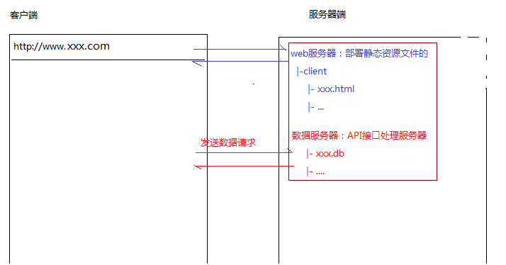
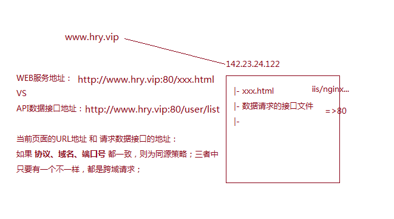
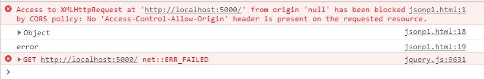
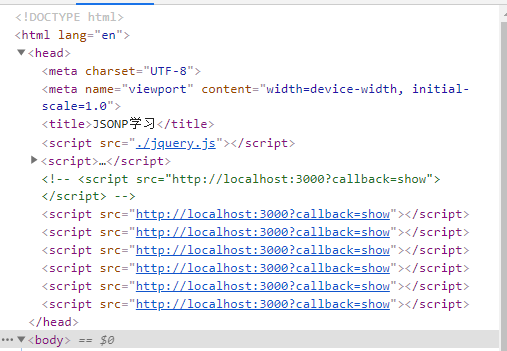
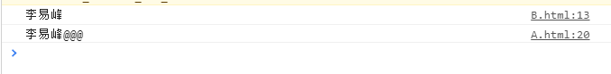

- [跨域](#跨域)
  - [同源策略](#同源策略)
- [前端跨域通信的方式](#前端跨域通信的方式)
  - [JSONP](#jsonp)
  - [CORS跨域资源共享](#cors跨域资源共享)
  - [http proxy](#http-proxy)
  - [Nginx反向代理](#nginx反向代理)
  - [postMessage](#postmessage)
  - [socket.io WebSocet协议跨域](#socketio-websocet协议跨域)
  - [`document.domain + iframe`实现跨域](#documentdomain--iframe实现跨域)
  - [`window.name + iframe`](#windowname--iframe)
  - [`location.hash + iframe`](#locationhash--iframe)


## 跨域

### 同源策略


- 在项目部署的时候，如果把web服务/数据服务，部署到同一台机器的同一个端口下，则属于同源策略
- 没有部署到形同的服务器，或者部署到相同的服务器下但是不是相同的端口都属于非同源策略，即跨域请求


假设只有一台服务器，外网地址是`142.23.24.122`，购买一个叫做`www.hry.vip`的域名，首先需要做一个DNS解析，即与外网IP关联在一起。将项目资源和后台数据请求的接口文件放在同一台服务器的80端口下，如图：


如果当前页面的URL地址与请求数据接口的地址**协议**，**域名**，**端口号**三者都一致，则为同源策略，三者中只要有一个不一致就是跨域请求。

- 真实项目中，跨域的情况要比同源更多一些：
  - 现在的项目一般都是前后端分离的，所以项目部署的时候一般也是分开部署的(不排除后期部署在一起),有些公司需要web服务器由前端开发部署(linux + nginx...)
  - 为了保证服务器资源的合理利用，一般把服务器分成几类(一个项目访问的资源是分门别类的在不同的服务器上的)
    - web服务器(页面/CSS/JS等资源)
    - 图片服务器
    - 音视频服务器
    - 数据服务器
    - ...
  - 一个项目太大，分散成为多个子项目(基于二级域名分别部署)，但是所有的子项目之间的数据需要互相访问(内部联调)，此时也是以跨域为主：
    - 举例：腾讯体育部门：`sports.qq.com/kbs/game.html`，里面需要视频直播，就需要调用视频部门的数据`v.qq.com/api/xxx`
## 前端跨域通信的方式

- 跨域请求的处理方案
  - 很早有这样一种方案（开发环境下）：
      =>项目部署的时候肯定会在一起（项目一旦部署不存在跨域访问），但是在开发的时候，开发者需要让本地的项目也能访问到正常的数据接口
      
      1）最开始需要前端开发把后台代码也在本地部署起来，和本地的WEB部署在一起，在本地也产生同源的环境 =>BUG：需要前端随时同步后台的代码到本地，而且本地也要安装一些后台环境
      
      2）本地无需拿后台代码等，本地启动一个WEB服务，通过修改本地的HOST文件，模拟出和数据服务器相同的环境  `xamp/wamp` 
  - 需要跨域才能完成一些需求，就需要跨域解决方案：
    - JSONP
    - 其它一些方案（IFRAME）
      + `window.name`  
      + `window.location.hash`(少)
      + `document.domain` 处理主域相同，子域不同的相互请求(少)
      + `postMessage`
    - CORS 跨域资源共享(多)
    
        原理：让服务器端允许客户端跨域AJAX请求（基本上靠服务端设置允许跨域，客户端无需做太多的修改，直接正常发送AJAX请求即可）

    - webpack的崛起，带动了`http proxy`方案的兴起(多)
         
      原理：利用webpack-dev-server插件，构建本地服务AA（预览本地开发的项目），发送AJAX请求，都先把请求发送给AA，由AA帮我们发送给真正的服务器，AA起了一个中间代理的作用，从而解决跨域的问题！

      但是上述操作是基于AA这个服务的（webpack-dev-server），项目最后部署的时候，没有webpack-dev-server插件，此时我们需要基于其它方案（例如：nginx反向代理）实现出当初AA服务代理的作用才可以！
    - nginx反向代理
    - webScoket

### JSONP

> script、img、link、iframe不受同源限制
- JSONP: JSON with Padding， 填充JSON
- 案例引入：
  - 服务端存储天气数据："南京 晴 18~25"
  - 客户端：ajax调用服务端的天气数据，成功拿到数据后以弹窗的形式显示出来
  - 代码实现：
  - 服务端程序：
    ```javascript
    // 服务器程序：server.js
    const http = require('http')
    // 创建服务端程序实例
    http.createServer((req, res) => {
        // 每当有客户端发来请求时，自动调用一下回调函数
        var weather = "南京 晴 18~25"
        res.writeHead(200, {
            "Content-Type": "text/plain; charset=utf-8"
        })
        res.write(weather)
        res.end()
    }).listen(3000)

    // 在终端启动写好的服务器程序：node server.js 
    // 测试服务器是否正常
    // 浏览器地址栏输入http://localhost:3000
    ```
  - 客户端：
    ```html
    <!DOCTYPE html>
    <html lang="en">
    <head>
        <meta charset="UTF-8">
        <meta name="viewport" content="width=device-width, initial-scale=1.0">
        <title>JSONP学习</title>
        <script src="./jquery.js"></script>
        <script>
            $(function(){
                $("#btn").click(function(){
                    $.ajax({
                        type:'get',
                        url:'http://localhost:3000',
                        success:function(data){
                            alert(data)
                        },
                        error:function(data){
                            console.dir(data);
                            console.log('error');
                        }
                    });
                });
            });
        </script>
    </head>
    <body>
        <input type="button" value="点击" id="btn">
    </body>
    </html>
    ```
页面上点击按钮时就会向我们写好的服务器程序发起请求，我们知道ajax是不支持跨域请求的，得到的结果是：


- 如何解决ajax跨域问题？
  - 可以实现跨域请求的标签有哪些？
    - ``：可以成功显示请求的图片，说明不受同源策略的限制
    - `<link href="theme.css">`：可成功请求其它网站的css资源，不受同源策略的限制
    - `<script src="http://localhost:3000"></script>`: 测试发现，同样是向我们刚才写好的服务器程序请求数据，能够请求成功，说明script标签本身不受同源策略的限制,但是需要注意的是，服务端返回的应该是js语句，如果还是以之前字符串的形式返回会报语法错误。原因是，从服务端请求到的内容会被js引擎当作js语句执行，js引擎不能直接解析字符串。

- 原理：script标签的src属性不受同源策略的限制，可以跨域访问js脚本，利用这个特性，服务端不再返回JSON格式的数据，而是返回一段调用某个函数的js代码。具体来说就是客户端利用script标签可以跨域请求资源的性质，向网页中动态插入script标签，来向服务端请求数据；服务端会解析请求的url，至少从请求参数中拿到一个回调函数(cb=myCallback)参数，将数据当作函数参数放入其中，返回给客户端；jsonp仅支持get类型的方式。

接下来，慢慢解释下为什么叫JSONP？回调函数的函数名如何在客户端与服务端保持一致？为什么需要动态插入script标签？等等一系列对于看到上述原理产生的疑问。

首先，上面提到，如何服务端直接返回给客户端一个字符串会报语法错误，也就是说script发起请求之后客户端想要的一段可执行的js代码，而不是字符串, 所以可以将想在客户端执行的代码在服务端拼接好之后再返回回来就可以执行了。


修改下客户端请求数据的方式：
```html
<!DOCTYPE html>
<html lang="en">
<head>
    <meta charset="UTF-8">
    <meta name="viewport" content="width=device-width, initial-scale=1.0">
    <title>JSONP学习</title>
    <script src="./jquery.js"></script>
    <script src="http://localhost:3000"></script>
</head>
<body>
    
</body>
</html>
```

修改下服务端的返回：
```javascript

const http = require('http')
http.createServer((req, res) => {
    var weather = "南京 晴 18~25"
    res.writeHead(200, {
        "Content-Type": "text/plain; charset=utf-8"
    })
    // 想在客户端执行：document.write("天气")
    res.write(`document.write("${weather}")`)   // 修改
    res.end()
}).listen(3000)
```

上述代码可以看到，将原来的直接将weather字符串变量传给客户端变成了这样的一个模板字符串的形式，weather字符串变量放在了`${}`中，实际上,传给客户端的就是`document.write("南京 晴 18~25")`。注意，修改服务器程序之后记得重启一下。现在来测试一下服务器，会发现拿到的就是`document.write("南京 晴 18~25")`这条js语句，这条语句放在控制台里面是可以执行的，客户端的script拿到之后也能执行。

现在重新刷新页面,`南京 晴 18~25`就会显示在页面上了，客户端拿到的是`document.write("南京 晴 18~25")`代码，script一执行就会显示在页面上了。

使用script将最简单的跨域请求实现了，那为什么叫JSONP呢？应该能感知到了，JSON填充，就是发生在服务端返回给客户端内容的时候，将客户端请求的天气数据weather填充到一条合法的js语句中进而返回一条js语句到客户端被script自动执行，就是通过这种方式实现跨域请求的。

但是，会发现，现在的这种实现方案是把代码直接在服务端写死了，有的需要在客户端直接显示在页面上，有的想要弹窗的形式显示出来，显然不够灵活。

_**改进1:**_ 在客户端定义一个函数，利用这个函数来指定拿到数据后的操作，比如显示在页面上或者做其它的事情都可以在这个函数中自己定义。

一般我们调用一个函数是这样子做的：
```javascript
function show(weather) {
    document.write(weather)
    // alert(weather)
    // console.log(weather)
}
show("来自我自己的天气预报数据")
```
直接调用执行，肯定没问题。所以现在就明确了，我想要从服务端请求的数据是weather，拿到数据之后想要通过show函数来控制这个数据的操作，在服务端把数据weather填充到`show()`函数当中返回给客户端这样一条函数调用的js语句就可以了。

修改一下服务器返回：
```javascript
res.write(`show("${weather}")`)
```
重启测试，没有问题，依然能够请求成功，随意修改show函数里面的代码都可以完成相应的操作。需要注意的是：客户端与服务端的函数名要保持一致，返回到客户端才能正常执行。

上述方案也存在问题：服务端返回的调用函数名还是写死的，不够灵活。

_**改进2：**_通过请求参数传递给服务端调用函数名，这样就可以由客户端来决定调用函数名称了。

客户端：
```html
<!DOCTYPE html>
<html lang="en">
<head>
    <meta charset="UTF-8">
    <meta name="viewport" content="width=device-width, initial-scale=1.0">
    <title>JSONP学习</title>
    <script src="./jquery.js"></script>
    <script>
        function show(weather) {
            document.write(weather)
        }
    </script>
    <script src="http://localhost:3000?callback=show"></script>
</head>
<body>
</body>
</html>
```

服务端：
```javascript
const http = require('http')
const url = require('url')

http.createServer((req, res) => {
    var Url = url.parse(req.url, true)
    var callback = Url.query.callback  // 从请求参数中获取callback参数
    var weather = "南京 晴 18~25"
    res.writeHead(200, {
        "Content-Type": "text/plain; charset=utf-8"
    })
    res.write(`${callback}("${weather}")`)  // 将函数名变量拼接后返回给客户端
    res.end()
}).listen(3000)
```

上述改进方案还有一个缺点在于，script标签本身是写死的，页面加载时只能执行一次，如果有需要反复请求的场景就不能完成了。

_**改进3：**_动态生成script标签，按需发起请求

客户端：
```html
<!DOCTYPE html>
<html lang="en">
<head>
    <meta charset="UTF-8">
    <meta name="viewport" content="width=device-width, initial-scale=1.0">
    <title>JSONP学习</title>
    <script src="./jquery.js"></script>
    <script>
        function show(weather) {
            alert(weather)
        }
    </script>
    
</head>
<body>
    <button>天气预报</button>
    <script>
        $("button").click(function () {  
            // 点击按钮发送请求，显示天气
            var script = document.createElement('script')
            var url = "http://localhost:3000?callback=show"
            script.setAttribute('src', url)
            document.getElementsByTagName('head')[0].appendChild(script)
        })
    </script>
</body>
</html>
```
服务端：不需要修改

经过上述修改，每次点击页面上的按钮时都会向服务端发起一个数据请求，查看一下页面元素就是这样的：



实际上，这样的script作用就是向服务端请求数据的，发完这次数据请求之后就没有什么作用了，所以就可以考虑在调用完回调函数之后直接清楚，以保持页面整洁：
```html
<!DOCTYPE html>
<html lang="en">
<head>
    <meta charset="UTF-8">
    <meta name="viewport" content="width=device-width, initial-scale=1.0">
    <title>JSONP学习</title>
    <script src="./jquery.js"></script>
    <script>
        function show(weather) {
            alert(weather)
            // 调用函数结尾：删除用过的script元素
            $("head>script:last").remove()
        }
    </script>
    
</head>
<body>
    <button>天气预报</button>
    <script>
        $("button").click(function () {  
            // 点击按钮发送请求，显示天气
            var script = document.createElement('script')
            var url = "http://localhost:3000?callback=show"
            script.setAttribute('src', url)
            document.getElementsByTagName('head')[0].appendChild(script)
        })
    </script>
</body>
</html>
```

终极方案：jQuery实现了ajax通过jsonp跨域请求的封装，添加一个参数即可：

```html
<script>
    $("button").click(function(){
        $.ajax({
            type:'get',
            url:'http://localhost:3000',
            dataType: 'jsonp',
            success:function(data){
                alert(data)
            },
            error:function(data){
                console.dir(data);
                console.log('error');
            }
        });
    });
</script>
```

以上这个封装的实现原理也是动态创建`<script>`，借助`<script>`发送跨域请求，必须有服务器端的支持，服务端要接受请求参数中的callback参数才可以实现。

-总结：
  - 方案一：用`<script src="服务端接口地址"></script>`代替$.ajax发送请求。
    - 服务端：将要发送的数据填充到一条js语句中返回给客户端
    - 客户端：`<script src="服务端接口地址"></script>`,script发送请求到服务端并能够收到服务端返回的js语句，script只要收到js语句就会立刻自动执行
    - 存在问题：要在客户端执行的js语句，在服务端写死了，不灵活，众口难调
  - 方案二：提前在客户端定义一个函数，用于处理服务端返回的请求，服务端仅仅使用函数名拼接一条函数调用的js语句。
    - 客户端：`function show(data) { 任意js语句 }`
    - 服务端：`res.write(`show("${weather}")`)`, 函数名要保持一致
    - 存在问题：各个不同的客户端，函数名是根据自己的需要定义的，方案二中服务端返回的调用函数名还是写死的，不灵活
  - 方案三：用请求参数将函数名传递给服务器
    - 客户端：`<script src="http://localhost:3000?callback=show"></script>`
    - 服务端：接收客户端传来的名为callback的参数中保存的函数名，将callback函数名动态拼接到要返回的函数调用语句中
    - 存在问题：这种方案已经是比较灵活了，但是script在页面中是写死的，在页面加载中这个script只能执行一次，无法按需反复执行，比如每次点击按钮时，随时发送请求。
  - 方案四：每次点击按钮时动态创建script元素
    - 客户端：动态创建script元素追加在head尾部，回调函数调用完成之后删除，这样不会造成script元素的堆积
    - 服务端：不需要修改
    - 注意：请求参数callback是要提前商定好的，因为客户端要使用这个参数名将回调函数传递给服务端，服务端需要从url中使用这个请求参数名获取到回调函数名后拼接返回给客户端。
  - 方案5：jQuery实现了jsonp跨域方式的封装，直接在发送ajax请求的时候添加一个`dataType`属性即可实现跨域请求。

JSONP实现跨域存在问题：JSONP请求都是资源文件请求，只能支持GET请求

### CORS跨域资源共享

> 参看：www.ruanyifeng.com/blog/2016/04/cors.html

- 客户端：发送ajax/fetch请求

```javascript
axios.defaults.baseURL = 'http:127.0.0.1:8888'
axios.defaults.withCredentials = true
axios.defaults.headers['Content-Type'] = 'application/x-www-form-urlencoded'
axios.defaults.transformRequest = function (data) {
    if (!data) return data
    let result = ''
    for(let attr in data) {
        if(!data.hasOwnProperty(attr)) break
        result += `&${attr}=${data[attr]}`
    }
    return result.substring(1)
}
axios.interceptors.response.use(function onFulfilled(response) {
    return response.data
}, function onRejected(reason) {
    return Promise.reject(reason)
})
axios.defaults.validateStatus = function (status) {
    return /^(2|3)\d{2}$/.test(status)
}
```

- 服务端：设置相关头信息(需要处理options试探性请求)
  
```javascript
// 使用node，借助中间件配置, app是借助express框架创建的服务器应用程序
app.use((req, res, next) => {
    res.header("Access-Control-Allow-Origin", "http://localhost:8080")
    // res.header("Access-Control-Allow-Origin", *)
    res.header("Access-Control-Allow-Credentials", true)
    res.header("Access-Control-Allow-Headers", "Content-Type, Content-Length, Authorization, Accept-Methods", "PUT, POST, GET, DELETE, HEAD, OPTIONS")
    if(req.method === 'OPTIONS'){
        res.send('OK!')
        return 
    }
    next()
})
```
存在局限性：服务端设置源，可以设置为`*`(表示允许多源)，也可以设置为具体的地址，一旦设置为`*`就不能允许携带cookie了。

### http proxy

> 配合webpack和webpack-dev-server来设置的

webpack.config.js配置文件中，dev环境下配置proxy。

### Nginx反向代理

> 假设从`www.xxxx.con`向`www.xxxx.com`发请求

- 前端无需配置

- proxy服务器：
```javascript
server {
    listen      80;  
    server_name www.xxxx.com;   
    location / {
        proxy_pass www.xxxx.cn;   // 反向代理
        proxy_cookie_demo www.xxxx.cn www.xxxx.com;
        add_header Access-Control-Allow-Origin www.xxxx.cn;
        add_header Access-Control-Allow-Credentials true;
}
```
- proxy相当于node模拟了一个nginx服务请求，服务器请求服务器不存在跨域，proxy请求回来数据，解决跨域问题。

### postMessage

> 创建两个文件A.html和B.html, B是在服务器端的

```html
<!DOCTYPE html>
<html lang="en">
<head>
    <meta charset="UTF-8">
    <meta name="viewport" content="width=device-width, initial-scale=1.0">
    <title></title>
</head>
<body>
    <h1>A页面</h1>
    <iframe id="iframe" src="http://127.0.0.1:1002/B.html" frameborder="0" style="display: none;"></iframe>
    <script>
        // console.log(iframe.contentWindow)
        iframe.onload = function () {  
            // iframe.contentWindow 指的是B页面的window
            iframe.contentWindow.postMessage('李易峰', 'http://127.0.0.1:1002/')
        }

        // 反监听，监听B传递过来的信息
        window.onmessage = function (ev) {  
            console.log(ev.data)
            // ev.source 表示A窗口
        }
    </script>
</body>
</html>
```

```javascript
<!DOCTYPE html>
<html lang="en">
<head>
    <meta charset="UTF-8">
    <meta name="viewport" content="width=device-width, initial-scale=1.0">
    <title></title>
</head>
<body>
    <h1>B页面</h1>
    <script>
        // 监听A页面发送过来的数据
        window.onmessage = function (ev) {  
            // console.log(ev.data)
            // ev.source 表示A窗口
            // 将接收到的数据添加@@@后返回给A页面
            ev.source.postMessage(ev.data + '@@@', ev.origin)
        }
    </script>
</body>
</html>
```

创建服务器：
```javascript
// server1.js
let express = require("express");
let app = express();
app.listen(1001, (_) => {
  console.log("OK!");
});
app.use(express.static('./'))  // 表示设置为当前文件夹为服务器资源存放地址
```

```javascript
// server2.js
let express = require("express");
let app = express();
app.listen(1002, (_) => {
  console.log("OK!");
});
app.use(express.static('./'))
```

- 在控制台启动创建好的两个服务器
- 打开浏览器地址栏中输入:`http://localhost:1001/A.html`
- 回车之后，打开开发者工具，可以看到第一行是B页面接收到的A页面发送的数据，第二行是B页面返回来的数据

    

### socket.io WebSocet协议跨域

> 使用的是H5中提供的webSocket协议来完成的, 这是客户端与服务端进行实时通信的一个协议

- 前端处理：
```html
<script src="./socket.io.js"></script>
<script>
    let socket = io('http://127.0.0.1:3001')
    // 连接成功
    socket.on('connect', function () {
        // 监听服务端消息
        // 这个消息指的是，建立连接之后服务器实时推送的消息
        socket.on('message', function (msg) {
            console.log('data from server:' + msg)
        })
        // 监听服务端关闭
        socket.on('disconnect', function () {
            console.log('server socket has closed!')
        })
    })
    // 发送消息给服务端
    socket.send("李易峰")
</script>
```

- 服务端
```javascript
// 监听socket连接, server是服务器创建的服务
socket.listen(server).on('connection', function (client) {
    // 当与客户端连接成功，就会触发这个回调函数执行

    // 接收信息，监听客户端的信息msg
    client.on('message', function (msg) {
        // 拿到客户端的数据做一些处理之后，给客户端返回一些新的数据
        client.send(msg + '@@@')  
    })
    // 断开处理
    client.on('disconnect', function () {
        console.log('client socket has closed!')
    })
})
```

以上流程类似于postMessage的方式，A向B传递数据，B拿到数据做一些处理之后将数据传递给A。

### `document.domain + iframe`实现跨域

> 注意: 这种方式只能实现同一个主域，不同子域之间的通信
> 比如：可以从`v.qq.com`向`sports.qq.com`发起请求，因为它们都是属于`qq.com`这个域名下的

- 父页面A： `http://school.xxxx.cn/A.html`
```html
<iframe src="http://www.xxxx.cn/B.html"></iframe>
<script>
    // 设置主域 
    document.domain = 'xxxx.cn'
    var user = 'admin'
</script>
```

- 子页面B： `http://www.xxxx.cn/B.html`
```html
<script>
    // 设置主域 
    document.domain = 'xxxx.cn'
    alert(window.parent.user)
</script>
```

### `window.name + iframe`

> 需要三个页面：A.html、B.html、proxy.html
> 其中：
>   - A为：http://127.0.0.1:1001
>   - B为：http://127.0.0.1:1002
>   - proxy为：http://127.0.0.1:1001

- 页面A
```javascript
let proxy = function (url, callback) {
    let count = 0
    let iframe = document.createElement('iframe')
    iframe.src = url
    iframe.onload = function () {
        if(count === 0) {
            // 指向一个同源地址之后才能获取`iframe.contentWindow.name`中的值，只修改一次指向就可以
            iframe.contentWindow.location = 'http://127.0.0.1:1001/NAME/proxy.html'
            count++
            return
        }
        callback(iframe.contentWindow.name)
    }
    document.body.appendChild(iframe)
}

// 请求跨域B页面的数据
proxy('http://www.xxxx.cn/B.html', function (data) {
    console.log(data)
})
```

- B页面
```javascript
<script>
    // 服务器需要返回给A的信息都在window.name中存储
    window.name = '李易峰'
</script>
```


### `location.hash + iframe`

> 与上述方法类似，需要3个页面，A页面与B页面不同源，A页面与C页面同源

- 页面A
```html
<iframe id="iframe" src="http://127.0.0.1:1002/B.html" style="display:none;"></iframe>
<script>
    let iframe = document.getElementById('iframe')
    // 向B页面传递hash值
    iframe.onload = function () {
        iframe.src = 'http://127.0.0.1:1002/B.html#msg=xxxxxx'
    }

    // 开放给同域C.html的回调
    function func(res) {
        alert(res)
    }
</script>
```

- 页面B
```html
<!-- B页面访问1001端口下的C页面 -->
<iframe id="iframe" src="http://127.0.0.1:1001/C.html" style="display:none;"></iframe>
<script>
    let iframe = document.getElementById('iframe')
    // 监听A页面传递过来的hash值改变，再传递给C页面
    window.onhashchange = function () {
        iframe.src = "http://127.0.0.1/C.html" + location.hash
    }
</script>
```

- 页面C
```html
<script>
    // 监听B页面传递过来的hash值改变
    window.onhashchange = function () {
        再通过操作同域A的js回调，将结果传回
        window.parent.parent.func(location.hash)
    }
</script>
```
