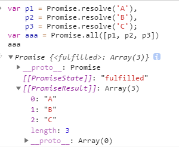

- [手写Promise.all()](#手写promiseall)
  - [总结Promise.all()的特点](#总结promiseall的特点)
  - [实现Promise.all()](#实现promiseall)
- [手写Promise.race()](#手写promiserace)
  - [总结Promise.race()的特点](#总结promiserace的特点)
  - [实现Promise.race()](#实现promiserace)
- [判断下述代码的输出顺序-事件循环](#判断下述代码的输出顺序-事件循环)

### 手写Promise.all()

#### 总结Promise.all()的特点

- `Promise.all()`的使用：Promise.all()可以将多个Promise实例包装成一个新的Promise实例。接收一个promise对象的数组作为参数，当数组中的所有promise对象全部变为resolve或者reject状态时才会去调用.then()。并且，这个数组中的promise对象是并发执行的。

```javascript
var p1 = Promise.resolve('A'),
    p2 = Promise.resolve('B'),
    p3 = Promise.resolve('C');
Promise.all([p1, p2, p3])
    .then((res) => {
        console.log(res) //  ["A", "B", "C"]
    }).catch((e) => {
        console.log(e)
    });
```
上述方法当中，数组[p1, p2, p3]中所有的promise实例都变为resolve时，调用.then()将所有结果传递到res数组中给出最终结果。

```javascript
var p1 = Promise.resolve('A'),
    p2 = Promise.reject('B'),
    p3 = Promise.resolve('C');
Promise.all([p1, p2, p3])
    .then((res) => {
        console.log(res) // 不会调用.then()中的回调
    }).catch((e) => {
        console.log(e) // p2为reject，遇到p2时执行catch，输出"B"
    });
```
上述方法中表示，promise数组中遇到了reject，这时，整个Promise.all调用会立即终止，并返回一个reject的新promise对象。

Promise.all()具有以下特点：
- 输入参数是一个promise实例组成的数组或者具有Iterator 接口的对象
- 如果输入的不是promise对象，会使用Promise.resolve()将其转换成promise对象
- 如果全部成功，则状态变为resolved，返回值将作为一个数组传给then的回调
- 只要有一个失败，状态就变为rejected，返回值将直接传递给catch的回调
- Promise.all()的返回值是一个新的promise对象

#### 实现Promise.all()

```javascript
function promiseAll(iterators) {
    return new Promise((resolve, reject) => {
        if (!Array.isArray(iterators)) {
            return reject(new TypeError('Arguments must be an Array'))
        }
        let count = 0
        let promisesLen = iterator.length
        let res = []
        for(let i in iterators) {
            Promise.resolve(iterators[i])
                .then((val) => {
                    count++
                    res[i] = val
                    if(count == promisesLen) {
                        return resolve(res)
                    }
                }, (err) => {
                    return reject(err)
                })
        }
    })
}
```



上图中的`[[PromiseResult]]`是什么？如果不传给then，怎么拿到`[[PromiseResult]]`的值？ --- 待探究

### 手写Promise.race()

#### 总结Promise.race()的特点

- 


#### 实现Promise.race()

### 判断下述代码的输出顺序-事件循环

```javascript
    console.log('1');
    async function fun1() {
        console.log('2');
        await fun2();
        console.log('3');
    }
    async function fun2() {
        console.log('4');
    }

    process.nextTick(function() {
        console.log('5');
    })

    setTimeout(function() {
        console.log('6');
        process.nextTick(function() {
            console.log('7');
        })
        new Promise(function(resolve) {
            console.log('8');
            resolve();
        }).then(function() {
            console.log('9')
        })
    })

    fun1();

    new Promise(function(resolve) {
        console.log('10');
        resolve();
    }).then(function() {
        console.log('11');
    });
    console.log('12');
```

解析：考察点是NodeJS中的事件循环(详细内容参考[详解JS中的EventLoop](https://zhuanlan.zhihu.com/p/33058983))
- 同步任务->本轮循环->次轮循环
  - `process.nextTick`的回调函数注册到nextTick queue中，
  - `fun1()`：调用函数fun1，输出：1、2
  - async/await函数中，await之前的语句是直接执行的，await语句是一个函数调用，立即执行输出4，await后面的语句就相当于微任务会被注册到微任务队列中
  - 继续执执行同步代码，输出10，遇到resolve将.then中的回调注册到微任务队列中，继续执行同步代码输出12
  - 同步代码执行完成之后，会执行nextTick queue里面的任务，所以接下来输出5
  - nextTick queue中的任务执行完之后再去执行microtask队列中的任务，所以输出3，11
  - 微任务队列执行完成，去执行宏任务队列，输出6之后将`process.nextTick`的回调注册到nextTick queue中，执行`new Promise`输出8，遇到resolve将`.then`中的回调注册到微任务队列中
  - 执行nextTick queue中的事件，输出7，执行微任务队列中的事件输出9
  - 所以最终的输出结果是：`1->2->4->10->12->5->3->11->6->8->7->9`

---

```javascript
console.log("script start");

setTimeout(() => {
    console.log("北歌");
}, 1 * 2000);

Promise.resolve()
    .then(function () {
        console.log("promise1");
    })
    .then(function () {
        console.log("promise2");
    });

async function foo() {
    await bar();
    console.log("async1 end");
}

foo();

async function errorFunc() {
    try {
        await Promise.reject("error!!!");
    } catch (e) {
        console.log(e);
    }

    console.log("async1");
    return Promise.resolve("async1 success");
}

errorFunc().then((res) => console.log(res));

function bar() {
    console.log("async2 end");
}

console.log("script end");
```

- 考察点：浏览器中的事件循环
  - 执行script中的代码输出: `script start` 
  - 接下来是setTimeout,其中的回调函数被注册到宏任务队列A中，即：`A = [() => {console.log("北歌")}]`
  - `Promise.resolve()`执行是已经知道这个promise对象是resolved状态，所以它的第一个.then的回调会被注册到微任务队列B中，即`B = [function () {console.log("promise1")}]`
  - 执行`foo()`, 在函数中遇到await，右边是一个函数的调用，`bar()`会调用，输出`async2 end`，await后面的语句会被添加到微任务队列中，此时`B = [function () {console.log("promise1")}, console.log("async1 end")]`
  - 执行`errorFunc()`, 遇到await，await右边是一个Promise实例，或者一个方法返回了Promise实例时，await会等着Promise的实例resolve，并且在实例resolve之前，await后面的代码不执行；并且还会拿到Promise在resolve时传入的值，并且赋值给等号左侧变量，在这里，await右边是一个promise对象实例，并且知道它的状态是rejected的，catch当中的回调就会被添加到微任务队列中，此时`B = [function () {console.log("promise1")}, console.log("async1 end"), console.log("error!!!")]`, await后面的代码也都不会执行，添加到微任务队列中，`B = [function () {console.log("promise1")}, console.log("async1 end"), console.log("error!!!"), console.log("async1"), Promise.resolve("async1 success")]`，`errorFunc()`执行返回的是一个promise实例，因为`Promise.resolve("async1 success")`被添加到微任务队列中等待，还没有执行，所以现在并不知道这个promise的状态，它后面的.then回调也就不会被注册进微任务队列，等到获取到它的promise状态时就会将这个回调函数注册到微任务队列中
  - 继续执行同步代码，输出: `script end`
  - 同步代码执行完成，现在开始执行微任务队列中的回调，首先是`function () {console.log("promise1")}`,输出promise1，这个回调函数执行完之后，它返回的promise对象的状态变为resolved，第二个.then里面的回调函数被注册到微任务队列中，此时，`B = [console.log("async1 end"), console.log("error!!!"), console.log("async1"), Promise.resolve("async1 success"), console.log("promise2")]`
  - 接着依次执行`console.log("async1 end")、console.log("error!!!")、console.log("async1")`
  - 接下来执行`Promise.resolve("async1 success")`，这个时候我们就拿到了执行`errorFunc()`返回的promise的状态resolved，将.then中的回调函数注册到微任务队列中，此时，`B = [console.log("promise2"), ("async1 success") => console.log("async1 success")]`
  - 继续执行微任务队列中的回调函数，依次输出: promise2、async1 success
  - 到这里，微任务队列就全部执行完了，开始执行宏任务队列中

---

改进版：
```javascript
console.log("script start");

setTimeout(() => {
    console.log("北歌2");
}, 2 * 2000);

setTimeout(() => {
    console.log("北歌1");
}, 1 * 2000);

Promise.resolve()
    .then(function () {
        console.log("promise1");
    })
    .then(function () {
        console.log("promise2");
    });

async function foo() {
    await bar();
    for (var i = 0; i < 5000; i++) {
        var a = 5+5+5+5
        console.log(i)
    }
    console.log(i)
    console.log('=========')
    console.log("async1 end");
}

foo();

async function errorFunc() {
    try {
        await Promise.reject("error!!!");
    } catch (e) {
        console.log(e);
    }

    console.log("async1");
    return Promise.resolve("async1 success");
}

errorFunc().then((res) => console.log(res));

function bar() {
    console.log("async2 end");
}

console.log("script end");
```

注意：该题目与输出结果可以放在浏览器控制台跑一下看看，这里需要注意的一点就是使用setTimeout设置的回调函数是会被加入到延迟队列中的，会计算到期时间，到期的任务先执行(参考进阶篇，使用setTimeout有没有遇到过什么坑)，在执行过程中会有一个占用时间比较长的for循环任务，这个任务的执行时间比较长，大于第二个定时器设置的时间，要等到任务执行完再去执行定时器设置的这个回调函数，看到的效果就是`北歌1`是输出`async1 success`之后立即输出的。