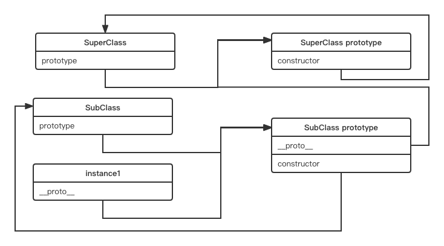

1. 注意版本：

```javascript
"html-webpack-plugin": "^5.5.0",
"webpack": "^5.71.0",
"webpack-cli": "^4.9.2",
"webpack-dev-server": "^4.8.0"
```
node 版本： 14.18.1

2. 注意webpack配置文件中写法
  
```javascript
devServer: {
  static: {   // 对应 contentBase
    directory: path.join(__dirname, './release')
  },
  open: true,
  port: 8000
},
```

3. babel版本问题：

```javascript
"@babel/core": "^7.17.8",
"@babel/plugin-transform-runtime": "^7.17.0",
"@babel/polyfill": "^7.12.1",
"@babel/preset-env": "^7.16.11",
"babel-loader": "^8.2.4",
```

babel配置：
```javascript
{
  "presets": [
    ["@babel/preset-env", {
      "useBuiltIns": "usage", // 在每个文件中使用polyfill时，为polyfill添加特定导入。利用捆绑器只加载一次相同的polyfill
      "modules": false, // 启用将ES6模块语法转换为其他模块类型，设置为false不会转换模块
      "targets": {
        "browsers": "last 2 versions, not ie <= 9"
      }
    }]
  ]
}
```

## 面向对象
### 封装
> 数据的权限和保密

JS中没有class，类就是一个函数：
```javascript
var Book = function (id, bookname, price) {
  this.id = id
  this.bookname = bookname
  this.price = price
}

Book.prototype.display = function () {
  // 显示这本书的信息
}
// 或者
Book.prototype = {
  display: function () {
    // 展示这本书的信息
  }
}

// 通过 new 实例化创建对象
var book = new Book(10, 'JavaScript设计模式', 50)
console.log(book.bookname)
```

this添加的属性和方法是实例对象自身拥有的，每次通过new创建实例的是后都会创建，但通过prototype添加的属性和方法在new创建实例对象的时候是不会重复创建的，需要访问prototype上的属性和方法就要沿着原型链一级一级的查找，prototype上的方法是共用的。

基本概念：
- 私有属性：构造函数内部创建的属性
- 私有方法：构造函数内部创建的方法
- 特权方法：通过this创建的方法，可以访问到类实例对象自身的私有属性和私有方法
- 对象公有属性：通过this创建的属性，在类创建对象时，每个对象自身都拥有一份并且可以在外部访问
- 对象公有方法：this上的方法
- 构造器：创建对象时调用的特权方法
- 类静态公有属性：对象不能访问
- 类静态公有方法：对象不能访问
- 公有属性：类的prototype上的属性
- 公有方法：类的prototype上的方法  

比如：
```javascript
var Book = function (id, name, price) {
  // 私有属性
  var num = 1
  // 私有方法
  function checkId() {}

  // 特权方法
  this.getName = function () {}
  this.getPrice = function () {}
  this.setName = function () {}
  this.setPrice = function () {}

  // 对象公有属性
  this.id = id
  this.copy = function () {}

  // 构造器
  this.setName(name)
  this.setPrice(price)
}

// 类静态公有属性 对象访问不到，要使用类+点语法访问
Book.isChinese = true
// 类静态公有方法 对象访问不到，要使用类+点语法访问
Book.resetTime = function () {}

Book.prototype = {
  isJsBook: false, // 公有属性
  display: function () {} // 公有方法
}
```

闭包实现：

```javascript
var Book = (function () {
  // 静态私有属性
  var bookNum = 0
  // 静态私有方法
  function checkBook(name) {}

  // 创建类
  function _book(newId, newName, newPrice) {
    // 私有变量
    var name, price

    // 私有方法
    function checkId(id) {}

    // 特权方法
    this.getName = function () {}
    this.getPrice = function () {}
    this.setName = function () {}
    this.setPrice = function () {}

    // 公有属性
    this.id = newId

    // 公有方法
    this.copy = function () {}
    bookNum++
    if (bookNum > 100) throw new Error('只出版100本书')
    
    // 构造器
    this.setName(newName)
    this.setPrice(newPrice)
  }

  // 构建原型
  _book.prototype = {
    // 静态公有属性
    isJsBook: true,
    // 静态公有方法
    display: function () {}
  }
  // 返回类
  return _book
})()
```
为什么要用闭包实现？闭包可以访问类函数作用域中的变量如bookNum。

创建对象的安全模式：防止创建实例对象的时候忘记new
```javascript
var Book = function (title, name, type) {
  if (this instanceof Book) { // 判断执行过程中this是否是当前对象，如果是就说明是用 new 创建的
    this.title = title
    this.name = name
    this.type = type
  } else { // 否则，重新创建这个对象
    return new Book(title, name, type)
  }
}
```

ES6下的封装

public：完全开放
protected：对子类开放
private：私有

```javascript
// typescript
class People {
  name  // public
  age   // public
  protected weight   // protected 属性
  constructor(name: string, age: number) {
    this.name = name
    this.age = age
    this.weight = 120
  }

  eat() {
    return `${this.name} is eating egg`
  }
  speak() {
    return `My name is ${this.name}, I'm ${this.age} years old.`
  }
}

class Student extends People {
  number
  private girlfriend  // 私有属性
  constructor(name: string, age: number, number: number) {
    super(name, age)  // 继承
    this.number = number
    this.girlfriend = 'milly'
  }

  study() {
    return `${this.name} is learing coding`
  }
  getWeight() {  // 可以访问， protected属性可以被子类访问
    return this.weight 
  }
}

const xm = new Student('xiaoming', 10, 99)
xm.getWeight()
console.log(xm.girlfriend)  // 编译报错
```
TS在线工具：https://www.typescriptlang.org/play

封装：
  1. 减少耦合，不该外漏的不外漏
  2. 利于数据、接口的权限管理
  3. 一般认为_开头的属性时private属性

### 继承

> 子类继承父类

1. 类式继承
```javascript
// 声明父类
function SuperClass() {
  this.superValue = true
}

SuperClass.prototype.getSuperValue = function () {
  return this.superValue
}

// 声明子类
function SubClass() {
  this.subValue = false
}

// 继承父类
SubClass.prototype = new SuperClass()
SubClass.prototype.getSubValue = function () {
  return this.subValue
}
```

存在问题：由于子类通过其原型prototype对父类实例化，继承了父类，所以，父类中的公有属性如果是引用类型会在子类中被所有实例共用，一个子类实例更改子类原型从父类构造函数中继承来的共有属性就会直接影响到其他子类，比如：

```javascript
function SuperClass() {
  this.books = ['js', 'html', 'css']
}

function SubClass() {}
SubClass.prototype = new SuperClass()
var instance1 = new SubClass()
var instance2 = new SubClass()
console.log(instance2.books)  // ['js', 'html', 'css']
instance1.books.push('python')
console.log(instance2.books) // ['js', 'html', 'css', 'python']
```

2. 构造函数继承

```javascript
// 父类
function SuperClass(id) {
  // 引用类型 共有属性
  this.books = ['js', 'html', 'css']
  this.bookId = id
}

SuperClass.prototype.showBooks = function () {
  console.log(this.books)
}

// 子类
function SubClass(id) {
  // 继承父类构造函数中共有属性
  SuperClass.call(this, id)
}

var instance1 = new SubClass(10)
var instance2 = new SubClass(11)

instance1.books.push('node')
console.log(instance1.books)
console.log(instance1.id)
console.log(instance2.books)
console.log(instance2.id)

instance1.showBooks()  // TypeError
```

SuperClass..call(this, id)修改this指向，相当于在子类中调用了父类，this指向子类，子类就继承了父类构造函数中的属性和方法，但是不会继承原型prototype上的属性和方法，要想继承就要放在构造函数中，这样每个实例都会有单独的属性和方法，不能复用。

3. 组合继承

构造函数继承 + 类式继承

```javascript
// 声明父类
function SuperClass(name) {
  // 值类型共有属性
  this.name = name
  // 引用类型共有属性
  this.books = ['js', 'html', 'css']
}
// 父类原型公有方法
SyperClass.prototype.getName = function () {
  console.log(this.name)
}

// 声明子类
function SubClass(name, id) {
  // 构造函数式继承父类的 name 属性
  SuperClass.call(this, name)
  // 子类共有属性
  this.bookId = id
}

// 类式继承
SubClass.prototype = new SuperClass()

SubClass.prototype.getBookId = function () {
  console.log(this.bookId)
}

// 测试
var instance1 = new SubClass('js', 10)
var instance2 = new SubClass('css', 5)

instance1.books.push('html')
console.log(instance1.books) // [ 'js', 'html', 'css', 'html' ]
console.log(instance2.books) // [ 'js', 'html', 'css' ]

```

可以发现，instance1实例对象修改其引用类型属性books时并不会影响其他子类创建的实例对象，但这种方式也存在一点问题，即：在使用构造函数式继承父类属性的时候调用了一次父类构造函数，类式继承中将父类实例化对象赋值给子类的prototype时也调用了一次父类的构造函数，所以组合式继承中调用了两次父类的构造函数。

4. 原型式继承

```javascript
function inheritObj(o) {
  // 声明一个过渡函数对象
  function F() {}
  // 过渡对象的原型继承父对象
  F.prototype = o
  // 返回过渡对象的一个实例。该实例的原型继承了父对象
  return new F()
}
```

类式继承的封装，过渡对象就相当于类式继承中的子类，目的是为了创建要返回的新的实例化对象。同样的，类式继承中存在的问题，原型式继承也存在，即：若修改某个实例对象的引用类型属性，其他实例对象也会受到影响：

```javascript
var book = {
  name: 'I like it',
  books: ['js book', 'css book']
}

var book1 = new inheritObj(book)
var book2 = new inheritObj(book)

book1.name = 'I dislike it'
book1.books.push('html book')

console.log(book1.name) // I dislike it
console.log(book1.books) // [ 'js book', 'css book', 'html book' ]
console.log(book2.name) // I like it
console.log(book2.books) // [ 'js book', 'css book', 'html book' ]
```

5. 寄生式继承

```javascript
// 原型式继承
function inheritObj(o) {
  // 声明一个过渡函数对象
  function F() {}
  // 过渡对象的原型继承父对象
  F.prototype = o
  // 返回过渡对象的一个实例。该实例的原型继承了父对象
  return new F()
}

// 声明基对象
var book = {
  name: 'I like it',
  books: ['js book', 'css book']
}

function createBook(obj) {
  // 通过原型继承方式创建新对象
  var o = new inheritObj(obj)

  // 拓展新对象
  o.getName = function () {
    console.log(this.name)
  }

  // 返回拓展后的新对象
  return o
}
```

寄生式继承是对原型式继承的二次封装，且在封装过程中对继承的对象进行拓展。

6. 寄生组合式继承

```javascript
// 原型式继承
function inheritObj(o) {
  // 声明一个过渡函数对象
  function F() {}
  // 过渡对象的原型继承父对象
  F.prototype = o
  // 返回过渡对象的一个实例。该实例的原型继承了父对象
  return new F()
}

/**
 * 寄生式继承 继承原型
 * @param subClass 子类
 * @param superClass 父类
 */
function inheritPrototype(subClass, superClass) {
  // 复制父类的原型副本
  var p = inheritObj(superClass.prototype)
  // 修正因为重写子类原型导致子类的 constructor 属性被修改
  p.constructor = subClass
  // 设置子类的原型
  subClass.prototype = p
}

// 父类
function SuperClass(name) {
  this.name = name
  this.colors = ['red', 'blue']
}
SuperClass.prototype.getName = function () {
  console.log(this.name)
}

// 子类
function SubClass(name, time) {
  // 构造函数式继承
  SuperClass.call(this, name)
  // 子类的属性
  this.time = time
}

// 寄生式继承父类原型
inheritPrototype(SubClass, SuperClass)

// 子类新增原型方法
SubClass.prototype.getTime = function () {
  console.log(this.time)
}

var instance1 = new SubClass('js', 2014)
var instance2 = new SubClass('css', 2013)
instance1.colors.push('green')

console.log(instance1.colors) // [ 'red', 'blue', 'green' ]
console.log(instance2.colors) // [ 'red', 'blue' ]
instance2.getName() // css
instance2.getTime() // 2013
```
注意：子类要想添加原型方法必须通过`prototype.方法名`的形式一个一个添加，若直接赋予新对象就会覆盖掉从父类原型继承的对象。

寄生组合式继承关系如下：


ES6语法下的继承

```javascript
// 父类
class Person {
  constructor(name, age) {
    this.name = name
    this.age = age
  }
  getName() {
    return this.name
  }
}

// 子类
class Student extends Person {
  constructor(name, age, number) {
    super(name, age)   // 继承
    this.number = number
  }

  study() {
    return this.number
  }
}
```

继承可以将公共方法抽离出来，提高复用。


### 多态
> 同一接口不同实现，JS应用极少，需要接口JAVA等语言的接口、重写、重载等功能

1. 保持子类的开放性和灵活性
2. 面向接口编程
3. 了解即可

## jQuery如何使用面向对象

```javascript
class jQuery {
  constructor(selector) {
    const slice = Array.prototype.slice
    const dom = slice.call(document.querySelectorAll(selector))
    const len = dom ? dom.length : 0
    for(let i = 0; i < len; i++) {
      this[i] = dom[i]
    }
    this.length = len
    this.selector = selector || ''
  }
  append(node) {
    // ...
  }

  addClass(name) {
    // ...
  }
  html(data) {
    // ...
  }
}

window.$ = function (selector) {
  return new jQuery(selector)
}
```

## 为什么要使用面向对象

程序执行：顺序、判断、循环 --- 结构化

面向对象 --- 数据结构化

对于计算机来说，结构化是最简单的

编程应用 简单 & 抽象
