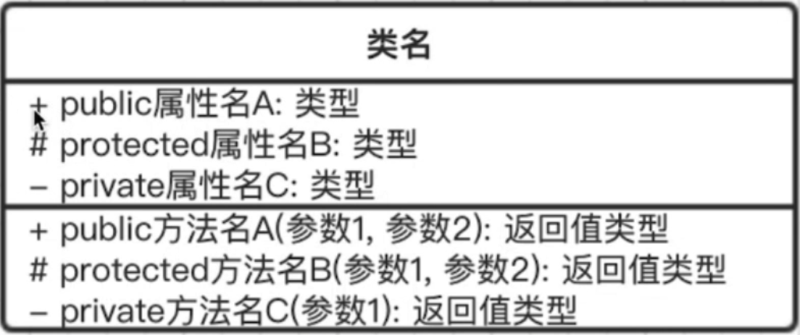
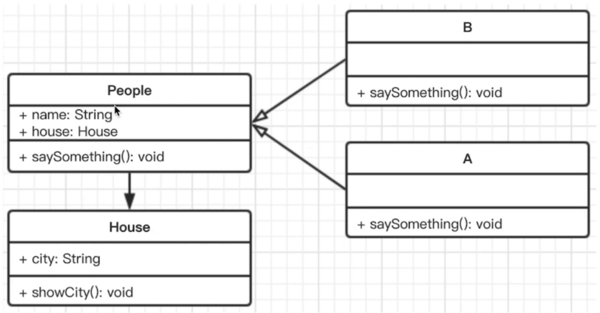

## UML 类图

Unified Modeling Language 统一建模语言

类图： UML包含很多种图
关系： 泛化表示继承， 关联表示引用




## 画图工具

MS Offivce visio

processon在线工具

## UML 类图 示例

```javascript
class People {
  constructor(name, house) {
    this.name = name
    this.house = house  // 引用
  }

  saySomething() {

  }
}

class A extends People {
  constructor(name, house) {
    super(name, house)
  }

  saySomething() {
    alert('I am A')
  }
}

class B extends People {
  constructor(name, house) {
    super(name, house)
  }

  saySomething() {
    alert('I am B')
  }
}

class House {
  constructor(city) {
    this.city = city
  }

  showCity() {
    alert(`house in ${this.city}`)
  }
}

// 测试
let aHouse = new House('北京')
let a = new A('AAA', aHouse)
console.log(a)  // a 有房子
let b = new B('bbb')
console.log(b)  // b 有房子
```
UML类图如下：


空箭头：泛化(继承)
实心箭头：引用
