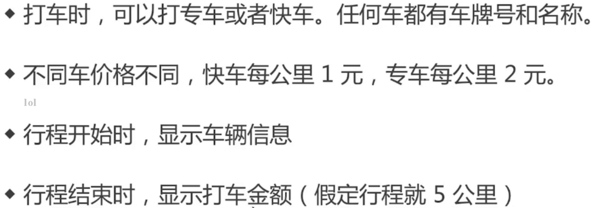
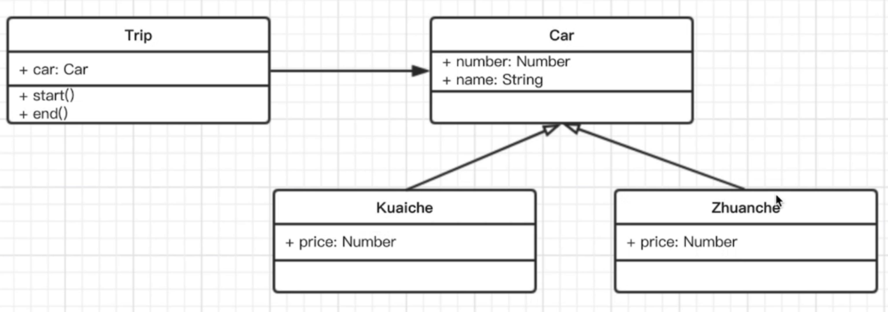
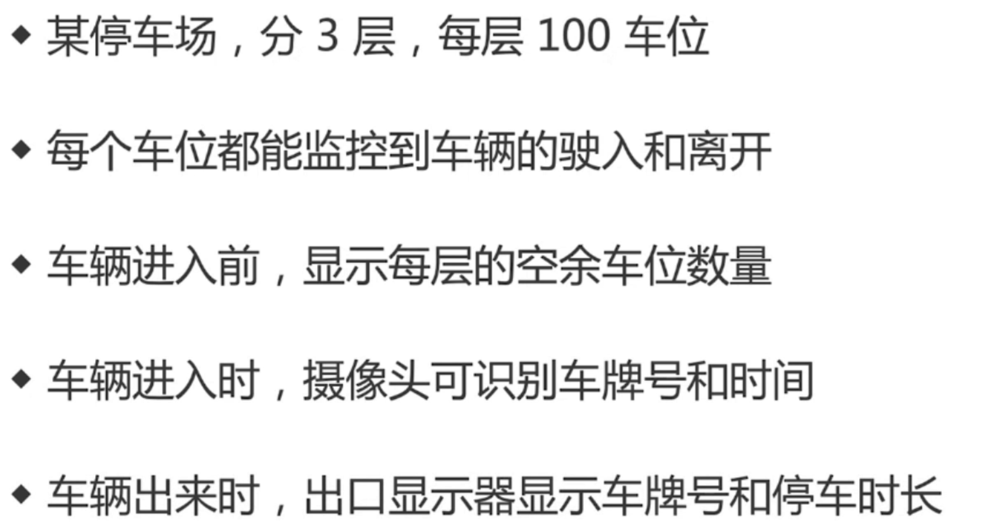

## 设计原则

### 什么是设计

设计：按照一种思路或者标准实现功能，功能相同可以有不同的设计方案来实现，伴随着需求的增加，设计的作用才能体现出来

《UNIX/LINUX设计哲学》 推荐电子版
准则1：小即是美
准则2：让每个程序只做好一件事
准则3：快速建立原型
准则4：舍弃高效率而取可移植性
准则5：采用纯文本来存储数据
准则6：充分利用软件的杠杆效应（软件复用）
准则7：使用shell脚本来提供杠杆效用和可移植性
准则8：避免强制性的用户界面
准则9：让每个程序都成为过滤器

小准则：
1. 允许用户定制环境
2. 尽量使操作系统内核小而轻量化
3. 使用小写字母并尽量简短
4. 沉默是金
5. 各部分之和大于整体
6. 寻求90%的解决方案  二八定律

### SOLID设计原则

- S：单一职责原则，一个程序只做好一件事，如果功能过于复杂就拆分开，每个部分保持独立
- O：开放封闭原则，对扩展开放，对修改封闭，增加需求时，扩展新代码，而非修改已有代码，这是软件设计的终极目标
- L：李氏置换原则，子类能覆盖父类，父类能出现的地方子类就能出现，JS中使用较少(弱类型&继承使用较少)
- I：接口独立原则，保持接口的单一独立，尽量避免出现“胖接口”，JS中没有接口（typescript例外），使用较少，类似于单一职责原则，这里更关注接口
- D：依赖倒置原则：面向接口编程，依赖于抽象而不依赖于具体，使用方只关注接口而不关注具体类的实现，JS中使用较少(没有接口&弱类型)

用Promise来说明SO原则
```javascript
function loadImg(src) {
  return new Promise(function (resolve, reject) {
    var img = document.createElement('img')
    img.onload = function () {
      resolve()
    }
    img.onerror = function () {
      reject('图片加载失败')
    }
    img.src = src
  })
}

var src = 'https://www.imooc.com/static/img/index/logo_new.png'
var result = loadImg(src)

result.then(function (img) {
  console.log('img.width', img.width)
  return img
}).then(function (img) {
  console.log('img.height', img.height)
}).catch(function (e) {
  // 统一捕获异常
  console.log(e)
})
```

SO如何提现的？
S - 一个then完成一件事
O - 如果新增需求，扩展then，对扩展开放对修改封闭

### 从设计到模式

设计：设计原则
模式：设计模式，既定的模板样式
从设计到模式

### 23种设计模式

> 标 ** ：必会，不理解就先背过
> 其他：理解原理，会写 

1. 创建型
   1. 工厂模式(工厂方法模式、抽象工厂模式、建造者模式) **
   2. 单例模式 **
   3. 原型模式 **
2. 结构型
   1. 适配器模式 **
   2. 装饰器模式 **
   3. 代理模式 **
   4. 外观模式 **
   5. 桥接模式
   6. 组合模式
   7. 享元模式
3. 行为型
   1. 策略模式
   2. 模板方法模式
   3. 观察者模式 **
   4. 迭代器模式 **
   5. 职责连模式
   6. 命令模式
   7. 备忘录模式
   8. 状态模式  **
   9. 访问者模式
   10. 中介者模式 (了解)
   11. 解释器模式 (了解)

> 该如何学习设计模式？
> - 分优先级学习，有主次
> - 明白每个设计模式的道理和用意
> - 通过经典应用场景体会真实使用场景
> - 自己编码时多思考，尽量模仿

### 示例

题目1：


要求：1. 画出UML类图 2. 用ES6语法写出该示例



抽象
```javascript
class Car {
  constructor(number, name) {
    this.number = number
    this.name = name
  }
}

class Kuaiche extends Car {
  constructor(number, name) {
    super(number, name)
    this.price = 1
  }
}

class Zhuanche extends Car {
  constructor(number, name) {
    super(number, name)
    this.price = 2
  }
}

class Trip {
  constructor(car) {
    this.car = car
  }
  start() {
    console.log(`行程开始，名称：${ this.car.name }, 车牌号：${ this.car.number }`)
  }
  end() {
    console.log(`行程结束，价格：${ this.car.price * 5 }`)
  }
}

let car = new Kuaiche(100, '桑塔纳')
let trip = new Trip(car)
trip.start()
trip.end()
```

题目2：

要求：画出UML类图

分析：
- 通过第一个条件，要定义停车场、层、车位，3个class类
- 第二个条件：
  - 车位要有一个方法实现对车辆驶入和离开的监控
  - 要定义车辆这个class
  - 车辆具有驶入、离开功能
  - 隐含一个状态信息：车位是否为空
- 第三个条件：
  - 车辆进入前，面对的是停车场，停车场class要有一个方法显示每层空余车位数量，具体的要交给层class，所以层class要有一个方法计算空余车位数量，最终由停车场class汇总显示所有层中的空余车位的数量
- 第四个条件：
  - 需要一个摄像头class
  - 摄像头输入的是一个车辆，输出的是车牌号和时间，如何存储？存在停车场，所以停车场需要一个属性记录车辆列表
- 第五个条件：
  - 需要一个出口显示器class
  - 记录车牌号和停车时间

```javascript
// 停车场
class Park {
  constructor(floors) {
    this.floors = floors || []
    // 初始化摄像头
    this.camera = new Camera()
    // 出口显示器
    this.screen = new Screen()
    // 存储摄像头返回的车辆信息
    this.carList = {} // 命名可优化？
  }
  in(car) {
    // 通过摄像头获取信息
    const info = this.camera.shot(car)
    // 停到某个停车位
    const i = parseInt(Math.random() * 100 % 100)
    const place = this.floors[0].places[i]
    // 驶入停车位
    place.in()
    info.place = place
    // 记录信息
    this.carList[car.num] = info
  }
  out(car) {
    // 获取信息
    const { num, inTime, place } = this.carList[car.num]
    // 将停车位清空
    place.out()
    // 显示屏显示车牌号和停车时长
    this.screen.show(car, inTime)
    // 清空记录
    delete this.carList[num]
  }
  emptyNum() {
    return this.floors.map(floor => {
      return `${floor.index}层，还有${floor.emptyPlaceNum()}个空余车位`
    }).join('\n')
  }

}

// 摄像头
class Camera {
  shot(car) {
    return {
      num: car.num,
      inTime: Date.now()
    }
  }
}

// 停车场出口显示器
class Screen {
  show (car, inTime) {
    console.log('车牌号：', car.num)
    console.log('停车时长：', Date.now() - inTime)
  }
}

// 车辆
class Car {
  constructor(num) {
    this.num = num
  }
}

// 层
class Floor {
  constructor(index, places) {
    this.index = index  // 表示第几层
    this.places = places || [] // 这一层的空车位
  }
  emptyPlaceNum() {
    let num = 0
    this.places.forEach(place => {
      if (place.empty) {
        num++
      }
    })

    return num
  }
}

// 车位
class Place {
  constructor() {
    this.empty = true // 空车位
  }
  in() {
    this.empty = false
  }
  out() {
    this.empty = true
  }
}


// 测试
// 初始化停车场
const floors = []
for (let i = 0; i < 3; i++) {
  const places = []
  for (let j = 0; j < 100; j++) {
    places[j] = new Place()
  }
  floors[i] = new Floor(i+1, places)
}

const park = new Park(floors)

// 初始化车辆
const car1 = new Car(100)
const car2 = new Car(200)
const car3 = new Car(300)

// 测试第一辆车进入
console.log('第一辆车进入')
console.log('当前空余车位数：', park.emptyNum())
park.in(car1)
console.log('第二辆车进入')
console.log('当前空余车位数：', park.emptyNum())
park.in(car2)
console.log('第一辆车离开')
park.out(car1)
console.log('第二辆车离开')
park.out(car2)

console.log('第三辆车进入')
console.log('当前空余车位数：', park.emptyNum())
park.in(car3)
console.log('第三辆车离开')
park.out(car3)

```
