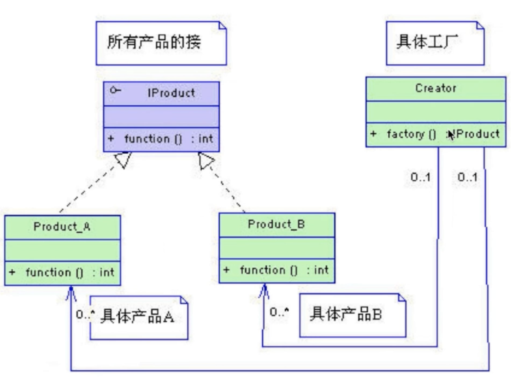
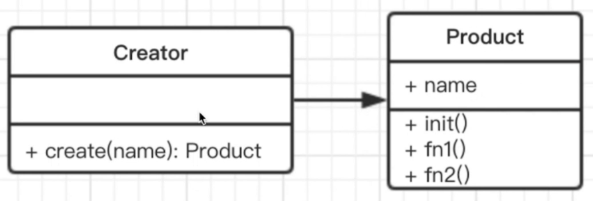

## 认识工厂模式

> 将 new 操作单独封装，遇到 new 时，就要考虑是否该使用工厂模式。

举个生活场景的例子：
- 去购买汉堡，直接点餐、取餐，不会是自己亲手做
- 商店要“封装”制作汉堡的工作，做好直接给你

传统UML类图：

其中，紫色图中前面带有一个'I'表示接口，虚线箭头连接表示这个接口是由Product_A、Product_B生成的，可以理解为继承，最右侧为工厂类。

简化UML类图：


编码：
```javascript
class Product {
  constructor(name) {
    this.name = name
  }
  init() {
    console.log('init')
  }
  fun1() {
    console.log('fun1')
  }
  fun2() {
    console.log('fun2')
  }
}

// 工厂
class Creator {
  create(name) {
    return new Product(name)
  }
}

// 测试
const creator = new Creator()
const p = creator.create('p1')
p.init()
p.fun1()
```

## 使用场景

- jQuery中`$('div')`
- React.createElement
- Vue异步组件

### jQuery中`$('div')`

```javascript
class jQuery {
  constructor(selector) {
    const slice = Array.prototype.slice
    const dom = slice.call(document.querySelectorAll(selector))
    const len = dom ? dom.length : 0
    for(let i = 0; i < len; i++) {
      this[i] = dom[i]
    }
    this.length = len
    this.selector = selector || ''
  }
  append(node) {
    // ...
  }

  addClass(name) {
    // ...
  }
  html(data) {
    // ...
  }
}

// 工厂
window.$ = function (selector) {
  return new jQuery(selector)
}
```

### React.createElement

jsx语法：
```
var profile = <div>
  
  <h3>{ [user.firstName, user.lastName].join('') }</h3>
</div>
```

编译后的代码：
```
var profile = React.createElement("div", null
  React.createElement("img", { src: "avatar.png", className: "profile" }),
  React.createElement("h3", null, [user.firstName, user.lastName].join(''))
)
```
React.createElement是一个工厂，创建的实际上是一个虚拟DOM的实例。

```javascript
class Vnode(tag, attrs, children) {
  // 省略内部代码
}

React.createElement = function (tag, attrs, children) {
  return new Vnode(tag, attrs, children)
}
```

### Vue异步组件

```javascript
Vue.component('async-example', function(resolve, reject) {
  setTimeout(function () {
    resolve({
      template: '<div>I am async!</div>'
    })
  }, 1000)
})
```

设计原则验证
- 构造函数和创建者分离
- 符合开放封闭原则

## 简单工厂设计模式

在工作中可能遇到这样的场景：
- 在登录模块添加一个警示框，当用户输入的用户名多于16个字母或数字时，警示用户“用户名不能多于16个字符”
- 当用户输入的密码错误时，通过提示框给出错误提示
- 当用户输入的用户名不存在时，需要有个确认框，其中包含提示信息“您的用户名不存在，请重新输入！”以及注册按钮
- 登录成功后给出一个自定义提示框，有确认、取消按钮，且提示“欢迎回来~”

以上3个需求的代码逻辑如下：
```javascript
// 需求1：
var LoginAlert = function (text) {
  this.content = text
}

LoginAlert.prototype.show = function () {
  // 显示警示框的逻辑
}

var userNameAlert = new LoginAlert('用户名不能多于16个字符')
userNameAlert.show()

// 需求2：
// 复用 警示框
var passwordAlert = new LoginAlert('输入的密码不正确')
passwordAlert.show()


// 需求3：
var LoginConfirm = function (text) {
  this.content = text
}

LoginConfirm.prototype.show = function () {
  // 确认框的逻辑
}

var loginFailConfirm = new LoginConfirm('您的用户名不存在，请重新输入！')
userNameAlert.show()

// 需求4：
var LoginPrompt = function (text) {
  this.content = text
}

LoginPrompt.prototype.show = function () {
  // 显示提示框
}
```

通过上述代码可以完成需求，如果有另一个同时有相似需求，比如要做一个注册模块，上述逻辑可以复用么？可以，但很繁琐，你要给出上述3个类，类太多了，可以只提供一个么？而且，注册模块和登录模块在命名上也是不同的，怎么做呢？

简单工厂模式：只提供一个函数，这个函数可以创建上述3种实例对象。复用的人不需要关注创建这些对象具体是依赖于哪个基类，只需要知道这个函数就可以。代码如下：

```javascript
var popFactory = function (name) {
  switch(name) {
    case 'alert':
      return new LoginAlert()
    case 'confirm':
      return new LoginConfirm()
    case 'prompt':
      return new LoginPrompt()
  }
}
```

进一步的，上述3个类中存在共同的部分，可以通过简单工厂的方式抽象提取出共用的部分。思路：使用简单工厂创建相似对象。即简单创建一个对象，然后对这个对象拓展方法和属性，并最终将这个对象返回出来。

```javascript
function createPop(type, text) {
  var o = new Object()
  o.content = text
  o.show = function () {
    // 显示
  }
  if (type === 'alert') {
    // 警示框差异部分
  }
  if (type === 'confirm') {
    // 确认框差异部分
  }
  if (type === 'prompt') {
    // 提示框差异部分
  }

  // 返回对象
  return o
}

// 创建警示框
var userNameAlert = createPop('alert', '用户名不能多于16个字符')
```

上面场景涉及了简单工厂模式的两种不同使用，有什么区别？
- 第一种：通过类实例化对象创建
- 第二种：通过创建一个新对象，包装增强其属性和功能，并最终返回这个对象

## 工厂方法模式


