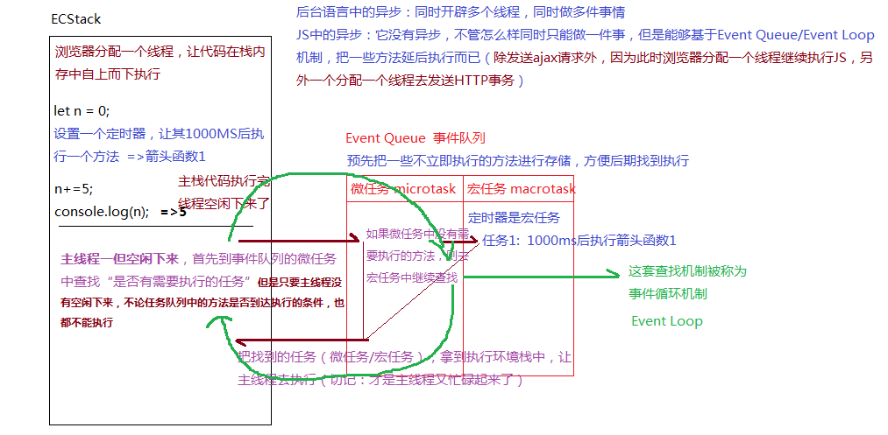
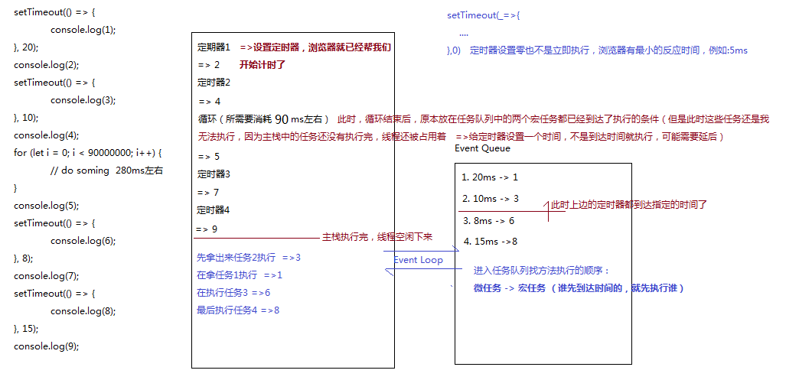
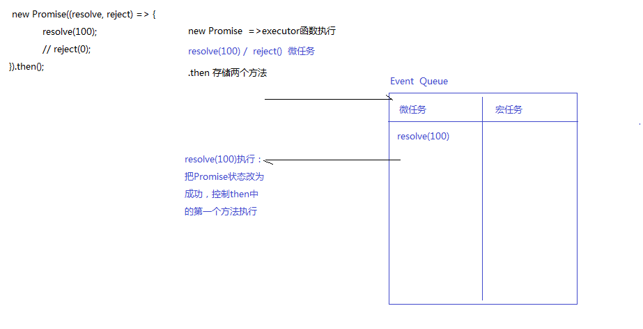

- [Event Loop](#event-loop)
  - [同步异步编程](#同步异步编程)
  - [同步异步练习](#同步异步练习)
  - [JS中AJAX的异步性](#js中ajax的异步性)
    - [发送ajax请求的原理](#发送ajax请求的原理)
  - [Promise基础语法](#promise基础语法)
  - [手写Promise](#手写promise)

## Event Loop

### 同步异步编程

- JS本身是单线程的（浏览器只分配一个线程供JS代码自上而下运行） 
  - 在JS中大部分操作都是同步编程：当前任务不完成，下一个任务是无法继续执行的，换句话说，任务是逐一执行的
  - 但是对于某些特殊的需求，也是需要按照异步编程的思维去处理的
    
    [浏览器端]
      + 定时器是异步编程
      + JS中的事件绑定是异步编程
      + Ajax/Fetch请求的发送（HTTP事务）
      + Promise设计模式，管控异步编程的（包括：async/await...）
  
    [Node端]
      + progress.nextTick
      + setImmediate
      + FS进行I/O操作可以是异步操作
     
        ...
 
- JS中异步操作的运行机制：事件队列 Event Queue 和 事件循环 Event Loop

### 同步异步练习

```javascript
let n = 0

// 设置定时器的操作是同步的，但是1S干的事情是异步的
setTimeout(_ => {
    n += 10
    console.log(n)
}, 1000)

n += 5
console.log(n)
```


- JS本身是不存在异步的，它是使用事件队列和事件循环机制模拟出来的异步

---

```javascript
setTimeout(() => {
    console.log(1)
}, 20)

console.log(2)

setTimeout(() => {
    console.log(3)
}, 10)

console.log(4)

console.time('AAA')
for (let i = 0; i < 90000000; i++) {
    // do soming  
}
console.timeEnd('AAA')  // AAA: 89.541015625 ms

console.log(5)

setTimeout(() => {
    console.log(6)
}, 8)

console.log(7)

setTimeout(() => {
    console.log(8)
}, 15)

console.log(9)

// 2 4 5 7 9 3 1 6 8
```


- 定时器，从设置定时器开始就已经开始计时了
-进入任务队列中执行任务的顺序：
  - 微任务 -> 宏任务(谁先到达时间了谁就先执行)

- 修改循环执行的次数，会得到不同的输出结果 - 本质在于定时器的到期时间，谁先到时间谁就先执行
```javascript
setTimeout(() => {
    console.log(1)
}, 20)

console.log(2)

setTimeout(() => {
    console.log(3)
}, 10)

console.log(4)

console.time('AAA')
for (let i = 0; i < 9; i++) {
    // do soming  
}
console.timeEnd('AAA')  // AAA: 0.006103515625 ms

console.log(5)

setTimeout(() => {
    console.log(6)
}, 8)

console.log(7)

setTimeout(() => {
    console.log(8)
}, 15)

console.log(9)

// 2 4 5 7 9 6 3 8 1
```

---
```javascript
console.log(1)

setTimeout(_ => {
    console.log(2)
}, 50)

console.log(3)

setTimeout(_ => {
    console.log(4)
    // 遇到死循环  =>所有代码执行最后都是在主栈中执行，遇到死循环，主栈永远结束不了，后面啥都干不了了
    while (1 === 1) {}
}, 0)

console.log(5)
```
- 谷歌浏览器最小反应时间是在5-6ms左右，IE浏览器在10-13ms左右，综合情况下是17ms

### JS中AJAX的异步性

- 使用jQuery中的ajax

```javascript
let $body = $('body')

$.ajax({
    // 随便写了个地址
    url: './js/fastclick.js',
    method: 'get',
    success(result) {
        // 获取数据后动态创建了一个盒子
        $body.append(`<div id='box' class='box'></div>`)
    }
})

console.log($('#box'))   //=>获取不到元素

$('#box').click(function () {
    $(this).css('background', 'lightcoral')
})
```
- `$.ajax`是异步操作，代码会继续执行，数据还没有获取到，页面上就不会创建box的盒子，`$('#box')`是无法获取到的
- 解决方法1：确保获取到数据之后再操作元素：
  ```javascript
  $.ajax({
    url: './js/fastclick.js',
    method: 'get',
    success(result) {
        $body.append(`<div id='box' class='box'></div>`)

        // 
        $('#box').click(function () {
        $(this).css('background', 'lightcoral')
        }
    })
  ```
- 解决方法2：基于事件委托可以给动态绑定的元数据进行相关的处理
  ```javascript
    $.ajax({
        url: './js/fastclick.js',
        method: 'get',
        success(result) {
            $body.append(`<div id='box' class='box'></div>`)
    })

    $body.click(function (ev) {
        let target = ev.target,
            $target = $(target)
        if (target.id === 'box') {
            $target.css('background', 'lightcoral')
        }
    })
  ```
- JQ中的$.ajax是帮我们封装好的ajax库, axios也是基于Promise封装的ajax库, 核心都是ajax操作
- fetch是浏览器内置的发送请求的类(天生就是Promise管控的)

#### 发送ajax请求的原理

1. 基本步骤
```javascript
let xhr = new XMLHttpRequest

xhr.open('get', './js/fastclick.js', true)
// console.log(xhr.readyState); // => 1

xhr.onreadystatechange = function () {
    //=>监听到状态改变后才会触发的事件
    console.log(xhr.readyState); // => 2,3,4
}

xhr.send()
```
- AJAX的状态：`xhr.readyState`
  - `UNSENT 0`:  创建完XHR默认就是0
  - `OPENED 1`:   已经完成OPEN操作
  - `HEADERS_RECEIVED 2`:  服务器已经把响应头信息返回了
  - `LOADING 3`:  响应主体正在返回中
  - `DONE 4`:  响应主体已经返回
- `XHR.OPEN`第三个参数控制的同步异步指的是：
  - 从当前SEND发送请求，算任务开始，一直到AJAX状态为4才算任务结束（同步是：在此期间所有的任务都不去处理，而异步是：在此期间该干啥干啥） 
  - 异步在SEND后，会把这个请求的任务放在EventQueue中（宏任务）

```javascript
let xhr = new XMLHttpRequest
xhr.open('get', './js/fastclick.js', true)  // 异步

xhr.send()

xhr.onreadystatechange = function () {
    console.log(xhr.readyState)  // => 2, 3, 4
}
```

```javascript
let xhr = new XMLHttpRequest
xhr.open('get', './js/fastclick.js', false)  // 同步

xhr.send()  // 任务开始，同步特点：任务状态不为4，啥都干不了

xhr.onreadystatechange = function () {
    console.log(xhr.readyState)  // 不输出， 因为之前的状态就是4了，要想触发这个回调需要将状态从4变为5，这是不可能的
}
```

```javascript
let xhr = new XMLHttpRequest
xhr.open('get', './js/fastclick.js', false)  // 同步

xhr.onreadystatechange = function () {
    console.log(xhr.readyState); // => 4， 绑定之前状态为1，将这个事件绑定放入Event Queue
}

xhr.send()  // 同步任务开始，状态不为4，啥都做不了，状态为4的时候，主栈才结束
```

### Promise基础语法
> 推荐[阮一峰老师的ES6入门教程](https://es6.ruanyifeng.com/#docs/promise)

> [MDN-Promise](https://developer.mozilla.org/zh-CN/docs/Web/JavaScript/Reference/Global_Objects/Promise)

- PROMISR及其作用
  - ES6内置类
  - 回调地狱：AJAX的串行和并行
- PROMISE的executor函数和状态
  - executor
  - PROMISE状态
    - pending 初始状态
    - fulfilled 操作成功完成
    - rejected 操作失败
- PROMISE中的THEN和CATCH
  - then(func1,func2) / then(func)
  - catch(func)
  - then链机制
- PROMISE中其它常用方法
  - Promise.all
  - Promise.race
  - Promise.reject （选）
  - Promise.resolve （选）

- 从一个需求入手：
    - 向服务器发送请求
      - `/student?class=1`： 获取班级学员信息
      - `/score?stuId=[1, 2, 3]` ：返回学员的分数信息
      - `/jige?score=90`：确定是否及格

传统ajax获取数据：
```javascript
$.ajax({
    url: '/student',
    method: 'get',
    data: {
        class: 1
    },
    success: function (result) {
        // result=>学生信息
        $.ajax({
            url: '/score',
            method: 'get',
            data: {
                stuId: result.map(item => item.id)
            },
            success: function (result) {
                // result=>学员的分数信息
                $.ajax({
                    //...
                })
            }
        })
    }
})
```
回调地狱：上一个回调函数中继续做事情，而且继续回调（在真实项目的AJAX请求中经常出现回调地狱）=>异步请求、不方便代码的维护 

Promise的诞生就是为了解决异步请求中的回调地狱问题：它是一种设计模式，ES6中提供了一个JS内置类Promise，来实现这种设计模式:

```javascript
function ajax1() {
    return new Promise(resolve => {
        $.ajax({
            url: '/student',
            method: 'get',
            data: {
                class: 1
            },
            success: resolve
        })
    })
}

function ajax2(arr) {
    return new Promise(resolve => {
        $.ajax({
            url: '/score',
            method: 'get',
            data: {
                stuId: arr
            },
            success: resolve
        })
    })
}

function ajax3() {
    return new Promise(resolve => {
        $.ajax({
            url: '/jige',
            // ...
            success: resolve
        })
    })
}

ajax1().then(result => {
    return ajax2(result.map(item => item.id));
}).then(result => {
    return ajax3();
}).then(result => {

});


// 或者使用async/await
async function handle() {
    let result = await ajax1()
    result = await ajax2(result.map(item => item.id))
    result = await ajax3()
    // 此处的result就是三次异步请求后获取的信息
}

handle()
```

- `new Promise([executor])`： [executor]执行函数是必须传递的
- PROMISE是用来管理异步编程的，它本身不是异步的：new Promise的时候会立即把executor函数执行（只不过我们一般会在executor函数中处理一个异步操作）
- PROMISE本身有三个状态  => `[[PromiseStatus]]`
  - `pending` 初始状态
  - `fulfilled` 代表操作成功(resolved)
  - `rejected` 代表当前操作失败
- PROMISE本身有一个VALUE值，用来记录成功的结果（或者是失败的原因的） => `[[PromiseValue]]`

```javascript
let p1 = new Promise((resolve, reject) => {
    setTimeout(_ => {
        // 一般会在异步操作结束后，执行resolve/reject函数，执行这两个函数中的一个，都可以修改Promise的[[PromiseStatus]]/[[PromiseValue]]
        // 一旦状态被改变，再执行resolve、reject就没有用了
        resolve('ok')
        reject('no')
    }, 1000)
})
```

```javascript
let p1 = new Promise((resolve, reject) => {
    setTimeout(_ => {
        let ran = Math.random()
        console.log(ran)
        if (ran < 0.5) {
            reject('NO!')
            return;
        }
        resolve('OK!')
    }, 1000)
})

// THEN：设置成功或者失败后处理的方法
// Promise.prototype.then([resolvedFn],[rejectedFn])

p1.then(result => {
    console.log(`成功：` + result);
}, reason => {
    console.log(`失败：` + reason);
})
```
- 上述代码执行：
  - `new Promise`的时候先执行executor函数，在这里开启了一个异步操作的任务（此时不等：把其放入到EventQuque任务队列中），继续执行
  - `p1.then`基于THEN方法，存储起来两个函数(此时这两个函数还没有执行)
  - 当executor函数中的异步操作结束了，基于resolve/reject控制Promise状态，从而决定执行then存储的函数中的某一个

```javascript
let p1 = new Promise((resolve, reject) => {
    // resolve/reject 的执行，不论是否放到一个异步操作中，都需要等待then先执行完，把方法存储好，才会在更改状态后执行then中对应的方法 =>此处是一个异步操作（所以很多人说PROMISE是异步的），而且是微任务操作
    console.log(1)
    resolve(100)
    console.log(2)
})

p1.then(result => {
    console.log(`成功：` + result)
}, reason => {
    console.log(`失败：` + reason)
})

console.log(3)

// 1 2 3 100
```

创建一个状态为成功/失败的Promise实例有两种写法：
```javascript
new Promise((resolve, reject) => {
    resolve(100)
    // reject(0)
}).then()

// 
Promise.resolve(100).then()
// Promise.reject(0).then()
```

- `new Promise`时，executor函数执行
  - 遇到`resolve(100)`，它是一个微任务
  - 将这个微任务推入Event Queue的微任务队列中
  - 执行`.then`，目的是为了存储两个方法(成功回调与失败回调)
  - 函数存储好之后，向微任务队列中查找，执行`resolve(100)`，把promise状态改为"成功"，控制then中的第一个方法执行

```javascript
let p1 = new Promise((resolve, reject) => {
    resolve(100)
})

let p2 = p1.then(result => {
    console.log('成功：' + result)
    return result + 100
}, reason => {
    console.log('失败：' + reason)
    return reason - 100
})

let p3 = p2.then(result => {
    console.log('成功：' + result)
}, reason => {
    console.log('失败：' + reason)
})

// 上述代码执行结果：
    // 成功：100
    // 成功：200
```
- THEN方法结束都会返回一个新的Promise实例（THEN链）
  - `[[PromiseStatus]]:'pending'`
  - `[[PromiseValue]]:undefined`
- p1这个`new Promise`出来的实例，成功或者失败，取决于executor函数执行的时候，执行的是resolve还是reject决定的，再或者executor函数执行发生异常错误，也是会把实例状态改为失败的
- p2/p3这种每一次执行`.then`返回的新实例的状态，由then中存储的方法执行的结果来决定最后的状态
  - 上一个THEN中某个方法执行的结果，决定下一个then中哪一个方法会被执行
  - 不论是成功的方法执行，还是失败的方法执行(THEN中的两个方法)，凡是执行抛出了异常，则都会把实例的状态改为失败
  - 方法中如果返回一个新的PROMISE实例，返回这个实例的结果是成功还是失败，也决定了当前实例是成功还是失败
  - 剩下的情况基本上都是让实例变为成功的状态 (方法返回的结果是当前实例的value值：上一个then中方法返回的结果会传递到下一个then的方法中)

```javascript
Promise.resolve(10).then(result => {
    console.log(`成功：${result}`)
    return Promise.reject(result * 10)
}, reason => {
    console.log(`失败：${reason}`)
}).then(result => {
    console.log(`成功：${result}`)
}, reason => {
    console.log(`失败：${reason}`)
})
```

- TEHN中也可以只写一个或者不写函数


### 手写Promise


```javascript
async function async1() {
    console.log('async1 start')
    await async2();
    console.log('async1 end')
}

async function async2() {
    console.log('async2')
}

console.log('script start')

setTimeout(function() {
    console.log('setTimeout')
}, 0)

async1()

new Promise(function(resolve) {
    console.log('promise1')
    resolve()
}).then(function() {
    console.log('promise2')
})

console.log('script end')
```
