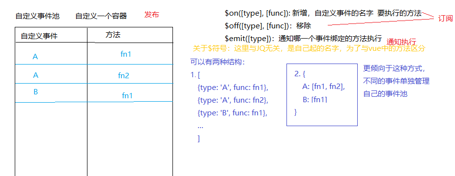

- [1. 发布订阅模式](#1-发布订阅模式)

## 1. 发布订阅模式

- 设计思想：
  - 事件池：把所有要做的事情先添加到事件池中，当真正触发对应的事件时，通知事件池中的对应方法执行
  - 从服务器拿到数据之后再逐一做很多事情：数据分析，数据绑定，DOM操作，...，不使用设计思想也可以实现(JQ中的ajax或者axios)
  ```javascript
  // 使用JQ中的Ajax实现
  $.ajax({
    url:'/api/userList',
    success: function (result) {
      fn1(result);
      fn2(result);
      fn3(result);
    }
  })

  function fn1() {}
  function fn2() {}
  function fn3() {}

  // 使用axios实现
  axios.get('/api/userList').then(result => {
    // 实现第一件业务逻辑
    return result;
  }).then(result => {
    // 实现第二件业务逻辑
    
  })

  // async await 实现
  ```
  - 新的设计方案(发布订阅设计模式)：
    - 拿一个容器，事先定义一个方法(比如$on()用于向容器中添加事件, $off()用于从容器中移除事件)
    - 那么需要触发这些事件的时候，(比如使用JQ的ajax方法实现)，当到达指定的条件时，在`success`只需要执行一个`$emit()`方法，
      去通知那些需要执行的方法执行即可，就不需要再再success中写各个方法的执行逻辑了

- 什么是发布订阅模式
  - 自定义事件池：自定义的一个容器
  
  

  为了方便展示，核心逻辑代码在：`03.JavaScript/03-高级/js/发布订阅`

  - 测试：
  ```html
  <script src="subscribe.js"></script>
  <script>
    function fn1() {console.log('111111');}
    function fn2(a, b) {console.log('222222', a, b);}
    function fn3() {console.log('333333');}
    function fn4() {console.log('444444');}
    function fn5() {console.log('555555');}

    let sub = subscribe();
    sub.$on('Study', fn1);
    sub.$on('Study', fn2);
    sub.$on('Study', fn2);
    sub.$on('Study', fn3);
    sub.$on('Study', fn3);
    sub.$on('Study', fn4);
    sub.$on('Study', fn5);
    sub.$on('Study', fn5);


    setTimeout(_ => {
      sub.$emit('Study', 100, 200);
    }, 2000);

  </script>
  ```
  - 上述测试案例可以正常显示，但是存在bug：**数组塌陷**
    - 看如下代码，想要实现在第一次执行之后将fn1和fn2方法移除，
      - 应该得到的效果是，第一次满足触发条件时fn1~fn5都执行，再往后触发时，只执行fn3~fn5
    ```html
    <script src="subscribe.js"></script>
  <script>
    function fn1() {console.log('111111');}
    function fn2(a, b) {
      console.log('222222', a, b);
      // 第一次执行fn2后，把fn1和fn2从事件池中移除
      sub.$off('Study', fn1);
      sub.$off('Study', fn2);
    }
    function fn3() {console.log('333333');}
    function fn4() {console.log('444444');}
    function fn5() {console.log('555555');}

    let sub = subscribe();
    sub.$on('Study', fn1);
    sub.$on('Study', fn2);
    sub.$on('Study', fn2);
    sub.$on('Study', fn3);
    sub.$on('Study', fn3);
    sub.$on('Study', fn4);
    sub.$on('Study', fn5);
    sub.$on('Study', fn5);


    document.onclick = function () {
      sub.$emit('Study', 100, 200)
    };

  </script>
    ```
  - 上述代码执行时，存在数组塌陷问题：从事件池中删除方法，是基于splice实现的，删除项后面项的索引会向前移动，此时造成了数组塌陷，下图展示的是上述案例在第一次通知执行的过程：
  
  

  - 为了防止数组塌陷，在移除的时候，不应该改变数组结构，而是应该将当前项设置为null, 在下一次通知执行的时候再把值为null的元素删除掉即可。
