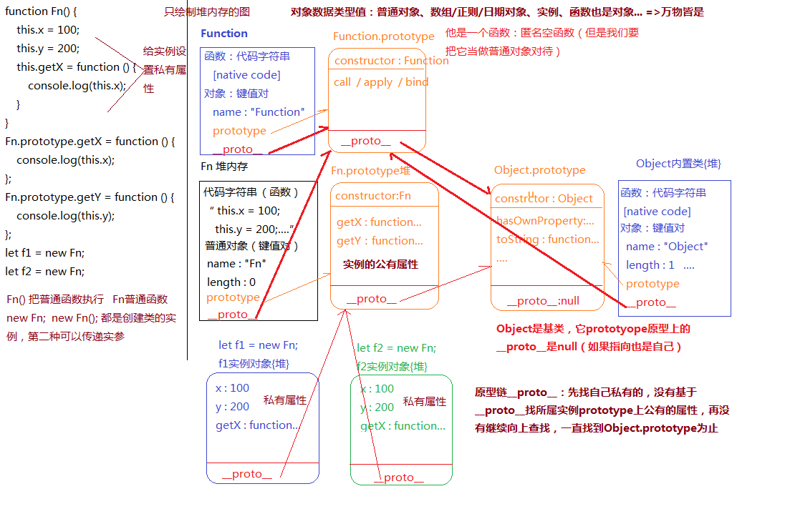
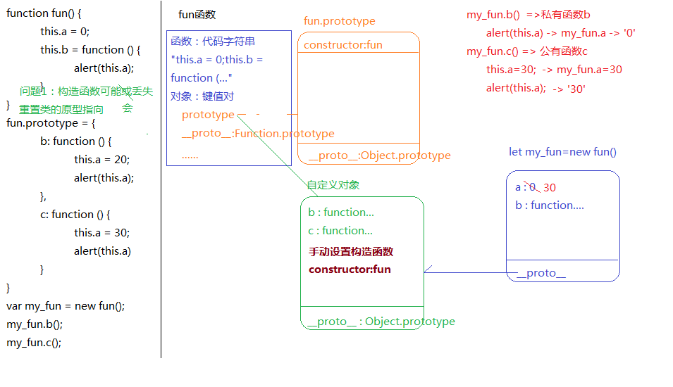
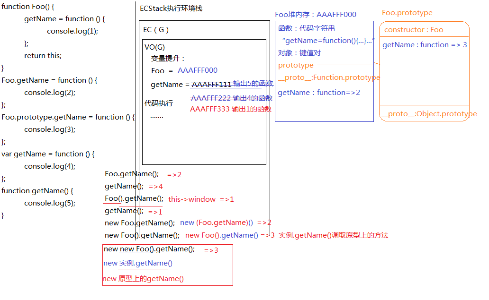
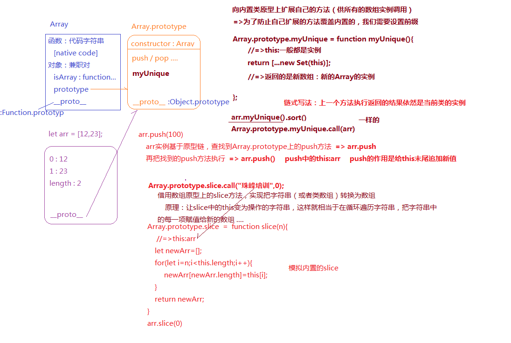

- [JS高阶编程技巧](#js高阶编程技巧)
  - [惰性函数](#惰性函数)
  - [柯里化函数](#柯里化函数)
  - [compose函数实现函数调用扁平化](#compose函数实现函数调用扁平化)
- [面向对象编程OOP（Object Oriented Programming）](#面向对象编程oopobject-oriented-programming)
  - [JS是基于面向对象的](#js是基于面向对象的)
  - [new执行的原理](#new执行的原理)
  - [new的实现原理](#new的实现原理)
  - [原型和原型链的底层运行机制](#原型和原型链的底层运行机制)
  - [练习](#练习)
- [基于内置类原型扩展方法](#基于内置类原型扩展方法)
  - [内置类原型方法的借用](#内置类原型方法的借用)


## JS高阶编程技巧

### 惰性函数

- 单例设计模式(单体模式)：最原始的模块化思想，闭包机制
  - 单体模式用于创建命名空间，将一系列关联的属性和方法组织成一个逻辑单元，减少全局变量。逻辑单元中的代码通过单一的变量进行访问
  - 特点：
    - 该类只有一个实例
    - 全局可访问该实例
    - 自行实例化（主动实例化）
    - 可推迟初始化，即延迟执行（与静态类/对象的区别）
  - 使用全局变量存在的问题：
    - 命名冲突
    - 不方便维护，团队协作开发中很容易被覆盖
  - 应对方案：
    - 使用命名空间
    - 闭包封装私有变量(利用函数作用域)
    - ES6的`const/symbol`

```javascript
// 一个天气管理模块：可以查询、设置地区
// 一个新闻管理模块：可以查询、设置地区、分享...

// 单例模式
let weatherModule = (function () {
  let _default = 'beijing'
  let queryWeather = function () {
    // ...
  }
  let setCity = function () {
    // ...
  }

  return {
    // ES6语法
    // 返回供外部使用
    setCity
  }
})()
// weatherModule是不销毁的闭包的返回值，是一个对象，这个对象中包含有天气管理模块的方法，使用的时候可以直接使用该模块直接调用。


let newsModule = (function () {
  let _default = 'beijing'
  let queryNews = function () {
    //...
    weatherModule.setCity()
  }
  return {}
})()
```
如果上述两个模块的代码都在全局下进行定义，在代码合并的时候非常容易引起命名冲突的问题，利用闭包的保护机制来避免冲突。

- 惰性函数

以DOM2事件绑定为例：

  标准浏览器：元素.addEventListener()

  IE8以前：元素.attachEvent()

```javascript
// 正常处理兼容性问题
function emit(element, type, func) {
  if(element.addEventListener) {
    element.addEventListener(type, func, false)
  }else if(element.attachEvent) {
    element.attachEvent('on' + type, func)
  }else {
    element['on' + type] = func
  }
}

emit(box, 'click', fn1)
emit(box, 'click', fn2)
```
上述兼容代码存在一个问题：每一次执行emit函数的时候，内部的判断都需要全部走一遍，实际上，我在第一次执行emit函数的时候就已经知道浏览器的兼容性问题了，后面再调用emit函数的时候就没有必要再重新判断了。

利用惰性思想改进-闭包机制
```javascript
function emit(element, type, func) {
  if (element.addEventListener) {
    emit = function (element, type, func) {
      element.addEventListener(type, func, false);
    };
  } else if (element.attachEvent) {
    emit = function (element, type, func) {
      element.attachEvent('on' + type, func)
    }
  } else {
    emit = function (element, type, func) {
      element['on' + type] = func
    }
  }
  emit(element, type, func)
}
```

### 柯里化函数

- 柯里化函数思想：利用闭包的机制，把一些内容事先存储和处理了，等到后期需要的时候拿来即用即可
- 最简单的理解：一个大函数返回一个小函数
- 柯里化函数在项目中的实际意义：

- 案例：页面上一个盒子，当点击这个盒子的时候，触发该盒子的点击事件
```html
<head>
<style>
  .box {
    width: 100px;
    height: 100px;
    background: lightcoral;
  }
</style>
</head>

<body>
  <div class="box" id="box">李易峰</div>
</body>
```

```javascript
let obj = {
  x: 100
}

function fn(y) {
  console.log(y)
  this.x += y
  console.log(this)
}

box.onclick = fn  // 这个时候this指的是这个box， y参数指的是事件对象MouseEvent

// 需求：触发盒子点击事件的时候，把fn执行，并且让fn中的this执行obj，再给obj传递一个200
box.onclick = fn.bind(obj, 200)  // bind不会立即执行，预先存储一些内容，而call/apply也都会改变this的指向，但是会立即执行函数

// 注意：bind不兼容IE8及以下浏览器。

box.onclick = function () {
  // 点击执行匿名函数，在匿名函数执行的时候再把fn执行
  fn.call(obj, 200)
}

// 设置定时器的时候也是类似的

```

```javascript
// 写一个简单的bind函数

// bind：预先处理内容
//   @params
//     func: 要执行的函数
//     context: 需要改变的this指向
//     args: 给函数传递的参数
//   @return
//       返回一个代理函数

function bind(func, ctx, ...args) {

  return function () {
    func.call(ctx, ...args)
  }
}

// 测试
let obj = {
    x: 100
}

function fn(y) {
    this.x += y
    console.log(this.x)
}
setTimeout(bind(fn, obj, 200), 1000)
// setTimeout(bind(fn, obj, 200, 300), 1000)

setTimeout(function (){
  func.call(obj, ...args);
  // fn.call(obj,200,300);
}, 1000);
```

```javascript
// 我们正常使用bind的方式：fn.bind(obj, 200), 是因为Function的原型上有bind

// 柯里化函数思想重写bind
~ function (proto) {
  function myBind(ctx = window, ...outerArgs) {
    // this：指的是要处理的函数
    let _this = this
    return function () {
      // 这里面的this与myBind中不一定是一致的，还得看给谁绑定了
      _this.call(ctx, ...outerArgs)
    }
  }
  proto.myBind = myBind
}(Function.prototype)
```
上述写法存在一个小问题：
```javascript
box.onclick = fn.myBind(obj, 200)
// => box.onclick = function (event) {
//   _this.call(ctx, ...outerArgs)
// }

// 会发现，这个匿名函数中还有一个默认的事件对象

// 改进
~ function (proto) {
  function myBind(ctx = window, ...outerArgs) {
    // this：指的是要处理的函数
    let _this = this
    return function (...innerArgs) {
      let args = outerArgs.concat(innerArgs)
      _this.call(ctx, ...args)
    }
  }
  proto.myBind = myBind
}(Function.prototype)
```
兼容所有浏览器的版本：
```javascript
~ function (proto) {
  function myBind(ctx) {
    ctx = ctx || window
    var _this = this
    var outerArgs = Array.prototype.slice.call(arguments, 1)
    return function () {
      var innerArgs = [].slice.call(arguments, 0)
      var args = outerArgs.concat(innerArgs)
      _this.apply(ctx, args)
    }
  }
  proto.myBind = myBind
}(Function.prototype)

// 测试
let obj = {
    x: 100
}

function fn(y) {
    this.x += y
    console.log(this.x)
}

fn.myBind(obj, 200)()
```

### compose函数实现函数调用扁平化

```javascript
let fn1 = function (x) {
  return x + 10
}

let fn2 = function (x) {
  return x * 10
}

let fn3 = function (x) {
  return x / 10
}

console.log(fn3(fn1(fn2(fn1(5)))))  // 一个函数的返回值作为另一个函数的实参时
```
先来看数组中的reduce方法：
```javascript
let arr = [12, 23, 34, 45]
let total = arr.reduce((x, y) => {
  //=>x: 上一次处理的结果
  //=>y: 数组中某一项
  // reduce不传第二个参数：
    // x初始值是第一项的值，然后每一次返回的结果作为下一次x的值
  //reduce传第二个参数: x初始值就是第二个参数值
  console.log(x, y)
  return x + y
}, 0)
console.log(total)

// 可应用与当前的函数调用方式
// [fn1, fn2, fn1, fn3]
// fn2(fn1())
```

```javascript
// 实现一个函数，在调用的时候上这样来调用的：
compose(fn1, fn2, fn1, fn3)(5)   // 传入函数的参数顺序是调用的顺序，初始传参是5

// compose函数调用的扁平化
// compose()(5)  => 5
// compose(fn1)(5)  => 5 + 10 = 15
// compose(fn1, fn2)(5)  => fn1(5) = 15, fn2(15)=150

function compose(...funcs) {
  // funcs:传递的函数集合
  return function (...args) {
    let len = funcs.length
    if(len === 0) {
      return args
    }
    if(len === 1) {
      return funcs[0](...args)
    }
    
    return funcs.reduce((x, y) => {
      // 第一次执行的时候，x是一个函数，再往后执行的时候x就是函数执行结果了而不是一个函数，相当于是下一个函数的实参
      return typeof x === 'function' ? y(x(...args)) : y(x)
    })
  }
}

// 测试
compose()(5)
compose(fn1)(5)
compose(fn1, fn2)(5)
```

redux中的写法：
```javascript
function compose(...funcs) {
  if (funcs.length === 0) {
    return arg => arg
  }

  if (funcs.length === 1) {
    return funcs[0]
  }

  return funcs.reduce((a, b) => (...args) => a(b(...args)))
}

// 这个是从后往前执行的
```

## 面向对象编程OOP（Object Oriented Programming）

> 两个关键点： new的原理； 原型和原型链的原理

面向过程的编程语言：C

面向对象的编程语言：JS, JAVA, C#(.NET), Python, Ruby, PHP

### JS是基于面向对象的

1. 对象、类、实例:
   1. 对象：万物皆对象
   2. 类：对象的细分
   3. 实例：类中具体的事物
2. JS本身就是基于面向对象研发出来的编程语言：内置类
   1. 数据类型
   ```javascript
    1 ->Number
    'A' ->String
    true ->Boolean
    null ->Null                ->Object
    undefined ->Undefined
    [] ->Array
    /^$/ ->RegExp
    function(){}  ->Function
    {} ->Object
   ```
   2. DOM元素: 每一个元素标签（元素对象）都有一个自己所属的大类, 比如：
   `div -> HTMLDivElement -> HTMLElement -> Element -> Node -> EventTarget -> Object`，每一个实例可以调用所属类（整条链）中的属性和方法。
   3. ...

```javascript
function func() {
  let x = 100;
  this.num = x + 100; 
}

func()  // this: window  AO(FUNC): {X=100} ... 普通执行函数

let f = new func()   // 这个时候func不仅仅是Function的一个实例，它本身也是一个类

// 创建一个自定义类 :
//  创建一个函数（Function类的实例），直接执行就是普通函数，但是“new 执行”它则被称为一个自定义的类
```

### new执行的原理

- `NEW` 函数执行
  - 形成一个全新的执行上下文EC
  - 形成一个AO变量对象
    - `ARGUMENTS`
    - 形参赋值
  - 初始化作用域链
  - [新]默认创建一个对象，而这个对象就是当前类的实例
  - [新]声明其THIS指向，让其指向这个新创建的实例
  - 代码执行
  - [新]不论其是否写RETURN，都会把新创建的实例返回（特殊点）

分析：

```javascript

function func() {
  // let obj = {}
  // this -> obj

  let x = 100
  this.num = x + 100  // 相当于给创建的实例对象新增一个num的属性obj.num = 200, 因为具备普通函数执行的一面，所以只有this.xxx=xxx才和创建的实例有关系，此案例中的x只是AO中的一个私有变量
  // 默认 return obj
}

let f = new func()
console.log(f)   // f是func这个类的实例
console.log(f instanceof func)  // true, instanceof用来检测某一个实例是否属于这个类

let f2 = new func()  
console.log(f === f2)   // f与f2是两个不同的实例对象，是两个不同的堆内存
```
- 关于返回值：如果自己设置返回值，返回的是一个引用类型值，则会把默认返回的实例给覆盖掉(此时返回的值就不再是类的实例了)，如果返回的是基本类型值，就不会产生影响
```javascript
function func() {
  let x = 10
  this.num = x + 10
  return 100  // 返回一个基本数据类型
}
let f = new func()
console.log(f)  // func {num: 20}

function func() {
  let x = 10
  this.num = x + 10
  return {   // 返回一个引用类型
    x: 666
  }
}
let f = new func()
console.log(f)  // {x: 666}
console.log(f instanceof func)  // false
```

### new的实现原理

```javascript

function Dog(name) {
    this.name = name;
}

Dog.prototype.bark = function () {
    console.log('wangwang');
}

Dog.prototype.sayName = function () {
    console.log('my name is ' + this.name);
}

/*
let sanmao = new Dog('三毛');
sanmao.sayName();
sanmao.bark();
*/

// 内置new的实现原理
function _new() {
    //=>完成你的代码   
}

let sanmao = _new(Dog, '三毛');
sanmao.bark(); //=>"wangwang"
sanmao.sayName(); //=>"my name is 三毛"
console.log(sanmao instanceof Dog); //=>true
```

```javascript
/*
* @params
*    Func：操作的那个类
*    ARGS：NEW类的时候传递的实参集合
* @return
*    实例或者自己返回的对象
*/

function _new(Func, ...args) {
  // 默认创建一个实例对象，而且是属于当前这个类的一个实例
  // let obj = {}
  // obj.__proto__ = Func.prototype  // IE大部分浏览器不允许直接操作__proto__

  // 
  let obj = Object.create(Func.prototype)  // 这个函数的功能与上述两个语句的功能是一样的

  // 会把类当作普通函数执行
  // 执行的时候，要保证函数中的this指向创建的实例
  let result = Func.call(obj, ...args)

  // 如果自己返回引用值，则以自己返回的为主，否则返回创建的实例
  if((result !== null && typeof result === 'object') || (typeof result === 'function')) {
    return result
  }

  return obj
}

let sanmao = _new(Dog, '三毛');
sanmao.bark(); //=>"wangwang"
sanmao.sayName(); //=>"my name is 三毛"
console.log(sanmao instanceof Dog); //=>true
```

### 原型和原型链的底层运行机制

- 每一个类（函数）都具备prototype，并且属性值是一个对象
- 对象上天生具备一个属性：constructor，指向类本身
- 每一个对象（普通对象、prototype、实例、函数等）都具备：`__proto__`，属性值是当前实例所属类的原型

```javascript
function Fn() {
  this.x = 100;
  this.y = 200;
  this.getX = function () {
      console.log(this.x)
  }
}

Fn.prototype.getX = function () {
  console.log(this.x)
}

Fn.prototype.getY = function () {
  console.log(this.y)
}

let f1 = new Fn
let f2 = new Fn

console.log(f1.getX === f2.getX);
console.log(f1.getY === f2.getY);
console.log(f1.__proto__.getY === Fn.prototype.getY);
console.log(f1.__proto__.getX === f2.getX);
console.log(f1.getX === Fn.prototype.getX);
console.log(f1.constructor);
console.log(Fn.prototype.__proto__.constructor);
f1.getX();
f1.__proto__.getX();
f2.getY();
Fn.prototype.getY();
```

- `Fn()`表示普通函数调用，`new Fn()`和`new Fn`是相同的效果，都是创建类的实例，不同在于第一种方式可以传递参数
- 万物皆对象：对象类型值包括普通对象，数组/正则/日期对象，实例，函数也是对象
- `Object`是基类，它`prototype`原型上的`__proto__`是null，如果指向也是自己
- 原型链`__proto__`: 先找自己私有的，没有的话，基于`__proto__`找所属实例`prototype`上公有的属性，再没有，继续向上查找，一直找到`Object.prototype`

---

### 练习

1. 
```javascript
function fun(){
    this.a = 0;
    this.b = function(){
        alert(this.a)
    }
}

fun.prototype = {
  // constructor: fun  重置原型指向的时候，构造器的指向需要手动修改, 不加这句话，fun的构造器就指向了Object
    b: function () {
        this.a = 20
        alert(this.a)
    },
    c: function () {
        this.a = 30
        alert(this.a)
    }
}

var my_fun = new fun()
console.log(fun.prototype.constructor)  // ƒ Object() { [native code] }
console.log(my_fun.constructor)  // ƒ Object() { [native code] }
my_fun.b()
my_fun.c()
```

- 注意：这里没有画执行上下文栈，直接画需要用到的堆了

2. 
```javascript
// 编写一个ADD函数满足如下需求:
// add(1);       //1
// add(1)(2);    //3
// add(1)(2)(3); //6
// add(1)(2,3);  //6
// add(1,2)(3);  //6
// add(1,2,3);   //6
```

方案一：
```javascript
function add(...outerArgs) {
  add = function (...innerArgs) {
    outerArgs.push(...innerArgs)
    return add
  }
  add.toString = function () {
    return outerArgs.reduce((x, y) => x + y)
  }
  return add
}

let res = add(1, 2)(3)(4)(5)(6, 7)
// 第一次执行add  outerArgs=[1,2]  重写了add
// 第二次执行add  innerArgs=[3]   outerArgs=[1,2,3]
// 第三次执行add  innerArgs=[4]   outerArgs=[1,2,3,4]
// ......
// outerArgs=[1,2,3,4,5,6,7]

alert(res)   // => alert会把输出的值转换为字符串(toString()), 重写toString方法，完成求和操作
```

方案二：
```javascript
// 混装函数
function currying(anonymous, length) {
  return function add(...args) {
    if(args.length >= length) {
      return anonymous(...args)
    }

    return currying(anonymous.bind(null, ...args), length - args.length)
  }
}


let add = currying(function anonymous(...args) {
  return args.reduce((x, y) => x + y)
}, 4)

console.log(add(1, 2)(3)(4))

// AO(currying) 
//   anonymous=求和函数
//   length=4
// ADD第一次执行  args=[1,2]
//   currying第二次执行
//   anonymous=求和函数 预先传递的参数[1,2]
//     length=2
//   ADD第二次执行 args=[3]
//     currying第三次执行 
//       anonymous=求和函数 预先传递的参数[3]
//       length=1
//     ADD函数第三次执行 args=[4]
//       把上一次的求和函数执行(4)
```
- 常见4大JS高阶编程技巧：惰性函数、柯里化函数、currying函数、compose函数


3. 

```javascript
let obj = {
    2: 3,
    3: 4,
    length: 2,
    push: Array.prototype.push
}

obj.push(1)   //
obj.push(2)   // 
console.log(obj)  // 
```
数组中的push方法简单模拟：
```javascript
Array.prototype.push = function push(num) {
  // this是arr
  this[this.length] = num
  // length的值会自动跟着累加1
  // {0: 10, 1: 20, 2: 30, length: 3}
}

let arr = [10, 20]   // {0: 10, 1:20, length: 2}
arr.push(30)
```

该题目中，`obj.push()`就是调用了数组中的push方法，所以：
```javascript
obj.push(1)   // => obj[2] = 1(拿上一次的length作为索引), obj.length = 3
obj.push(2)   // => obj[3] = 2, obj.length = 4
console.log(obj)  // {2: 1, 3: 2, length: 4, push: ƒ}
```

如果没有length：
```javascript
let obj = {
    1: 3,
    push: Array.prototype.push
}

obj.push(10)  
console.log(obj) 
```
- 如果没有length属性，调用push方法的时候会做一个处理，没有就是undefined，push会将其设置为0

4. a等于什么值会让下面条件成立

```javascript
var a = ?
if (a == 1 && a == 2 && a == 3) {
    console.log('OK')
}
```
- == 相等 VS === 绝对相等
  *   1.左右数据值类型不同，三个等号不能转换数据类型，直接返回false，但是两个等于号会默认先转换为一致的数据类型再进行比较 
  *   NaN==NaN ：NaN和谁都不相等（包括自己）
  *   null==undefined：null和undefined两个等号比较是相等的（三个则不相等），但是他们和其它任何值都不相等
  *   对象==字符串：把对象转换为字符串（对象.toString()）
  *   剩余的情况都是转换为数字（对象转换数字：Number(对象.toString())）

方案一：利用比较的时候默认会转换成字符串的机制，通过重写toString方法
```javascript
// 如果a直接设置为一个对象的话，a.toString()调用的是Object上的toString，可以设置一个自己的toString方法，每次调用时都更改这个对象中的值
var a = {
  i: 0,
  toString() {
    return ++this.i
  }
}
if (a == 1 && a == 2 && a == 3) {
    console.log('OK')
}
```

方案二：利用数组的shift方法重写toString方法
```javascript
var a = [1, 2, 3]
a.toString = a.shift   // 每次返回的是删除时的元素
if (a == 1 && a == 2 && a == 3) {
    console.log('OK')
}
```

方案三：`Object.defineProperty 劫持对象中的属性`
```javascript
// 全局变量也是给window设置一个全局属性
var i = 0
Object.defineProperty(window, 'a', {
  get() {
    // 获取window.a的时候触发
    return ++i
  },
  // set() {
  //   // 给window.a设置属性值的时候触发
  // }
})

if (a == 1 && a == 2 && a == 3) {
    console.log('OK')
}
```

5. 写出下面代码执行输出的结果
```javascript
function C1(name) {
  // name: undefined 没有给实例设置私有的属性name
    if (name) {
        this.name = name
    }
}

function C2(name) {
  // 给实例设置私有属性name，name的值是undefined
    this.name = name
}

function C3(name) {
    this.name = name || 'join'
}

C1.prototype.name = 'Tom'
C2.prototype.name = 'Tom'
C3.prototype.name = 'Tom'
alert((new C1().name) + (new C2().name) + (new C3().name))
```
- `new C1().name`: 找原型上的name属性 `Tom`
- `new C2().name`：找私有的name属性 `undefined`
- `new C3().name`：找私有的name属性 `join`


6. 写出下面代码执行输出的结果

```javascript
function Foo() {
    getName = function () {
        console.log(1)
    }
    return this
}

Foo.getName = function () {
    console.log(2)
}

Foo.prototype.getName = function () {
    console.log(3)
}

var getName = function () {
    console.log(4)
}

function getName() {
    console.log(5)
}


Foo.getName()
getName()
Foo().getName()
getName()
new Foo.getName()
new Foo().getName()
new new Foo().getName()
```


- `Foo().getName()`：Foo函数执行，里面的this指的是window，这个函数调用的时候里面有一个getName，不是私有的，沿着作用域链往全局下查找，Foo函数执行完之后就将全局下的getName函数重新赋值为了输出1的函数；接下来是`window.getName()`就是调用全局下的getName函数，所以输出结果是1
- [运算符优先级问题](https://developer.mozilla.org/zh-CN/docs/Web/JavaScript/Reference/Operators/Operator_Precedence)：
  - `new Foo.getName()`:在执行的时候是先执行`Foo.getName()`再执行new操作
  - `new Foo().getName()`: 从左到右执行，先执行new，然后执行`.getName()`
  - `new new Foo().getName()`: 两个new，从右往左执行，所以是先执行`new Foo()`, 然后执行`.getName()`，最后再执行new。

## 基于内置类原型扩展方法



- 向内置类原型上扩展自己的方法，目的是供所有的数组实例调用。为了防止自己扩展的方法覆盖内置的，我们需要设置前缀
  ```javascript
  Array.prototype.myUnique = function myUnique() {
    // this：一般都是实例
    return [...new Set(this)]
    // 返回的是新数组，即：新的arr实例
  }

  // 调用
  arr.myUnique()
  // 两种调用方式的效果是一样的
  Array.prototype.myUnique.call(arr)

  // 链式写法：上一个方法执行返回的结果依然是当前类的实例
  arr.myUnique().sort()
  ```

练习：编写plus和minus实现如下需求
```javascript
let n = 10
let m = n.plus(10).minus(5)
console.log(m)   //=> 15  (10+10-5)
```

- 分析：`n.plus(10)`表示实例可以调用自己的私有方法，如果没有就可以调用所属类原型上的方法，如果原型上也没有的话就一直沿着原型链往上找，一直找到Object基类为止

- 所有的数字实例可以调用plus，也可以调用minus，所以要保证这两个方法在Number这个类的原型上， 即：往内置类的原型上扩展方法

注意一种写法：
```javascript
Number.prototype.plus = function plus() {
  // 书写规范：使用具名函数
  // 需要注意的是：这个具名函数在函数外面是不能调用的，但是可以在函数内部调用，就是这个函数本身
  console.log(plus)

  // 如果想在这个函数中实现递归，在这里面就是可以直接使用的
  // 在全局中也不会冲突
}
```
```javascript
const checkNum = function checkNum(num) {
  num = Number(num)
  if(isNaN(num)) {
    num = 0
  }
  return num
}

Number.prototype.plus = function plus() {
  return this + checkNum(num)
}

Number.prototype.minus = function minus() {
  return this - checkNum(num)
}
```

全局下的checkNum很有可能发生冲突，闭包版本：
```javascript
~ function anonymous(proto) {
  const checkNum = function checkNum(num) {
    num = Number(num)
    if(isNaN(num)) {
      num = 0
    }
    return num
  }

  proto.plus = function plus(num) {
    // => this: 我们要操作的那个数字实例（对象）
		// => 返回Number类的实例，实现链式写法
    return this + checkNum(num)
  }

  proto.minus = function minus(num) {
    return this - checkNum(num)
  }

}(Number.prototype)
```
- 注意：`new Number(10)`得到的结果是一个对象，但是它的原始值是10，在进行运算的时候是使用它的原始值进行的: `new Number(10) + 10`的结果为20，它的运算过程是相当于是`(new Number(10).valueOf()) + 10`
- 创建一个数据类型值有两种方式，不论哪一种方式，创建出来的结果都是所属类的实例：
  - 字面量方式：`let x = 10`
  - 构造函数方式：`let y = new Number(10)`
  - 区别：字面量方式创建出来的是基本类型值，构造函数创建出来的是引用类型值；使用构造函数的方式创建出来的数据变量可以调用valueOf方法获取它的原始值，这个原始值是基本类型数字，与通过字面量的方式创建的值是相等的，即`y.valueOf() === x`
- 对于引用类型来说，两种创建方式是一样的，比如：`let x = [10, 0];` `let y = new Array(10, 0)`，x和y都是引用类型的

### 内置类原型方法的借用

```javascript
// 模拟内置slice
Array.prototype.slice = function slice() {
  // this指的是arr
  let newArr = []
  for(let i = n; i < this.length; i++) {
    newArr[newArr.length] = this[i]
  }

  return newArr
}
```

```javascript
Array.prototype.slice.call('始于颜值，忠于人品，陷于才华', 0)
// 借用数组原型上的slice方法，实现把字符串(或者类数组)转换成数组
// 原理：让slice中的this变为操作的字符串，这样就相当于在循环遍历字符串，把字符串中的每一项赋值给新的数组
```
