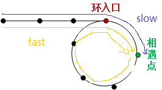

- [双指针技巧](#双指针技巧)
  - [快慢双指针](#快慢双指针)
  - [左右双指针](#左右双指针)
  - [双指针高级技巧 - 滑动窗口](#双指针高级技巧---滑动窗口)
  - [已知前序和中序遍历求后序遍历](#已知前序和中序遍历求后序遍历)
    - [基本概念](#基本概念)
  - [解题思路](#解题思路)

> 学习来源：https://labuladong.gitbook.io/algo/

> 边学习大佬的思路，边使用JS来实践


## 双指针技巧

### 快慢双指针

> 主要解决链表中的问题，比如典型的判定链表中是否包含环。当遇到有序数组时，应该优先想到双指针来解决问题，两个指针的同时遍历会减少空间复杂度和时间复杂度，比如删除排序数组中的重复项。

> 思路：快慢指针一般都初始化指向链表的头节点head，前进时快指针fast在前，慢指针slow在后。

案例分析：

1. 判断单链表中是否包含环-[leetCode 141.](https://leetcode-cn.com/problems/linked-list-cycle/)

一个完整的单链表结构：
- 头指针：一个普通的指针，它的特点是永远指向链表第一个节点的位置，头指针用于指明链表的位置，便于后期找到链表并使用表中的数据。
- 节点：
  - 头节点: 不含有数据的空节点
  - 首元节点: 第一个含有数据的节点
  - 其他节点，其中每一个节点都只知道下一个节点，最后一个节点指向null。


注意：链表中有头节点时，头指针指向头节点；反之，若链表中没有头节点，则头指针指向首元节点。

根据下述链表来明确几个关于节点的概念：


- 平时说的指针指的是指针变量，指针变量是存放指针的变量，指针就是地址
- 对于pA和pB,`pA.value=A`, `pB.value=B`，指针变量分别为pA,pB
  - `pA = pA.next`： 表示让指针pA指向它的下一个节点，指针变量的指向发生了变化，原链表的指向是不变的, 执行这行代码之后pA就指向了value为B的这个节点
  - `pA = pB`： 表示pA和pB指向同一个节点，执行这行代码之后，pA就指向了pB指的那个节点
  - `pA.next = pB.next`：表示指针pA的下一个节点是pB的下一个节点，这就会改变原链表的指向，执行这行代码，节点A的直接后继就变成了节点C。
  - 等号左边如果有`.next`会改变原链表,等号左边没有`.next`就是只操作的指针变量，原链表的指向不会发生改变。

我们已经封装了一个链表(该项目中`04-数据结构与算法/数据结构封装`)，可以用代码来验证一下：

```javascript
// 创建一个链表
var list = new LinkedList()
list.append('A')
list.append('B')
list.append('C')
console.log(list)  
// LinkedList {
//   head: Node { data: 'A', next: Node { data: 'B', next: Node { data: 'C', next: null } } },
//   length: 3
// }
console.log(list.toString())  // A B C

// 定义指针变量
let pA = list.head
console.log(pA)
// Node {
//   data: 'A',
//   next: Node { data: 'B', next: Node { data: 'C', next: null } }
// }

let pB = list.head.next
console.log(pB)  // Node { data: 'B', next: Node { data: 'C', next: null } }

// 验证pA = pA.next
pA = pA.next
console.log(pA) // Node { data: 'B', next: Node { data: 'C', next: null } }
console.log(list.toString())  // A B C

// 验证pA = pB
pA = pB
console.log(pA)  // Node { data: 'B', next: Node { data: 'C', next: null } }
console.log(list.toString())  // A B C

// 验证pA.next = pB.next
pA.next = pB.next
console.log(pA)  // Node { data: 'A', next: Node { data: 'C', next: null } }
console.log(pB)  // Node { data: 'B', next: Node { data: 'C', next: null } }
console.log(list.toString())  // A C 原链表中B节点被删除
```

开始思考这个题目：一个指针可以判断链表中是否含有环吗？
- 如果单链表中不含有环，这个指针最终一定会走到头，最终指向null，就说明是一个普通的单链表，不含有环，可以判断
- 如果单链表中含有环，这个指针就会陷入死循环，因为在环里面没有一个节点指向null，或者说没有null指针作为尾部节点，不能判断
  
一个不行，两个可以吗？
- 快指针fast和慢指针slow都从head开始前进，如果单链表中不含有环，fast指针就会先走到null，说明是普通的单链表，没有环。
- 如果链表中含有环，fast指针就一定会与slow指针相遇，如果能相遇就说明有环。
  
```javascript
var hasCycle = function (head) {
  if(!head || !head.next) return false   // 只含有头节点或者只含有首元节点一定不含有环
  // 定义两个快慢指针变量
  let slow = head
  let fast = head.next
  while(fast !== slow) { // 用来判断两个指针变量是否指向的是同一个地址，即fast是否追上了slow
    if(!fast || !fast.next) return false  // fast指针走到null，不含有环
    fast = fast.next.next  // 保证快指针的速度快
    slow = slow.next
  }
  return true
}
```
或者
```javascript
var hasCycle = function (head) {
  if(!head || !head.next) return false 
  let slow = head
  let fast = head
  while(fast !== null && fast.next !== null) { 
    fast = fast.next.next  // 保证快指针的速度快
    slow = slow.next
    if (fast == slow) return true
  }
  return false
}
```

2. 已知链表中含有环，返回这个环的起始位置



从上图可以看出：
- fast的速度是slow的一倍
- fast与slow第一次相遇时，假设slow走了k步，则fast一定走了2k步，fast比slow多走了一个环的距离，所以环的长度就是k(如果要你计算链表中环的长度也可以利用这一思路)
- 设相遇点与环入口之间的距离是m，则头节点到环入口的距离是k-m，也就是说从头节点开始走k-m就能到达环入口
- 从相遇点继续往前走，因为环的长度是k，相遇点到环入口的距离是m，则剩下的距离就是k-m

> 实现步骤：
> - 设置快慢指针都是从头节点开始，快指针的速度是慢指针速度的两倍
> - 快慢指针第一次相遇时，快慢指针中任意一个指针从头开始，另一个指针从相遇点开始同步前进(此时两个指针速度相同)
> - 两个指针第二次相遇的点就是环入口节点


```javascript
function EntryNodeOfLoop(pHead)
{
  if (!pHead || !pHead.next) return null
  let fast = pHead
  let slow = pHead
  while (fast != null && fast.next != null) {
    slow = slow.next
    fast = fast.next.next
    if (fast == slow) break
  }

  slow = pHead
  while (fast !== slow) {
    fast = fast.next
    slow = slow.next
  }
  return slow
}
```


3. 寻找链表的中点
> 思路分析：设置快慢指针，快指针的前进速度是慢指针的两倍，当快指针走到链表尾部时，如果链表长度是奇数，slow指针就是链表中点，如果链表长度是偶数，slow指针就在中点偏右的位置。

> 寻找链表中点的一个重要作用：归并排序

> 数组的归并排序：求中点索引递归地把数组二分，最后合并两个有序数组。对于链表而言，合并两个有序链表是简单的，难点在于二分，这就为其提供了一个思路。 

4. 寻找链表的倒数第k个元素-[剑指Offer 22.](https://leetcode-cn.com/problems/lian-biao-zhong-dao-shu-di-kge-jie-dian-lcof/)

> 思路分析：使用快慢指针，先让快指针走k步，然后快慢指针同速前进，当fast走到尾的时候slow就是倒数第k个节点

```javascript
var getKthFromEnd = function(head, k) {
    // 如果为null或者长度小于k返回null
    if(head == null) return null
    let slow = head
    let fast = head
    while(k--) {
        fast = fast.next
    }
    while(fast !== null) {
        slow = slow.next
        fast = fast.next
    }
    return slow
}
```

5. 删除排序数组中的重复项-[leetCode 26.](https://leetcode-cn.com/problems/remove-duplicates-from-sorted-array/)

```javascript
var removeDuplicates = function (nums) {
  let slow = 0
  let fast = 1
  while(fast < nums.length) {
    if(nums[slow] !== nums[fast]) {
      nums[++slow] = nums[fast]
    }
    fast++
  }
  return slow + 1
}
``` 


### 左右双指针

> 主要解决数组或字符串中的问题，比如二分查找

> 左右指针在解决数组和字符串问题时是使用索引值来控制的，一般初始化为`let left = 0, right = arr.length-1`

1. 二分查找
2. 两数之和 - [leetCode 1.](https://leetcode-cn.com/problems/two-sum/)

```javascript

```

3. 反转数组(反转字符串) - [leetCode 344.](https://leetcode-cn.com/problems/reverse-string/)
```javascript
var reverseString = function(s) {
    let left = 0
    let right = s.length-1
    while(left <= right) {
        let temp = s[left]
        s[left] = s[right]
        s[right] = temp
        left++
        right--
    }
    return s
}
```

### 双指针高级技巧 - 滑动窗口

### 已知前序和中序遍历求后序遍历

#### 基本概念
- 前序遍历：中 -> 左 -> 右
- 中序遍历：左 -> 中 -> 右
- 后序遍历：左 -> 右 -> 中

### 解题思路

1. 详细分析：已知前序和中序，如何构造树，进而得到其后序遍历

2. 选择题：

例1：

前序遍历：`GDAFEMHZ`

中序遍历：`ADEFGHMZ`

后序遍历：？

- 分析：
  - 前序遍历的第一个节点G一定是根节点，在中序遍历中根节点G左边的节点构成左子树，右边的节点构成右子树，G一定是后序遍历的最后一个元素，所以现在后序遍历中是：G
  - 接下来分析左子树中的排序：同样的，前序中的D一定是根节点，所以在后序遍历中D一定在其左子树的最后一个节点位置；中序遍历中D的左边节点构成左子树，后边节点构成右子树，除根节点D以外的节点AFE在前序遍历和中序遍历中的顺序不一致，则在后序遍历中的顺序是与前序遍历中顺序一致的，所以，现在左子树中的后序遍历是`AFED`
  - 接下来分析右子树：前序遍历中右子树的第一个节点M一定是根节点，在后序遍历中一定是在其右子树中的最后一个节点位置，中序遍历中M左边的节点构成左子树，右边的节点构成右子树，所以在右子树中的后序遍历是`HZM`
  - 综合上述分析，后序遍历(左右中): `AFEDHZMG`

例2：

前序遍历：`abcdefg`

中序遍历：`bcdaefg`

后序遍历：？

- 分析：
  - 前序遍历的第一个节点a一定是根节点，中序遍历中a左边的节点构成左子树，右边的节点构成右子树，在后序遍历中a一定是最后元素
  - 分析左子树：左子树中的元素是bcd，前序遍历和中序遍历中顺序是一致的，在这棵左子树中的根节点是b，cd都在其右子树上，在后序遍历中的顺序是与前序顺序相反的，其左子树在后序中的顺序是`dcb`
  - 分析右子树：右子树中的元素是efg，与左子树中的情况一样，前序和中序中的顺序是一致的，即fg都在其右子树上，所以在后序遍历中顺序与前序遍历是一致的，即后序遍历是`gfe`
  - 综上分析，后序遍历的结果是：`dcbgfea`