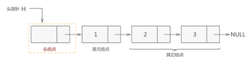
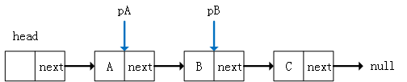

- [双指针技巧](#双指针技巧)
  - [快慢双指针](#快慢双指针)
  - [左右双指针](#左右双指针)

## 双指针技巧

### 快慢双指针

> 主要解决链表中的问题，比如典型的判定链表中是否包含环。当遇到有序数组时，应该优先想到双指针来解决问题，两个指针的同时遍历会减少空间复杂度和时间复杂度，比如删除排序数组中的重复项。

> 思路：快慢指针一般都初始化指向链表的头节点head，前进时快指针fast在前，慢指针slow在后。

案例分析：

1. 判断单链表中是否包含环-[leetCode 141.](https://leetcode-cn.com/problems/linked-list-cycle/)

一个完整的单链表结构：
- 头指针：一个普通的指针，它的特点是永远指向链表第一个节点的位置，头指针用于指明链表的位置，便于后期找到链表并使用表中的数据。
- 节点：
  - 头节点: 不含有数据的空节点
  - 首元节点: 第一个含有数据的节点
  - 其他节点，其中每一个节点都只知道下一个节点，最后一个节点指向null。



注意：链表中有头节点时，头指针指向头节点；反之，若链表中没有头节点，则头指针指向首元节点。

根据下述链表来明确几个关于节点的概念：



- 平时说的指针指的是指针变量，指针变量是存放指针的变量，指针就是地址
- 对于pA和pB,`pA.value=A`, `pB.value=B`，指针变量分别为pA,pB
  - `pA = pA.next`： 表示让指针pA指向它的下一个节点，指针变量的指向发生了变化，原链表的指向是不变的, 执行这行代码之后pA就指向了value为B的这个节点
  - `pA = pB`： 表示pA和pB指向同一个节点，执行这行代码之后，pA就指向了pB指的那个节点
  - `pA.next = pB.next`：表示指针pA的下一个节点是pB的下一个节点，这就会改变原链表的指向，执行这行代码，节点A的直接后继就变成了节点C。
  - 等号左边如果有`.next`会改变原链表,等号左边没有`.next`就是只操作的指针变量，原链表的指向不会发生改变。

我们已经封装了一个链表(该项目中`04-数据结构与算法/数据结构封装`)，可以用代码来验证一下：

```javascript
// 创建一个链表
var list = new LinkedList()
list.append('A')
list.append('B')
list.append('C')
console.log(list)  
// LinkedList {
//   head: Node { data: 'A', next: Node { data: 'B', next: Node { data: 'C', next: null } } },
//   length: 3
// }
console.log(list.toString())  // A B C

// 定义指针变量
let pA = list.head
console.log(pA)
// Node {
//   data: 'A',
//   next: Node { data: 'B', next: Node { data: 'C', next: null } }
// }

let pB = list.head.next
console.log(pB)  // Node { data: 'B', next: Node { data: 'C', next: null } }

// 验证pA = pA.next
pA = pA.next
console.log(pA) // Node { data: 'B', next: Node { data: 'C', next: null } }
console.log(list.toString())  // A B C

// 验证pA = pB
pA = pB
console.log(pA)  // Node { data: 'B', next: Node { data: 'C', next: null } }
console.log(list.toString())  // A B C

// 验证pA.next = pB.next
pA.next = pB.next
console.log(pA)  // Node { data: 'A', next: Node { data: 'C', next: null } }
console.log(pB)  // Node { data: 'B', next: Node { data: 'C', next: null } }
console.log(list.toString())  // A C 原链表中B节点被删除
```

开始思考这个题目：一个指针可以判断链表中是否含有环吗？
- 如果单链表中不含有环，这个指针最终一定会走到头，最终指向null，就说明是一个普通的单链表，不含有环，可以判断
- 如果单链表中含有环，这个指针就会陷入死循环，因为在环里面没有一个节点指向null，或者说没有null指针作为尾部节点，不能判断
  
一个不行，两个可以吗？
- 快指针fast和慢指针slow都从head开始前进，如果单链表中不含有环，fast指针就会先走到null，说明是普通的单链表，没有环。
- 如果链表中含有环，fast指针就一定会与slow指针相遇，如果能相遇就说明有环。
  
```javascript
var hasCycle = function (head) {
  if(!head || !head.next) return false   // 只含有头节点或者只含有首元节点一定不含有环
  // 定义两个快慢指针变量
  let slow = head
  let fast = head.next
  while(fast !== slow) { // 用来判断两个指针变量是否指向的是同一个地址，即fast是否追上了slow
    if(!fast || !fast.next) return false  // fast指针走到null，不含有环
    fast = fast.next.next  // 保证快指针的速度快
    slow = slow.next
  }
  return true
}
```


2. 已知链表中含有环，返回这个环的起始位置
```javascript

```
3. 寻找链表的中点

4. 寻找链表的倒数第k个元素


5. 删除排序数组中的重复项-[leetCode 26.](https://leetcode-cn.com/problems/remove-duplicates-from-sorted-array/)

```javascript
var removeDuplicates = function (nums) {
  let slow = 0
  let fast = 1
  while(fast < nums.length) {
    if(nums[slow] !== nums[fast]) {
      nums[++slow] = nums[fast]
    }
    fast++
  }
  return slow + 1
}
```
   


### 左右双指针

> 主要解决数组或字符串中的问题，比如二分查找