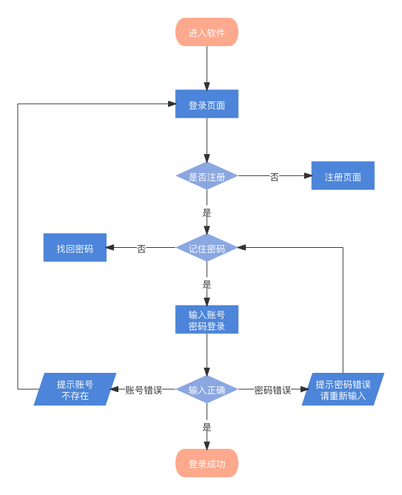

## 设计一个有有效期的本地缓存方案

### 前端本地缓存方案有哪些？

1. cookie
 + 兼容所有浏览器
 + 存储内容比较少「同源下只允许存储4KB」
 + 有存储时间限制「时间可以自己设置」
 + 不稳定:清除浏览器历史记录或者使用安全卫士清理电脑垃圾的时候，可以把cookie删掉
 + 浏览器隐私模式(无痕浏览模式)下是禁用cookie的
 + 不是单纯的客户端存储:
   + 客户端设置了cookie,向服务器发送请求的时候,浏览器总是默认的把本地存储的所有cookie信息,基于请求头传递给服务器
   + 服务器只要在响应头中设置set-cookie字段,浏览器会自己设置对应的cookie信息
 + 在跨域请求中,默认是不允许携带cookie信息的「想要携带需要自己特殊设置」
2. localStorage
  + H5中新增的API，不兼容低版本浏览器
  + 存储内容比cookie多「同源下最多允许存储5MB」
  + 没有存储时间限制，除非自己手动清除或者把浏览器卸载了，否则一直存在「持久化存储」
  + 清除历史记录以及垃圾清理、再或者隐私模式下，对localStorage存储没有影响「稳定」
  + localStorage是单纯本地存储，和服务器没有关系「当然我们可以手动的把localStorage存储的信息传递给服务器」
3. sessionStorage
  + 和localStorage操作语法一样，大部分特征也是相同的
  + sessionStorage会话存储，页面刷新sessionStorage存储信息有，但是页面一但关闭(会话结束)sessionStorage存储的信息自动清除
4. 全局变量（或者vuex公共状态管理）
  + 存储在运行内存中
  + 页面刷新和关闭，之前保存的信息都会释放掉
5. 本地数据库存储：IndexedDB、WebSQL...
6. 本地缓存存储：Cache Storage 、Application Cache...
7. 本地离线存储：Manifest

### 具体实践

#### 设计一个具备有效期的“数据缓存方案”

思路分析：可以设计一个函数storage，第一个参数是一个函数，用于从服务器请求数据，第二个参数是可能缓存在本地的某个key，第三个参数为缓存有效期，storage的返回值是一个promise实例，可以通过`.then`获取数据，就像下面这样使用：

```javascript
storage(query, 'userName', 10).then((val) => {
  // val 是从服务器获取的 或 是从本地缓存中获取的
  console.log(val)
})
```
所以，具体实现如下：
```javascript
/**
 * @description: 
 * @param {*} 
 *    query：a function to get data
 *    key: keyword cached locally
 *    limitTime: valid period stored locally of key
 * @return {*} promise
 */
const storage = (query, key, limitTime) => {
  if (typeof query !== "function") throw new TypeError("query is not a function!")
  if (typeof key !== "string") throw new TypeError("key is not a string!")
  if (typeof limitTime != "number" || isNaN(limitTime)) limitTime = 3600

  return new Promise(async resolve => {
    // 校验本地缓存
    const cache = localStorage.getItem(key)
    if (cache) {
        const { time, data } = JSON.parse(cache)
        if ((+new Date() - time) < (limitTime * 1000)) {
            // 本地缓存生效
            resolve(data)
            return
        }
    }
    // 从服务器获取
    const data = await query()
    localStorage.setItem(key, JSON.stringify({
        time: +new Date(),
        data
    }))
    resolve(data)
  })
}

const queryData = () => {
  return new Promise(resolve => {
    const xhr = new XMLHttpRequest
      xhr.open('GET', '../package.json')
      xhr.onreadystatechange = () => {
          if (xhr.readyState === 4 && xhr.status === 200) {
            resolve(JSON.parse(xhr.responseText))
          }
      }
      xhr.send(null)
  })
}
```

通过`localStorage`的方式大概就实现了一种具有有效期的数据缓存方案，这类方案有什么用呢？我们的实际应用场景是什么？最常接触到的一个需要有效缓存的场景就是用户登录。

一个完整通用的产品登录注册流程可以通过如下流程图清晰的描述：



在这里就不去详细描述流程图中的每个细节了，现在关注的是用户已经完成信息注册，来到了登录页面，用户在登录页面输入自己的用户名和密码并点击登录按钮之后发生的一系列事情。服务端是如何确认当前用户可以登录的？用户登录后的登录状态是如何存储的？登录之后过了一段时间如何确认当前用户登录态是否依然有效的？等等一系列问题，希望通过下面的两种方案分析以及小demo将其中的逻辑梳理清楚。
#### cookie+session实现用户登录

1. 实现用户登录的交互逻辑

用户点击登录按钮之后前端和后端分别需要做什么？

- 前端：
  - 表单格式校验：防止SQL注入或XSS攻击
  - 对于重要信息，比如密码，需要加密，比如可以使用md5加密
  - 向服务器发送登录请求: `post - /login`

- 服务端：
  - 获取客户端传递的数据，格式校验
  - 到数据库中查找，符合传递账号和密码的用户
    - 如果没找到，直接返回登录失败
     - 如果匹配到了用户
      - 把获取到的用户基本信息存储在服务器的session中
        - 服务器设置session，会和当前的客户端产生一个唯一的标识 `connect.sid`
        - 返回给客户端信息时，会在响应头中基于`set-cookie`把`connect.sid`返回给客户端
      - 把结果返回给客户端
- 前端：
  - 拿到的响应头中有`set-cookie`字段，值为`connect.sid`
  - 浏览器会把`connect.sid`设置在本地`cookie`中
  - 客户端可以进行相关的提示和跳转，还可以用一个字段记录是否已经登录，一般使用vuex存储。因为，如果在`cookie`中存储用户是否已经登录的字段值，别人知道了这个规则就知道什么时候是登录状态了，不安全，vuex是在运行内存中的，更安全。

如果使用vuex如何校验登录状态？页面刷新或者重新打开的时候，vuex中存储的登录标识会被删除，此时需要向服务器发送请求来校验是否登录，发一个GET类型的`/login`请求, 浏览器会自动在请求头中设置`cookie=connect.sid`，服务端获取到`connect.sid`的值，去session中查找，如果找到了之前存储的数据，就认为当前用户是登录的，如果没找到，就是未登录状态。服务端对于大部分请求，都需要先校验是否登录，未登录则返回非法访问。

可以通过如下流程图更清晰的表示上述过程：

tttttttttttttttt

接下来通过一个小demo来实际体验一下。demo技术栈：
- 前端：Vue3 + Element-plus
- 后端：NodeJS

> demo地址：aaaaaaaaaaaa


但是，cookie-session方案存在的问题：新版浏览器在前后端通信的时候，默认不允许携带cookie开启。

服务器端需要基于session存储登录的信息
  - session在服务器中不稳定，服务器重启就失效了
  - 不利于服务器集群

新一代互联网中使用就不太合适了。

新的方案使用token。

客户端向服务器发起POST请求/login，传递用户名和密码， 服务器拿到信息，如果登录成功，基于JWT算法，创建一个token令牌(生成规则：登录者信息+秘钥+有效时间戳)，在返回给客户端的信息中包含token，比如{code:0, token:'xxx'}，客户端把令牌信息存储到本地，用localStorage，下次发除登录意外的请求时，在请求头中把token带上传给服务器，服务器获取token后首先校验合法性(token是否合法秘钥对，时间有效，就可以解析出登陆者信息)，合法，就是登录的，反之为非法登录。


客户端不能伪造token，不合法就校验不通过。

A：token存储了

B：设置了A的token，也向服务器发请求，就是合法的，就能仿照A登录，不安全。

如何解决？？？

客户端给服务器，在请求头中带token，time时间戳，签名sign，这时服务端处了校验token合法性，还要校验签名的合法性，按照同样的加密规则，把传递的token_time进行处理，获取信的签名 和 传递签名对比，之前传递的签名会被存储，如果下次传递相同的签名，则认为是非法的。签名是服务器按照一定生成规则自己定义的，比如token+time+加密...

签名是每一次请求重新生成的，就是一个实施校验的东西。签名是存储在数据库中的，不存在服务器集群的问题。
