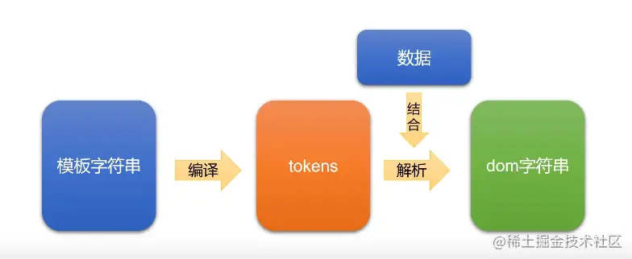
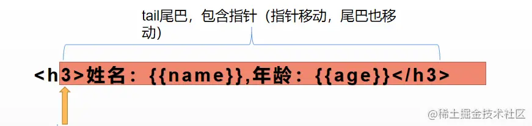
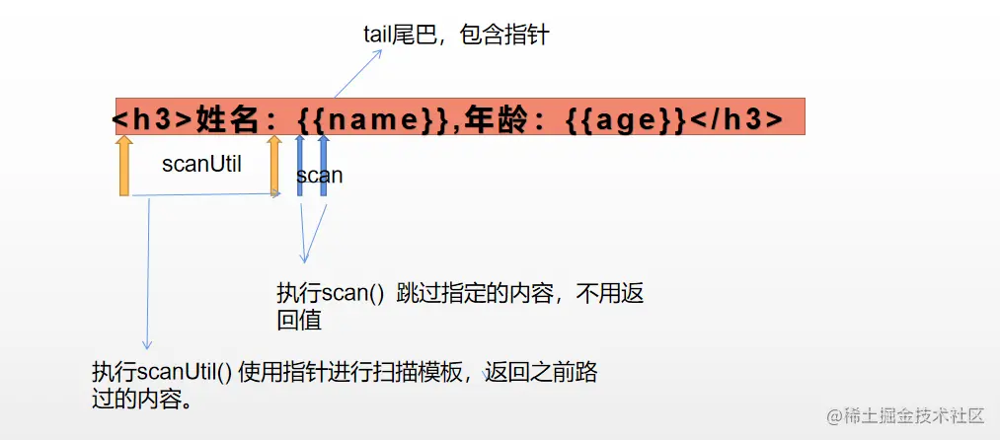

## mustache 模板语法

```javascript
1. {{keyName}}：变量替换
2. {{{keyName}}}：会将等特殊字符转译，如果想保持内容原样输出可以使用
3. {{#keyName}} {{/keyName}}：以#开始、以/结束表示区块会根据当前上下文中的键值来对区块进行一次或多次渲染。有类似if、foreach的功能
4. {{^keyName}} {{/keyName}}：keyName值为null, undefined, false时才渲染输出该区块内容
5. {{.}}：枚举，可以循环输出整个数组
6. {{!comments}}：注释
7. {{>partials}}：以>开始表示子模块，当结构比较复杂时，我们可以使用该语法将复杂的结构拆分成几个小的子模块
```
具体如何使用，参照当前项目目录mustache-howtouse

使用：https://www.npmjs.com/package/mustache

## 正则表达式

> mustache不能用简单的正则表达式思路实现
### replace

第一个参数：要匹配的正则，
第二个参数：可以是替换的字符串，也可以是一个函数。
第二个参数是函数的形式：第一个参数表示匹配到的正则部分，第二个参数表示匹配到的字符，第三个表示匹配到的字符所在位置，第四个表示需要匹配的字符串。一般来说第二个参数是我们想要的数据

```html
<div class="container"></div>
<script>
  const container = document.querySelector('.container')
  const data = {
      name: 'Milly',
      age: 18
  }
  var templateStr = `
      <h3>姓名：{{name}}, 年龄：{{age}}</h3>
  ` 
  // 正则里面()表示捕获里面的字母数据
  let dom = templateStr.replace(/\{\{(\w+)\}\}/g, (...args) => data[args[1]])
  console.log(dom)
</script>
```

### tokens 思想



来源：尚硅谷vue源码解析。

根据该原理图可以看出其基本流程为：将模板字符串先编译成 tokens，tokens当作中间的过渡形态，然后再将数据与tokens结合，并解析成DOM字符串。

但是，什么是tokens？tokens是一个JS的嵌套数组，其实就是模板字符串的JS表示，它是 AST（抽象语法树）、虚拟节点的起源。 还是不懂？举栗子：


简单的模板字符串：
```html
<h1>姓名：{{name}}，年龄：{{age}}</h1>
```
tokens：
```javscript
[
    ["text", "<h1>姓名："],
    ["name", "name"],
    ["text", "，年龄："],
    ["name", "age"],
    ["tetx", "</h1>"]
]
```

嵌套的模板字符串：
```javascript
var templateStr = `
  <ul>
    {{#array}}
    <li>
      {{name}}的爱好
      <ol>
        {{#hobbies}}
        <li>{{.}}</li>
        {{/hobbies}}    
      </ol>
    </li>
    {{/array}}
  </ul>
  `
```

tokens:
```javascript
[
  ["text", "<ul>"],
  ["#", "array", 
    [
      ["text", "<li>"],
      ["name", "name"],
      ["text", "的爱好<ol>"],
      ["#", "hobbies", 
        [
          ["text", "<li>"],
          ["name", "."],
          ["text", "</li>"]
        ]
      ],
      ["text", "</ol></li>"]
    ]
  ],
  ["text", "</ul>"]
]
```

外层有三个token，# 类型的 token 里面还包含着嵌套。

当遇到`{{}}`的时候会被封装成一个数组，数组里面第一个表示类型（text类型包括标签、文本，name类型表示匹配到`{{}}`，#类型表示要循环）。数组的第二个元素是文本内容，这个数组就是一个 token。

全部的 token（数组）合并就形成了一个 tokens。

## Scanner 类

在使用 mustache 基本用法的时候，是使用 mustache库 提供的 Mustache.render（）方法 将模板跟数据进行合并，然后生成 DOM 结构。底层是如何将我们的模板字符串，编译成上面所说的tokens的？其实就是使用了一个Scanner扫描器，对模板字符串的 `{{` 和 `}}` 进行截取和过渡。

Scanner类 的两个主要方法：
  - scan函数：Tries to match the given regular expression at the current position. Returns the matched text if it can match, the empty string otherwise
  - scanUtil函数：Skips all text until the given regular expression can be matched. Returns the skipped string, which is the entire tail if no match can be made

如何进行字符串收集？源码中通过一个标识变量来实现(tail：尾巴随指针改变而改变，包含指针)





## UMD通用模板

```javascript
function (global, factory) {
  typeof exports === 'object' && typeof module !== 'undefined' ? module.exports = factory() :
  typeof define === 'function' && define.amd ? define(factory) :
  (global = global || self, global.Mustache = factory());
}(this, function () {})
```


