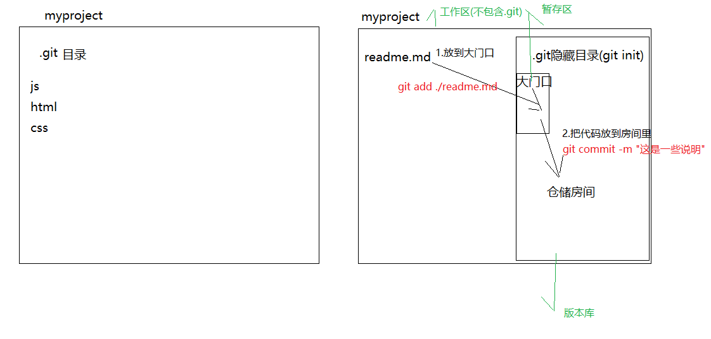
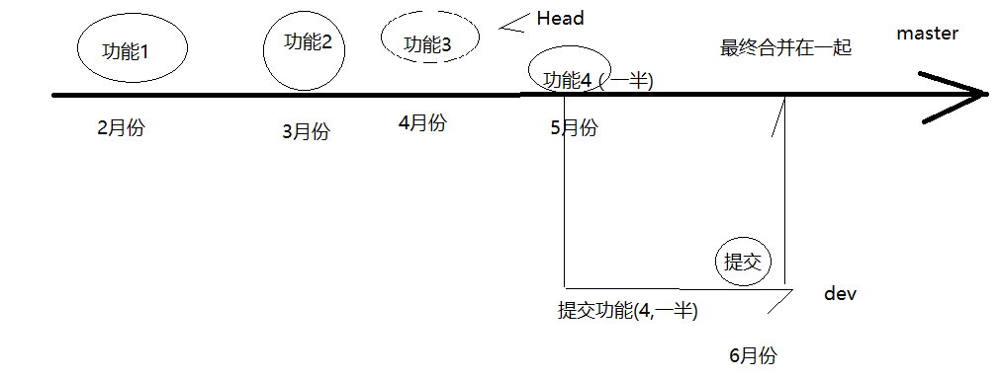

- [git安装与初始化](#git安装与初始化)
  - [git安装](#git安装)
  - [git初始配置与基本使用](#git初始配置与基本使用)
- [分支](#分支)
  - [创建分支](#创建分支)
  - [切换分支](#切换分支)
  - [合并分支](#合并分支)
- [github](#github)
  - [github设置SSH](#github设置ssh)
  - [提交代码到github(当作git服务器来用)](#提交代码到github当作git服务器来用)
- [Git指令清单](#git指令清单)

## git安装与初始化

### git安装

1. [官网安装](https://git-scm.com/)
2. [镜像地址](https://npm.taobao.org/mirrors/git-for-windows/)

安装过程很简单，直接[搜一个帖子](https://www.cnblogs.com/xiuxingzhe/p/9300905.html)照着一路安装即可

- 这个仓库会存放，git对我们项目代码进行备份的文件
- 在项目目录右键打开`git bash`
- 命令: `git init`

### git初始配置与基本使用

1. 初次运行git前的配置

- 用户信息

```javascript
配置用户名
git config --global user.name "Mengge Liu"

配置邮箱
git config --global user.email "liumengge_milly@163.com"
```
注意：如果使用了`--global`选项，则该命令只需要运行一次，之后不管你在该系统上做什么事情，git都会使用那些信息。当你想针对特定项目使用不同的用户名称与邮件地址时，可以在那个项目目录下运行没有 `–global` 选项的命令来配置。

- 检查配置信息

使用`git config --list`来查看配置项。

也可以使用`git config 配置项名称`来查看其中某一项配置。

2. 把代码存储到.git仓储中
   - 1.把代码放到仓储的门口
       + `git add ./readme.md` 所指定的文件放到暂存区
       + `git add ./` 把所有的修改的文件添加到暂存区
   - 2.把仓储门口的代码放到里面的房间中去
       + `git commit -m "这是对这次添加的东西的说明" `




3. 查看当前的状态

- 可以用来查看当前代码有没有被放到仓储中去
- 命令: `git status`  
  - 红色modified表示修改过但是还没有放到暂存区；  
  - 绿色modified表示已经将修改过的文件添加到了暂存区，但是还没有放入版本库
  - nothing to... 表示没有修改或者上次的存储工作已经完成

4. git中的忽略文件

- .gitignore,在这个文件中可以设置要被忽略的文件或者目录。
- 被忽略的文件不会被提交仓储里去.
- 在.gitignore中可以书写要被忽略的文件的路径，以/开头，
    一行写一个路径，这些路径所对应的文件都会被忽略，
    不会被提交到仓储中
    + 写法
        * ` /.idea  ` 会忽略.idea文件
        * ` /js`      会忽略js目录里的所有文件
        * ` /js/*.js` 会忽略js目录下所有js文件

5. 查看日志

- `git log`：查看历史提交的日志
- `git log --oneline`：可以看到简洁版的日志

6. 回退到指定的版本

- `git reset --hard Head~0`：表示回退到上一次代码提交时的状态
- `git reset --hard Head~1`：表示回退到上上次代码提交时的状态
- `git reset --hard [版本号]`：版本号指的是在提交的时候随机生成的那个字符串，可以通过版本号精确的回退到某一次提交时的状态
- `git reflog`：可以看到每一次切换版本的记录:可以看到所有提交的版本号， 在最左边的字符串

## 分支

### 创建分支
- `git branch dev`
    + 创建了一个dev分支
    + 在刚创建时dev分支里的东西和master分支里的东西是一样的

### 切换分支
- `git checkout dev`
    + 切换到指定的分支,这里的切换到名为dev的分支
    `git branch` 可以查看当前有哪些分支

### 合并分支
- `git merge dev`
    + 合并分支内容, 把当前分支与指定的分支(dev)进行合并
    + 当前分支指的是`git branch`命令输出的前面有*号的分支
- 合并时如果有冲突，需要手动去处理，处理后还需要再提交一次.




## github

- https://github.com
- 不是git, 只是一个网站
- 只不过这个网站提供了允许通过git上传代码的功能

### github设置SSH

从github上clone项目主要有两种方式：
- `https url`方式，比如使用https的方式clone该项目到本地，在`git bash`中输入：`git clone https://github.com/liumengge/frontEnder-Milly.git`
- SSH的方式
- https 和 SSH 的区别
  - https可以随意克隆github上的项目；SSH则是你必须是你要克隆的项目的拥有者或管理员，且需要先添加`SSH key` ，否则无法克隆
  - `https url`在push的时候是需要验证用户名和密码的；SSH 在push的时候，不需要输入用户名，如果配置SSH key的时候设置了密码，则需要输入密码，否则直接是不需要输入密码的


在github上添加`SSH Key`的步骤：
- 检查自己电脑上是不是已经存在`SSH key`，即运行git bash，输入`cd ~/.ssh`和`ls`，这两个命令用于检查是否已经存在 id_rsa.pub 或 id_dsa.pub 文件，如果文件已经存在，则可以跳过下面的创建SSH key的步骤进行下一步操作。
- 创建SSH key：git bash 中输入`ssh-keygen -t rsa -C "liumengge_milly@163.com"`
  - 上述代码的含义为：
    - `-t`：表示密钥类型，默认是rsa，可以省略； 
    - `-C`：设置注释文字，比如邮箱；
    - `-f`：指定密钥文件存储文件名，以上代码省略了这个参数，运行上述代码后会让你输入一个文件名，用于保存刚才生成的SSH key代码，可以直接按`Enter`键，使用默认文件名(推荐)，那么就会生成`id_rsa`和`id_rsa.pub`两个密钥文件。
  - 接下来会提示输入两次密码，这个密码是push文件的时候需要输入的密码，也可以不输入，直接按`Enter`，以后push文件的时候就不需要输入密码，直接提交到github上。
- 添加创建的SSH key到github上去
  - 拷贝`id_rsa.pub`文件的内容，可以使用编辑器打开文件复制或者使用git命令复制该文件的内容，即：`clip < ~/.ssh/id_rsa.pub`
  - 登陆自己的github，右上角点击Settings，然后点击左侧的SSH and GPG keys, 点击`New SSH key`添加一个新的SSH key，把刚才复制的SSH key代码粘贴到key对应的输入框中，注意SSH key代码的前后不要留空格或者回车。

### 提交代码到github(当作git服务器来用)
- `git push [地址] master`
 + 示例: `git push https://github.com/huoqishi/test112.git master  master`
 + 会把当前分支的内容上传到远程的master分支上

- `git pull [地址] master`
 + 示例: `git pull https://github.com/huoqishi/test112.git master`
 + 会把远程分支的数据得到:(*注意本地-要初始一个仓储!*)

- `git clone [地址]`
 + 会得到远程仓储相同的数据,如果多次执行会覆盖本地内容。


## Git指令清单


类别 | Git指令 | 功能含义
---------|----------|---------
 新建 | `git init` | 初始化当前项目
 - | `git init [project-name]` | 新建一个目录，将其初始化为Git代码库
 - | `git init --bare <directory>` | 运行这个命令会创建一个名为 directory，只包含 .git 子目录的空目录
- | `git clone [url]` | 将一个版本库拷贝到另一个目录中，同时也将分支都拷贝到新的版本库中。这样就可以在新的版本库中提交到远程分支
配置 | `git config --list` | 显示当前的Git配置
- | `git config -e [--global]` | 编辑Git配置文件
- | `git config --global user.email` | 配置全局用户邮箱
- | `git config --global user.name` | 配置全局用户名
- | `git config --global alias.<alias-name> <git-command>` | 定义当前用户所有提交使用的作者邮箱
- | `git config --system core.editor <editor>` | 为Git命令创建一个快捷方式(别名)
帮助查阅 | `git help` | 查找可用命令
 -  | `git help -a` | 查找所有可用命令
 -  | `git help <命令>` | 在文档当中查找特定的命令
 状态  | `git status` | 显示分支
 -  | `git help status` | 查看其他的git status的用法
 信息  | `git log --stat` | 显示commit历史，以及每次commit发生变更的文件
 -  | `git log -S [keyword]` | 根据关键词, 搜索提交历史
 -  | `git log [tag] HEAD --pretty=format:%s` | 显示某个commit之后的所有变动，每个commit占据一行
 -  | `git log [tag] HEAD --grep feature` | 显示某个commit之后的所有变动，其"提交说明"必须符合搜索条件
 -  | `git log --follow [file]`| 显示某个文件的版本历史，包括文件改名
 -  | `git log -p [file]`| 显示指定文件相关的每一次diff
 -  | `git log -5 --pretty --oneline`| 显示过去5次提交
 -  | `git shortlog -sn`| 显示所有提交过的用户，按提交次数排序
 -  | `git blame [file]`| 显示指定文件是什么人在什么时间修改过
 -  | `git diff`| 显示暂存区和工作区的差异
 -  | `git diff --cached [file]`| 显示暂存区和上一个commit的差异
 -  | `git diff HEAD`| 显示工作区与当前分支最新commit之间的差异
 -  | `git diff [first-branch]...[second-branch]`| 显示两次提交之间的差异
 -  | `git diff --shortstat "@{0 day ago}"`| 显示今天写了多少行代码
 -  | `git diff --cached`| 比较暂存区和版本库差异
 -  | `git diff --stat`| 仅仅比较统计信息
 -  | `git show [commit]`| 显示某次提交的元数据和内容变化
 -  | `git show --name-only [commit]`| 显示某次提交发生变化的文件
 -  | `git show [commit]:[filename]`| 显示某次提交时，某个文件的内容
 -  | `git reflog`| 显示当前分支的最近几次提交
 -  | `git br -r`| 查看远程分支
 -  | `git br <new_branch>`| 创建新的分支
 -  | `git br -v`| 查看各个分支最后提交信息
 -  | `git br --merged`| 查看已经被合并到当前分支的分支
 -  | `git br --no-merged`| 查看尚未被合并到当前分支的分支
 添加  | `git add [file]`| 添加一个文件
 -  | `git add /path/file/file1.js`| 添加一个子目录中的文件
 -  | `git add ./*.js`| 支持正则表达式
 -  | `git add [file1] [file2] ...`| 添加指定文件到暂存区
 -  | `git add [dir]`| 添加指定目录到暂存区，包括子目录
 -  | `git add .`| 添加当前目录的所有文件到暂存区
 -  | `git add -p`| 对于同一个文件的多处变化，可以实现分次提交
 删除  | `git rm test.js`| 移除 test.js
 -  | `git rm /path/file/test.js`| 移除 子目录中的文件
 -  | `git rm [file1] [file2] ...`| 删除工作区文件，并且将这次删除放入暂存区
 -  | `git rm --cached [file]`| 停止追踪指定文件，但该文件会保留在工作区
 分支  | `git branch -a`| 查看所有的分支和远程分支
 -  | `git branch`| 列出所有本地分支
 -  | `git branch -r`| 列出所有远程分支
 -  | `git branch -m [branch-name] [new-branch-name]`| 重命名分支
 -  | `git branch [branch-name] --edit-description`| 编辑分支的介绍
 -  | `git branch --track [branch] [remote-branch]`| 新建一个分支，与指定的远程分支建立追踪关系
 -  | `git branch --set-upstream [branch] [remote-branch]`| 建立追踪关系，在现有分支与指定的远程分支之间
 -  | `git branch -d [branch-name]`| 删除分支
 -  | `git branch -dr [remote-branch]`| 删除远程分支
 -  | `git branch [branch-name]`| 创建一个新的分支，但依然停留在当前分支
 -  | `git checkout -b [branch]`| 新建一个分支，并切换到该分支
 -  | `git checkout [branch-name]`| 切换到指定分支，并更新工作区
 -  | `git checkout -`| 切换到上一个分支
 -  | `git merge [branch]`| 合并指定分支到当前分支
 -  | `git cherry-pick [commit]`| 选择一个commit，合并进当前分支
 -  | `git co <branch>`| 切换到某个分支
 -  | `git co -b <new_branch>`| 创建新的分支，并且切换过去
 -  | `git co -b <new_branch> <branch>`| 基于branch创建新的new_branch
 -  | `git co $id`| 把某次历史提交记录checkout出来，但无分支信息，切换到其他分支会自动删除
 -  | `git co $id -b <new_branch>`| 把某次历史提交记录checkout出来，创建成一个分支
 -  | `git br -d <branch>`| 删除某个分支
 -  | `git br -D <branch>`| 强制删除某个分支 (未被合并的分支被删除的时候需要强制)
 检出  | `git checkout`| 检出一个版本库，默认将更新到master分支
 -  | `git checkout branchName`| 检出到一个特定的分支
 -  | `git checkout -b newBranch`| 新建一个分支，并且切换过去，相当于"git branch <名字>; git checkout <名字>"
 远程同步  | `git fetch [remote]`| 下载远程仓库的所有变动
 -  | `git remote -v`| 显示所有远程仓库
 -  | `git remote show [remote]`| 显示某个远程仓库的信息，查看远程服务器地址和仓库名称
 -  | `git remote add [shortname] [url]`| 增加一个新的远程仓库，并命名
 -  | `git remote add origin git@ github:xxx/xxx.git`| 添加远程仓库地址
 -  | `git remote set-url origin git@ github.com:xxx/xxx.git`| 设置远程仓库地址(用于修改远程仓库地址)
 -  | `git remote rm <repository>`| 删除远程仓库
 -  | `git push [remote] [branch]`| 上传本地指定分支到远程仓库
 -  | `git push`| 相当于 `git push origin master`，把本地的分支更新到远端origin的master分支上
 -  | `git push [remote] --force`| 强行推送当前分支到远程仓库，即使有冲突
 -  | `git push [remote] --all`| 推送所有分支到远程仓库
 撤销  | `git checkout [file]`| 恢复暂存区的指定文件到工作区
 -  | `git checkout [commit] [file]`| 恢复某个commit的指定文件到暂存区和工作区
 -  | `git checkout .`| 恢复暂存区的所有文件到工作区
 -  | `git reset [file]`|  重置暂存区的指定文件，与上一次commit保持一致，但工作区不变
 -  | `git reset --hard`| 重置暂存区与工作区，与上一次commit保持一致
 -  | `git reset [commit]`| 重置当前分支的指针为指定commit，同时重置暂存区，但工作区不变
 -  | `git reset --hard [commit]`| 重置当前分支的HEAD为指定commit，同时重置暂存区和工作区，与指定commit一致
 -  | `git reset --keep [commit]`| 重置当前HEAD为指定commit，但保持暂存区和工作区不变
 -  | `git revert [commit]`| 新建一个commit，用来撤销指定commit，后者的所有变化都将被前者抵消，并且应用到当前分支
 -  | `git revert HEAD`| 恢复最后一次提交的状态
 -  | `git stash, git stash pop`| 暂时将未提交的变化移除，稍后再移入
 -  | `git stash list`| 列所有stash
 -  | `git stash apply`| 恢复暂存的内容
 -  | `git stash drop`| 删除暂存区
 提交  | `git commit -m [message]`| 提交暂存区到仓库区附带提交信息
 -  | `git commit [file1] [file2] ... -m [message]`| 提交暂存区的指定文件到仓库区
 -  | `git commit -a`| 提交工作区自上次commit之后的变化，直接到仓库区
 -  | `git commit -v`| 提交时显示所有diff信息
 -  | `git commit --amend -m [message]`| 使用一次新的commit，替代上一次提交，如果代码没有任何新变化，则用来改写上一次commit的提交信息
 -  | `git commit --amend [file1] [file2] ...`| 重做上一次commit，并包括指定文件的新变化
 日志信息  | `git log`| 显示所有提交
 -  | `git log -n 10`| 显示某几条提交信息
 -  | `git log --merges`| 仅显示合并提交
 -  | `git log <file>`| 查看该文件每次提交记录
 -  | `git log -p <file>`| 查看每次详细修改内容的diff
 -  | `git log -p -2`| 查看最近两次详细修改内容的diff
 -  | `git log --stat`| 查看提交统计信息
 合并  | `git merge branchName`| 将其他分支合并到当前分支
 -  | `git merge --no-ff branchName`| 在合并时创建一个新的合并后的提交
 重命名或移动  | `git mv test.js test2.js`| 重命名
 -  | `git mv test.js ./new/path/test.js`| 移动
 -  | `git mv [file-original] [file-renamed]`| 改名文件，并且将这个改名放入暂存区
 -  | `git mv -f myFile existingFile`| 强制重命名或移动，这个文件已经存在，将要覆盖掉
 tag  | `git tag`| 列出所有的tag
 -  | `git tag [tag]`| 新建一个tag在当前commit
 -  | `git tag [tag] [commit]`| 新建一个tag在指定commit
 -  | `git tag -d [tag]`| 删除本地tag
 -  | `git push origin :refs/tags/[tagName]`| 删除远程tag
 -  | `git show [tag]`| 查看tag信息
 -  | `git push [remote] [tag]`| 提交指定tag
 -  | `git push [remote] --tags`| 提交所有tag
 -  | `git checkout -b [branch] [tag]`| 新建一个分支，指向某个tag
 拉取  | `git pull origin master`| 从远端origin的master分支更新版本库
 -  | `git pull --no-ff`| 抓取远程仓库所有分支更新并合并到本地，不要快进合并


