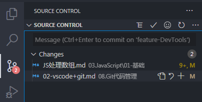

- [VSCode与Git](#vscode与git)

## VSCode与Git

- 基础
  - [Git安装](https://blog.csdn.net/qq_43715354/article/details/108638061)
  - [Git基本使用](https://www.liaoxuefeng.com/wiki/896043488029600)
  - 可以参看当前目录下的`git基础及常用命令.md`

- VScode 默认内置 `git` 的支持，当然图形化界面客户端也不一定要用 vscode ，git本身自带了一个图形化界面，安装了 `git` 之后在任意目录下右键就有 `Git GUI Here` 的选项。
  - 内置Git图标：VSCode左侧菜单栏第3个图标。
  - 文件更新，对仓库中已经被跟踪的文件进行修改，有三种文件状态
    - M：Modify的缩写，表示文件有修改
    - D：Delete的缩写，表示该文件被删除了
    - U：Update的缩写，表示该文件是新添加的
  - 选中显示的文件能够看到修改前后的对比
- 与github远程仓库结合进行代码管理：
  - 设置ssh免密登陆
  - github仓库创建项目
  - 项目clone到本地
  - 项目开发
  - commit代码
    
    上述每个changes文件上都对应3个按钮，分别是：
      
      + 打开文件
      + 放弃修改：
        + 如果是新修改的文件，会删除之前的修改，即该文件会恢复到修改之前的状态
        + 如果是新增加的文件，放弃修改就会提示彻底删除文件
        + 如果是删除的文件，放弃修改就会从仓库中恢复文件，这样就不用担心误删文件了
      + 确认修改：
        + 对应`git add`命令，会提到`stash changes`上
        + 确认了文件之后，在输入框中输入本次更新的内容，然后点击顶部的`√`就表示保存本次更新了，对应`git commit`命令。如果当前的所有changes文件都需要commit，则可以直接在输入框中输入上传的信息后点击`√`实现快速commit
  - push代码：
    - 点击`SOURCE CONTROL`右侧的`...(More Actions)`中的`Push`就实现了代码的push，对应`git push`命令
  - github查看远程代码库内容更新
  - pull代码：
    - 点击`SOURCE CONTROL`右侧的`...(More Actions)`中的`Pull`就实现了代码的同步更新，对应`git pull`命令
  - 切换分支
    - VSCode左下角显示的是当前所在开发分支，点击会看到当前仓库所包含的所有分支，如果想要创建一个新的分支，直接在输入框中输入分支名称之后回车即可实现新开发分支的创建。
    - 第一次上传新分支的时候会有一个提示框，点击ok，上传成功之后可以在github查看是否上传成功
  - 合并分支
    - 假设在当前分支`feature-DevTools`下开发完成了，按照上面的步骤一步步push到远程github仓库
    - 切换分支到master主分支，然后点击`...`中`Branch`下的`Merge Branch...`，最后点击`feature-DevTools`就可以实现将开发分支`feature-DevTools`合并到主分支master上了
    - 合并完成之后会看到VSCode左下角分支旁边有一个更新的图标，包含`向上/向下`两个箭头，并且箭头旁边会有对应的数字，其含义是：
      - 向上的箭头表示需要push的更新
      - 向下的箭头表示需要pull的更新
    - 左下角向上的箭头旁边有一个1，表示需要push，所以再将master分支push一下，就可以实现远程github的分支合并了

使用记录：
- 左侧有一个用户的图标，点击这个图标可以登录自己的github账户
- 在第一次push的时候VSCode提示：`Would you like Code to periodically run `git fetch`?`，具体查看了一下[`git fetch`与`git pull`的区别](https://www.cnblogs.com/runnerjack/p/9342362.html)后选择了`Yes`。然后继续后续操作实现分支合并，然后将合并后的master分支重新push到远程仓库中。
- 也可以分别在不同的分支进行开发，每天的内容push上去之后，当前分支内容全部完成再将分支合并到主分支上去