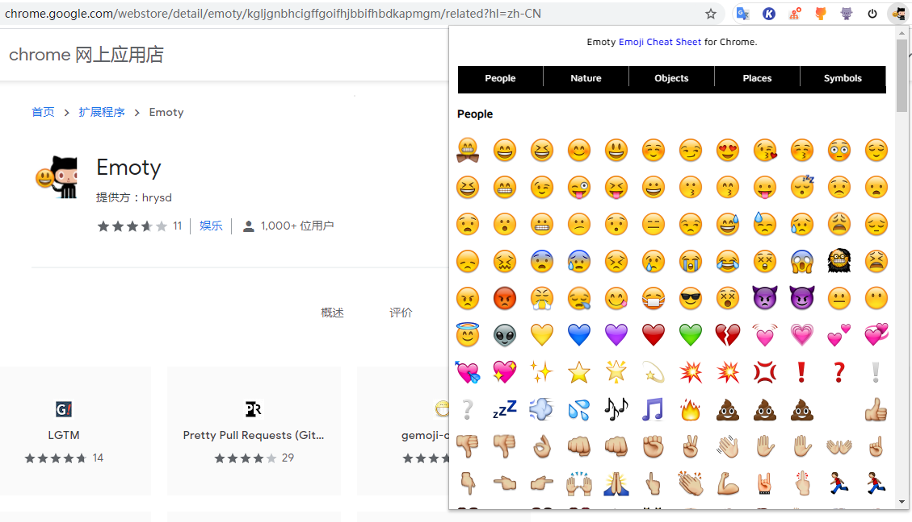

## github提交代码时使用emoji

### 安装：`npm i -g gitmoji-cli`

### commit时的符号指南

https://gitmoji.carloscuesta.me/

http://emojihomepage.com/

https://www.webfx.com/tools/emoji-cheat-sheet/

也可以在chrome安装`Emoty`插件就可以快速查找emoji啦，点击你想要的emoji就可以复制对应代码，直接粘贴就好:smirk:

### 提交指南

`git commit -m ':sparkles:提交可以有emoji嘛'`

效果：

结合vscode，还可以安装`Gitmoji`插件：

以后使用vscode提交代码的时候就可以快捷选择对应含义的emoji啦😆

😝😜👀😈😍