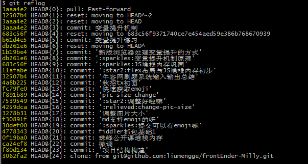

- [`git reset` 与 `git revert`](#git-reset-与-git-revert)
  - [`git reset`历史版本切换](#git-reset历史版本切换)
  - [`git revert`撤销操作](#git-revert撤销操作)
  - [`git revert` 和 `git reset`的区别](#git-revert-和-git-reset的区别)
- [在实际开发中，不小心在master上直接做任务开发了，但是为了避免后序各种问题我们还是在自己分支上开发比较好，该怎么办呢？](#在实际开发中不小心在master上直接做任务开发了但是为了避免后序各种问题我们还是在自己分支上开发比较好该怎么办呢)

## `git reset` 与 `git revert`

> 开开心心补充项目，到了push的时候有个文件太大了push不上去，就想着这个文件大家也能找到的，干脆不要上传了，可是我已经commit了，怎么回到之前的commit呢？

### `git reset`历史版本切换

首先，git要知道当前的版本是哪个版本，在Git中，用HEAD表示当前版本，也就是最新提交的版本，上一个版本就是HEAD^， 上上一个版本就是HEAD^^，此外，每一个版本都对应了一个commit_id。怎么查找commit_id？

`git log`看下自己之前的commit记录，emmm输出的内容太多了，不好看:cry:

以后查看直接用`git log --pretty=oneline`好了

上图中左侧黄色的非常长的字符串就是我每次commit生成的commit_id。如果想要回退到上上一个版本就可以使用`git reset --hard HEAD^^`，注意，reset有删除的意思，这时再`git log --pretty=oneline`，就会发现最新的两个版本已经不存在了。

如果这个时候你发现操作错了，还是想回到刚才那个最新的版本怎么办？使用`git reflog`, 这个命令按照之前经过的所有的commit路径按序排列，用来记录每一次命令。

比如我想回到"变量提升练习的版本"，则`git reset --hard b61d4e5`，这样就又回到之前的那个版本了，想要拿的文件也拿到了。

### `git revert`撤销操作

`git revert` 撤销 某次操作，此次操作之前和之后的commit和history都会保留，并且把这次撤销
作为一次最新的提交
  - `git revert HEAD`                  撤销前一次 commit
  - `git revert HEAD^`               撤销前前一次 commit
  - `git revert commit_id(比如：fa042ce57ebbe5bb9c8db709f719cec2c58ee7ff)`撤销指定的版本，撤销也会作为一次提交进行保存。

`git revert`是提交一个新的版本，将需要revert的版本的内容再反向修改回去，版本会递增，不影响之前提交的内容。

### `git revert` 和 `git reset`的区别
- `git revert`是用一次新的commit来回滚之前的commit，`git reset`是直接删除指定的commit
- 在回滚这一操作上看，效果差不多。但是在日后继续merge以前的老版本时有区别。因为`git revert`是用一次逆向的commit“中和”之前的提交，因此日后合并老的branch时，导致这部分改变不会再次出现，但是`git reset`是直接把某些commit在某个branch上删除，因而和老的branch再次merge时，这些被回滚的commit应该还会被引入。 
- `git reset` 是把HEAD向后移动了一下，而`git revert`是HEAD继续前进，只是新的commit的内容和要revert的内容正好相反，能够抵消要被revert的内容。

## 在实际开发中，不小心在master上直接做任务开发了，但是为了避免后序各种问题我们还是在自己分支上开发比较好，该怎么办呢？

- 在master上完成任务开发(或者没有全部完成也行)，完成commit，创建开发分支`git branch feature-git-test`(这个操作的意思是让feature-git-test分支指向最近的提交，但是还停留在master分支上)
- `git reset --hard origin/master`(将master回退到origin/master，并忽略所有新提交，那些提交保留在feature-git-test分支上)
- `git checkout feature-git-test`(切换到自己的开发分支上，其中就保留了最近的所有工作)
- `git push origin feature-git-test`(将本地分支推至远端)
 
 