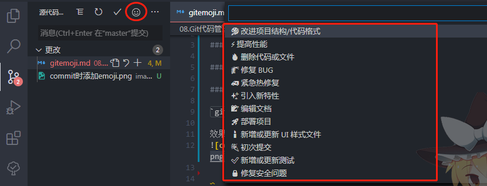

## github提交代码时使用emoji

### 安装：`npm i -g gitmoji-cli`

### commit时的符号指南

https://gitmoji.carloscuesta.me/

http://emojihomepage.com/

### 提交指南

`git commit -m ':sparkles:提交可以有emoji嘛'`

效果：

结合vscode，还可以安装`Gitmoji`插件：

以后使用vscode提交代码的时候就可以快捷选择对应含义的emoji啦😆

😝😜👀😈😍