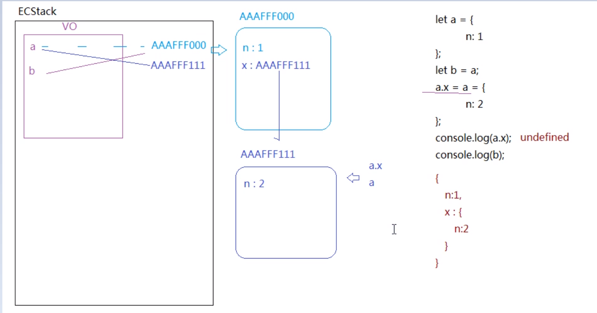
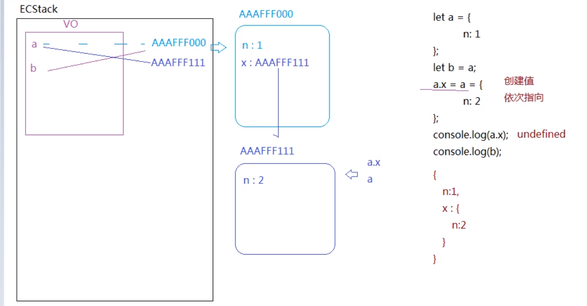

- [大前端时代](#大前端时代)
  - [JS中的几座大山](#js中的几座大山)
  - [JS的堆(heap)内存与栈(stack)内存](#js的堆heap内存与栈stack内存)
  - [JS引擎工作机制](#js引擎工作机制)
  - [深入V8底层 GO/VO/AO/EC及作用域和执行上下文](#深入v8底层-govoaoec及作用域和执行上下文)

## 大前端时代
- 软实力
  - 数据结构与算法
  - 设计模式
  - 组封装与插件封装
  - 编程思维
  - 实战能力
- 硬实力
  - javascript
  - ES6/ES7
  - HTML5/CSS3
  - Hybrid
  - vue
  - react
  - nodejs
  - 小程序
  - uni-app
  - typescript
  - ...

### JS中的几座大山
- 堆栈内存、闭包、作用域
- OOP面向对象编程思维
- JS中的同步异步编程
- DOM与BOM操作
- ajax、jsonp、proxy跨域、fetch同源请求、网站行为优化中的TCP与HTTP
- H5新特性

### JS的堆(heap)内存与栈(stack)内存

> JS之所以能够再浏览器中运行，是因为浏览器给JS提供了执行环境，即：栈内存(Stack)

引入：腾讯面试题

```javascript
let a = 0
let b = a
b++
alert(a)  // 注意：alert输出的结果都要toString(), 都是字符串， "0"

// 测试： alert({name: 'xxx'})  =>  [object Object]
let o = {}
o.a = 0
let b = o
b.a = 10
alert(o.a)  // "10"

```

涉及知识点：
- JS数据类型
  - 基本类型(值类型)：number string boolean null undefined NaN
  - 引用类型： object function
  - 特殊类型：symbol(也属于基本类型)
- 内存
  - 栈内存：提供代码运行的环境；存储基本类型
  - 堆内存：提供引用类型的存储空间
- 明确几个名词
  - ECStack(Execution Context Stack)：执行环境栈
  - EC(Execution Context)：执行上下文
    - VO(Variable Object)： 变量对象
    - AO(Activation Object):活动对象，函数的叫作AO，理解为VO的一个分支
- 变量赋值三步操作：1. 创建变量  2. 创建值  3. 关联
- 变量和值之间是指针关联的，注意不是拷贝一份！

以下是上述代码执行流程：


阿里面试题：
```javascript
let a = {
    n: 1
}
let b = a
a.x = a = {
    n: 2
}
console.log(a.x)
console.log(b)
```
理解`let a=b=13`：等价于`a = 13; b = 13`



### JS引擎工作机制
- 作用域
- 作用域链
- 闭包

```javascript
let a = 12,
    b = 12;
function () {
  console.log(a, b);
  let a = b = 13;
  console.log(a, b)
}
fn();
console.log(a, b)
```

```javascript

let i = 1
let fn = (i) => console.log(n + (++i))
let f = fn(1)
f(2)
fn(3)(4)
f(5)
console.log(i)
```


### 深入V8底层 GO/VO/AO/EC及作用域和执行上下文

- GO(Global Object)：全局对象

```javascript
// 浏览器全局对象
var globalObject = {
  Math: {},
  String: {},
  document: {},
  ...
  window: this
}
```
- ECStack: Execution Context Stack 执行环境栈(栈内存)
- EC： 执行环境(执行上下文)
  - VO(Variable Object): 变量对象
  - AO(Activation Object)：活动对象(函数的叫AO，是VO的一个分支)
- Scope: 作用域，创建函数的时候就赋予好的
- Scope Chian： 作用域链

举例：
```javascript
let x = 1
function A(y) {
  let x = 2
  function B(z) {
    console.log(x+y+z)
  }
  return B
}

let C = A(2)
C(3)
```
**注意：函数的作用域在创建的时候就生成了，而函数的执行上下文是在执行的时候生成的，每执行一次就创建一个新的执行上下文，在创建完执行上下文之后会形成作用域链，并且在函数执行前就初始化好了。**

- 模拟浏览器执行上述代码：
  - 第一步：创建全局执行上下文，并将其压入ECStack中
  ```javascript
  ECStack = [
    // => 全局执行上下文
    EC(G) = {
      // => 全局变量对象
      VO(G): {
        ... // => 包含全局对象原有的属性
        x = 1
        A = function (y) {...}
        A[[scope]] = VO(G)  // => 创建函数的时候就确定了其作用域
      }
    }
  ]
  ```
  - 第二步：执行函数A(2)
  ```javascript
  ECStack = [
    // => A的执行上下文
    EC(A) = {
      // => 作用域链表初始化为： AO(A) -> VO(G)
      [[scope]]: VO(G)
      scopeChain: <AO(A), A[[scope]]>
      // => 创建函数A的活动对象
      AO(A): {
        arguments: [0:2]
        y: 2
        x: 2
        B: function(z) {...},
        B[[scope]]: AO(A)
        this: window  // => 声明当前上下文执行主体
      }
    }

    // => 全局执行上下文
    EC(G) = {
      // => 全局变量对象
      VO(G): {
        ... // => 包含全局对象原有的属性
        x = 1
        A = function (y) {...}
        A[[scope]] = VO(G)  // => 创建函数的时候就确定了其作用域
      }
    }
  ]
  ```
  - 第三步：执行B/C函数 C(3)
  ```javascript
  ECStack = [
    // => B的执行上下文
    EC(B) = {
      [scope]: AO(A)
      scopeChain: <AO(B), B[[scope]], A[[scope]]>
      // => 创建函数B的活动对象
      AO(B): {
        arguments: [0:3]
        z: 3
        this: window
      }
    }

    // => A的执行上下文
    EC(A) = {
      // => 作用域链表初始化为： AO(A) -> VO(G)
      A[[scope]]: VO(G)
      scopeChain: <AO(A), A[[scope]]>
      // => 创建函数A的活动对象
      AO(A): {
        arguments: [0:2]
        y: 2
        x: 2
        B: function(z) {...},
        B[[scope]]: AO(A)
        this: window  // => 声明当前上下文执行主体
      }
    }

    // => 全局执行上下文
    EC(G) = {
      // => 全局变量对象
      VO(G): {
        ... // => 包含全局对象原有的属性
        x = 1
        A = function (y) {...}
        A[[scope]] = VO(G)  // => 创建函数的时候就确定了其作用域
      }
    }
  ]
  ```

