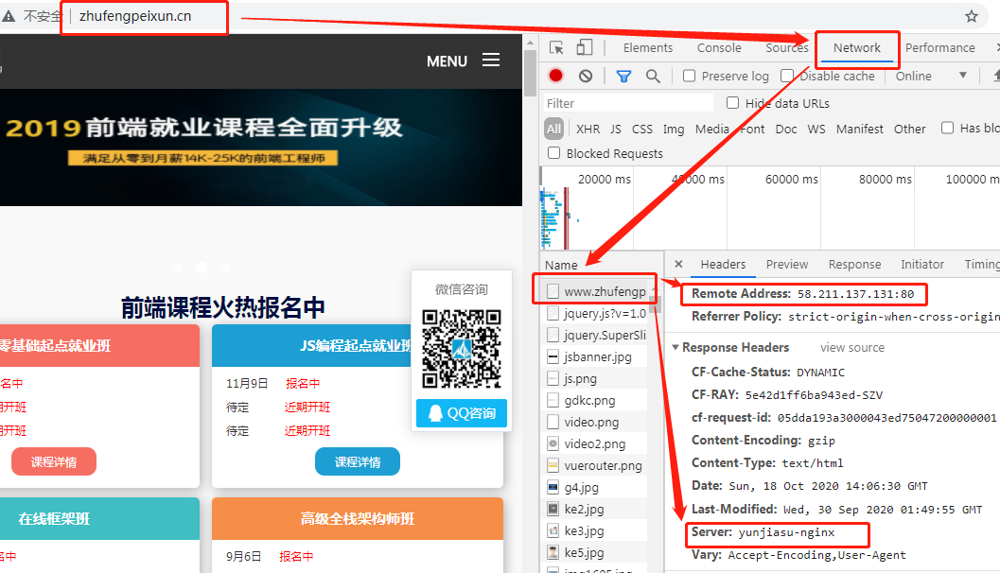

- [构建自己的个人博客](#构建自己的个人博客)
  - [hexo + github](#hexo--github)
  - [购买服务器搭建个人博客](#购买服务器搭建个人博客)
  - [怎么去查看服务器的外网IP地址？](#怎么去查看服务器的外网ip地址)
  - [购买服务器之后如何连接？](#购买服务器之后如何连接)

## 构建自己的个人博客

### hexo + github

基于github构建博客，写markdown文档，支持自定义域名解析。需要购买域名。

### 购买服务器搭建个人博客

- 在自己的电脑上构建博客的客户端(页面文件等)和服务器端(js文件、数据库等)。如果要想别人也能访问到我们的项目，就需要将当前的项目发布
- 项目发布
  - 购置一台服务器(阿里云服务器，里面有独立主机)，需要将我们的代码上传到服务器上(ftp上传)，注意，购买的服务器要是联网的。服务器上有两个IP地址：
    - 外网IP：不在同一个网段内的用户也可以访问到服务器
    - 局域网IP：相同网段的用户(比如自己的电脑)才可以访问服务器中的内容，比如：`http://127.0.0.1(localhost):8080/xxx.html`就是相当于一个局域网IP，可以访问本机上的内容
  - 上传之后，比如在服务器的C盘下有blogClient(存储客户端文件),blogServer(存储服务端文件)，还有其他比如做的毕设项目、自己的个人项目等等，别人访问我们服务器上的项目是怎么样准确访问你的毕设项目呢？在同一台服务器上会发布很多项目(Web服务器部署，构建客户端请求处理的服务)，部署方式有很多：Ngnix部署、Tomcat部署、IIS部署、Node部署等等，根据不同的端口号(0~65535)来区分不同的服务，假设我们的个人博客对应的是80端口号，比如毕设项目对应的是443端口号等等
- 通过外网ip访问到服务器，比如珠峰培训的官网(http://58.211.137.131:80/index.html)，但是这个ip地址对想要访问的用户来说非常繁琐，不便于记忆，所以可以使用域名
  - 【购买域名】：[万网](https://wanwang.aliyun.com/)(已被阿里云收购)，可以关注一下每年的域名促销活动，注意：需要进行域名备案
  - 【域名DNS解析】：解析设置 -> 添加记录
    - DNS域名解析可以通过域名找到对应服务器的公网IP
    - A记录：设定域名和服务器外网IP的关联
    - 记录值：表示的是服务器的外网IP
    - 可以解析二级或多级域名
  - 【购买服务器】：阿里云，云服务器ECS
    - ftp上传的主机对应的是购买服务器的外网IP

### 怎么去查看服务器的外网IP地址？

>   比如：珠峰培训的官网地址是http://www.zhufengpeixun.cn/

1. 方法一：

2. 方法二：
   win+R打开cmd，`ping www.zhufengpeixun.cn`
   
3. 方法三：
    
    使用域名解析工具`nslookup(name server lookup)`进行DNS域名解析查询，nslookup主要用来诊断域名系统 (DNS) 基础结构的信息，是一个用于查询 Internet域名信息或诊断DNS 服务器问题的工具。从Windows XP到Windows 10中都可以在"命令提示符"中使用。nslookup查找一个IP地住址的更有限制的替代者是ping命令。

    DNS域名解析：打开cmd输入`nslookup`，正常情况下应该得到像下图这样的结果
    

    但是我得到的是：
    

    查阅资料得到的答案是：pc机上可能有多个网络连接，每个网络连接可以有不同的dns，而且网络连接中还有主dns和备用dns。nslookup只是使用默认连接的主dns，所以很有可能出现这样的问题。

    解决方法：使用备用DNS服务器进行解析

    使用`ipconfig /all`查看所有DNS服务器：
    

    然后使用备用DNS服务器解析，即：`nslookup -qt=A 目标域名 DNS服务器ip`，来看下珠峰官网的解析结果：
    
    得到的两个ip地址是一致的。

    再来看下杭电官网的解析结果，
    
    会发现，使用不同的DNS服务器解析同一个域名的时候得到了两个不同的公网IP地址，为什么？
    
    推荐阅读：
    
    - [nslookup详解(name server lookup)( 域名查询)](https://www.cnblogs.com/Renyi-Fan/p/9045879.html)
    - [DNS域名解析流程剖析（详解版）](http://c.biancheng.net/view/6455.html)
    - [为什么域名能够访问网站，而直接使用IP不可以](https://blog.csdn.net/gui951753/article/details/83070180)
    
### 购买服务器之后如何连接？

> 之前男朋友买了阿里云的服务器(Linux)，我就准备连接他的啦~

一开始想要直接安装宝塔面板的，好像是它更新之后存在问题，无法正常连接，捣鼓半天决定使用下面这种方式了：

下载Xshell(对于学生是免费的)，一路安装完成之后新建会话：

在主机位置填写购买的服务器的外网IP，输入账号密码之后就可以正常连接了。

输入bt，然后输入14就会拿到服务器的宝塔网址了，将这个url粘贴到浏览器地址栏就可以管理我们的网站啦，奈斯~

