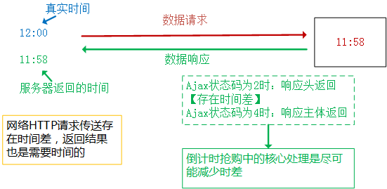

- [当用户在浏览器地址栏中输入网址，到看到页面，经历的步骤](#当用户在浏览器地址栏中输入网址到看到页面经历的步骤)
  - [URL地址解析](#url地址解析)
  - [1.解析输入的URL地址](#1解析输入的url地址)
  - [2.DNS解析](#2dns解析)
  - [3.基于TCP的三次握手，够建客户端和服务器端的连接通道](#3基于tcp的三次握手够建客户端和服务器端的连接通道)
  - [4.发送HTTP请求](#4发送http请求)
  - [5.服务器接收到请求，并进行处理，最后把信息返回给客户端](#5服务器接收到请求并进行处理最后把信息返回给客户端)
  - [6.断开TCP链接通道 （四次挥手）](#6断开tcp链接通道-四次挥手)
  - [7.客户端渲染服务器返回的结果](#7客户端渲染服务器返回的结果)
- [前端性能优化点](#前端性能优化点)
  - [1. 减少HTTP请求的次数和大小](#1-减少http请求的次数和大小)
    - [2.建立缓存机制](#2建立缓存机制)
    - [3.代码上的优化](#3代码上的优化)
    - [4.安全优化](#4安全优化)
    - [5.webpack上的优化](#5webpack上的优化)
- [AJAX基础知识](#ajax基础知识)
  - [AJAX的基础操作](#ajax的基础操作)
  - [电子商务平台倒计时抢购案例](#电子商务平台倒计时抢购案例)
  - [axios基础语法解读](#axios基础语法解读)
  - [基于Promise封装AJAX库](#基于promise封装ajax库)


## 当用户在浏览器地址栏中输入网址，到看到页面，经历的步骤


### URL地址解析

- URI / URL / URN
  - URI(Uniform Resource Identifier / 统一资源标志符)
  - URL(Uniform Resource Locator / 统一资源定位符)
  - URN（Uniform Resource Name / 统一资源名称）
- 一个完整URL的组成部分和实际意义
  - 协议：http 、 https 、 ftp
  - 域名：一级域名、二级域名、常用域名的性质
  - 端口号：80 、443 、 21 、 端口号范围
  - 请求资源路径名称：伪URL
  - 问号参数
  - HASH值

### 1.解析输入的URL地址
> 比如：http://www.zhufengpeixun.cn:80/index.html?lx=teacher#video

- 传输协议（把信息在客户端和服务器端进行传递，类似于快递小哥）
	+ http 超文本传输协议（传输的内容除了文本，还有可能是其它类型：二进制编码、BASE64码、文件流等等）
	+ https 比HTTP更加安全的传输协议（传输通道设置加密算法SSL），一般支付类网站都是HTTPS协议
	+ ftp 资源上传协议，一般应用于把本地文件直接上传到服务器端

- 域名  zhufengpeixun.cn
	+ 一级域名 www.zhufengpeixun.cn
	+ 二级域名 video.zhufengpeixun.cn
	+ 三级域名 webG.video.zhufengpeixun.cn
	+ 常用域名性质：.com国际 / .cn中国 / .gov政府 / .org官方 / .net系统 / .io博客 / .vip ...

- 端口号 （根据端口号，找到当前服务器上指定的服务）
	+ 0~65535之间
	+ 不同协议有自己默认的端口号（也就是自己不用写，浏览器会帮我们加上）
		+ http => 80
		+ https => 443
		+ ftp => 21
		+ 除这几个在书写的时候可以省略，其余的不能省

- 请求资源的路径和名称
	+ /stu/index.html
		+ 一般情况下，如果我们访问的是index.html等，可以省略不写（因为服务端一般会设置index.html为默认文档，当然可以自定义）
	+ 伪URL
		+ SEO优化    https://item.jd.com/100006038463.html(静态地址：可以被搜索引擎抓取到)    它的真实地址可能是 https://item.jd.com/detail.jsp?id=100006038463(动态页面地址，不利于SEO，需要利用URL伪重写技术把这样的地址重写为静态地址)
		+ 数据请求的接口地址  /user/list

- 问号传参部分 ?xxx=xxx
	+ 客户端基于GET系列请求，把信息传递会服务器，一般都会基于问号传参的模式
	+ 页面之间跳转，信息的一些通信也可以基于问号传参的方式（单页面中组件和组件跳转之间的信息通信，也可能基于问号传参）
	+ 关于传递的内容需要进行编码处理（处理特殊字符和中文）
		+ encodeURI / decodeURI ：只能把空格和中文内容进行编码和解码，所以一般应用这种模式处理整个URL的编码
        ```javascript
        let str = "http://www.zhufengpeixun.cn?l x=0&url=http://www.baidu.com/?aa=12&name=珠峰培训}"
		console.log(encodeURI(str))
        // http://www.zhufengpeixun.cn?l%20x=0&url=http://www.baidu.com/?aa=12&name=%E7%8F%A0%E5%B3%B0%E5%9F%B9%E8%AE%AD%7D
        ```
		+ encodeURIComponent / decodeURIComponent: 汇报所有的特殊字符和汉字都进行编码，一般不会整个URL编码，只会给传递的每一个参数值单独编码。
        ```javascript
        let str = "http://www.zhufengpeixun.cn?l x=0&url=http://www.baidu.com/?aa=12&name=珠峰培训}"
		console.log(encodeURIComponent(str))
        // http%3A%2F%2Fwww.zhufengpeixun.cn%3Fl%20x%3D0%26url%3Dhttp%3A%2F%2Fwww.baidu.com%2F%3Faa%3D12%26name%3D%E7%8F%A0%E5%B3%B0%E5%9F%B9%E8%AE%AD%7D
        ```
        客户端和服务器端都支持上述两种编码和解码方式(客户端和服务器端信息编码一般都是基于这种方式)
        ```javascript
        let str =
			`http://www.zhufengpeixun.cn?lx=0&url=${encodeURIComponent('http://www.baidu.com/?aa=12')}&name=${encodeURIComponent('珠峰培训')}`;
		console.log(str)
        // http://www.zhufengpeixun.cn?lx=0&url=http%3A%2F%2Fwww.baidu.com%2F%3Faa%3D12&name=%E7%8F%A0%E5%B3%B0%E5%9F%B9%E8%AE%AD
        ```
		+ escape / unescape：这种方式不一定所有的后台都有，所以一般只应用于客户端自己内部编码，例如：存储cookie信息，把存储的中文进行编码和解码；特殊符号也会被编码；
        ```javascript
        console.log(escape('珠峰培训'))
		console.log(unescape('%u73E0%u5CF0%u57F9%u8BAD'))
        ```
		+ ...

- 设置哈希HASH  #xxx


### 2.DNS解析
网站中，每发送一个TCP请求，都要进行DNS解析（一但当前域名解析过一次，浏览器一般会缓存解析记录，缓存时间一般在1分钟左右，后期发送的请求如果还是这个域名，则跳过解析步骤 =>这是一个性能优化点）

真实项目中，一个大型网站，他要请求的资源是分散到不同的服务器上的（每一个服务器都有自己的一个域名解析）
- WEB服务器（处理静态资源文件，例如：html/css/js等 的请求）
- 数据服务器（处理数据请求）
- 图片服务器 （处理图片请求）
- 音视频服务器
- ......
这样导致，我们需要解析的DNS会有很多次

**优化技巧：DNS Prefetch 即 DNS 预获取**
> 让页面加载（尤其是后期资源的加载）更顺畅更快一些
```
<meta http-equiv="x-dns-prefetch-control" content="on">
<link rel="dns-prefetch" href="//static.360buyimg.com">
<link rel="dns-prefetch" href="//misc.360buyimg.com">
<link rel="dns-prefetch" href="//img10.360buyimg.com">
<link rel="dns-prefetch" href="//img11.360buyimg.com">
<link rel="dns-prefetch" href="//img12.360buyimg.com">
.......
```

### 3.基于TCP的三次握手，够建客户端和服务器端的连接通道


只有建立好连接通道，才能基于HTTP等传输协议，实现客户端和服务器端的信息交互

- 第一次握手：由浏览器发起，告诉服务器我要发送请求了
- 第二次握手：由服务器发起，告诉浏览器我准备接受了，你赶紧发送吧
- 第三次握手：由浏览器发送，告诉服务器，我马上就发了，准备接受吧


### 4.发送HTTP请求

基于HTTP等传输协议，客户端把一些信息传递给服务器

- HTTP请求报文（所有客户端传递给服务器的内容，统称为请求报文）
	+ 谷歌控制台NetWork中可以看到
	+ 请求起始行
	+ 请求首部（请求头）
	+ 请求主体

- 强缓存 和 协商缓存（性能优化：减少HTTP请求的次数）
	+ 强缓存 ( Cache-Control 和 Expires )
	+ 协商缓存 ( Last-Modified 和 Etag )

### 5.服务器接收到请求，并进行处理，最后把信息返回给客户端

- WEB（图片）服务器和数据服务器
  - Tomcat
  - Nginx
  - Apache
  - IIS
  - ……

- HTTP响应报文（所有服务器返回给客户端的内容）
	+ 响应起始行
	+ 响应首部（响应头）
		+ date存储的是服务器的时间
		+ ...
	+ 响应主体 
	+ 服务器返回的时候是：先把响应头信息返回，然后继续返回响应主体中的内容（需要的信息大部分都是基于响应主体返回的）

### 6.断开TCP链接通道 （四次挥手）


- 当客户端把请求信息发送给服务器的时候，就挥第一次手：客户端告诉服务器端，我已经把请求报文都给你了，你准备关闭吧
- 第二次挥手：由服务器发起，告诉浏览器，我接收完请求报文，我准备关闭，你也准备吧；
- 第三次挥手：由服务器发起，告诉浏览器，我响应报文发送完毕，你准备关闭吧；
- 第四次挥手：由浏览器发起，告诉服务器，我响应报文接收完毕，我准备关闭，你也准备吧；

Connection: Keep-Alive 保持TCP不中断（性能优化点，减少每一次请求还需要重新建立链接通道的时间）

### 7.客户端渲染服务器返回的结果


## 前端性能优化点

### 1. 减少HTTP请求的次数和大小
- 合并压缩 webpack（代码比较少的情况下，尽可能使用内嵌式）
- 雪碧图
- 图片BASE64：`css-js.com`可以实现css/js代码的压缩、美化、加密与解密等,但是base64代码太多，不便于维护，慎用，开发中基于webpack的相关加载器file-loader可以自动把一些图片base64
- 尽量使用字体图标
- 对于动态获取的图片，采用图片懒加载（数据也做异步分批加载：开始只请求加载第一屏的数据，滑动到第几屏在加载这一屏的数据和图片）
	+ 骨架屏技术（首屏内容由服务器渲染；再或者开始展示占位结构，客户端再单独获取数据渲染；）
- 音视频取消预加载（播放的时候再去加载音视频文件，对于自动播放采取延迟播放的处理）
- 在客户端和服务器端进行信息交互的时候，对于多项数据我们尽可能基于JSON格式来进行传送(JSON格式的数据处理方便，资源偏小)
- 服务器采用GZIP压缩
- ....

#### 2.建立缓存机制

> 把一些请求回来的信息进行本地存储（缓存存储），在缓存有效期内，再次请求资源，直接从缓存中获取数据，而不是服务器上从新拉取
- DNS预获取
- 资源文件的强缓存和协商缓存（304）
- 数据也可以做缓存（把从服务器获取的数据存储到本地：cookie/localStorage/redux/vuex等，设定期限，在期限内，直接从本地获取数据即可）
- 离线存储（一般很少用）manifest
- CDN区域分布式服务器开发部署（费钱  效果会非常的好）
- ....

#### 3.代码上的优化
- 减少DOM的重绘和回流
- 在JS中尽量减少闭包的使用（内存优化）
- 在JS中避免“嵌套循环”和“死循环”
- 尽可能使用事件委托
- 尽量减少CSS表达式的使用(expression)
- CSS选择器解析规则是从右向左解析（基于less/sass开发的时候尽可能减少层级嵌套，目的是让选择器的前缀短一点）  【 a{}  和  .box a{}】
- 页面中的数据获取采用异步编程和延迟分批加载
- 尽可能实现JS的封装（低耦合高内聚），减少页面中的冗余代码
- 尽量减少对于filter滤镜属性的使用
- 在CSS导入的时候尽量减少使用@import导入式
- 使用window.requestAnimationFrame（JS中的帧动画）代替传统的定时器动画（能用CSS3动画的绝对不用JS动画）
- 减少递归的使用，避免死递归，避免由于递归导致的栈内存嵌套
- 基于SCRIPT调取JS的时候，可已使用 defer或者async 来异步加载
- 避免使用with语句
- ……

#### 4.安全优化

#### 5.webpack上的优化

============================================

## AJAX基础知识

> AJAX：async javascript and xml  异步的JS和XML

- XML（最早的时候，基于AJAX从服务器获取的数据一般都是XML格式数据，只不过现在基本上都是应用更小巧、更方便操作的JSON格式处理）
	+ HTML 超文本标记语言
	+ XHTML 严谨的HTML
	+ XML 可扩展的标记语言（基于标签结构存储数据）

- 异步的JS（基于AJAX实现局部刷新）

	+ 服务器渲染（一般都是同步：全局刷新）：只能重新向服务器发请求，让服务器从头到尾重新渲染数据，客户端重新呈现最新的内容，页面整体刷新一次
	+ 客户端渲染（一般都是异步：局部刷新）：
    	+ 第一次请求，请求index.html，拿到的是一个只有结构的页面，没有数据
    	+ 第二次请求，ajax请求，从服务器中只拿数据，通过JS循环创建li最后存储到box盒子中，这就是客户端基于AJAX获取数据，并动态展示的页面中的某个区域，页面整体不刷新，只需要局部内容改变即可，但是所有基于客户端渲染的内容，在页面源代码中看不到，导致不能被搜索引擎收录，也就不利于SEO

### AJAX的基础操作

- 核心四步：
  - 创建一个XHR对象
    - 不兼容`XMLHttpRequest`的浏览器使用`ActiveXObject`创建
  - 打开请求连接(配置请求信息)
    - `xhr.open([METHOD], [URL], [ASYNC], [USER-NAME], [USE-PASS])`
      - `[METHOD]`:请求方式
        - GET系列：从服务端获取
        - POST系列：向服务端发送数据
      - ：是否为异步请求，默认是true，表示默认是异步请求，设置为false时当前请求任务为同步请求(项目中基本上都采用异步请求)
      - `[USER-NAME], [USE-PASS]`：向服务器发请求所携带的用户名和密码，只有在服务器设置了安全来宾账号的情况下需要，一般不需要设置
  - 监听状态和获取数据，在不同状态中做不同的事情
  - 发送ajax请求(ajax任务开始，直到响应主体信息返回[ajax状态为4]代表当前任务结束)

```javascript
let xhr = new XMLHttpRequest;
xhr.open('get', './data.json?lx=1&name=xiaoxiao');
xhr.send();

// 
xhr = new XMLHttpRequest;
xhr.open('post', './data.json');
xhr.setRequestHeader('Content-Type', 'application/x-www-form-urlencoded');
xhr.send('lx=1&name=zhufeng&obj=' + encodeURIComponent(JSON.stringify({name: '哈哈'})));

// 
xhr = new XMLHttpRequest;
xhr.open('post', './data.json');
xhr.setRequestHeader('Content-Type', 'multipart/form-data');
let formData = new FormData();
formData.append('lx', 2);
formData.append('name', 'zhufeng');
formData.append('obj', {name: '哈哈'});
xhr.send(formData);
```

- GET系列 VS POST系列
  - 不管是哪一种请求方式，客户端都可以把信息传递给服务器，服务器也可以把信息返回给客户端，只不过GET偏向于拿(给的少拿的多)，而POST偏向于给(给的多拿的少)
  - `GET系列`：
    - GET 
    - HEAD: 只获取响应头的信息，不获取响应主体内容
    - DELETE: 删除，一般代指删除服务器上指定的文件
    - OPTIONS: 试探性请求，在CROSS跨域请求中，所以正常请求发送前，先发送一个试探请求，验证是否可以和服务器正常的建立连接
  - `POST系列`：
    - POST 
    - PUT: 新增，一般代指向服务器中新增文件
  - 基于GET向服务器发送请求，传递给服务器的方式：
    - 基于请求头传递给服务器, 比如想把本地的Cookie信息传递给服务器
    - 请求URL地址后面的问号传参（主要方式）： `xhr.open('get', './data.json?id=2&lx=0'); xhr.send();`
  - 基于POST向服务器发送请求，传递给服务器的方式：
    - 基于请求头传递给服务器
    - 基于请求主体，把信息传递给服务器（主要方式）： `xhr.open('post', './data.json');  xhr.send(data);`
  - 传递给服务器的数据格式：
    - `application/x-www-form-urlencoded：xxx=xxx&xxx=xxx` （最常用的方式） 【字符串】
    - `multipart/form-data` （也很常用，例如：表单提交或者文件上传）  【对象】
    - `raw` （可以上传text、json、xml、html等格式的文本，富文本编辑器中的内容可以基于这种格式传递）【字符串】
    - `binary` （上传二进制数据或者编码格式的数据）【二进制文件】
    - ...
  - 区别：
    -  GET请求传递给服务器的信息有大小的限制(因为它是基于地址问号传参方式传递信息，而URL有长度的限制：IE浏览器只有2KB大小...); 而POST请求理论上是没有大小限制的(实际操作中也都会给予限制);
    - GET请求相对POST请求来说不太安全，也是因为传参是基于地址栏问号传参，会被别人基于URL劫持的方式把信息获取到...所以真实项目中，涉及到安全的信息(例如：密码等)都是基于POST方式传递的(互联网面前人人都在裸奔，没有绝对的安全，我们需要更多的处理安全性)
    - GET请求容易产生缓存，原因还是因为GET是基于问号传参传递信息的，浏览器在每一次获取数据后，一般会缓存一下数据，下一次如果请求的地址和参数和上一次一样，浏览器直接获取缓存中的数据，所以我们基于GET发送请求，需要清除缓存的时候，一般都会在地址栏中添加一个随机数：`xhr.open('get', './data.json?lx=1&name=zhufeng&_='+Math.random())`

- 状态码：
  - AJAX状态码
    - 0 => UNSENT
    - 1 => OPENED
    - 2 => HEADERS_RECEIVED
    - 3 => LOADING
    - 4 => DONE
  - 服务器返回的HTTP网络状态码(代表服务器返回信息的状态)
    + 2开头的基本都是代表成功
     	+ 200 OK 正常返回数据 
   	+ 3开头的一般也是成功了，只不过中间做了一些额外处理
     	+ 301 Moved Permanently 永久性转移/重定向   一般应用于网站域名更换，访问老域名，永久都跳转到新的域名上，比如：浏览器地址栏中输入`360buy.com`会直接跳转到`jd.com`
  		+ 302 Move Temporarily 临时转移
  		+ 307 Temporary Redirect 临时重定向，一般应用于服务器的负载均衡
  		+ 304 Not Modified 读取的是缓存中的数据，这个是客户端和服务器端共建的协商缓存(把不经常更新，请求过的资源文件做缓存，后期在访问这些资源直接走缓存数据，除非服务器端更新了此资源，或者客户端强制清缓存刷新等)
    + 4开头的都是失败：失败的原因一般都是客户端的问题
      	+ 400 Bad Request  请求参数错误
        + 401 Unauthorized 无权限访问
   		+ 404 Not Found  地址错误
        + 405 Method Not Allowed 当前请求的方式服务器不支持
    + 5开头的都是失败：失败的原因一般都是服务器问题
        + 500 Internal Server Error  未知服务器错误
        + 502 Bad Gateway 作为网关或者代理工作的服务器尝试执行请求时，从上游服务器接收到的无效响应
   		+ 503 Service Unavailable  服务器超负荷，比如12306网站，遇到这种问题不断刷新，总能轮到你的
  > [HTTP状态码](https://baike.baidu.com/item/HTTP状态码/5053660?fr=aladdin#2_3)
  >
  > 真实项目中，后台开发者可能不是按照这个规则来进行处理的，不管传参或者权限是否正确等，只要服务器接收到请求最后都给返回200，再返回的JSON数据中，基于某一个字段（例如：code）来表示错误信息
   ```javascript
    {
        code:0,       // 0成功  1无权限  2参数错误  3服务器错误 ....
        message:''    // 当前状态的具体描述
    }
	```

```javascript
// xhr.onreadystatechange在open之前和之后监听到的ajax状态码是不同的
let xhr = new XMLHttpRequest;
xhr.onreadystatechange = function () {
	console.log(xhr.readyState)  // 1, 2, 3, 4
};
xhr.open('get', './data.json');
xhr.send(); // SEND后：首先响应头信息回来  最后响应主体信息再回来

// 
xhr = new XMLHttpRequest;
xhr.open('get', './data.json');
xhr.onreadystatechange = function () {
	console.log(xhr.readyState)  // 2, 3, 4
};
xhr.send(); 
```

- 汇总XHR的属性和方法及事件
  - xhr.response / xhr.responseText / xhr.responseXML：响应主体信息
  - xhr.status / xhr.statusText：HTTP状态码
  - xhr.readyState：ajax状态码
  - xhr.timeout：设置超时时间
  - xhr.withCredentials：跨域资源共享中，允许携带资源凭证
  - xhr.abort()：强制中断AJAX请求
  - xhr.getAllResponseHeaders()
  - xhr.getResponseHeader([key])
  - xhr.open()
  - xhr.overrideMimeType()
  - xhr.send()
  - xhr.setRequestHeader()：设置请求头信息（记住：属性值不能是中文和特殊字符）

```javascript
let xhr = new XMLHttpRequest;
xhr.open('get', './data.json');
// xhr.timeout = 100; 
// xhr.withCredentials=true; 
// xhr.abort() 
// xhr.setRequestHeader() 
xhr.setRequestHeader('name', encodeURIComponent("李易峰"));
xhr.onreadystatechange = function () {
	let status = xhr.status,   
		state = xhr.readyState,    
		result = null;
	
	if (!/^(2|3)\d{2}$/.test(status)) {
		// 错误处理
		return;
	}

	// AJAX状态码为2的时候，响应头信息回来了
	if (state === 2) {
		// 获取响应头信息
		console.log(xhr.getAllResponseHeaders());
		// console.log(xhr.getResponseHeader('date')); //=>获取的服务器日期是格林尼治时间 GMT（比北京时间晚了八个小时 北京时间：GMT+0800）
		console.log(new Date(xhr.getResponseHeader('date'))); //=>转换为北京时间
		return;
	}

	if (state === 4) {
		// 获取响应主体信息  responseText/responseType/responseXML
		result = xhr.response;
		console.log(result);
	}
};

xhr.send();
```

### 电子商务平台倒计时抢购案例

> - 有一个目标核定时间：比如2020年双十一  2020/11/11 00:00:00
> 
> - 获取当前客户端的时间`let time = new Date()  // (Thu Oct 22 2020 11:50:24 GMT+0800 (中国标准时间))`，但是客户可以自己修改本地时间，真实项目中只能做一些参考的工作，不能做严谨的校验，严谨校验的情况下，我们需要的时间是从服务器获取的。
> - 如何从服务器获取时间以及存在的问题：
>   - 可以基于ajax向服务器发送请求，服务器返回的信息中，响应头中包含了服务器时间(GMT 格林尼治时间  => 转换为北京时间  new Date([转换的时间]))
>   - 由于网络传送存在时差，导致客户端接收到的服务器时间和真实时间存在偏差(看下图中分析)
>     - 打开控制台在Timing中可以看到对应的时间，会发现下载响应主体也需要一定的时间当响应头信息返回（AJAX状态为2的时候），我们即获取到时间即可
>     - HTTP传输中的HEAD请求方式，就是只获取响应头的信息



```html
<div class="box">
  距离抢购时间还剩：
  <span id="spanBox"></span>
</div>
```

```javascript
// 封装一个函数获取服务器的时间 - 获取到时间之后做什么是，是一个异步操作
function queryServerTime() {
  return new Promise(resolve => {
    let xhr = new XMLHttpRequest
    xhr.open('head', './data.json')
    xhr.onreadystatechange = function () {
      if(!/^(2|3)\d{2}$/.test(xhr.status)) return
      if(xhr.readyState === 2) {
        // 响应头信息回来了
        let time = xhr.getResponseHeader('date')
        time = new Date(time) // 转换成标准北京时间
        resolve(time)
      }
    }
    xhr.send()
  })
}


async function init() {
  let serverTime = await queryServerTime()   // time就是成功时拿到的服务器时间
  let targetTime = new Date('2020/11/11 00:00:00')
  let autoTime = null  

  // 计算时差
  function computed() {
    let spanTime = targetTime - serverTime   // 获取两个时间的毫秒差
    
    if(spanTime <= 0) {
      // 表示已经到达抢购时间了
      spanBox.innerHTML = `00:00:00`
      clearInterval(autoTimer)
      return
    }

    let hours = Math.floor(spanTime / (60 * 60 * 1000))
    spanTime = spanTime - hours * 60 * 60 * 1000

    let minutes = Math.floor(spanTime / (60 * 1000))
    spanTime = spanTime - minutes * 60 * 1000

    let seconds = Math.floor(spanTime / 1000)
    hours = hours < 10 ? '0' + hours : hours

    minutes = minutes < 10 ? '0' + minutes : minutes
    seconds = seconds < 10 ? '0' + seconds : seconds

    spanBox.innerHTML = `${hours}:${minutes}:${seconds}`
  }

  computed()

  // 每隔1秒重新计算一次
  autoTime = setInterval(async _ => {
    // 我们应该重新从服务器获取时间（但是这样有很大延迟和服务器的压力太大了）
    // serverTime = await queryServerTime();
    // 我们可以基于第一次获取的时间，在原来的基础上，让其自动累加1000MS即可
    serverTime = new Date(serverTime.getTime() + 1000);
    computed();
  }, 1000)
}

init()
```

### axios基础语法解读

- 常用的AJAX库（调用起来更方便、操作起来更简单）：
  - 以JQ/ZEPTO为主的AJAX库（把AJAX四步操作进行封装、提供了JSONP跨域处理、对于一些常用操作[例如：GET/POST/表单序列化/参数处理等]进行封装处理）
  ```javascript
  $.ajax({
    url: './data.json',
    method: 'GET',
    data: {
      // 如果是GET请求，则问号传参，POST请求则基于请求主体传参
      lx: 1
    },
    success: function (result) {
      // 请求成功，从服务器获取的结果 RESULT
    }
  }); 
  ```
  - 以[AXIOS](http://www.axios-js.com/zh-cn/docs/ )为主的AJAX库（不仅对AJAX进行封装，而且是基于PROMISE进行管理） [最常用的]
  - ES6中新增的内置类[Fetch](https://developer.mozilla.org/zh-CN/docs/Web/API/Fetch_API)来完成HTTP数据请求（记住：FETCH不是AJAX，他是新的通讯方案；而且默认基于PROMISE进行管理） [很多公司已经开始尝试使用]
  - 跨域请求方案...

- 详细解读axios基础语法
```javascript
axios.request({
	url: './data.json',  // 请求的地址  baseURL：统一基本地址，一般是设置地址的前缀
	method: 'GET',  // 请求的方式
	// 设置请求头信息
	headers: {
		'Content-Type': 'application/x-www-form-urlencoded'
	},
	params: {},  // GET请求下，问号传参的信息
	data: {},  // POST请求下，请求主体传参的信息
}).then(result => {
	// 从服务器获取的结果: result
	/* 
	 * config: 你自己的配置信息
	 * headers: 响应头信息
	 * request: 原生的XHR AJAX对象
	 * status: 网络状态码  
	 * statusText
	 * data: 存储的是响应主体信息
	 */
	console.log(result);
});
```
 - 什么是baseURL？比如完整的url是：`http://127.0.0.1:8090/api/add`和`http://127.0.0.1:8090/api/list`
   - baseURL:  `http://127.0.0.1:8090/api`
   - url:  `/add`
   - url:  `/list`
  - 在真事项目开发中，上面的配置比较麻烦，有快捷请求的方法 `axios.get/delete/head/post/put... `或者 `axios.all`
 - `axios.get([URL],[OPTIONS])`
  ```javascript
  axios.get('./data.json', {
    params: {
      lx: 0
    },
    /* transformResponse: [function (data) {
      // 把从服务器获取的请求主体信息进行处理，处理完在执行THEN操作
    }] */
  });
  // .get([URL],[DATA],[OPTIONS])  [DATA]是基于请求主体传递的内容
  ```
  ```javascript
  // axios基于请求主体传递给服务器的默认是JSON格式，如果想变为x-www-form-urlencoded格式还需要自己处理，使用transformRequest

  axios.post('./data.json', {
    lx: 0,
    name: 'zhufeng'
  }, {
    // 针对于POST系列请求，把传递给服务器请求主体内容进行处理(函数中返回的结果就是最后基于请求主体传递给服务器的内容)
    transformRequest: [function (data) {
      // xxx=xxx&xxx=xxx
      let str = ``;
      for (let key in data) {
        if (!data.hasOwnProperty(key)) break;
        str += `&${key}=${data[key]}`;
      }
      str = str.substring(1);
      return str;
    }],
    headers: {
      'Content-Type': 'application/x-www-form-urlencoded'
    }
  }); 

  // let request1 = axios.get('./data.json');
  // let request2 = axios.get('./data.json');
  // let request3 = axios.get('./data.json');
  ```

  ```javascript
  axios.all([request1, request2, request3]).then(resuls => {
  	// 所有请求都成功后才会执行  => Promise.all
  	// resuls数组中存储了三个请求的结果
  	console.log(resuls);
  	let [val1, val2, val3] = results;
  });

  axios.all([request1, request2, request3]).then(
  	axios.spread((val1, val2, val3) => {
  		// 把ALL返回的多个结果进行处理
  		console.log(val1, val2, val3);
  	})
  );
  ```
- 配置默认值
  - axios.defaults.baseURL
  - axios.defaults.withCredentials
  - 请求拦截器 axios.interceptors.request
    - form-data、x-www-form-urlencoded、raw
    - QS库
  - 响应拦截器 axios.interceptors.response
  
  ```javascript
  import axios from 'axios';
  import qs from 'qs';

  /*
   * 根据环境变量区分接口的默认地址 
   */

  switch (process.env.NODE_ENV) {
      case "production":
          axios.defaults.baseURL = "http://api.zhufengpeixun.cn";
          break;
    case "test":
          axios.defaults.baseURL = "http://192.168.20.12:8080";
          break;
      default:
          axios.defaults.baseURL = "http://127.0.0.1:3000";
  }
  
  /*
   * 设置超时时间和跨域是否允许携带凭证 
   */
  axios.defaults.timeout = 10000;
  axios.defaults.withCredentials = true;
  
  /*
   * 设置请求传递数据的格式（看服务器要求什么格式）
   * x-www-form-urlencoded
   */
  axios.defaults.headers['Content-Type'] = 'application/x-www-form-urlencoded';
  axios.defaults.transformRequest = data => qs.stringify(data);
  
  /*
   * 设置请求拦截器 
   * 客户端发送请求 - > [请求拦截器] - > 服务器
   * TOKEN校验（JWT）：接收服务器返回的token，存储到vuex/本地存储中，每一次向服务器发请求，我们应该把token带上
   */
  axios.interceptors.request.use(config => {
      // 携带上token
      let token = localStorage.getItem('token');
      token && (config.headers.Authorization = token);
      return config;
  }, error => {
      return Promise.reject(error);
  });
  
  /*
   * 响应拦截器 
   * 服务器返回信息  -> [拦截的统一处理] -> 客户端JS获取到信息
   */
  axios.defaults.validateStatus = status => {
      // 自定义响应成功的HTTP状态码
      return /^(2|3)\d{2}$/.test(status);
  };
  axios.interceptors.response.use(response => {
      return response.data;
  }, error => {
      let {
          response
      } = error;
      if (response) {
          //=>服务器最起码返回结果了
          switch (response.status) {
              case 401: //=>权限
                  break;
              case 403: //=>服务器拒绝执行（token过期）
                  break;
              case 404: //=>找不到页面 
                  break;
          }
      } else {
          //=>服务器连结果都没有返回
          if (!window.navigator.onLine) {
              // 断网处理：可以跳转到断网页面
              return;
          }
          return Promise.reject(error);
      }
  });

  export default axios;
  ```

### 基于Promise封装AJAX库

- 封装一个类似于axios的ajax库，支持的功能：
  - 支持全局默认配置项：`_ajax.defaults.xxx = xxx`
  - 发送请求：`_ajax.get/post`
  - 每一次请求都会返回Promise实例，基于Promise设计模式进行管理
  - 支持：`_ajax.all`

先搭建起来整个架子：
```javascript
let _ajax = (function anonymous() {
    // 定义_ajax对象和默认参数配置
    let _ajax = {}

    _ajax.defaults = {
        url: '',
        baseURL: '',
        headers: {},
        cache: true,
        params: null,
        data: null,
        timeout: 10000,
        withCredentials: false,
        responseType: 'json',
        // => POST请求先走这个函数，在函数中可以把基于请求主体传递的内容做特殊处理
        transformRequest: null,
        // => 接收到服务器成功返回的结果后，我们把返回的结果进行处理
        transformResponse: null
    }

    // 用户传递的配置项，替换默认的配置项
    let init = function (options = {}) {
        // 处理headers这种二级结构，合并替换
        _ajax.defaults.headers = Object.assign(_ajax.defaults.headers, options.headers)
        delete options.headers
        return Object.assign(_ajax.defaults, options)
    }

    // 并发多个ajax请求
    _ajax.all = function (requestArr) {
        return Promise.all(requestArr)
    }

    // GET系列请求
    ['get','delete', 'head', 'options'].forEach(item => {
        _ajax[item] = function (url, options = {}) {
            //
        }
    })

    // POST系列请求
    ['post', 'put'].forEach(item => {
        _ajax[item] = function (url, data = {}, options = {}) {
            // 
        }
    })
    
    return _ajax
})();
```

不管是哪种请求方式，都需要发送一个ajax请求, 接下来创建MyAjax类,实现完整封装：
```javascript
let _ajax = (function anonymous() {
	class MyAjax {
		constructor(options) {
			// options => 最终处理好的配置项
			this.options = options;
			return this.init();
		}

		init() {
			// 解构出我们需要的参数配置
			let {
				url,
				baseURL,
				method,
				headers,
				cache,
				params,
				data,
				timeout,
				withCredentials,
				responseType,
				transformRequest,
				transformResponse
			} = this.options;

			let GET_REG = /^(GET|DELETE|HEAD|OPTIONS)$/i;

			// 请求的API地址的特殊处理
			// 1.拼接完成地址
			url = baseURL + url;
			// 2.GET系列请求下，要把params或者cache指定的随机数，以问号参数的方式拼接到URL的末尾
			if (GET_REG.test(method)) {
				if (params !== null) {
					url += `${_ajax.ask(url)}${_ajax.paramsSerializer(params)}`;
				}
				if (!cache) {
					// 随机数的属性名一般用_，因为项目中后台发现传递的是_，一般就不错这个传递值的处理（约定俗称的规范，根据JQ中的规则来的）
					url += `${_ajax.ask(url)}_=${Math.random()}`;
				}
			}

			// 请求主体传递参数的处理（POST系列）
			if (!GET_REG.test(method)) {
				if (typeof transformRequest === 'function') {
					data = transformRequest(data);
				}
			}

			// 基于PROMISE管理AJAX的发送
			return new Promise((resolve, reject) => {
				let xhr = new XMLHttpRequest;
				xhr.open(method, url);
				// 额外的配置设置（例如：请求头信息）
				xhr.timeout = timeout;
				xhr.withCredentials = withCredentials;
				if (headers !== null && typeof headers === "object") {
					for (let key in headers) {
						if (!headers.hasOwnProperty(key)) break;
						xhr.setRequestHeader(key, headers[key]);
					}
				}
				xhr.onreadystatechange = () => {
					let status = xhr.status,
						statusText = xhr.statusText,
						state = xhr.readyState,
						result = null;
					if (/^2\d{2}$/.test(status)) {
						if (state === 4) {
							result = xhr.response;
							responseType === 'json' ? result = JSON.parse(result) : null;
							// 处理响应头
							let responseHeaders = {},
								responseHeadersText = xhr.getAllResponseHeaders();
							responseHeadersText = responseHeadersText.split(/\n+/g);
							responseHeadersText.forEach(item => {
								let [key, value] = item.split(': ');
								if (key.length === 0) return;
								responseHeaders[key] = value;
							});
							// 返回结果
							resolve({
								config: this.options,
								request: xhr,
								status,
								statusText,
								data: result,
								headers: responseHeaders
							});
						}
						return;
					}
					// 请求失败	
					reject({
						config: this.options,
						request: xhr,
						status,
						statusText
					});
				};
				xhr.send(data);
			}).then(result => {
        // 相当于先做一个拦截处理
				if (typeof transformResponse === "function") {
					result = transformResponse(result);
				}
				return result;
			});
		}
	}

	// 定义_AJAX对象和默认参数配置
	let _ajax = {};
	_ajax.defaults = {
		url: '',
		baseURL: '',
		method: 'get',
		headers: {},
		// =>cache：axios中没有但是JQ中存在的配置：清除GET请求中的缓存（如果设置为false，则在所有GET请求的末尾追加一个随机数作为参数，一次保证每次请求地址不同，从而清除缓存）
		cache: true,
		params: null,
		data: null,
		timeout: 10000,
		withCredentials: false,
		responseType: 'json',
		// =>POST请求先走这个函数，我们在函数中可以把基于请求主体传递的内容做特殊处理
		transformRequest: null,
		// =>接收到服务器成功返回的结果后，我们把返回的结果进行处理
		transformResponse: null
	};

	// 用客户传递的配置项，替换默认的配置项
	let init = function (options = {}) {
		// 处理HEADERS这种二级结构合并替换的
		_ajax.defaults.headers = Object.assign(_ajax.defaults.headers, options.headers);
		delete options.headers;
		return Object.assign(_ajax.defaults, options);
	};

	// 并发多个AJAX请求，待所有请求都成功后做一些事情
	_ajax.all = function (requestArr) {
		return Promise.all(requestArr);
	};

	// GET系列请求
	['get', 'delete', 'head', 'options'].forEach(item => {
		_ajax[item] = function (url, options = {}) {
			options.url = url;
			options.method = item;
			return new MyAjax(init(options));
		};
	});

	// POST系列请求
	['post', 'put'].forEach(item => {
		_ajax[item] = function (url, data = {}, options = {}) {
			options.url = url;
			options.data = data;
			options.method = item;
			return new MyAjax(init(options));
		};
	});

	// 提供一些对内和对外都有用的公共方法
	_ajax.paramsSerializer = function (obj) {
		// 把对象变为x-www-form-urlencode格式
		let str = ``;
		for (let key in obj) {
			if (!obj.hasOwnProperty(key)) break;
			str += `&${key}=${obj[key]}`;
		}
		str = str.substring(1);
		return str;
	};

	_ajax.ask = function (url) {
		// 验证地址中是否存在问号，来决定分隔符用谁
		return url.indexOf('?') < 0 ? '?' : '&';
	};

	return _ajax;
})();
```

接下来测试一下：
```html
<!-- 测试1 -->
<script src="js/_ajax.js"></script>
<script>
  _ajax.get('./data.json', {
    cache: false,
    params: {
      lx: 0,
      name: 'liyifeng'
    },
    headers: {
      xxx: 'xxx'
    }
  }).then(result => {
    console.log(result)
  })
</script>
```
注意：我们在使用这个测试案例的时候，`open in browser`的时候会报错，报错信息是这样的:
```javascript
Access to XMLHttpRequest at 'file:///F:/work/2020%E5%B9%B4%E7%AC%AC%E4%B8%80%E6%9C%9FWeb%E9%AB%98%E7%BA%A7%E5%9C%A8%E7%BA%BF%E8%AF%BE%E8%AE%B2%E4%B9%89/20200225%E8%AE%B2%E4%B9%89%E5%92%8C%E4%BD%9C%E4%B8%9A/20200225/data.json?lx=0&name=liyifeng&_=0.94880710007918' from origin 'null' has been blocked by CORS policy: Cross origin requests are only supported for protocol schemes: http, data, chrome, chrome-extension, chrome-untrusted, https.
```
意思是说，本地跨域仅支持ajax跨域只支持这些协议框架：`http,https,data,chrome（Chrome浏览器）,chrome-extension（Chrome扩展插件），chrome-extension-resource（Chrome扩展资源）`，就是没有file协议!用了jsonp这种跨域json数据交互协议也没有，人家ajax就只支持那几个协议，并且jsonp交互协议也非官方正式的。

解决方法：vscode安装一个叫做 `live server`的插件，它可以支持以http形式打开html文件，就相当于是以服务器的形式打开的，右键 -> `Open with live server`或者使用快捷键`Alt+L+O`就可以正常打开了。

```html
<!-- 
  测试2：
    有transformResponse函数的统一拦截处理，
    我们就可以像下面一样做统一的配置。
    在我们封装的ajax库里面，拿到返回结果的时候设置了一次.then，也就是说从服务器拿到的结果要先经过transformResponse函数的处理，然后再给_ajax.get.then()拿到处理之后的返回结果。

-->
<script>
  _ajax.defaults.baseURL = './';
  _ajax.defaults.headers = {
    'Content-Type': 'application/x-www-form-urlencode'
  };
  _ajax.defaults.transformResponse = function (result) {
    return result.data;  // 只把请求主体的信息返回
  };

  _ajax.get('data.json', {
    cache: false,
    params: {
      key: '00d91e8e0cca2b76f515926a36db68f5',
      phone: '13594347817',
      passwd: '000000'
    },
    headers: {
      xxx: 'xxx'
    }
  }).then(result => {
    console.log(result);
  });
</script>
```
