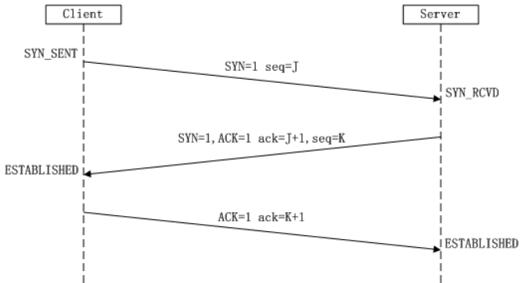
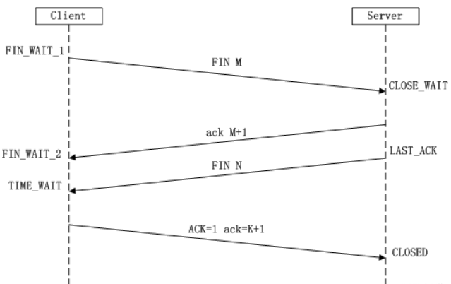
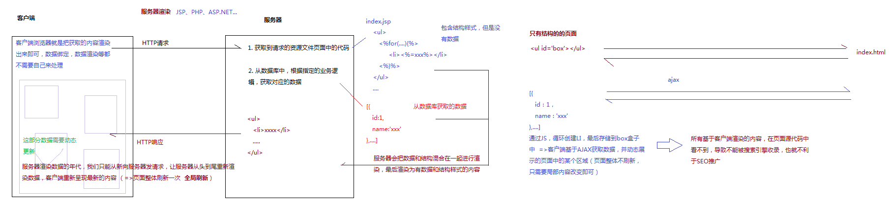

- [当用户在浏览器地址栏中输入网址，到看到页面，经历的步骤](#当用户在浏览器地址栏中输入网址到看到页面经历的步骤)
	- [URL地址解析](#url地址解析)
	- [1.解析输入的URL地址](#1解析输入的url地址)
	- [2.DNS解析](#2dns解析)
	- [3.基于TCP的三次握手，够建客户端和服务器端的连接通道](#3基于tcp的三次握手够建客户端和服务器端的连接通道)
	- [4.发送HTTP请求](#4发送http请求)
	- [5.服务器接收到请求，并进行处理，最后把信息返回给客户端](#5服务器接收到请求并进行处理最后把信息返回给客户端)
	- [6.断开TCP链接通道 （四次挥手）](#6断开tcp链接通道-四次挥手)
	- [7.客户端渲染服务器返回的结果](#7客户端渲染服务器返回的结果)
- [前端性能优化点](#前端性能优化点)
	- [1. 减少HTTP请求的次数和大小](#1-减少http请求的次数和大小)
		- [2.建立缓存机制](#2建立缓存机制)
		- [3.代码上的优化](#3代码上的优化)
		- [4.安全优化](#4安全优化)
		- [5.webpack上的优化](#5webpack上的优化)
	- [AJAX基础知识](#ajax基础知识)
	- [AJAX的基础操作](#ajax的基础操作)


## 当用户在浏览器地址栏中输入网址，到看到页面，经历的步骤


### URL地址解析

- URI / URL / URN
  - URI(Uniform Resource Identifier / 统一资源标志符)
  - URL(Uniform Resource Locator / 统一资源定位符)
  - URN（Uniform Resource Name / 统一资源名称）
- 一个完整URL的组成部分和实际意义
  - 协议：http 、 https 、 ftp
  - 域名：一级域名、二级域名、常用域名的性质
  - 端口号：80 、443 、 21 、 端口号范围
  - 请求资源路径名称：伪URL
  - 问号参数
  - HASH值

### 1.解析输入的URL地址
> 比如：http://www.zhufengpeixun.cn:80/index.html?lx=teacher#video

- 传输协议（把信息在客户端和服务器端进行传递，类似于快递小哥）
	+ http 超文本传输协议（传输的内容除了文本，还有可能是其它类型：二进制编码、BASE64码、文件流等等）
	+ https 比HTTP更加安全的传输协议（传输通道设置加密算法SSL），一般支付类网站都是HTTPS协议
	+ ftp 资源上传协议，一般应用于把本地文件直接上传到服务器端

- 域名  zhufengpeixun.cn
	+ 一级域名 www.zhufengpeixun.cn
	+ 二级域名 video.zhufengpeixun.cn
	+ 三级域名 webG.video.zhufengpeixun.cn
	+ 常用域名性质：.com国际 / .cn中国 / .gov政府 / .org官方 / .net系统 / .io博客 / .vip ...

- 端口号 （根据端口号，找到当前服务器上指定的服务）
	+ 0~65535之间
	+ 不同协议有自己默认的端口号（也就是自己不用写，浏览器会帮我们加上）
		+ http => 80
		+ https => 443
		+ ftp => 21
		+ 除这几个在书写的时候可以省略，其余的不能省

- 请求资源的路径和名称
	+ /stu/index.html
		+ 一般情况下，如果我们访问的是index.html等，可以省略不写（因为服务端一般会设置index.html为默认文档，当然可以自定义）
	+ 伪URL
		+ SEO优化    https://item.jd.com/100006038463.html(静态地址：可以被搜索引擎抓取到)    它的真实地址可能是 https://item.jd.com/detail.jsp?id=100006038463(动态页面地址，不利于SEO，需要利用URL伪重写技术把这样的地址重写为静态地址)
		+ 数据请求的接口地址  /user/list

- 问号传参部分 ?xxx=xxx
	+ 客户端基于GET系列请求，把信息传递会服务器，一般都会基于问号传参的模式
	+ 页面之间跳转，信息的一些通信也可以基于问号传参的方式（单页面中组件和组件跳转之间的信息通信，也可能基于问号传参）
	+ 关于传递的内容需要进行编码处理（处理特殊字符和中文）
		+ encodeURI / decodeURI ：只能把空格和中文内容进行编码和解码，所以一般应用这种模式处理整个URL的编码
        ```javascript
        let str = "http://www.zhufengpeixun.cn?l x=0&url=http://www.baidu.com/?aa=12&name=珠峰培训}"
		console.log(encodeURI(str))
        // http://www.zhufengpeixun.cn?l%20x=0&url=http://www.baidu.com/?aa=12&name=%E7%8F%A0%E5%B3%B0%E5%9F%B9%E8%AE%AD%7D
        ```
		+ encodeURIComponent / decodeURIComponent: 汇报所有的特殊字符和汉字都进行编码，一般不会整个URL编码，只会给传递的每一个参数值单独编码。
        ```javascript
        let str = "http://www.zhufengpeixun.cn?l x=0&url=http://www.baidu.com/?aa=12&name=珠峰培训}"
		console.log(encodeURIComponent(str))
        // http%3A%2F%2Fwww.zhufengpeixun.cn%3Fl%20x%3D0%26url%3Dhttp%3A%2F%2Fwww.baidu.com%2F%3Faa%3D12%26name%3D%E7%8F%A0%E5%B3%B0%E5%9F%B9%E8%AE%AD%7D
        ```
        客户端和服务器端都支持上述两种编码和解码方式(客户端和服务器端信息编码一般都是基于这种方式)
        ```javascript
        let str =
			`http://www.zhufengpeixun.cn?lx=0&url=${encodeURIComponent('http://www.baidu.com/?aa=12')}&name=${encodeURIComponent('珠峰培训')}`;
		console.log(str)
        // http://www.zhufengpeixun.cn?lx=0&url=http%3A%2F%2Fwww.baidu.com%2F%3Faa%3D12&name=%E7%8F%A0%E5%B3%B0%E5%9F%B9%E8%AE%AD
        ```
		+ escape / unescape：这种方式不一定所有的后台都有，所以一般只应用于客户端自己内部编码，例如：存储cookie信息，把存储的中文进行编码和解码；特殊符号也会被编码；
        ```javascript
        console.log(escape('珠峰培训'))
		console.log(unescape('%u73E0%u5CF0%u57F9%u8BAD'))
        ```
		+ ...

- 设置哈希HASH  #xxx


### 2.DNS解析
网站中，每发送一个TCP请求，都要进行DNS解析（一但当前域名解析过一次，浏览器一般会缓存解析记录，缓存时间一般在1分钟左右，后期发送的请求如果还是这个域名，则跳过解析步骤 =>这是一个性能优化点）

真实项目中，一个大型网站，他要请求的资源是分散到不同的服务器上的（每一个服务器都有自己的一个域名解析）
- WEB服务器（处理静态资源文件，例如：html/css/js等 的请求）
- 数据服务器（处理数据请求）
- 图片服务器 （处理图片请求）
- 音视频服务器
- ......
这样导致，我们需要解析的DNS会有很多次

**优化技巧：DNS Prefetch 即 DNS 预获取**
> 让页面加载（尤其是后期资源的加载）更顺畅更快一些
```
<meta http-equiv="x-dns-prefetch-control" content="on">
<link rel="dns-prefetch" href="//static.360buyimg.com">
<link rel="dns-prefetch" href="//misc.360buyimg.com">
<link rel="dns-prefetch" href="//img10.360buyimg.com">
<link rel="dns-prefetch" href="//img11.360buyimg.com">
<link rel="dns-prefetch" href="//img12.360buyimg.com">
.......
```

### 3.基于TCP的三次握手，够建客户端和服务器端的连接通道



只有建立好连接通道，才能基于HTTP等传输协议，实现客户端和服务器端的信息交互

- 第一次握手：由浏览器发起，告诉服务器我要发送请求了
- 第二次握手：由服务器发起，告诉浏览器我准备接受了，你赶紧发送吧
- 第三次握手：由浏览器发送，告诉服务器，我马上就发了，准备接受吧


### 4.发送HTTP请求

基于HTTP等传输协议，客户端把一些信息传递给服务器

- HTTP请求报文（所有客户端传递给服务器的内容，统称为请求报文）
	+ 谷歌控制台NetWork中可以看到
	+ 请求起始行
	+ 请求首部（请求头）
	+ 请求主体

- 强缓存 和 协商缓存（性能优化：减少HTTP请求的次数）
	+ 强缓存 ( Cache-Control 和 Expires )
	+ 协商缓存 ( Last-Modified 和 Etag )

### 5.服务器接收到请求，并进行处理，最后把信息返回给客户端

- WEB（图片）服务器和数据服务器
  - Tomcat
  - Nginx
  - Apache
  - IIS
  - ……

- HTTP响应报文（所有服务器返回给客户端的内容）
	+ 响应起始行
	+ 响应首部（响应头）
		+ date存储的是服务器的时间
		+ ...
	+ 响应主体 
	+ 服务器返回的时候是：先把响应头信息返回，然后继续返回响应主体中的内容（需要的信息大部分都是基于响应主体返回的）

### 6.断开TCP链接通道 （四次挥手）



- 当客户端把请求信息发送给服务器的时候，就挥第一次手：客户端告诉服务器端，我已经把请求报文都给你了，你准备关闭吧
- 第二次挥手：由服务器发起，告诉浏览器，我接收完请求报文，我准备关闭，你也准备吧；
- 第三次挥手：由服务器发起，告诉浏览器，我响应报文发送完毕，你准备关闭吧；
- 第四次挥手：由浏览器发起，告诉服务器，我响应报文接收完毕，我准备关闭，你也准备吧；

Connection: Keep-Alive 保持TCP不中断（性能优化点，减少每一次请求还需要重新建立链接通道的时间）

### 7.客户端渲染服务器返回的结果


## 前端性能优化点

### 1. 减少HTTP请求的次数和大小
- 合并压缩 webpack（代码比较少的情况下，尽可能使用内嵌式）
- 雪碧图
- 图片BASE64：`css-js.com`可以实现css/js代码的压缩、美化、加密与解密等,但是base64代码太多，不便于维护，慎用，开发中基于webpack的相关加载器file-loader可以自动把一些图片base64
- 尽量使用字体图标
- 对于动态获取的图片，采用图片懒加载（数据也做异步分批加载：开始只请求加载第一屏的数据，滑动到第几屏在加载这一屏的数据和图片）
	+ 骨架屏技术（首屏内容由服务器渲染；再或者开始展示占位结构，客户端再单独获取数据渲染；）
- 音视频取消预加载（播放的时候再去加载音视频文件，对于自动播放采取延迟播放的处理）
- 在客户端和服务器端进行信息交互的时候，对于多项数据我们尽可能基于JSON格式来进行传送(JSON格式的数据处理方便，资源偏小)
- 服务器采用GZIP压缩
- ....

#### 2.建立缓存机制

> 把一些请求回来的信息进行本地存储（缓存存储），在缓存有效期内，再次请求资源，直接从缓存中获取数据，而不是服务器上从新拉取
- DNS预获取
- 资源文件的强缓存和协商缓存（304）
- 数据也可以做缓存（把从服务器获取的数据存储到本地：cookie/localStorage/redux/vuex等，设定期限，在期限内，直接从本地获取数据即可）
- 离线存储（一般很少用）manifest
- CDN区域分布式服务器开发部署（费钱  效果会非常的好）
- ....

#### 3.代码上的优化
- 减少DOM的重绘和回流
- 在JS中尽量减少闭包的使用（内存优化）
- 在JS中避免“嵌套循环”和“死循环”
- 尽可能使用事件委托
- 尽量减少CSS表达式的使用(expression)
- CSS选择器解析规则是从右向左解析（基于less/sass开发的时候尽可能减少层级嵌套，目的是让选择器的前缀短一点）  【 a{}  和  .box a{}】
- 页面中的数据获取采用异步编程和延迟分批加载
- 尽可能实现JS的封装（低耦合高内聚），减少页面中的冗余代码
- 尽量减少对于filter滤镜属性的使用
- 在CSS导入的时候尽量减少使用@import导入式
- 使用window.requestAnimationFrame（JS中的帧动画）代替传统的定时器动画（能用CSS3动画的绝对不用JS动画）
- 减少递归的使用，避免死递归，避免由于递归导致的栈内存嵌套
- 基于SCRIPT调取JS的时候，可已使用 defer或者async 来异步加载
- 避免使用with语句
- ……

#### 4.安全优化

#### 5.webpack上的优化

============================================

### AJAX基础知识

> AJAX：async javascript and xml  异步的JS和XML

- XML（最早的时候，基于AJAX从服务器获取的数据一般都是XML格式数据，只不过现在基本上都是应用更小巧、更方便操作的JSON格式处理）
	+ HTML 超文本标记语言
	+ XHTML 严谨的HTML
	+ XML 可扩展的标记语言（基于标签结构存储数据）

- 异步的JS（基于AJAX实现局部刷新）

	+ 服务器渲染（一般都是同步：全局刷新）：只能重新向服务器发请求，让服务器从头到尾重新渲染数据，客户端重新呈现最新的内容，页面整体刷新一次
	+ 客户端渲染（一般都是异步：局部刷新）：
    	+ 第一次请求，请求index.html，拿到的是一个只有结构的页面，没有数据
    	+ 第二次请求，ajax请求，从服务器中只拿数据，通过JS循环创建li最后存储到box盒子中，这就是客户端基于AJAX获取数据，并动态展示的页面中的某个区域，页面整体不刷新，只需要局部内容改变即可，但是所有基于客户端渲染的内容，在页面源代码中看不到，导致不能被搜索引擎收录，也就不利于SEO

### AJAX的基础操作

- 核心四步：
  - 创建一个XHR对象
    - 不兼容`XMLHttpRequest`的浏览器使用`ActiveXObject`创建
  - 打开请求连接(配置请求信息)
    - `xhr.open([METHOD], [URL], [ASYNC], [USER-NAME], [USE-PASS])`
      - `[METHOD]`:请求方式
        - GET系列：从服务端获取
        - POST系列：向服务端发送数据
      - ：是否为异步请求，默认是true，表示默认是异步请求，设置为false时当前请求任务为同步请求(项目中基本上都采用异步请求)
      - `[USER-NAME], [USE-PASS]`：向服务器发请求所携带的用户名和密码，只有在服务器设置了安全来宾账号的情况下需要，一般不需要设置
  - 监听状态和获取数据，在不同状态中做不同的事情
  - 发送ajax请求(ajax任务开始，直到响应主体信息返回[ajax状态为4]代表当前任务结束)

```javascript
let xhr = new XMLHttpRequest;
xhr.open('get', './data.json?lx=1&name=xiaoxiao');
xhr.send();

// 
xhr = new XMLHttpRequest;
xhr.open('post', './data.json');
xhr.setRequestHeader('Content-Type', 'application/x-www-form-urlencoded');
xhr.send('lx=1&name=zhufeng&obj=' + encodeURIComponent(JSON.stringify({name: '哈哈'})));

// 
xhr = new XMLHttpRequest;
xhr.open('post', './data.json');
xhr.setRequestHeader('Content-Type', 'multipart/form-data');
let formData = new FormData();
formData.append('lx', 2);
formData.append('name', 'zhufeng');
formData.append('obj', {name: '哈哈'});
xhr.send(formData);
```

- GET系列 VS POST系列
  - 不管是哪一种请求方式，客户端都可以把信息传递给服务器，服务器也可以把信息返回给客户端，只不过GET偏向于拿(给的少拿的多)，而POST偏向于给(给的多拿的少)
  - `GET系列`：
    - GET 
    - HEAD: 只获取响应头的信息，不获取响应主体内容
    - DELETE: 删除，一般代指删除服务器上指定的文件
    - OPTIONS: 试探性请求，在CROSS跨域请求中，所以正常请求发送前，先发送一个试探请求，验证是否可以和服务器正常的建立连接
  - `POST系列`：
    - POST 
    - PUT: 新增，一般代指向服务器中新增文件
  - 基于GET向服务器发送请求，传递给服务器的方式：
    - 基于请求头传递给服务器, 比如想把本地的Cookie信息传递给服务器
    - 请求URL地址后面的问号传参（主要方式）： `xhr.open('get', './data.json?id=2&lx=0'); xhr.send();`
  - 基于POST向服务器发送请求，传递给服务器的方式：
    - 基于请求头传递给服务器
    - 基于请求主体，把信息传递给服务器（主要方式）： `xhr.open('post', './data.json');  xhr.send(data);`
  - 传递给服务器的数据格式：
    - `application/x-www-form-urlencoded：xxx=xxx&xxx=xxx` （最常用的方式） 【字符串】
    - `multipart/form-data` （也很常用，例如：表单提交或者文件上传）  【对象】
    - `raw` （可以上传text、json、xml、html等格式的文本，富文本编辑器中的内容可以基于这种格式传递）【字符串】
    - `binary` （上传二进制数据或者编码格式的数据）【二进制文件】
    - ...
  - 区别：
    -  GET请求传递给服务器的信息有大小的限制(因为它是基于地址问号传参方式传递信息，而URL有长度的限制：IE浏览器只有2KB大小...); 而POST请求理论上是没有大小限制的(实际操作中也都会给予限制);
    - GET请求相对POST请求来说不太安全，也是因为传参是基于地址栏问号传参，会被别人基于URL劫持的方式把信息获取到...所以真实项目中，涉及到安全的信息(例如：密码等)都是基于POST方式传递的(互联网面前人人都在裸奔，没有绝对的安全，我们需要更多的处理安全性)
    - GET请求容易产生缓存，原因还是因为GET是基于问号传参传递信息的，浏览器在每一次获取数据后，一般会缓存一下数据，下一次如果请求的地址和参数和上一次一样，浏览器直接获取缓存中的数据，所以我们基于GET发送请求，需要清除缓存的时候，一般都会在地址栏中添加一个随机数：`xhr.open('get', './data.json?lx=1&name=zhufeng&_='+Math.random())`

- 状态码：
  - AJAX状态码
    - 0 => UNSENT
    - 1 => OPENED
    - 2 => HEADERS_RECEIVED
    - 3 => LOADING
    - 4 => DONE
  - 服务器返回的HTTP网络状态码(代表服务器返回信息的状态)
    + 2开头的基本都是代表成功
     	+ 200 OK 正常返回数据 
   	+ 3开头的一般也是成功了，只不过中间做了一些额外处理
     	+ 301 Moved Permanently 永久性转移/重定向   一般应用于网站域名更换，访问老域名，永久都跳转到新的域名上，比如：浏览器地址栏中输入`360buy.com`会直接跳转到`jd.com`
  		+ 302 Move Temporarily 临时转移
  		+ 307 Temporary Redirect 临时重定向，一般应用于服务器的负载均衡
  		+ 304 Not Modified 读取的是缓存中的数据，这个是客户端和服务器端共建的协商缓存(把不经常更新，请求过的资源文件做缓存，后期在访问这些资源直接走缓存数据，除非服务器端更新了此资源，或者客户端强制清缓存刷新等)
    + 4开头的都是失败：失败的原因一般都是客户端的问题
      	+ 400 Bad Request  请求参数错误
        + 401 Unauthorized 无权限访问
   		+ 404 Not Found  地址错误
        + 405 Method Not Allowed 当前请求的方式服务器不支持
    + 5开头的都是失败：失败的原因一般都是服务器问题
        + 500 Internal Server Error  未知服务器错误
        + 502 Bad Gateway 作为网关或者代理工作的服务器尝试执行请求时，从上游服务器接收到的无效响应
   		+ 503 Service Unavailable  服务器超负荷，比如12306网站，遇到这种问题不断刷新，总能轮到你的
  > [HTTP状态码](https://baike.baidu.com/item/HTTP状态码/5053660?fr=aladdin#2_3)
  >
  > 真实项目中，后台开发者可能不是按照这个规则来进行处理的，不管传参或者权限是否正确等，只要服务器接收到请求最后都给返回200，再返回的JSON数据中，基于某一个字段（例如：code）来表示错误信息
   ```javascript
    {
        code:0,       // 0成功  1无权限  2参数错误  3服务器错误 ....
        message:''    // 当前状态的具体描述
    }
	```

```javascript
// xhr.onreadystatechange在open之前和之后监听到的ajax状态码是不同的
let xhr = new XMLHttpRequest;
xhr.onreadystatechange = function () {
	console.log(xhr.readyState)  // 1, 2, 3, 4
};
xhr.open('get', './data.json');
xhr.send(); // SEND后：首先响应头信息回来  最后响应主体信息再回来

// 
xhr = new XMLHttpRequest;
xhr.open('get', './data.json');
xhr.onreadystatechange = function () {
	console.log(xhr.readyState)  // 2, 3, 4
};
xhr.send(); 
```

- 汇总XHR的属性和方法及事件
  - xhr.response / xhr.responseText / xhr.responseXML：响应主体信息
  - xhr.status / xhr.statusText：HTTP状态码
  - xhr.readyState：ajax状态码
  - xhr.timeout：设置超时时间
  - xhr.withCredentials：跨域资源共享中，允许携带资源凭证
  - xhr.abort()：强制中断AJAX请求
  - xhr.getAllResponseHeaders()
  - xhr.getResponseHeader([key])
  - xhr.open()
  - xhr.overrideMimeType()
  - xhr.send()
  - xhr.setRequestHeader()：设置请求头信息（记住：属性值不能是中文和特殊字符）

```javascript
let xhr = new XMLHttpRequest;
xhr.open('get', './data.json');
// xhr.timeout = 100; 
// xhr.withCredentials=true; 
// xhr.abort() 
// xhr.setRequestHeader() 
xhr.setRequestHeader('name', encodeURIComponent("李易峰"));
xhr.onreadystatechange = function () {
	let status = xhr.status,   
		state = xhr.readyState,    
		result = null;
	
	if (!/^(2|3)\d{2}$/.test(status)) {
		// 错误处理
		return;
	}

	// AJAX状态码为2的时候，响应头信息回来了
	if (state === 2) {
		// 获取响应头信息
		console.log(xhr.getAllResponseHeaders());
		// console.log(xhr.getResponseHeader('date')); //=>获取的服务器日期是格林尼治时间 GMT（比北京时间晚了八个小时 北京时间：GMT+0800）
		console.log(new Date(xhr.getResponseHeader('date'))); //=>转换为北京时间
		return;
	}

	if (state === 4) {
		// 获取响应主体信息  responseText/responseType/responseXML
		result = xhr.response;
		console.log(result);
	}
};

xhr.send();
```