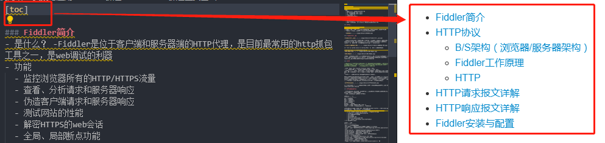
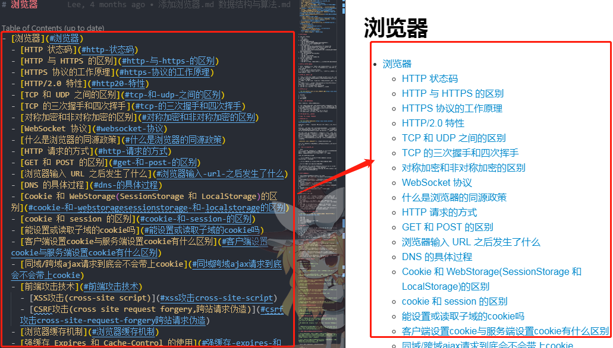
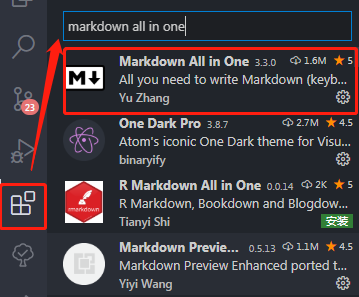
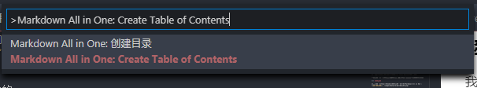

## 解决使用VSCode书写markdown用[toc]生成目录上传github不展示的问题

### 问题起源

在项目初期，想着在生成某一个文件的时候首先要在文章的前面呈现文章目录，这样才能更清晰，我是这么做的：

这不是很方便很简洁很nice嘛！

小伙伴是这样做的：

正开开心心的写markdown呢，还想着提醒小伙伴生成文件目录的时候可以非常简便的使用[toc]就可以自动识别锚点生成当前文件的文件目录了，这样的想法简直就是Naive！！！

上传到github不兼容啊喂，直接就显示`[toc]`了，蓝瘦香菇,555~

难道我要一个一个收敲上去生成目录嘛？当然不是！！！看下面如何解决的

### 解决方案

- 开发工具VSCode安装一下插件`Markdown All in One`:

- 在你想要生成目录文件中`ctrl+shift+p`,输入`Markdown All in One: Create Table of Contents`:
  

- 在写md的时候，在正文中添加新的标题也会自动更新文件目录啦~

现在，放心上传去叭~