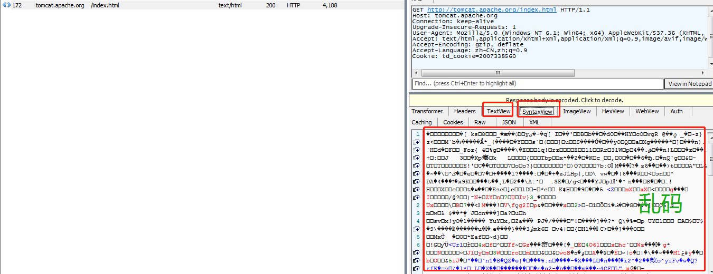

## 解决使用Fiddler抓包得到的响应数据乱码的问题

在请求`http://tomcat.apache.org/index.html`时会发现我得到的响应报文会出现乱码的现象：

## 解决方法
- 方法1：点击上图中响应报文顶部浅黄色区域`Response body is encoded. Click to decode.`
- 方法2：点击工具条中的Decode

## 两种解决方法的区别

- 方法1是针对当前请求的，会对当前请求进行解码，但是如果再抓取一次的话还会是乱码，而方法2是全局的，点击之后再次抓包的时候就会自动解码。