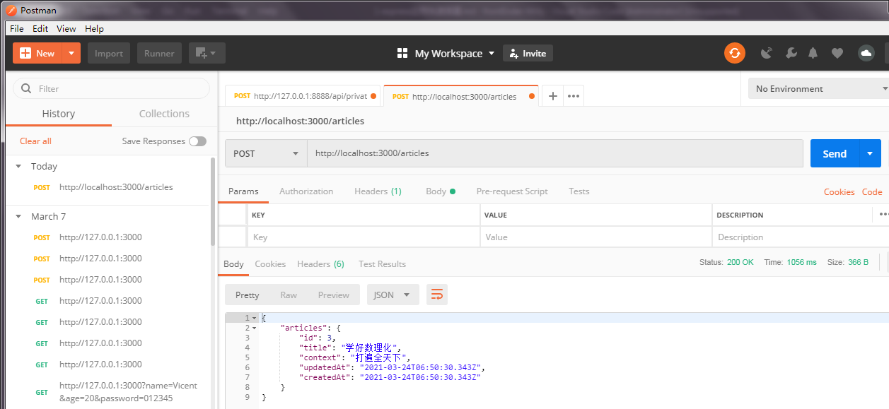
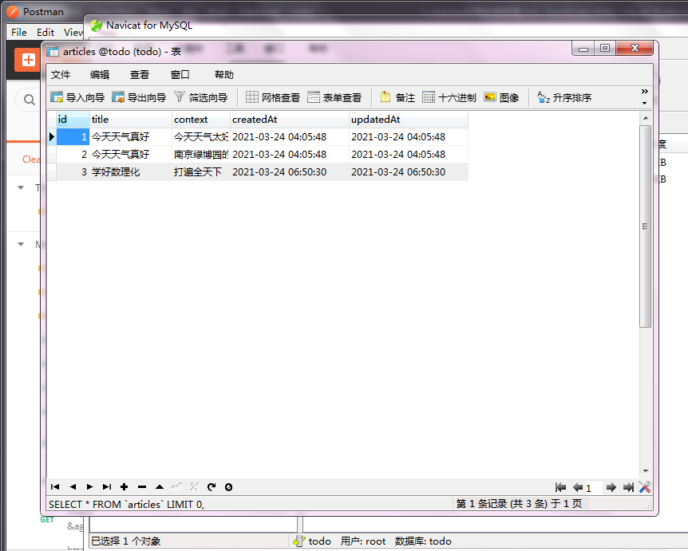
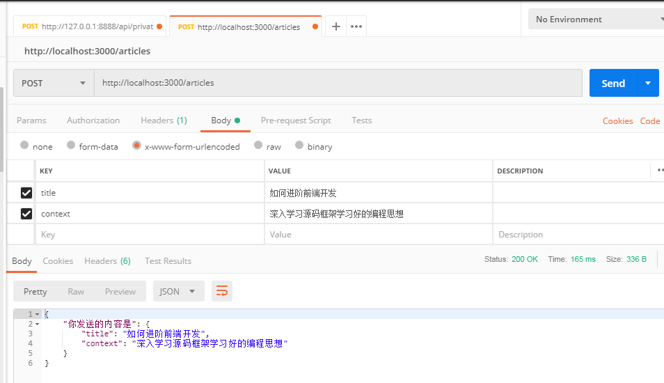
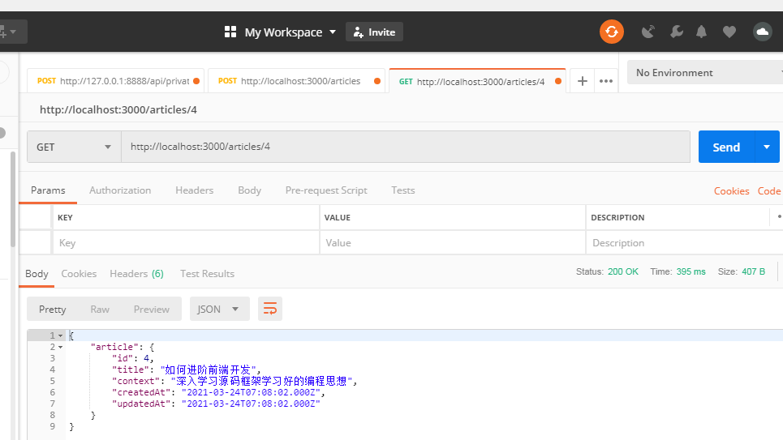
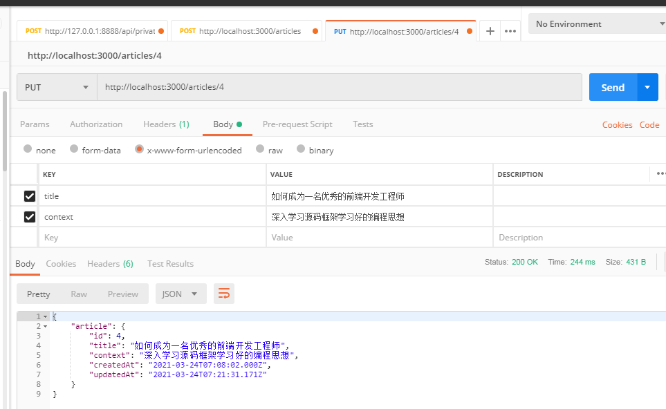
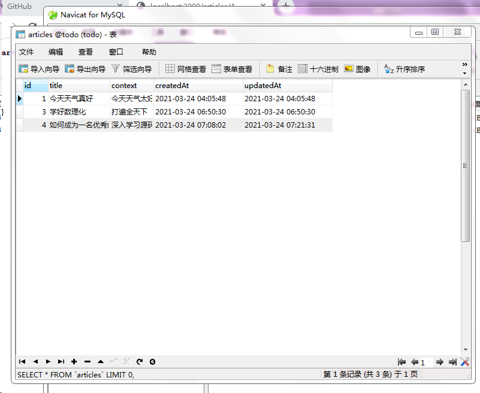

- [快速创建一个Express应用框架](#快速创建一个express应用框架)
- [创建数据库](#创建数据库)
- [CURD](#curd)

## 快速创建一个Express应用框架

计算机环境：win7系统，node版本 13.9.0

```javascript
npm install express-generator -g

express servertest --view=ejs

cd servertest

SET DEBUG=servertest :* & npm start
```
设置修改代码后项目自启动：
```javascript
npm install nodemon
```
修改package.json中script脚本：node改为nodemon。以后再npm start启动项目修改完代码之后就不需要手动重启项目了。

至此，一个express应用就创建成功了，其目录主要结构和功能在实战MyTODO_server中有介绍，这里不再重复。

安装Node的ORM框架sequelize：
```javascript
npm install sequelize

npm install mysql2
```

-g全局安装，会自动添加环境变量。用于快速生成sequelize框架
```javascript
npm install sequelize-cli -g

sequelize init
```
看一下sequelize初始化新生成的文件结构：

- `config/config.json`：sequelize所需要连接数据库的配置文件
- `migrations`：迁移，如果要对数据库做新增表、修改字段、删除表等操作就需要在这里添加迁移文件
- `models/index.js`：模型文件，使用sequelize执行CURD(创建、修改、读取和删除)，需要用到这里的模型，每个模型都会对应数据库中的一张表
- `seeders`：存放种子文件，一般是将需要添加到数据库中的测试数据添加到这里，只需要一个命令就会自动填充测试内容

## 创建数据库

> 在这之前要先安装MySQL数据库，可以去官网下载安装。本人使用的是一个集成开发环境WampServer(Windows+Apache+MySQL+PHP)

修改config下的配置文件：
```javascript
"development": {
    "username": "root",
    "password": "root",
    "database": "todo",
    "host": "127.0.0.1",
    "dialect": "mysql"
  },
```

- 创建数据库：
    ```javascript
    sequelize db:create --charset 'utf8mb4'
    ```
    创建完成之后打开数据库客户端工具Navicat刷新，会看到todo连接下会出现一个新的名为todo的表。当然，创建数据库直接使用客户端工具手动创建也是一样的效果。

- 创建模型：
  ```javascript
  sequelize model:generate --name Article --attributes title:string,context:text
  ```
  上述命令表示创建了一个模型名字为Article，这个表一共有两个字段：标题(string类型)，内容(text类型)。
  
  运行这条指令之后会发现model文件夹下生产了article.js文件，迁移文件目录下生成了一个迁移文件，这里存储的是article这张表的字段。注意，sequelize规定模型名字为单数，迁移文件中表的名称是复数。这个迁移文件中有up和down两个操作，up是建表，down是删除表，在up中除了设置的字段还生成了如下字段：
  ```javascript
  id: {
    allowNull: false,   // 不允许为空
    autoIncrement: true,   // 自增
    primaryKey: true,
    type: Sequelize.INTEGER
  },
  createdAt: {  // 新增的时候自动填充一个时间
    allowNull: false,
    type: Sequelize.DATE
  },
  updatedAt: {  // 修改的时候自动更新一个时间
    allowNull: false,
    type: Sequelize.DATE
  }
  ```
- 运行迁移文件：`sequelize db:migrate`，打开Navicat刷新之后会看到生成的articles表，里面的字段就是迁移文件中定义好的字段
- 添加测试数据,新建种子文件：`sequelize seed:generate --name article`，运行这行指令之后会看到在种子文件夹下会生成一个种子文件
- 修改种子文件：把里面的案例中的People改成我们的表名articles，然后根据之前创建的字段修改需要添加的数据默认值。比如：
- 运行迁移：`sequelize db:seed:all`，运行之后打开Navicat刷新就会看到新添加的表格数据了

## CURD

1. 查询文章列表接口

在路由文件中创建一个文章接口文件articles.js:
```javascript
var express = require("express");
var router = express.Router();
var models = require('../models')   // 导入模型

/* GET home page. */
router.get("/", function (req, res, next) {
    models.Article.findAll().then(articles => {
        res.json({ articles: articles });
    })
});

module.exports = router;
```
上述接口表示客户端发起get请求，即请求`http://localhost:3000/articles`时，找到模型中的Article(每一个模型都对应数据库中的一张表),`models.Article`可以理解为找到了Article这张表，然后使用`.findAll()`方法查询出表中的所有数据；then回调函数中的articles就是查询到的数据，查询之后通过`res.json({ articles: articles })`以json形式返回给客户端。

sequelize采用的是Promise的写法，也可以写成async/await的形式：
```javascript
var express = require("express");
var router = express.Router();
var models = require('../models')

/* GET home page. */
router.get("/", async function (req, res, next) {
    var articles = await models.Article.findAll()
    res.json({ articles: articles })
});

module.exports = router;
```
数据库查询得到的结果默认是按照id正序排列的。如果想要使查询的内容是按照某种规则排序的，比如后发布的内容在最上面显示，就可以在查询的时候添加一个排序的参数：
```javascript
router.get("/", async function (req, res, next) {
    var articles = await models.Article.findAll({
        order: [['id', 'DESC']]
    })
    res.json({ articles: articles })
});
```

2. 新增文章接口

在articles.js中添加一个新的post请求：
```javascript
router.post("/", async function (req, res, next) {
  var articles = await models.Article.create({
    title: '学好数理化',
    context: '打遍全天下'
  });
  res.json({ articles: articles });
});
```
通过create方法创建一条新的记录插入到数据表Article中。这个post请求使用浏览器就不好测试了，因为浏览器默认发起的都是get请求，如何测试post请求呢？使用Postman。

选定请求方式，输入请求地址点击发送：


刷新数据库会看到article数据库中新增了一条数据。


当前提交的是写死的数据，如何添加从客户端发送过来的数据？
```javascript
router.post("/", async function (req, res, next) {
    res.json({"你发送的内容是": req.body})
});
```


如上所示，打开postman，选中Body中的x-www-form-urlencoded格式，输入对应数据表中的字段点击发送，会发现可以得到客户端传送过来的数据。

修改post接口操作：
```javascript
router.post("/", async function (req, res, next) {
  var articles = await models.Article.create(req.body);
  res.json({ articles: articles });
});
```
postman再次提交，刷新数据库会看到新增了刚刚提交的一条记录。

3. 查看文章接口

article数据库中每一篇文章都会有一个唯一的id，如果想要查看哪一篇就去查询id就可以拿到了。

定义接口：
```javascript
router.get("/:id", async function (req, res, next) {
  var article = await models.Article.findByPk(req.params.id);
  res.json({ article: article });
});
```
其中Pk是Primary Key的缩写，表示主键。一个表会有一个主键，如果没有特殊命名，主键就是id。

postman创建一个新的get请求，url为`http://localhost:3000/articles/4`，点击发送就可以看到查询出来的文章了：


4. 修改文章接口

接口定义：
```javascript
router.put("/:id", async function (req, res, next) {
  var article = await models.Article.findByPk(req.params.id);
  article.update(req.body)   // 更新文章内容
  res.json({ article: article });
});
```
打开postman修改一下第4篇文章，点击发送，修改的内容是客户端传送过来的，写在body中，点击发送就会看到修改后的信息：


5. 删除文章接口

```javascript
router.delete("/:id", async function (req, res, next) {
  var article = await models.Article.findByPk(req.params.id);
  article.destroy(req.body);
  res.json({ msg: "删除成功" });
});
```
打开postman新建一个delete请求，删除articles表中的id为2的文章，即url为`http://localhost:3000/articles/2`，点击发送之后刷新数据库会看到删除之后的结果：


以上简单的CURD接口就是符合Restful风格的接口格式。