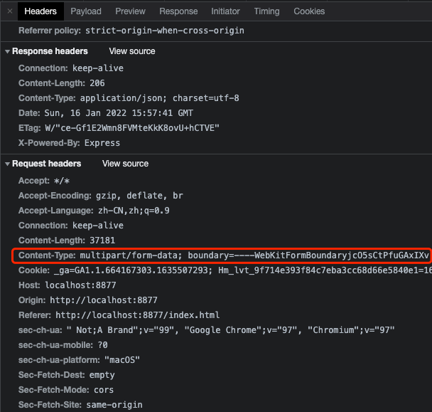
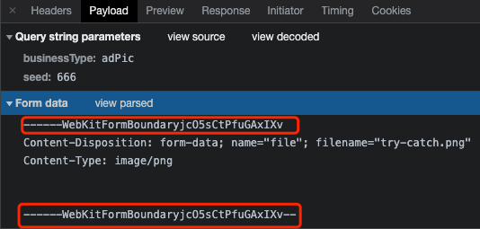

## 前端文件上传

> 前端文件上传是工作中经常接触的功能，希望通过本篇文章详细整理有关前端文件上传的知识点和实现方式。有上传就有下载，最近工作中也有接触大文件的下载，这里一并整理学习下。

## 基础

### Blob

原本，JavaScript无法处理二进制数据，ECMAScript 5引入了[Blob对象](https://developer.mozilla.org/zh-CN/docs/Web/API/Blob)，允许直接操作二进制数据。Blob对象是一个代表二进制数据的基本对象，在它的基础上，又衍生出一系列相关的API，用来操作文件。

在使用Blob对象时有以下几点需要注意：
- Blob构造函数，接收两个参数。第一个参数是一个包含实际数据的数组，第二个参数是数据的类型，这两个参数都不是必需的
- Blob对象的slice方法，将二进制数据按照字节分块，返回一个新的Blob对象
- 在Ajax操作中，如果`xhr.responseType`设为`blob`，接收的就是二进制数据
- Blob对象有两个只读属性：size：二进制数据的大小，单位为字节；type：二进制数据的MIME类型，全部为小写，如果类型未知，则该值为空字符串
### File

FileList：针对表单的file控件。当用户通过file控件选取文件后，这个控件的files属性值就是FileList对象。它在结构上类似于数组，包含用户选取的多个文件。

## 文件上传原理

直接看文件上传的http请求头，如下：


可以发现，在文件上传的请求头中通过`Content-Type`设置了`multipart/form-data`，并且指定边界分隔符boundary为`------WebKitFormBoundaryjcO5sCtPfuGAxIXv`，再来看下消息体中的具体内容，如下：



上述上传一个图片的消息体中包含3部分：
1. 边界分隔符boundary: `------WebKitFormBoundaryjcO5sCtPfuGAxIXv`，与请求头中指定的一致，并且整个消息体以`------WebKitFormBoundaryjcO5sCtPfuGAxIXv--`结束
2. `Content-Disposition`: form-data表示这是一个表单元素，name指定表单元素的名称，filename的值为上传的文件名称
3. `Content-Type`: image/png表示上传文件的[MIME类型](https://developer.mozilla.org/zh-CN/docs/Web/HTTP/Basics_of_HTTP/MIME_types)，很明显这里上传的是一张.png的图片

疑问：
客户端上传文件发送到服务端后如何对消息体进行解析呢？服务端是如何解析出表单或者附件内容的？

## 文件上传方式汇总

### form表单实现文件上传

前端实现：
```html
<form method="post" action="http://localhost:8100" enctype="multipart/form-data">
    选择文件: <input type="file" name="f1"/>
    <br/>
    标题：<input type="text" name="title"/>
    <br/>
    <button type="submit" id="btn">上 传</button>
</form>
```


### vue+axios实现单文件上传

前端实现：
```html

```

后端接口：
```javascript

```
### 多文件上传

前端实现：
```html
 <div>
  选择文件(可多选):
  <input type="file" id="f1" multiple/><br/><br/>
  <div id="progress">
    <span class="red"></span>
  </div>
  <button type="button" id="btn-submit">上 传</button>
</div>
```

后端接口：
```javascript
function submitUpload() {
    var progressSpan = document.getElementById('progress').firstElementChild;
    var fileList = document.getElementById('f1').files;
    progressSpan.style.width='0';
    progressSpan.classList.remove('green');

    if(!fileList.length){
        alert('请选择文件');
        return;
    }

    var fd = new FormData();   //构造FormData对象
    fd.append('title', document.getElementById('title').value);

    for(var i =0;i<fileList.length;i++){
        fd.append('f1', fileList[i]);//支持多文件上传
    }

    var xhr = new XMLHttpRequest();   //创建对象
    xhr.open('POST', 'http://10.70.65.235:8100/', true);

    xhr.onreadystatechange = function () {
        console.log('state change', xhr.readyState);
        if (xhr.readyState == 4) {
            var obj = JSON.parse(xhr.responseText);   //返回值
            console.log(obj);
            if(obj.fileUrl.length){
                //alert('上传成功');
            }
        }
    }

    xhr.onprogress=updateProgress;
    xhr.upload.onprogress = updateProgress;
    function updateProgress(event) {
        console.log(event);
        if (event.lengthComputable) {
            var completedPercent = (event.loaded / event.total * 100).toFixed(2);
            progressSpan.style.width= completedPercent+'%';
            progressSpan.innerHTML=completedPercent+'%';
            if(completedPercent>90){//进度条变色
                progressSpan.classList.add('green');
            }
            console.log('已上传',completedPercent);
        }
    }
    //注意 send 一定要写在最下面，否则 onprogress 只会执行最后一次 也就是100%的时候
    xhr.send(fd);//发送时  Content-Type默认就是: multipart/form-data; 
}
//绑定提交事件
document.getElementById('btn-submit').addEventListener('click',submitUpload);
```

### 前端大文件上传

1. 大文件切片上传
```javascript
//分片逻辑  像操作字符串一样
var start=0,end=0;
while (true) {
  end+=chunkSize;
  var blob = file.slice(start,end);
  start+=chunkSize;
  if(!blob.size){//截取的数据为空 则结束
    //拆分结束
    break;
  }
  
  chunks.push(blob);//保存分段数据
}
function submitUpload() {
    var chunkSize=2*1024*1024;//分片大小 2M
    var file = document.getElementById('f1').files[0];
    var chunks=[], //保存分片数据
      token = (+ new Date()),//时间戳
      name =file.name,chunkCount=0,sendChunkCount=0;

    //拆分文件 像操作字符串一样
    if(file.size>chunkSize){
        //拆分文件
        var start=0,end=0;
        while (true) {
            end+=chunkSize;
            var blob = file.slice(start,end);
            start+=chunkSize;
            
            if(!blob.size){//截取的数据为空 则结束
                //拆分结束
                break;
            }
            
            chunks.push(blob);//保存分段数据
        }
    }else{
        chunks.push(file.slice(0));
    }

    chunkCount=chunks.length;//分片的个数 
    
    //没有做并发限制，较大文件导致并发过多，tcp 链接被占光 ，需要做下并发控制，比如只有4个在请求在发送
    
    for(var i=0;i< chunkCount;i++){
        var fd = new FormData();   //构造FormData对象
        fd.append('token', token);
        fd.append('f1', chunks[i]);
        fd.append('index', i);
        xhrSend(fd,function () {
            sendChunkCount+=1;
            if(sendChunkCount===chunkCount){//上传完成，发送合并请求
                console.log('上传完成，发送合并请求');
                var formD = new FormData();
                formD.append('type','merge');
                formD.append('token',token);
                formD.append('chunkCount',chunkCount);
                formD.append('filename',name);
                xhrSend(formD);
            }
        });
    }
}

function xhrSend(fd,cb) {
    
    var xhr = new XMLHttpRequest();   //创建对象
    xhr.open('POST', 'http://localhost:8100/', true);
    xhr.onreadystatechange = function () {
        console.log('state change', xhr.readyState);
        if (xhr.readyState == 4) {
            console.log(xhr.responseText);
            cb && cb();
        }
    }
    xhr.send(fd);//发送
}

//绑定提交事件
document.getElementById('btn-submit').addEventListener('click',submitUpload);
```

2. 断点续传


## 参考

- [XMLHttpRequest
](https://developer.mozilla.org/zh-CN/docs/Web/API/XMLHttpRequest)
- [写给新手前端的各种文件上传攻略](https://juejin.cn/post/6844903968338870285#heading-26)
- [文件上传](https://juejin.cn/post/6980142557066067982#heading-1)
- [文件下载](https://juejin.cn/post/6989413354628448264#heading-17)
- http://javascript.ruanyifeng.com/htmlapi/file.html
- https://wangdoc.com/javascript/bom/file.html
- https://github.com/zhaopeiym/BlogDemoCode/tree/master/%E4%B8%8A%E4%BC%A0%E4%B8%8B%E8%BD%BD/%E6%96%87%E4%BB%B6%E4%B8%8A%E4%BC%A0%E4%B8%8B%E8%BD%BD

