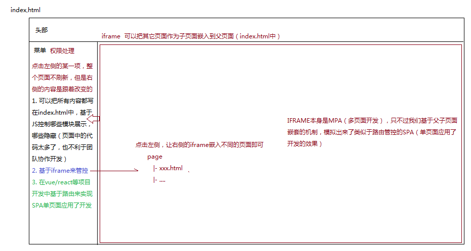
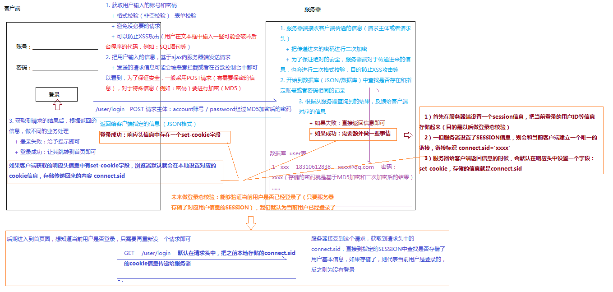

- [企业级CRM客户管理系统](#企业级crm客户管理系统)
	- [0. 技术栈](#0-技术栈)
	- [1. 跑通客户端和服务器端的环境](#1-跑通客户端和服务器端的环境)
	- [2. 客户端的项目结构](#2-客户端的项目结构)
	- [3. 登录模块开发](#3-登录模块开发)
		- [3.1 登录模块开发逻辑](#31-登录模块开发逻辑)
		- [3.2 登录模块开发实现](#32-登录模块开发实现)

- 企业中有哪些管理系统？
  - OA 企业办公管理系统
  - ERP 企业战略资源管理系统
  - CRM 客户管理系统
  - CMS 内容管理系统
  - TIM 及时通讯系统
  - ...

### 企业级CRM客户管理系统

#### 0. 技术栈
- 服务器端：node + express + JSON 完成的
	+ 支持跨域请求 CROS跨域资源共享
	+ 数据存储采用 JSON 临时存储（真实项目中是基于数据库完成的：MD/MS）
- 客户端：JQ + axios + 自己封装的公共方法
	+ md5加密
	+ cookie的相关操作
	+ ...

#### 1. 跑通客户端和服务器端的环境

1. 把客户端先运行起来
> 必须保证客户端的程序运行在http://这种协议下，基于文件file://协议预览是不可以的
=> 基于VSCODE的Live Server插件
http://127.0.0.1:5500/login.html

2. 把服务器端跑起来 => 配置服务器端的跨域请求参数
admin/config.js
```javascript
module.exports = {
	// => WEB服务端口号(后台服务启动的端口号：0~65535之间)
	PORT: 8888,
	// => CROS跨域相关信息
	CROS: {
		// => 客户端启动服务的地址，允许哪一个客户端向当前服务发送请求
		ALLOW_ORIGIN: 'http://127.0.0.1:5500', 
		......
	},
	......
};
```

=> 基于node启动服务

WIN：当前后台项目根目录 地址栏中输入CMD，在当前目录下打开DOS命令窗口

MAC：终端运行窗口，cd 把admin文件夹拖进去，按一下Enter键也可以快速进入到当前项目的目录

```
跑环境：安装当前后台需要的模块
$ npm i

启动服务
$ node server.js

在窗口中提示：THE WEB SERVER .... PORT:8888 则代表启动成功
记住此时我们的窗口不能关闭(关掉服务就结束了)
```

=> API.TXT
客户端可以向服务器发送请求的所有接口说明文档


#### 2. 客户端的项目结构

```javascript
|- css 包含了项目中的样式
	|- reset.min.css 结合国际通用的和大公司自己封装的，汇总的一个清除默认样式的CSS
	|- xxx.css
|- font 字体图片库
|- images 图片资源库
|- js
	|- axios.min.js
	|- axios.defaults.js  基于axios二次封装的内容，把常用的一些配置项提前处理好（在我们发送ajax请求之前，需要先导入这个基础配置JS）
	|- jquery.cookie.js 基于JQ封装的COOKIE操作的库
	|- jquery.min.js
	|- md5.min.js  我们后期对密码等信息进行加密（MD5是不可逆转的加密, md5加密基本使用在md5.htm中进行简单阐述）
	|- utils.js  自己封装的一些项目中常用到的工具方法
	|- xxx.js
|- page 各个模块的页面
	|- xxx.html
	|- ...
|- index.html 首页 （真实项目中，只有登录成功才能进入首页）
|- login.html 登录页面（对内的管理系统一般没有注册，可登录的账号是在系统的员工管理版块，由管理员统一录入的信息）
```


- 我们要实现的效果如上图所示，分为三个大块：
  - 顶部是head
  - 左侧是菜单(菜单处需要权限处理)，
  - 右侧是对应左侧菜单的具体内容
- 需要实现：点击菜单中的某一项时，整个页面不刷新，但是右侧的内容跟着改变(对应点击的左侧菜单项)
  - 方法1：可以把所有内容都写在index.html中，基于JS控制哪些模块显示哪些模块隐藏，但是这样的话页面中的代码太多了，也不利于团队协作开发
  - 方法2：在vue/react等项目开发中基于路由来实现SPA单页面应用进行开发
  - 方法3：基于iframe进行管控，点击左侧菜单项时，让右侧的iframe嵌入不同的页面即可。iframe本身是MPA(多页面开发)，只不过我们基于父子页面嵌套的机制，模拟出来了类似于路由管控的SPA的效果

#### 3. 登录模块开发

##### 3.1 登录模块开发逻辑



- 首先来看与登录相关的API设置(在`admin/API.TXT`)
  ```javascript
    用户登录
	URL：/user/login
	METHOD：POST
	PARAMS：account=xxx&password=xxx
	RESULT：{
		code:0  //=>0成功 1失败
		codeText:'OK',  //=>CODE状态码描述
		power:'xxx|xxx' //=>用户权限
	}
  ```
- 点击登录，获取用户输入的账号和密码
  - 格式校验(非空校验)，即表单校验
    - 避免没必要的请求
    - 可以防止XSS攻击，比如 用户在文本框中输入一些可能会破坏后台程序的代码，例如：SQL语句等
- 把用户输入的信息，基于ajax向服务器端发送请求
  - 发送的请求信息可能会被恶意拦截或者在谷歌控制台中都可以看到，为了保证安全，一般采用POST请求(有需要保密的信息)，对于特殊信息(例如：密码)要进行加密(MD5)
- 在用户登录的API中可以看到，请求地址是`/user/login`，POST请求主体是账号和经过MD5加密的密码
- 服务器端接收客户端传递的信息(请求主体或者请求头)
  - 把传递进来的密码进行二次加密
  - 为了保证绝对的安全，服务器端对于传递进来的信息，也会进行二次格式校验，目的是防止XSS攻击等
- 开始到数据库(JSON/数据库)中查找是否存在和指定账号或者密码相同的记录
- 根据从服务器端查询到的结果，反馈给客户端指定的信息(JSON格式)
  - 如果失败：直接返回信息 即可
  - 如果成功：需要额外做一些事情
    - 首先在服务器端设置一个session信息，把当前登录的用户ID等信息存储起来(目的是以后做登录态校验)
    - 一旦服务器端设置了session信息，则会和当前客户端建立一个唯一的链接，链接标识为：`connect.sid = 'xxx'`
    - 服务器给客户端返回信息的时候，会默认在响应头中设置一个字段：`set-cookie`，存储的信息就是`connect.sid`
- 客户端获取到请求结果后，根据返回的信息，做不同的业务处理：
  - 登录失败：给予提示即可
  - 登录成功：跳转到首页
    - 如果客户端获取到的响应头信息中有`set-cookie`字段，浏览器默认就会在本地设置对应的cookie信息，存储传递回来的内容`connect.sid`
- 未来做登录态校验：能够验证当前用户是否已经登录了(只要服务器存储了对应用户信息的session)，就认为当前用户已经登录了
  - 后期进入到首页面，想知道当前用户是否登录，只需要重新再发一个请求即可：`GET /user/login`,默认在请求头中，把之前本地存储的`connect.sid`的cookie信息传递给服务器
  - 服务器端接收到这个请求，获取到请求头中的connect.sid，直接到指定的session中查找是否存储了用户基本信息，如果存储了，则代表当前用户是登录的，反之则没有登录
  - cookie和session的区别与联系
    - 区别：session是服务器端存储的，cookie是客户端存储
    - 联系：服务器端一旦设置 session，则会在响应头中携带`set-cookie=connect.sid`的信息给客户端，客户端会把信息种植到本地的cookie中，客户端下一次发送请求的时候，会在请求头中，基于cookies字段把connect.sid再传递给服务端，实现客户端与服务端的信息通信

##### 3.2 登录模块开发实现

- 页面部分：`login.html`
- 登录逻辑实现：`js/login.js`
> 初始账号密码：账号：15951815815 ，  密码：1234567890

- 首页：`index.html`
- 补充点：如何实现remember me的功能
  - 第一种方式：本地存储
    - 登录成功后，会把输入的用户名和密码(经过加密后的密码)存储到本地cookie/localStorage，下一次进入登录页面(或者自动登录)，首先在页面中的账号框中显示存储的用户名，密码框中存储一个占位符，例如：000000，点击登录的时候，验证占位符是否还是000000，如果是，说明用户没有改过密码，以本地存储的信息向服务器发请求；如果获取的密码不是000000，说明用户换过密码，则以最新用户输入的信息向服务器发送请求(当然密码还需要MD5加密)
  - 第二种方式：服务器存储
    - 登录成功后，服务器把账号密码存储，进入登录页面，从服务器获取存储的信息，显示在框中。目前使用第一种方式来实现记住用户名和密码的情况比较多，实现自动登录功能时，使用服务器端存储的比较多。