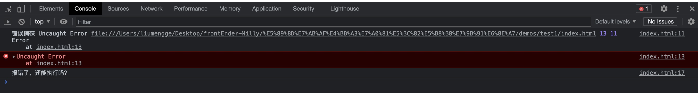
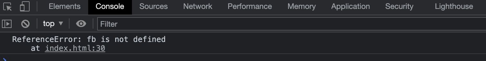
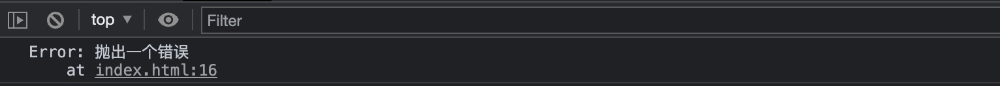

## 前言

入职也有一段时间了，从后台管理系统入手，对于没有太多实践经验的自己来说确实是一个非常非常宝贵的学习机会，感谢我的导师给我充足的时间让我一步步前进。在这段时间的开发过程中遇到了很多错误，很多不同类型的错误，在写业务代码的时候也知道使用类似try-catch的方式来捕获，可是原理是啥呢？还不是特别的清楚，刚好下周要完成将后台系统前端异常上报的任务，借此机会详细学习一下。

程序错误，来自wiki的定义：Bug，程序设计的术语，指在软件运行中因为程序本身有错误而造成的功能不正常、死机、数据丢失、非正常中断等现象。有些bug会造成计算机安全隐患，此时叫漏洞。不想变成一个bug写手，最好是知道bug产生的原因，能不能有办法处理异常以不影响程序运行，就算是不幸吃了一个bug，能不能快速定位bug源头，敏捷修复。嗯，会的，一定会写出优美健壮的代码！

## JS异常

JS代码执行时出现异常，导致的结果时什么？异常并不会导致JS引擎崩溃，最多只会使当前执行的任务停止。

eg1:
```javascript
<script>
    window.onerror = (msg, url, line, column, error) => {
      console.log('错误捕获', msg, url, line, column, error)
    }
    throw new Error()
    console.log('报错了，不继续往下走了')
  </script>
  <script>
    console.log('报错了，还能执行吗？')
  </script>
```
得到的结果是这样的：



- 当前代码块作为一个任务压入任务队列，JS线程不断从任务队列中提取任务依次执行
- 当任务执行过程中出现异常，且异常没有捕获处理，则会一直沿着调用栈逐层向外抛出，最终终止当前任务的执行
- JS线程会继续从任务队列中提取下一个任务继续执行

## JS错误类型

### 脚本错误 与 网络错误

### 语法错误 与 语义错误(运行时错误)

在编译语言中，语法错误一定只在编译期时出现，编译器要所有的语法都正确，才能正确编译。不过解释型语言中的语法错误可能要到运行期才会出现，而且不一定容易区分语法错误及语义错误。看到下面例子在控制台的错误提示还是能比较明显区分属于哪种类型的。

eg2:
```javascript
try {
  var test == 123
} catch(e) {
  console.log(e)
}
```
会看到在控制台拿到的错误信息为`Uncaught SyntaxError: Unexpected token '=='`。

eg3:
```javascript
try {
  var test = [ 1，2，3]  // 中间用了中文逗号
} catch(e) {
  console.log(e)
}
```
会得到`Uncaught SyntaxError: Invalid or unexpected token`错误信息提示。一般语法错误(SyntaxError)会导致程序崩溃，是比较容易定位的。而且会发现，当发生语法错误的时候，异常是走不到catch分支的。

eg4-语义错误：
```javascript
try {
  fb()      // 未定义变量 
} catch(e) {
  console.log(e)
}
```
上述语义错误捕获后在控制台输出的结果是这样的：


很明显，语义错误不会导致程序崩溃。

### 同步错误 与 异步错误

1. 同步与异步：同步就是单线程中JS代码按照从上到下的顺序依次执行，相反的，不是同步的就是异步的，不按顺序依次执行就是异步
2. 同步错误与异步错误：可以理解为前者是代码同步执行过程中出现的错误，后者是异步回调中存在的异常。

eg4:
```
function printTime() {
  console.log('It is time!')
}

setTimeout(printTime, 1000)
console.log('done')
```
eg1-eg3这几个例子就是同步错误，eg4为异步错误。

注：本小节仅从两个角度对JS异常进行了一个简单的分类，其实具体的错误种类有7类大，是有很多种，可以在文末[参考4](https://developer.mozilla.org/zh-CN/docs/Web/JavaScript/Reference/Errors)中查阅。

## 异常处理

要将前端后台系统的错误上报，我们需要先对

### `window.onerror`

### `try-catch`

`try-catch`是日常开发中常用的异常处理方式，给代码包一层`try-catch`后，try代码块中出现异常时会catch就可以捕获到错误信息，当然，页面执行不会受到影响。但是，`try-catch`并不是所有错误都能捕获的，它只能捕获运行时非异步错误，也就是说语法错误、异步错误是捕获不到的，但是可以捕获async-await执行出现的异常。

eg:
```javascript
try {
  throw new Error('抛出一个错误')
} catch(err) {
  console.log(err)
}
```

结果如下：


### 前端异常上报

前端错误


参考：
- [1. 逻辑错误](https://zh.wikipedia.org/zh-hans/%E9%80%BB%E8%BE%91%E9%94%99%E8%AF%AF_(%E7%A8%8B%E5%BA%8F%E8%AE%BE%E8%AE%A1))
- [2. 异步错误](https://www.liaoxuefeng.com/wiki/1022910821149312/1120880431288064#0)
- [3. 查找并解决JS代码的错误](https://developer.mozilla.org/zh-CN/docs/Learn/JavaScript/First_steps/What_went_wrong)
- [4. JS中7类错误](https://www.yisu.com/zixun/611905.html)
- [5. JS错误种类](https://developer.mozilla.org/zh-CN/docs/Web/JavaScript/Reference/Errors)
- 
