> 尽管在code的时候很小心地避免出错，并且一个功能的正式上线大多会经历自测、联调、CR、QA测试一系列质量保障，但是还是会出现意想不到的异常报错导致脚本停止运行。刚好近期也在做前端后台系统错误信息上报的任务，为了更好地避免前端错误以及主动发现错误，我觉得有必要详细学习一下前端异常捕获与上报。本文是一篇学习记录，梳理了前端异常类型、处理方式、错误信息上报相关内容，如有理解有误的地方，希望各位大佬不吝赐教~

程序错误，来自wiki的定义：Bug，程序设计的术语，指在软件运行中因为程序本身有错误而造成的功能不正常、死机、数据丢失、非正常中断等现象。有些bug会造成计算机安全隐患，此时叫漏洞。不想变成一个bug写手，最好是知道bug产生的原因，能不能有办法处理异常以不影响程序运行，就算是不幸吃了一个bug，能不能快速定位，敏捷修复？嗯，会的，一定会写出优美健壮的代码！

## 前端异常

JS异常从不同的角度可分为如下3组：
- 编译时异常与运行时异常
- 语法异常与语义异常
- 同步异常与异步异常
### 编译时异常 与 运行时异常
> JS代码的执行有两个阶段：预编译+代码执行，这两个阶段都有可能出现异常。可参考之前整理过的[JS引擎执行机制](https://github.com/liumengge/frontEnder-Milly/tree/master/00.%E8%AE%A1%E7%AE%97%E6%9C%BA%E7%BD%91%E7%BB%9C/%E6%B5%8F%E8%A7%88%E5%99%A8%E5%8E%9F%E7%90%86%E5%89%96%E6%9E%90)。

1. 定义：
   - 编译时异常：是在JS预编译阶段出现的异常
   - 运行时异常：预编辑阶段通过了，JS代码在真正运行时出现异常
2. 编译时异常很容易发现，因为在代码预编译阶段若存在异常就直接输出在浏览器控制台了，比较难搞的是运行时异常。
3. 举个例子：
  eg.1:
    ```javascript
    function test_1() {
      console.log('start')
      await test_A()
      console.log('end')
    }
    test_1()
    ```
    在浏览器控制台执行就会看到报错信息:
    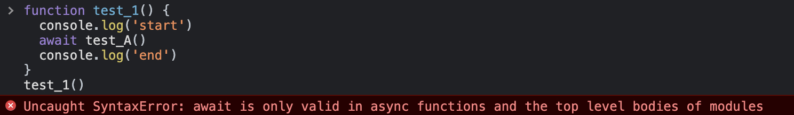
    test_1函数在预编译阶段就出现了语法错误，还没有真正执行，所以并不会打印start。

    eg.2:
    ```javascript
    const user = {
      name: 'Milly'
    }
    const isAl = true
    function test_2() {
      console.log('start')
      if (isAl) {
        alert(`Hi, I'm ${ user.name }. I am a ${ user.job } working in ${ user.job.addr }`)
      } else {
        console.log('Milly')
      }
      console.log('end')
    }
    test_2()
    ```
    控制台输出：
    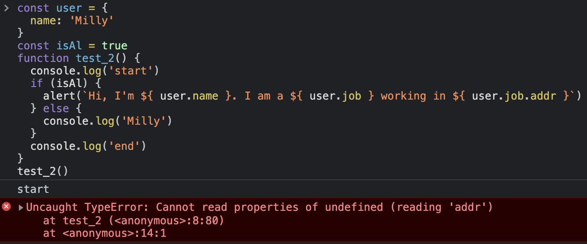

    控制台打印出了start，但是执行到user.job.addr时，由于user中job字段为undefined所以抛出了如图所示的异常。此外，end字段并没有被打印出来，也就是说执行到这里抛出异常，JS代码也就不会继续往下执行了。

    在日常业务开发中，类似这样的错误很容易像eg.2一样被隐藏在流程控制语句中，尤其是开发自测的需求，很难覆盖所有的case，极有可能因为接口数据不规范等原因出现这样的异常。

### 语法异常 与 逻辑异常

1. 定义：
   - 语法错误：代码中存在拼写错误，将导致程序完全或部分不能运行，这类错误根据错误提示信息基本可修复
   - 逻辑错误：语法正确但执行结果和预期相悖。程序虽能运行但会给出错误的结果，一般不会收到来自这些错误的提示，所以逻辑错误通常比语法错误难修复。
2. 简单例子：
  
    eg.3
    ```html
    <style>
      .app {
        width: 100px;
        height: 100px;
        border: 1px solid red;
      }
    </style>

    <body>
    <div class="app"></div>
      <script>
        const app = document.querySelector('app')
        app.textContent = 'This is ...'
      </script>
    </body>
    ```
    控制台拿到的结果：
    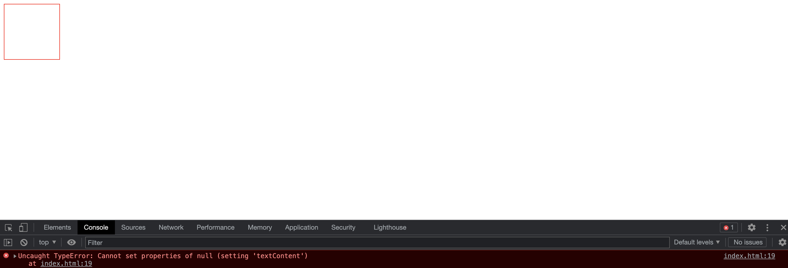
  - Uncaught标识标识是未被捕获的异常
  - 提示错误为TypeError
  - 冒号后面给出错误描述信息
  - 最右端有错误在文件中的行号
  - 错误类型以及错误描述信息下方是错误的堆栈信息，可以根据该信息快速定位
  
    可以看到，控制台给出的语法错误信息很详细，根据错误相关信息即可快速定位及修复

3. [查找并解决JS代码的错误](https://developer.mozilla.org/zh-CN/docs/Learn/JavaScript/First_steps/What_went_wrong)

### 同步异常 与 异步异常

1. 定义：
   - 同步异常：在主线程上排队执行的任务时出现的异常，JS代码由上到下依次执行过程中出现的异常
   - 异步异常：执行异步任务时出现的异常，比如在文件读取、ajax数据请求过程中出现的异常等
2. 举个例子：

    eg.4: NodeJS同步读取文件内容
    ```javascript
    const fs = require('fs')

    fs.readFileSync('readme.milly')
    console.log('Milly')
    ```

    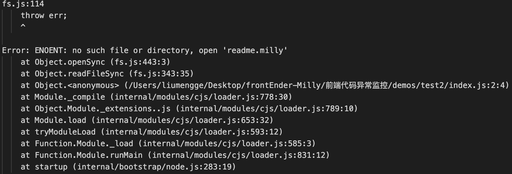

    eg.5: NodeJS异步读取文件内容
    ```javascript
    const fs = require('fs')

    fs.readFile('readme.milly', (err, data) => {
      if(err) {
        throw err
      }
    })
    console.log('Milly')
    ```
    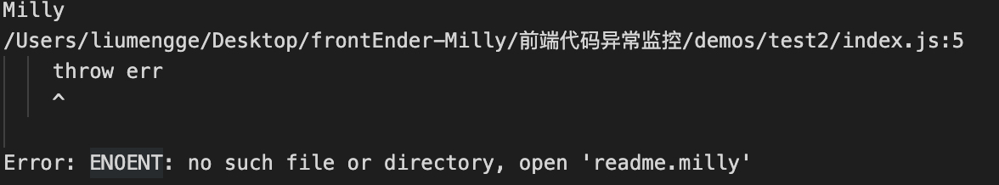

## 异常处理

> 异常是如何呈现在控制台上的？JS异常被抛出后就会沿着函数调用栈逐层传递出来，如果异常在传递的过程中没有被捕获，就会像eg.1中一样展示在控制台上，而且会有一个Uncaught标识；如果异常在传递过程中遇到catch就会被捕获而不会有Uncaught标识。

### 异常捕获与处理

常用异常捕获方式有：`try-catch`、`window.onerror`、`window.onunhandledrejection`，分别应对不同的场景。

1. try-catch
   - try-catch只能捕获当前调用栈的错误
  首先，明确try-catch-finally的执行逻辑：
  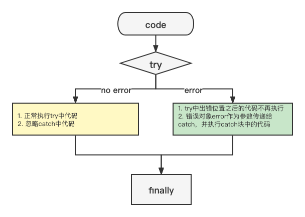

    通过使用try-catch就可以在catch分支捕获到在try块中抛出的异常而不会导致脚本终止执行。但在使用try-catch时有几点需要注意：

   - try-catch只能捕获运行时异常，对于编译时异常是无法捕获的，比如：
    eg.6:
      ```javascript
      try {
        console.log('start')
        test_3()
        console.log('end')
      } catch (error) {
        console.log('捕获到的错误信息', error)
      }
      ```
      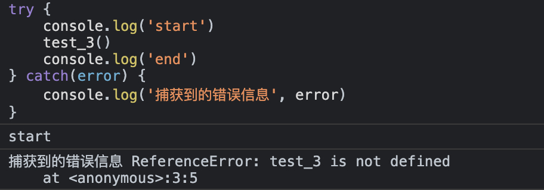

      eg.7:
      ```javascript
      try {
        console.log('start')
        test_3（）
        console.log('end')
      } catch(error) {
        console.log('捕获到的错误信息', error)
      }
      ```
      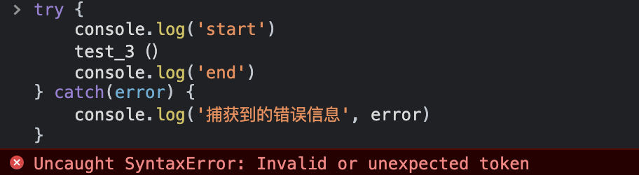
    eg.6中，test_3函数没有定义，属于运行时错误，可以被catch到，而eg.7中在调用函数test_3的地方不小心把后面的括号写成了中文的，这个时候的语法错误在预编译阶段就会被抛出，不会被catch到。从这两个小例子中也能看出来，未被捕获到的异常，最终会输出在控制台上并标有Uncaught字样，而被catch到的异常打印在控制台上时是没有Uncaught标识的。
   - `try-catch`无法catch到异步异常，因为try-catch只能捕获当前调用栈中的错误。通过例子来看会比较清晰，还是以同步、异步文件读取为例：  
    eg.8:
      ```javascript
      try {
        fs.readFileSync('readme.milly')
        console.log('Milly')
      } catch (error) {
        console.log('catch', error)
      }
      ```
      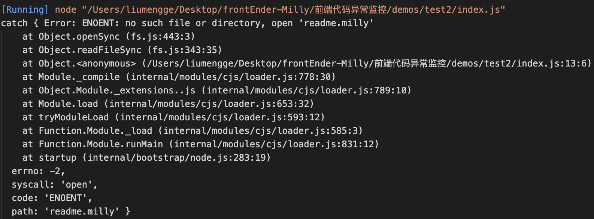
    eg.8是在eg.4的基础上添加了try-catch进行异常捕获，从上图结果中可以看出，在读取一个不存在的文件时出现异常并被catch到了。

      eg.9:
      ```javascript
      const fs = require('fs')

      try {
        fs.readFile('readme.milly', (err, data) => {
          if(err) {
            throw err
          }
        })
        console.log('Milly')
      } catch (error) {
        console.log('catch', error)
      }
      ```
      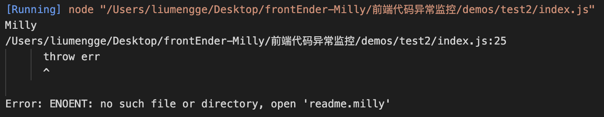
    eg.9是在eg.5的基础上添加了try-catch来捕获异常，从上图结果中可以看到在异步文件读取的回调函数中抛出了一个错误，但是并没有被catch到。那回调函数中的异常要怎么处理呢？调整下吧，在回调函数中处理：

      eg.10:
      ```javascript
      const fs = require('fs')

      fs.readFile('readme.milly', (err, data) => {
        try {
          if (err) {
            throw err
          }
        } catch (error) {
          console.log('catch', error)
        }
      })
      ```
      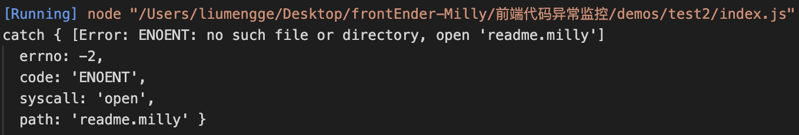
      像这样调整下捕获位置，就可以捕获到异步回调中出现的错误了。
    
      但是为什么呢？为什么try-catch无法直接捕获异步异常？原因是，它只能捕获当前函数调用栈中抛出的异常，这里可以来看下调用栈：
    
      eg.11:
      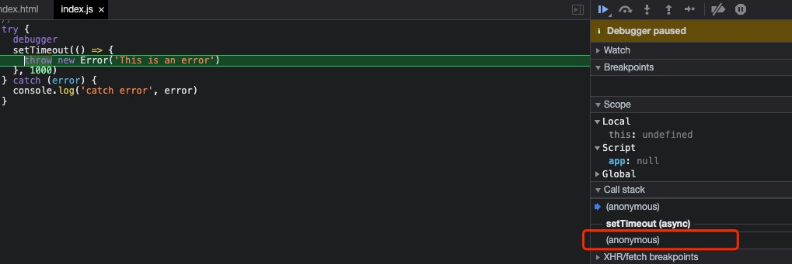
      上图中try-catch只能捕获所在调用栈中抛出的异常，也就是红色框所在的匿名函数调用栈中，但是真正的异常是在定时器的回调函数中抛出的(蓝色箭头指的函数调用栈), Error不会被捕获。这样分析来看，将try-catch放在抛出异常所在的回调函数内就可以了，试下：
      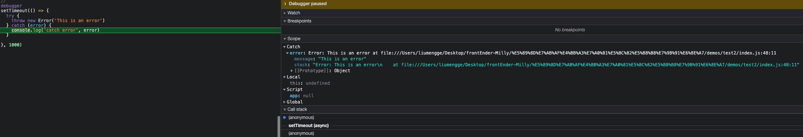
    确实，若想捕获异步异常，就需要将try-catch写入回调函数中，始终将try-catch放在可能会抛出异常的当前函数作用域就可以捕获到异常了。

 - `try-catch`捕获promise的reject异常
    在Promise的executor和handler中存在隐式的`try-catch`，若抛出异常，该异常就会被catch到，此时为rejection。

      eg.12:
      ```javascript
      new Promise((resolve, reject) => {
        // reject('This is an error in executor')       1
        // throw new Error('This is an error in executor')    2
        resolve('test')
      }).then((res) => {
        throw new Error('This is an error in handler')     //  3
      }).catch((err) => {
        console.log('catch error', err)
      })
      ```
      eg.12例子中，在1、2、3处抛出的异常在catch中均能被捕获到。

   - `try-catch`捕获`async/await`异常
      eg.13:
      ```javascript
      async function test_6() {
        try {
          let res = await fetch('http://test-url')
        } catch(error) {
          console.log(error)
        }
      }
      test_6()
      ```
    为什么try-catch可以直接捕获async/await的异常？

    async关键字表示该函数返回的是一个promise，如果return的不是一个显示的promise也会被包装成promise，如果一个promise正常resolve，await promise 返回的就是其结果，但是如果promise被reject，它将throw这个error，而await会让JS引擎等待直到promise完成(resolved或rejected)并返回结果。如果没有像eg.13一样使用`try-catch`捕获异常，也可以像下面例子中一样使用`.catch`来捕获。

    ```javascript
    async function test_6() {
      let res = await fetch('http://test-url')
    }

    // test_6() 变成了一个 rejected 的 promise
    test_6().catch((error) => {
      console.log(error)
    })
    ```
    实战项目中，通常async/await来处理promise而不是链式调用，配合`try-catch`捕获异常使得代码看起来更清晰明了。

2. `window.onerror`

`try-catch`可以实现局部异常捕获，如果是在try-catch外部出现的异常该如何捕获？常用`window.onerror`来实现全局异常捕获。

eg.14:
```javascript
window.onerror = function(message, source, line, col, error) {
  console.log('异常描述信息', message)
  console.log('发生错误的脚本文件', source)
  console.log('异常所在文件行列号', line, col)
  console.log('异常对象', error)
}

function test_7() {
  test_6()
}

test_7()
```

eg.14中在控制台打印出来的信息如下：
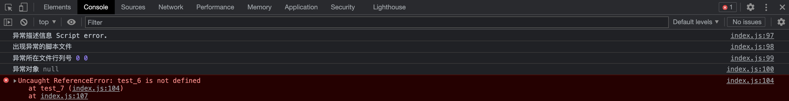
控制台上console出来的信息好像没有什么用啊，而且出现了一个不知道是什么含义的`Script error.`，除此之外就没有其他有用信息了。。。

[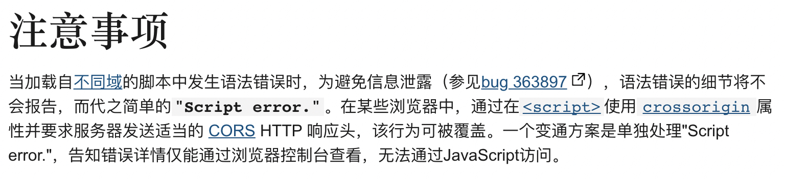](https://developer.mozilla.org/zh-CN/docs/Web/API/GlobalEventHandlers/onerror)

注意事项的意思就是说，这种获取不到具体错误信息的情况是跨域导致的，eg.14是直接在默认浏览器打开看到的结果，那换种方式-`Open with Live Server`，然后地址栏中输入`http://10.242.35.108:5502/%E5%89%8D%E7%AB%AF%E4%BB%A3%E7%A0%81%E5%BC%82%E5%B8%B8%E7%9B%91%E6%8E%A7/demos/test2/`(端口号对应刚刚启动的server端口号，资源地址对应demo的index.html文件地址)：

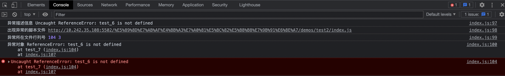

若在后续实战项目中遇到跨域导致无法捕获全局异常信息的情况可以参考[GlobalEventHandlers.onerror](https://developer.mozilla.org/zh-CN/docs/Web/API/GlobalEventHandlers/onerror)。

3. `window.onunhandledrejection`

在使用promise相关操作时如果忘记添加catch或者`async/await`没有`try-catch`异常捕获，就可能会有未被捕获的rejected异常被抛出，这时可以使用`window.onunhandledrejection`来全局捕获。

eg.15:
```javascript
window.onunhandledrejection = function(event) {
  console.log(event)
  console.log(event.promise)   // [object Promise] - 生成该全局 error 的 promise
  console.log(event.reason)
}

async function test_8() {
  let res = await test_9()
}
test_8()
```

同样的，`Open in Default Browser`不会触发`window.onunhandledrejection`，而`Open with Live Server`就可以拿到如下详细错误信息：

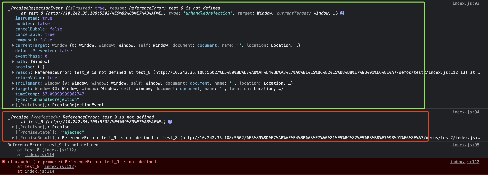

4. app.config.errorHandler

> vue也提供了错误处理的配置属性`app.config.errorHandler`，vue2.x中使用`Vue.config.errorHandler`。

在vue3.x中，错误的捕获类型统一到了一个文件中，除了严重的任务直接报错阻碍应用运行，其他在各个生命周期以及各种钩子中的错误都能被errorHandler捕获到。如下图是[vue3.x源码中错误类型](https://github.com/vuejs/vue-next/blob/master/packages/runtime-core/src/errorHandling.ts):

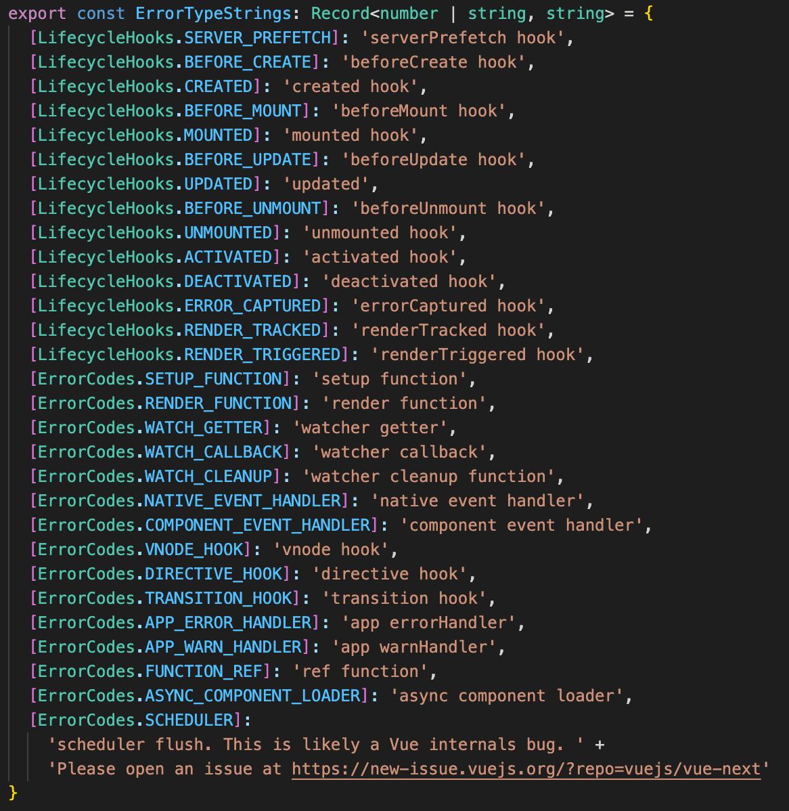

至此，通过上述几种类型的例子已经明确如何捕获异常了，那捕获后的异常该如何处理呢？

**关于异常处理的一个原则就是：只处理能明确处理的异常，无法处理的异常再次手动抛出。**在项目中，一种是捕获到异常给出适当的错误信息提示，进一步的，可以将捕获到的异常信息上报(Setnry)。

```javascript
window.onunhandledrejection = function(event) {
  console.log(event)
  console.log(event.promise)
  console.log(event.reason)
}

window.onerror = function(message, source, line, col, error) {
  console.log('异常描述信息', message)
  console.log('出现异常的脚本文件', source)
  console.log('异常所在文件行列号', line, col)
  console.log('异常对象', error)
}

;(async () => {
  try {
    // test_7()
    let res = await fetch('http://test-url')
  } catch (error) {
    if (error instanceof ReferenceError) {
      console.log('ReferenceError, do something here')
    } else {
      // 其他类型的错误不知道怎么处理，抛出
      throw new Error(`出现一个不知该如何处理的错误：${error}`)
    }
  }
})()
```

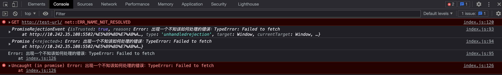

### 异常上报

前端后台管理系统接入了哨兵，在捕获到异常后将错误对象上报，以及时发现问题、定位问题、解决问题。在将错误信息上报时引用了TraceKit这一跨浏览器堆栈跟踪日志标准化工具。为什么需要tracekit？

因为并非所有浏览器都支持对错误对象的堆栈跟踪，不同的浏览器错误信息格式不一致:
```javascript
// SAFARI:
ex = {
  name: `ReferenceError`,
  message: `Can't find variable: qq`,
  line: 59,
  sourceId: 580238192,
  sourceURL: `http://...`,
  expressionBeginOffset: 96,
  expressionCaretOffset: 98,
  expressionEndOffset: 98
}

// FIREFOX:
ex = {
  name: 'ReferenceError',
  message: `qq is not defined`,
  fileName: `http://...`,
  lineNumber: 59,
  columnNumber: 69,
  stack: `...stack trace...`
}

// CHROME:
ex = {
  name: `ReferenceError`,
  message: `qq is not defined`,
  type: 'not_defined',
  arguments: ['aa'],
  stack: '...stack trace...'
}

// IE:
ex = {
  message: `...`,
  name: `ReferenceError`,
}

// OPERA:
ex.message = ...message... 
ex.name = ReferenceError
ex.opera#sourceloc = 11  (pretty much useless, duplicates the info in ex.message)
ex.stacktrace = n/a; see 'opera:config#UserPrefs|Exceptions Have Stacktrace'
```

使用方式大概是这样的：

1. 封装`sentry.js`: 其中主要包含将错误信息上报哨兵的逻辑，比如上报

```javascript
const trace = TraceKit.computeStackTrace(obj.stack)
const stack = trace?.stack
// 格式化处理 ... 

if (stack.join('')) {  // errorMsg 为最终上报的错误信息字符串
  errorMsg = `${ trace.message }|||${ stack.join('\n') }${ errorMsg }`
}

// 指定 错误信息接收平台 提供的API中 接收的错误信息相关字段
const params = {
  clusterName, 
  modelName, 
  timestamp: +Date.now(),
  deviceId: 'PC',
  dataList: [
    {
      code,
      errorCode,  // 错误码
      errorMsg,  // 错误信息
      ajaxUrl,  // 请求url
      url,   // 脚本地址
      accountId,   // 用户Id
      ua,
      system   // 上报系统名称
    },
  ],
}

// 发送错误信息
axios.post('http://sentry-url', params).catch((err) => {
  console.log(err)
})
```

2. 使用`sentry`将捕获到的全局信息上报哨兵

这里主要处理全局未捕获的异常信息，主要包含`app.config.errorHandler、window.onerror、window.onunhandledrejection`3部分，使用方式基本类似，如：

```javascript
app.config.errorHandler = function (e) { // 注意：区分环境上报
  sentry._send({
    code: 'jserror',
    text: errorToString(e),
    stack: e
  })
}
```
此外, 将错误信息上报哨兵系统后还可以结合git、sourcemap等实现快速定位、解决问题。

在接入哨兵后，遇到了这样一个未被捕获的报错信息：
```javascrtipt
Uncaught TypeError: Cannot read properties of null (reading 'name')
  at Object.v [as computeStackTrace] (vendor.ad4708b2b0e80cb613ab.js:2)
  at Object._send (app.594c2d160e52ef172369.js:2)
  at window.onerror (app.594c2d160e52ef172369.js:2)
```

具体报错位置：
```javascript
 window.onerror = (e,t,i,a,o)=>{
  Di.Z._send({
    code: "jserror",
    text: n(o),
    stack: o
  })
}
```
某一后台系统中存在部分老页面，在从老页面切换到新的vue页面时会出现该报错信息，本地不会，test环境就开始出现了。
```javascript
this: undefined
a: 0
e: "ResizeObserver loop limit exceeded"
i: 0
o: null
t: "https://..."
```
可以看到，error对象为null了，出现了eg.14中的情况。这样看来，tracekit也无法处理跨域的错误信息。借此机会来学习下`tracekit@0.4.6`是如何进行标准化的。

主要包含两个主要的API：
1. `TraceKit.report: Cross-browser processing of unhandled exceptions`
```javascript
/**
  *   TraceKit.report.subscribe(function(stackInfo) { ... })
  *   TraceKit.report.unsubscribe(function(stackInfo) { ... })
  *   TraceKit.report(exception)
  *   try { ...code... } catch(ex) { TraceKit.report(ex); }
  *   
  *   Requires TraceKit.computeStackTrace.
  * /
```
这一部分主要是用来绑定和解绑错误监听函数、拦截错误。主要包含如下功能：

- subscribe: 绑定监听错误的函数
```javascript
function subscribe(handler) {
  installGlobalHandler();   // 全局未捕获异常 - 对应window.onerror
  installGlobalUnhandledRejectionHandler();  // 对应window.onunhandledrejection
  handlers.push(handler);
}
```
这里以处理全局未捕获的同步异常为例看一下具体是怎么处理的：
```javascript
// 安装全局onerror, 在上下文中拦截window.onerror
function installGlobalHandler() {
  if (_onErrorHandlerInstalled === true) {
    return;
  }
  _oldOnerrorHandler = window.onerror;
  window.onerror = traceKitWindowOnError;  // 主要处理逻辑
  _onErrorHandlerInstalled = true;
}
```
首先通过installGlobalHandler来安装全局错误处理函数，可以看到主要的处理逻辑在traceKitWindowOnError：
```javascript
// 确保记录所有全局未处理的异常
function traceKitWindowOnError(message, url, lineNo, columnNo, errorObj) {
  var stack = null;
  if (lastExceptionStack) {
    TraceKit.computeStackTrace.augmentStackTraceWithInitialElement(lastExceptionStack, url, lineNo, message);
    processLastException();
  } else if (errorObj) {
    // computeStackTrace 格式化错误信息
    stack = TraceKit.computeStackTrace(errorObj);
    notifyHandlers(stack, true, errorObj);
  } else {
    // 封装error
    var location = {
      'url': url,
      'line': lineNo,
      'column': columnNo
    };
    var name;
    var msg = message; // must be new var or will modify original `arguments`
    if ({}.toString.call(message) === '[object String]') {
      var groups = message.match(ERROR_TYPES_RE);
      if (groups) {
        name = groups[1];
        msg = groups[2];
      }
    }

    location.func = TraceKit.computeStackTrace.guessFunctionName(location.url, location.line);
    location.context = TraceKit.computeStackTrace.gatherContext(location.url, location.line);
    stack = {
      'name': name,
      'message': msg,
      'mode': 'onerror',
      'stack': [location]
    };

    notifyHandlers(stack, true, null);
  }

  if (_oldOnerrorHandler) {
    return _oldOnerrorHandler.apply(this, arguments);
  }

  return false;
}
```
这里处理错误信息分为4种情况：
- 若lastExceptionStack有正在处理的异常，说明是当前错误引起的，将error最加到当前的错误栈前，然后调用 processLastException 处理lastException
- 如果lastExceptionStack为null并且errorObj存在，就使用`TraceKit.computeStackTrace`格式化错误信息后再给handler处理
- 否则，就封装一个stack信息，交给handler处理

2. `TraceKit.computeStackTrace: cross-browser stack traces in JavaScript`
```javascript
/**
 *   s = TraceKit.computeStackTrace.ofCaller([depth])
 *   s = TraceKit.computeStackTrace(exception) // consider using TraceKit.report instead (see below)
 */
```
这里主要完成错误信息格式化。兼容了多种浏览器中错误信息的处理：

```javascript
function computeStackTrace(ex, depth) {
  var stack = null;
  depth = (depth == null ? 0 : +depth);
  try {
    stack = computeStackTraceFromStacktraceProp(ex);
    if (stack) {
      return stack;
    }
  } catch (e) {
    if (debug) {
      throw e;
    }
  }

  try {
    stack = computeStackTraceFromStackProp(ex);
    if (stack) {
      return stack;
    }
  } catch (e) {
    if (debug) {
      throw e;
    }
  }

  try {
    stack = computeStackTraceFromOperaMultiLineMessage(ex);
    if (stack) {
      return stack;
    }
  } catch (e) {
    if (debug) {
      throw e;
    }
  }

  try {
    stack = computeStackTraceByWalkingCallerChain(ex, depth + 1);
    if (stack) {
      return stack;
    }
  } catch (e) {
    if (debug) {
      throw e;
    }
  }

  return {
    'name': ex.name,
    'message': ex.message,
    'mode': 'failed'
  };
}
```
- `computeStackTraceFromStacktraceProp`: 处理Opera 10+浏览器中的错误信息格式化
- `computeStackTraceFromStackProp(ex)`：处理Chrome和Gecko浏览器下的错误信息格式化
- `computeStackTraceFromOperaMultiLineMessage(ex)`: 处理Opera 9及以下版本浏览器的错误信息格式化
- `computeStackTraceByWalkingCallerChain(ex)`，处理IE和Safari浏览器下的错误信息格式化

我们前端后台管理系统的用户统一使用最新版Chrome，这里就主要看一下`computeStackTraceFromStackProp(ex)`的错误信息格式化。它是通过换行符得到stack信息，并通过正则格式化所需要的错误信息。

```javascript
function computeStackTraceFromStackProp(ex) {
  if (!ex.stack) {
    return null;
  }

  // chrome gecko(比如Firefox) winjs匹配正则
  var chrome = /^\s*at (.*?) ?\(((?:file|https?|blob|chrome-extension|native|eval|webpack|<anonymous>|\/).*?)(?::(\d+))?(?::(\d+))?\)?\s*$/i,
    gecko = /^\s*(.*?)(?:\((.*?)\))?(?:^|@)((?:file|https?|blob|chrome|webpack|resource|\[native).*?|[^@]*bundle)(?::(\d+))?(?::(\d+))?\s*$/i,
    winjs = /^\s*at (?:((?:\[object object\])?.+) )?\(?((?:file|ms-appx|https?|webpack|blob):.*?):(\d+)(?::(\d+))?\)?\s*$/i,

    isEval,
    geckoEval = /(\S+) line (\d+)(?: > eval line \d+)* > eval/i,
    chromeEval = /\((\S*)(?::(\d+))(?::(\d+))\)/,
    // 以 换行符 分割
    lines = ex.stack.split('\n'),
    stack = [],
    submatch,
    parts,
    element,
    reference = /^(.*) is undefined$/.exec(ex.message);

  for (var i = 0, j = lines.length; i < j; ++i) {
    if ((parts = chrome.exec(lines[i]))) {
      var isNative = parts[2] && parts[2].indexOf('native') === 0; // start of line
      isEval = parts[2] && parts[2].indexOf('eval') === 0; // start of line
      if (isEval && (submatch = chromeEval.exec(parts[2]))) {
        // throw out eval line/column and use top-most line/column number
        parts[2] = submatch[1]; // url
        parts[3] = submatch[2]; // line
        parts[4] = submatch[3]; // column
      }
      element = {
        'url': !isNative ? parts[2] : null,
        'func': parts[1] || UNKNOWN_FUNCTION,
        'args': isNative ? [parts[2]] : [],
        'line': parts[3] ? +parts[3] : null,
        'column': parts[4] ? +parts[4] : null
      };
    } else if ( parts = winjs.exec(lines[i]) ) {
      element = {
        'url': parts[2],
        'func': parts[1] || UNKNOWN_FUNCTION,
        'args': [],
        'line': +parts[3],
        'column': parts[4] ? +parts[4] : null
      };
    } else if ((parts = gecko.exec(lines[i]))) {
      isEval = parts[3] && parts[3].indexOf(' > eval') > -1;
      if (isEval && (submatch = geckoEval.exec(parts[3]))) {
        // throw out eval line/column and use top-most line number
        parts[3] = submatch[1];
        parts[4] = submatch[2];
        parts[5] = null; // no column when eval
      } else if (i === 0 && !parts[5] && !_isUndefined(ex.columnNumber)) {
        stack[0].column = ex.columnNumber + 1;
      }
      element = {
        'url': parts[3],
        'func': parts[1] || UNKNOWN_FUNCTION,
        'args': parts[2] ? parts[2].split(',') : [],
        'line': parts[4] ? +parts[4] : null,
        'column': parts[5] ? +parts[5] : null
      };
    } else {
      continue;
    }

    if (!element.func && element.line) {
      element.func = guessFunctionName(element.url, element.line);
    }

    element.context = element.line ? gatherContext(element.url, element.line) : null;
    stack.push(element);
  }

  if (!stack.length) {
    return null;
  }

  if (stack[0] && stack[0].line && !stack[0].column && reference) {
    stack[0].column = findSourceInLine(reference[1], stack[0].url, stack[0].line);
  }

  return {
    'mode': 'stack',
    'name': ex.name,   // name和message是各个浏览器错误信息中都会携带的信息
    'message': ex.message,
    'stack': stack
  };
}
```
`computeStackTraceFromStackProp`中提供了`chrome gecko winjs`3种匹配正则，然后将`ex.stack`以`\n`为分隔符分成lines数组后逐个遍历，在for循环中完成的工作如下：
- 进行chrome匹配，匹配到的信息存储在`parts`，然后将匹配到的相关信息封装到`element`
- 如果不符合，再进行winjs匹配
- 如果不符合 ，再进行gecko匹配
- 如果都不符合就continue进行下一次循环
- 如果上面3种情况匹配到了，判断匹配到的element中是否有函数，如果没有就`guessFunctionName`推测函数，然后`gatherContext`收集上下文环境(位置)
- 最终将收集到的且统一格式的`element`存储到`stack`

通过上述源码可以知道，最终格式化之后的error对象为：
```javascript
{
  'mode': 'stack',
  'name': ex.name,
  'message': ex.message,
  'stack': stack
}
```
其中：
- `mode`: 解析异常的方式，有`onerror、stack、stacktrace、multiline、callers、failed`6种取值，分别表示上述提到的应对不同浏览器的处理方式，即：
  - `onerror`：onerror 事件中处理特殊一类异常
  - `stack`：从异常 ex.stack中解析
  - `stacktrace`：从 ex.stacktrace 中解析，针对的是 Opera 10+ 
  - `multiline`：从 ex.message 中进行解析，针对的是 Opera 9 及更早版本
  - `callers`：根据 arguments.caller 进行解析，主要针对 Safari 和 IE
  - `failed`：表示解析失败
- `name`和`message`：各个浏览器错误信息中都会携带的信息，分别表示错误信息名称和错误信息描述字符串
- `stack`: 存储的是异常堆栈信息，每个异常element包含的信息有出错的文件、所在函数、行列号、上下文信息等，即
  ```javascript
  element = {
    'url': '出错脚本url',
    'func': '出错函数',
    'args': '函数参数',
    'line': '行号',
    'column': '列号',
    'context': '上下文信息源码字符串'
  }
  ```

以上就是tracekit处理`window.onerror`错误信息格式化的整理流程，处理`window.onunhandledrejection`也是类似的逻辑，这里就不列举了。

## 小结

- `try…catch`只能处理运行时错误
- `try…catch`捕获不到Promise中抛出的错误，以及异步的错误，需要将其调整到回调函数内执行异常捕获
- `try…catch`可以捕获 `async…await`中的异步错误
- `window.onerror`对于同域的js抛出的错误，error中包含了详情的错误信息，但对于跨域的js异常，只会在message中显示简单的 `Script error.`并且error为null
- `window.onerror`可以捕获到宏任务抛出的错误，微任务比如：Promise，和async函数抛出的错误捕获不到
- `window.onunhandledrejection`可以捕获Promise、async函数自动抛出或手动抛出的未被捕获的异常
- 错误信息处理：对于有应对方案的错误信息捕获处理，未能处理错误信息再次throw
- 错误信息捕获上报：借助tracekit跨浏览器堆栈跟踪日志标准化错误信息上哨兵系统

## 参考

- [Error](https://developer.mozilla.org/zh-CN/docs/Web/JavaScript/Reference/Global_Objects/Error)
- [你不知道的前端异常处理](https://segmentfault.com/a/1190000022977773)
- [函数式编程](https://github.com/azl397985856/functional-programming)
- [自定义Error](https://zh.javascript.info/custom-errors#kuo-zhan-error)
- [GlobalEventHandlers.onerror](https://developer.mozilla.org/zh-CN/docs/Web/API/GlobalEventHandlers/onerror)
- vue应用配置
- [Read TraceKit](https://github.com/XXHolic/blog/issues/69#report)