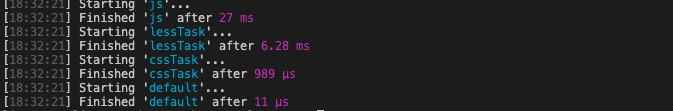
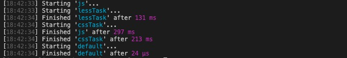
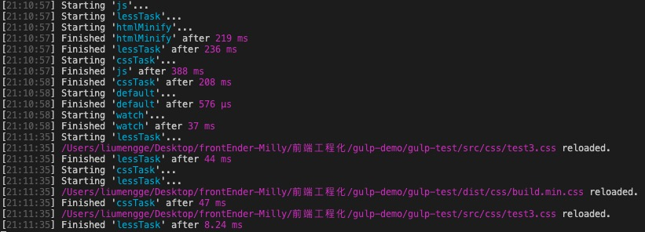
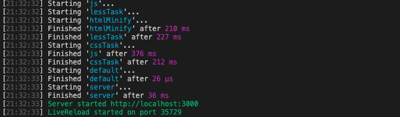

> 最近接触了几个使用gulp实现项目构建的实战项目，也许以后会有将老项目实现前后端分离并使用webpack替换gulp的任务，也考虑到完善自身的前端学习体系，所以觉得详细学习一下gulp，到底gulp与webpack相比有哪些联系与不同，哪个更好？

## Gulp基础

### gulp安装与构建

  * [中文文档](http://www.gulpjs.com.cn/)
  * gulp是与grunt功能类似的**前端项目构建**工具, 也是基于Nodejs的自动**任务运行器**
  * 能自动化地完成 javascript/coffee/sass/less/html/image/css 等文件的
    合并、压缩、检查、监听文件变化、浏览器自动刷新、测试等任务
  * gulp比grunt更高效(异步多任务), 更易于使用, 插件高质量
* 安装 nodejs, 查看版本: node -v
* 创建一个简单的应用`gulp-test`
  ```
  |- dist
  |- src
    |- js
    |- css
    |- less
  |- index.html
  |- gulpfile.js-----gulp配置文件
  |- package.json
    {
      "name": "gulp_test",
      "version": "1.0.0"
    } 
  ```
* 安装gulp:
  * 全局安装gulp
    ```
    npm install gulp -g
    ```
  * 局部安装gulp
    ```
    npm install gulp -D
    ```
  * 配置编码: gulpfile.js
  
    ```javascript
    // 引入gulp模块
    var gulp = require('gulp')

    // 注册任务
    // 注册完任务之后就可以在终端通过`gulp 任务名`执行任务
    gulp.task('任务名', function() {
      // 任务代码...

    })

    // 注册默认任务：通过上述方式注册任务再在控制台执行单项任务太繁琐，通过注册并执行默认任务完成一系列任务的执行
    gulp.task('default', ['任务1', '任务2', '任务3']) // 异步执行任务
    ```
  * 构建命令: 
    ```
    gulp
    ```

### [gulp插件](https://gulpjs.com/plugins)

  * 常用插件:
    * gulp-concat : 合并文件(js/css)
    * gulp-uglify : 压缩js文件
    * gulp-rename : 文件重命名
    * gulp-less : 编译less
    * gulp-clean-css : 压缩css
    * gulp-livereload : 实时自动编译刷新
  * 重要API
    * gulp.src(filePath/pathArr) : 
      * 指向指定路径的所有文件, 返回文件流对象
      * 用于读取文件
    * gulp.dest(dirPath/pathArr)
      * 指向指定的所有文件夹
      * 用于向文件夹中输出文件
    * gulp.task(name, [deps], fn) 
      * 定义一个任务
    * gulp.watch() 
      * 监视文件的变化

### gulp处理js

  * 创建js文件
    * src/js/add.js
      ```javascript
      (function () {
        function add(num1, num2) {
          var num3 = 0;
          num1 = num2 + num3;
          return num1 + num2;
        }
        console.log(add(10, 20));
      })();
      ```
    * src/js/square.js
      ```javascript
      (function () {
        var arr = [1, 2, 3].map(function (item, index) {
            return item**2;
        });
        console.log(arr);
      })();
      ```
  * 下载插件:
    ```
    npm install gulp-concat gulp-uglify gulp-rename -D
    ```
  * 配置编码
    ```javascript
    var concat = require('gulp-concat');
    var uglify = require('gulp-uglify');
    var rename = require('gulp-rename');
    
    gulp.task('js', function() {
        return gulp.src('src/js/**/*.js')     //  操作的源文件，将数据读取到gulp内存中
            .pipe(concat('build.js'))         //  合并到临时文件     
            .pipe(gulp.dest('dist/js'))       //  生成到目标文件夹，临时输出文件到本地
            .pipe(rename({suffix: '.min'}))   //  重命名， 添加后缀名.min
            .pipe(uglify())                   //  压缩
            .pipe(gulp.dest('dist/js'));      // 
    });
    
    gulp.task('default', ['js']);
    ```
  * 页面引入js浏览测试 : index.html
    ```html
    <script type="text/javascript" src="dist/js/build.min.js"></script>
    ```
  * 打包测试: gulp

### gulp处理less与css

  * 创建文件
    * index.html
      ```html
      <div id="div1" class="index1">div1</div>
      <div id="div2" class="index2">div2</div>
      ```
    * src/css/test1.css
      ```css
      #div1 {
        width: 100px;
        height: 100px;
        background: green;
      }
      ```
    * src/css/test2.css
      ```css
      #div2 {
        width: 200px;
        height: 200px;
        background: blue;
      }
      ```
    * src/less/test3.less
      ```css
      @base: yellow;
      .index1 { color: @base; }
      .index2 { color: green; }
      ```
  * 下载插件:
    ```
    npm install gulp-less gulp-clean-css -D 
    ```
  * 配置编码
    ```javascript
    var less = require('gulp-less');
    var cleanCSS = require('gulp-clean-css');
    
    // 注册less处理任务
    gulp.task('lessTask', function () {
      return gulp.src('src/less/*.less')
          .pipe(less())                   // 编译less文件为css文件
          .pipe(gulp.dest('src/css'));    // 输出到css文件夹下，为与其他css文件一起执行css合并压缩
    })

    // 注册css处理任务
    gulp.task('cssTask', function () {
      return gulp.src('src/css/*.css')
          .pipe(concat('build.css'))                  // 将合并后的css文件命名为build.css
          .pipe(gulp.dest('dist/css'))                // 临时输出到dist/css目录下，可以输出
          .pipe(rename({suffix: '.min'}))
          .pipe(cleanCSS({compatibility: 'ie8'}))     // 压缩css文件，兼容ie8   
          .pipe(gulp.dest('dist/css'));
    });
    
    gulp.task('default', ['js', 'lessTask', 'cssTask']);
    ```
  * 页面引入css浏览测试 : index.html
    ```
    <link rel="stylesheet" href="dist/css/build.min.css">
    <div id="div1" class="index1">div1</div>
    <div id="div2" class="index2">div2</div>
    ```
  * 打包测试: gulp
  
  控制台可以看到打包过程：
  

  可以发现，gulp任务是异步执行的，如何项grunt一样同步执行呢？

  去掉gulp注册任务时回调函数中的return，比如：
  ```javascript
  gulp.task('lessTask', function () {
    gulp.src('src/less/*.less')
      .pipe(less())                   // 编译less文件为css文件
      .pipe(gulp.dest('src/css'));    // 输出到css文件夹下，为与其他css文件一起执行css合并压缩
  })

  // js 任务和 css任务 也一样
  ```
  删除dist目录后重新执行`gulp`，这时在控制台看到的执行顺序是：
  

  另外，在gulp任务注册的回调函数中使用return可以保证gulp任务是异步执行的，还能保证当前注册的任务执行完毕后将gulp内存中的数据释放掉。所以，平常开发中都会使用return，但是在使用return时如何保证任务的执行顺序呢？比如在当前的gulp配置文件中注册的任务，如何less中任务量比较大而css的任务量比较小，css任务会优先less任务执行完毕，less任务就白执行了，所以需要保证在执行css任务的时候less任务已经执行完毕了。
  
  这个问题如何解决呢？ - 指定依赖任务

  在注册css任务的时候指定其依赖任务-lessTask，即：
  ```javascript
  // 注册css处理任务, 指定依赖的任务，表示执行cssTask之前要保证lessTask任务已经执行完成了
  gulp.task('cssTask', ['lessTask'], function () {
    return gulp.src('src/css/*.css')
        .pipe(concat('build.css'))                  // 将合并后的css文件命名为build.css
        .pipe(gulp.dest('dist/css'))                // 临时输出到dist/css目录下，可以输出
        .pipe(rename({suffix: '.min'}))
        .pipe(cleanCSS({compatibility: 'ie8'}))     // 压缩css文件，兼容ie8   
        .pipe(gulp.dest('dist/css'));
  });
  
  gulp.task('default', ['js', 'cssTask']);
  ```
  此时，再次执行`gulp命令`, 执行顺序就是这样的：
  


### gulp处理html

  * 下载插件:
    ```
    npm install gulp-htmlmin -D
    ```
  * 配置编码
    ```javascript
    var htmlmin = require('gulp-htmlmin');

    // 压缩html任务
    gulp.task('htmlMinify', function() {
      return gulp.src('index.html')
        .pipe(htmlmin({collapseWhitespace: true}))
        .pipe(gulp.dest('dist'));
    });
    gulp.task('default', ['js', 'cssTask', 'htmlMinify']);
    ```
  注意：此时执行`gulp`命令后打开`dist/index.html`页面会发现之前的样式都消失了，原因是引入文件都是在项目根目录的角度上考虑的，但是index.html文件压缩之后放在了dist目录下，所以在引入css样式的时候路径需要修改下。
  * 修改页面引入
    ```html
    <link rel="stylesheet" href="css/build.min.css">
    <script type="text/javascript" src="js/build.min.js"></script>
    ```
  * 打包测试: gulp
  
    执行完成后再打开压缩后的index.html文件就可以看到正常样式了。

### 自动编译

  > 此时，通过执行gulp命令能够实现js、less、css以及html的构建了，但是，在开发过程中代码修改是非常频繁的，比如修改一个css样式，修改后需要重新执行gulp命令并刷新页面才能看到修改之后的效果。能否实现在修改代码之后自动执行gulp命令并刷新页面呢？可以通过如下操作实现。
    
  * 下载插件
    ```
    npm install gulp-livereload -D
    ```
  * 配置编码:
    ```javascript
    var livereload = require('gulp-livereload');
              
    // 所有的task
    .pipe(livereload());  // 表示实时刷新，watch任务监听源目标，一旦发生变化就调用相应的构建任务重新打包编译，编译完后当用户刷新界面看到效果就必须执行该操作
    
    // 注册监听任务
    gulp.task('watch', ['default'], function () {    
      // 开启监视
      livereload.listen();
      // 监视指定的目标文件, 并指定对应的处理任务
      gulp.watch('src/js/*.js', ['js'])
      gulp.watch(['src/css/*.css','src/less/*.less'], ['cssTask']);  // 只指定cssTask即可，因为启动cssTask时lessTask必定是启动执行的
    });
    ```
    此时，执行`gulp watch`会发现控制台会显示一个持续监听的状态，修改`crs/css/test1 .css`中background为pink后会发现，控制台执行了reload，即：
    
    然后再回到页面刷新就能看到修改之后的效果。

    至此，达到的效果是：执行一次gulp命令，在后续修改代码之后不用再去手动执行gulp命令了，但是还需要手动刷新页面，如何实现修改代码之后自动执行gulp命令并自动刷新页面呢？- 通过热加载实现。
  
  * 热加载(实时加载)
      * 下载插件
      ```
      npm install gulp-connect -D
      ```
      这个插件内置一个微型服务器，它会读取gulp配置文件中的所有内容，所有的步骤都在这个微型服务器中执行，最终这个服务器提供一个可以访问的地址。

      * 注册 热加载的任务 server，注意依赖build任务
      ```javascript
      gulp.task('server', ['default'], function () {
        // 配置加载的选项
        connect.server({
          root: 'dist',         // 监视的源目标文件路径，就是构建完输出的项目目录
          livereload: true,      // 是否实时刷新
          port: 3000             // 开启端口号
        });

        // 监听目标文件
        gulp.watch('src/js/*.js', ['js']);
        gulp.watch(['src/css/*.css', 'src/css/*.less'], ['cssTask']);
      });

      // 所有的task后面添加
      .pipe(connect.reload())
      ```
    此时，执行`gulp server`控制台可以看到，这个微型服务器提供了一个可以访问的地址，即：
    
    再去修改css文件中的样式，保存后就可以在页面上看到修改之后的结果了。
    
    最后，在项目开始的时候，需要手动打开这个微型服务器提供的访问地址，能否在构建完后自动打开项目？ - 使用open插件自动开启链接，即：
    ```
    npm install open -D
    ```
    然后在gulp配置文件中引入使用：
    ```javascript
    gulp.task('server', ['default'], function () {
      // 配置加载的选项
      connect.server({
        root: 'dist',         // 监视的源目标文件路径，就是构建完输出的项目目录
        livereload: true,      // 是否实时刷新
        port: 3000             // 开启端口号
      })

      // 自动打开指定的链接
      open('http://localhost:3000')

      // 监听指定的文件, 并指定对应的处理任务
      gulp.watch('src/js/*.js', ['js'])
      gulp.watch(['src/css/*.css','src/less/*.less'], ['cssTask'])
    })
    ```
    执行`gulp server`就可以自动打开项目，修改后自动重新构建并实现热加载(实时更新)。

### gulp扩展

> gulp-load-plugins 插件可以打包gulp插件，可以进一步简化gulp配置文件的写法

  * 下载打包插件： 
  ```
  npm install gulp-load-plugins -D
  ```
  * 引入： `var $ = require('gulp-load-plugins')();` 注意：引入的插件是个方法，必须调用。
  * 其他的插件不用再引入了
  * 使用方法：所有的插件用 $ 引出，其他插件的方法名统一为插件的功能名字(即插件名字的最后一部分)：如：`concat,connect,cssmin...`
    ```javascript
    gulp.task('lessTask', function () {
      return gulp.src('src/less/*.less')
      .pipe($.less())                   // 将less转换为css
      .pipe(gulp.dest('src/css'))       // 将转换为css的文件输出到src下
      .pipe($.livereload())             // 实时刷新
      .pipe($.connect.reload())
    });
    ```

### Gulp的特点： 
  - 任务化：需要先注册任务
  - 基于流：输入输出流，gulp有自己的内存，使用gulp进行项目构建，首先gulp会将本地的文件数据读取到gulp内存中，然后，接下来所有的操作都是在这个内存中进行，比如：合并、压缩等等，在内存中操作完这些任务以后再从gulp的内存中输出到本地，可以创建一个项目接收它，这就对应两个任务流
  - gulp任务异步执行，效率高，可同步执行

## 踩坑记录

1. 必须指定任务函数

控制台报错信息：
```
AssertionError [ERR_ASSERTION]: Task function must be specified
```

原因：gulp版本问题

如果有一个任务A、B和C的列表，需要在一个序列中运行并确保A在B开始之前完成，B在C开始之前完成, 在gulp3(比如：v3.9.1)中是这样写的：
```
gulp.task('A', () => {
    // Do something
});

gulp.task('B', ['A'], () => {
   // Do something

});

gulp.task('C', ['B'], () => {
    // Do something
});
```

在gulp4(比如： v4.0.2)中, gulp任务现在只有两个参数:

- `gulp.series`：按照顺序执行
- `gulp.parallel`：可以并行计算
```
gulp.task('test', gulp.series('html', 'cssmin', 'copy', async () => {

}));

gulp.task('build', gulp.parallel('style', 'script', 'images', () => {
    
}));

// 或者
gulp.task('my-task', gulp.series('A', gulp.parallel('style', 'script', 'image'), 'B', 'C', () => {
    
}));
```

2. 自执行函数前加分号

在执行`gulp js`完成js的合并压缩后，打开index.html文件发现控制台报了一个这样的错误：

```
build.min.js:1 Uncaught TypeError: (void console.log(...)) is not a function
  at build.min.js:1
```

去查看合并压缩后的build.min.js文件发现是这样的：
```
(void console.log(30))(function(){var o=[1,2,3].map(function(o,n){return o**2});console.log(o)})();
```

解决方法：在add.js文件和square.js文件中的自执行函数前分别添加一个`;`，再次执行`gulp js`后打开index.html文件就可以看到控制台正确输出的相关内容了。

但是，为什么呢？有的时候也会看到自执行函数前面添加了`!`，为什么要添加这些符号，有什么联系和区别吗？


参考文章：

